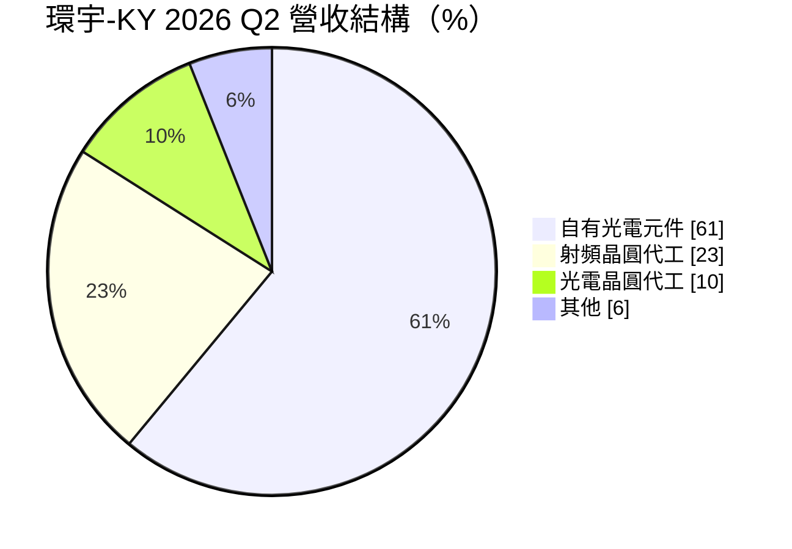
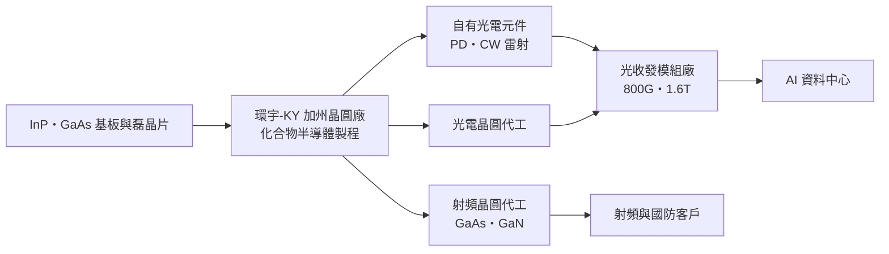
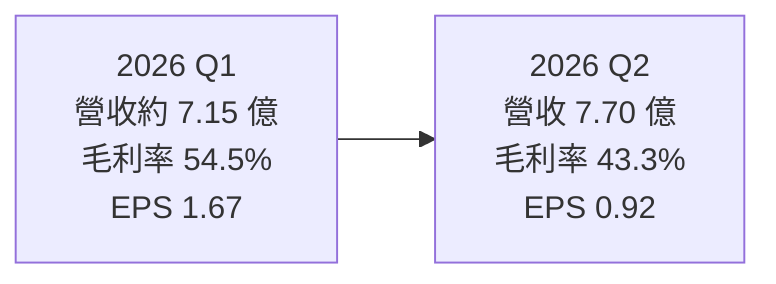
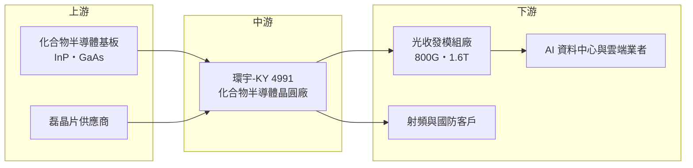

# 4991 環宇-KY

> 上櫃｜[[產業索引-半導體業|半導體業]]｜上市（櫃）日期 2014/09/15

# 第一章：企業模式與商業藍圖

> [!info] 撰寫說明
> 本文由 Claude 依公開資料整理，架構比照 [[2330台積電]] 的四章研究，資料截至 2026-10-08。財務數字來源：StockAnalysis（S&P Global Market Intelligence）年度損益與財務比率、工商時報 2026 年 8 月法說會報導、優分析報導、nStock 公司資料頁、櫃買中心 OpenAPI 的 2026 年上半年財報；產業描述為整理性內容，尚未逐條比對原始文件。#待校對

在評估單一個股的長期投資價值時，首要步驟是拆解企業的底層獲利邏輯。本章針對環宇通訊半導體控股（股票代號：4991，簡稱環宇-KY）的商業模式進行定性分析，說明一家位於美國加州的化合物半導體代工廠，如何從射頻代工轉型為以光通訊元件為主的公司。

## 一、核心定位：美國本土的化合物半導體晶圓廠

環宇-KY 的控股公司於 2010 年在開曼群島設立，2014 年在櫃買中心掛牌，是 [[KY股]]；實際營運主體 GCS（Global Communication Semiconductors）位於美國加州托倫斯（Torrance）。它擁有自己的[[化合物半導體]]晶圓廠，製程涵蓋 [[GaAs]]（砷化鎵）、[[InP]]（磷化銦）與 [[GaN]]（氮化鎵），用來生產高頻射頻元件與光電元件。

環宇-KY 的業務有兩種型態。一是晶圓代工：替客戶製造射頻與光電晶圓，並提供製程技術授權，客戶設計、環宇負責製造。二是自有產品：以自有設計生產光通訊用的光偵測器（[[PD]]）、雷射等光電元件，直接賣給光收發模組廠。後者近年成長最快，已成為營收主體。

## 二、終端應用與產品板塊：自有光電元件占六成

依工商時報對 2026 年第二季法說會的報導，營收結構為自有品牌光電元件約 61%、射頻晶圓代工約 23%、光電晶圓代工約 10%。

* **自有光電元件：** 主要是光收發模組接收端的高速光偵測器，以及矽光子使用的 CW 雷射光源。依優分析 2026 年 2 月的報導，法人估計環宇在光收發模組接收端 PD 的市占率超過七成（法人估計，非公司正式揭露）。CW 雷射於 2025 年第四季起全面量產，200G PD 與 CW 雷射已進入量產。
* **射頻晶圓代工：** 以 GaAs、GaN 製程替客戶生產射頻功率放大器與高頻元件，應用於無線基礎設施、國防與衛星通訊。
* **光電晶圓代工：** 替其他光元件設計公司代工光電晶圓。

## 三、資本轉化邏輯（營運模式）：自有晶圓廠的雙軌模式

環宇-KY 擁有自己的晶圓廠，屬於重資產模式：產能利用率高時，固定的折舊與人事成本被攤薄，毛利率可以大幅提升；利用率低時則相反。2021 至 2023 年營收僅 12 億至 13 億元，營業利益率為負；2025 年營收成長到 22 億元，營業利益率回升到 18%。

自有產品與代工並行的好處是，自有光電元件毛利較高（優分析指出 AOC 自有產品線毛利率優於平均），代工業務則可填補產能、分散客戶。2026 年上半年毛利率 48.7%，比 2024 年的 37.9% 高出十個百分點以上，主要來自高毛利光電元件比重上升。

## 四、企業長期藍圖：跟隨 AI 光通訊規格升級

環宇-KY 的長期成長主要綁在 AI 資料中心的光通訊升級。資料中心從 400G、800G 走向 1.6T，每個光模組需要更高速的光偵測器，矽光子架構也需要外部 CW 雷射光源，這兩類產品都是環宇的主力。依工商時報報導，公司表示光通訊仍供不應求，200G 與 1.6T 是最強的產品區段，並看好 2027 年營運。

另一個長期優勢是美國本土產能。在美國政府重視化合物半導體與國防供應鏈安全的趨勢下，加州晶圓廠可以服務對產地有要求的客戶。長期觀察重點是公司能否在維持 PD 高市占的同時，把 CW 雷射打造成第二個主力產品。

# 第二章：護城河深度與競爭優勢

在長期價值投資中，「護城河」指企業抵禦競爭、維持超額利潤的保護機制。本章分析環宇-KY 的護城河構成、全球主要競爭對手，以及這些優勢在光通訊快速升級中能守住多少。

## 一、環宇-KY 護城河的核心組成要素

* **1. 高速光偵測器的規模與驗證：** 光收發模組廠導入一顆 PD 需要完整的模組級可靠度驗證，一旦在某個世代（例如 800G）大量採用，後續升級通常也優先找原供應商合作。法人估計環宇在接收端 PD 市占超過七成，代表它已成為多數模組廠的標準選擇，這是最主要的護城河。
* **2. 自有化合物半導體晶圓廠：** 化合物半導體晶圓廠投資大、良率學習曲線長，新進者需要多年才能穩定量產。環宇同時擁有製程與產品設計能力，可以快速針對客戶需求調整元件。
* **3. 美國本土製造：** 位於加州，對美國國防、政府與重視供應鏈安全的客戶具有地緣優勢。

## 二、全球主要競爭對手格局

| 對手 | 定位 | 對環宇-KY 的威脅 |
|---|---|---|
| [[3105穩懋]] | 全球最大砷化鎵晶圓代工廠，也發展光電元件 | 射頻代工規模遠大於環宇，光電代工也在擴張 |
| [[8086宏捷科]] | 台灣砷化鎵晶圓代工廠 | 射頻代工直接競爭 |
| [[3081聯亞]] | InP 光通訊磊晶與雷射元件 | 在光通訊雷射與磊晶競爭 |
| Lumentum、Coherent 等 | 垂直整合的光通訊大廠 | 自製 PD 與雷射，可能減少外購 |
| 中國光元件廠 | 本土化政策扶植 | 以低價搶中國光模組廠訂單 |

## 三、優勢轉化：哪些市場守得住、哪些守不住

* **守得住：** 已在 800G 與 1.6T 世代驗證的高速 PD。這類元件占光模組成本比例不高，但影響整體效能，模組廠不輕易更換。
* **守不住：** 一般射頻晶圓代工的定價。射頻代工市場由規模更大的台灣同業主導，環宇在這塊的議價能力有限。
* **觀察重點：** 第一，CW 雷射在矽光子與 [[CPO]] 架構中的市占能否複製 PD 的成績。第二，InP 基板供應是否穩定，這在 2026 年曾限制出貨。第三，1.6T 放量速度，公司表示 1.6T 出貨量低於原先預期。

# 第三章：財務體質與盈利規模

資料日期：2026-10-08。數字取自 StockAnalysis（S&P Global）年度損益與財務比率、工商時報法說會報導與櫃買中心 OpenAPI，表格是撰寫當時的快照；最新月營收、毛利率、累計 EPS 由自動排程寫在本筆記的屬性欄位（月營收、毛利率、累計EPS 等）。#待校對

財務報表是檢驗護城河是否真實存在的最終標準。本章用多年度三率、ROE、現金流與資本報酬，檢視環宇-KY 轉型後的獲利品質。

## 一、獲利能力的基石：三率

| 年度 | 營收（新台幣） | [[毛利率]] | [[營業利益率]] | EPS（元） | [[ROE]] |
|---|---|---|---|---|---|
| 2021 | 12.4 億 | 27.92% | -2.49% | -4.20 | -9.43% |
| 2022 | 13.3 億 | 23.61% | -10.30% | -8.53 | -22.92% |
| 2023 | 13.5 億 | 17.57% | -16.81% | -7.18 | -23.70% |
| 2024 | 17.5 億 | 37.89% | 11.02% | -2.13 | -7.89% |
| 2025 | 22.0 億 | 47.13% | 18.40% | 0.15 | 0.56% |
| 2026 上半年 | 14.8 億 | 48.69% | 18.87% | 2.58 | 未查得 |

* **[[毛利率]]：** 2023 年毛利率只有 17.6%，2025 年升到 47.1%，2026 年第一季創下 54.5% 的新高，第二季回落到 43.3%。這段轉變反映兩件事：產能利用率隨營收成長大幅提高，以及高毛利的自有光電元件比重上升。
* **[[營業利益率]]：** 2021 至 2023 年營業利益率為負，2024 年轉正為 11%，2025 年 18.4%，2026 年上半年 18.9%。
* **業外與淨利：** 2021 至 2024 年的稅後虧損遠大於營業虧損，例如 2022 年營業利益率約 -10%，淨損卻達 9.4 億元、EPS -8.53 元，代表有大額業外損失（可能與轉投資或資產減損有關，具體原因未查得，需查閱年報）。2024 年本業已轉盈，全年仍虧損，也是業外因素所致。
* **營收規模：** 2021 至 2025 年營收年複合成長率約 15.4%（推算）。

## 二、[[ROE]]：資本效率

近五年（2021 至 2025 年）ROE 平均約 -12.7%（推算），長期資本效率很差，主因是過去幾年的大額業外損失。2025 年 ROE 才轉正為 0.56%，2026 年上半年 EPS 2.58 元，年化 ROE 推估約 13% 至 14%（以上半年稅後淨利 3.06 億元與第二季底股東權益約 44.6 億元推算）。環宇的資本效率正處於由負轉正的轉折期，能否持續取決於業外損失是否已告一段落。

## 三、資本支出與自由現金流

* **[[CapEx]]：** 自有晶圓廠需要持續投資設備，光通訊產品擴產是近年主要支出（金額未查得）。
* **[[自由現金流]]：** 依 StockAnalysis 的自由現金流殖利率，2021 與 2025 年為正，2022 至 2024 年為負，與營運由虧轉盈的軌跡一致。負債權益比長期在 0.05 至 0.12 之間，財務結構保守。
* **股利：** nStock 資料顯示近五年沒有配息紀錄，公司過去處於虧損與累積虧損彌補階段。

## 四、[[ROIC]] 與 [[WACC]]：價值創造利差

依 StockAnalysis，環宇-KY 的 ROIC 在 2021 至 2025 年分別為 -1.2%、-4.2%、-6.8%、7.0%、16.9%。ROIC 以營業利益計算，因此 2024 年本業轉盈後已轉正，與受業外損失拖累的 ROE 走勢不同。

WACC 以 CAPM 推估：無風險利率取台灣 10 年期公債約 1.75%，市場風險溢酬 6%，β 取光通訊與化合物半導體同業常見的 1.3（假設值，未查得公司實際 β），股東權益成本約 9.55%。公司有息負債很少，WACC 約等於股東權益成本，約 9.5%（推算）。

比較兩者：2021 至 2024 年 ROIC 低於 WACC，價值被侵蝕；2025 年 ROIC 16.9% 明顯高於 9.5%，本業開始創造價值。不過股東實際拿到的報酬（ROE）仍被業外拖累，投資人需要同時確認本業 ROIC 能否維持在 WACC 之上，以及業外損失不再出現。

# 第四章：總體風險與地緣政治

任何企業都無法脫離宏觀環境獨立存在。本章分析環宇-KY 未來必須面對的地緣政治、產業週期、營運與技術風險。

## 一、地緣政治

環宇的晶圓廠位於美國，這在美中科技競爭下是一項優勢，美國國防與重視供應鏈安全的客戶偏好本土製造。風險來自原料與客戶兩端：InP 與 GaAs 基板產能集中在少數日本與中國廠商，中國對鎵、銦等關鍵礦物的出口管制可能影響原料取得；而許多光收發模組廠的產能位於中國與東南亞，美中關稅與出口管制可能影響客戶的採購與出貨。

## 二、產業週期與市場結構

光通訊需求跟著雲端與 AI 資料中心的資本支出循環，2023 年雲端業者消化庫存時，光元件供應鏈普遍衰退。目前 AI 帶動的需求強勁，但雲端業者若調整資本支出，光元件訂單可能快速修正。上游元件廠承受的[[長鞭效應]]通常大於模組廠。

## 三、營運環境的隱性風險

* **基板供應：** 2026 年上半年 InP 基板短缺曾限制出貨，公司表示 6 月起供應改善，但供給集中問題未根本解決。
* **客戶集中：** 光收發模組市場由少數大廠主導，高市占也意味著對大客戶的依賴度高。
* **業外與財報透明度：** 過去多年的大額業外損失使 ROE 與 EPS 長期偏離本業表現，作為 KY 股，投資人需特別關注年報中轉投資與減損的揭露。
* **單一廠區：** 主要產能集中在加州，若發生停電、天災或製程事故，影響會直接反映在營收。

## 四、科技或法規演進

光通訊技術路線正從可插拔模組走向[[矽光子]]與共同封裝光學（CPO）。在矽光子架構下，部分光偵測器可能整合到矽晶片上，可能減少獨立 InP PD 的需求；但矽本身無法發光，仍需外部 CW 雷射光源，這正是環宇布局的方向。若環宇能在 CW 雷射建立與 PD 相當的地位，技術轉換對它反而是機會。

# 專有名詞解析

## 半導體

- **[[化合物半導體]]**：由兩種以上元素組成的半導體材料，例如砷化鎵、磷化銦、氮化鎵，適合高頻、高功率與光電應用。
- **[[GaAs]]**：砷化鎵，一種化合物半導體材料，高頻特性佳，常用於功率放大器與 VCSEL。
- **[[InP]]**：磷化銦，一種化合物半導體，是光通訊波段雷射與光偵測器的主要材料，基板產能有限。
- **[[GaN]]**：氮化鎵，耐高電壓、高頻的化合物半導體材料，用於快充、基地台射頻與國防雷達。
- **[[PD]]**：光偵測器，把光訊號轉成電訊號的元件，是光收發模組接收端的核心。
- **[[CW 雷射]]**：連續波雷射，持續輸出穩定光源，矽光子架構需要外接的 CW 雷射提供光。
- **[[矽光子]]**：在矽晶片上製作光學元件，以光取代電傳輸資料，可降低 AI 資料中心的傳輸耗電。
- **[[CPO]]**：共同封裝光學，把光學引擎與交換器晶片封裝在一起，縮短電訊號路徑以降低功耗。

## 金融

- **[[KY股]]**：在開曼群島等境外註冊、來台上市櫃的公司，營運據點多在海外，資訊揭露與法規環境與本國公司不同。
- **[[ROE]]**：股東權益報酬率，稅後淨利除以股東權益，衡量公司運用股東資金賺錢的效率。
- **[[ROIC]]**：投入資本報酬率，衡量公司投入營運的資本能產生多少稅後營業利益。
- **[[WACC]]**：加權平均資金成本，股東與債權人要求報酬率的加權平均，ROIC 高於 WACC 才代表創造價值。
- **[[長鞭效應]]**：終端需求的小幅變動，沿供應鏈往上游傳遞時被逐級放大，造成上游庫存與訂單劇烈波動。

# 核心供應鏈

## 1. 上游：基板與磊晶
- InP 與 GaAs 基板：日本等少數基板廠（具體供應商未揭露）
- 磊晶片：化合物半導體磊晶廠，例如 [[4971IET-KY]]、[[2455全新]]、IQE（產業常見供應來源，環宇未揭露具體供應商，推估）

## 2. 中游：環宇-KY 本身與同業
- 射頻代工同業：[[3105穩懋]]、[[8086宏捷科]]
- 光通訊元件同業：[[3081聯亞]]、Lumentum、Coherent

## 3. 下游：光收發模組與終端
- 光收發模組廠：供應 800G、1.6T 光模組（具名客戶未查得）
- 終端：AI 資料中心與雲端業者，例如 [[NVDA輝達]] 生態系的交換器與伺服器（間接需求來源）

## 最新新聞
<!-- news:start（自動產生，請勿手動編輯此範圍） -->
- 2026-10-08 🏛️ 重訊 15:15｜本公司有價證券近期多次達公布注意交易資訊標準, 故公告相關訊息，以利投資人區別暸解。｜[觀測站](https://mops.twse.com.tw/mops/#/web/t05st01)

完整紀錄：[[4991環宇-KY 新聞]]
<!-- news:end -->

## 相關連結
- [公開資訊觀測站](https://mopsov.twse.com.tw/mops/web/t05st03?step=1&firstin=1&co_id=4991)
- [Goodinfo](https://goodinfo.tw/tw/StockDetail.asp?STOCK_ID=4991)
- [Yahoo 股市](https://tw.stock.yahoo.com/quote/4991)
- [鉅亨網新聞](https://www.cnyes.com/twstock/4991/news)
