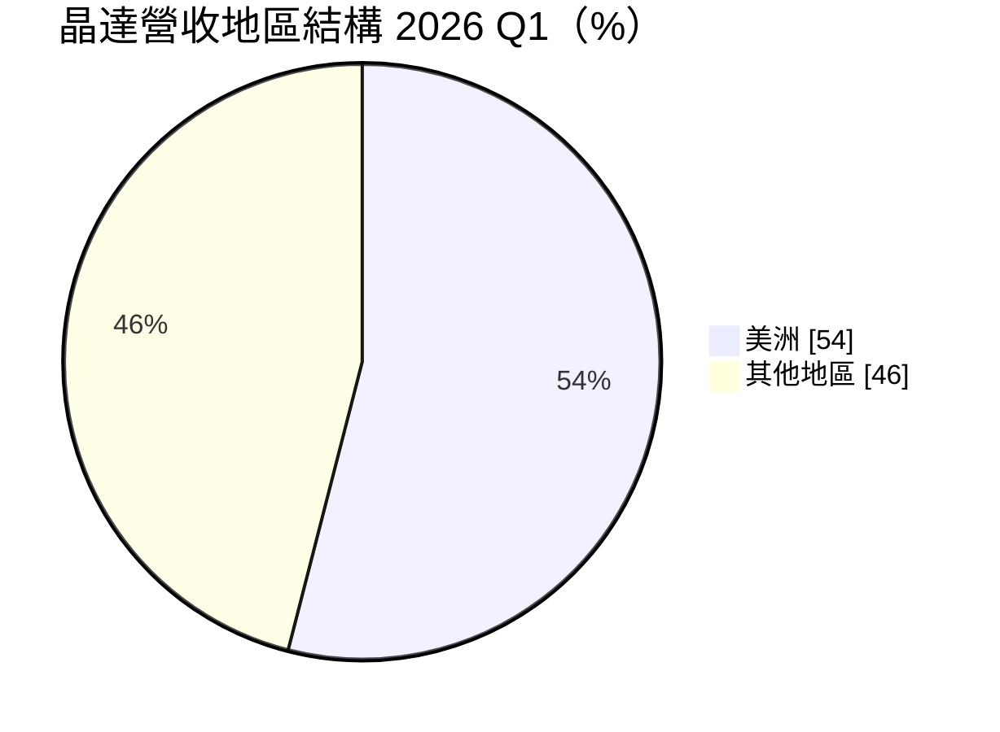
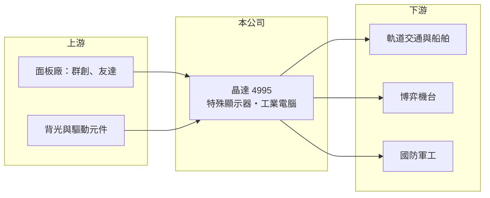

# 4995 晶達

> 上櫃｜[[產業索引-光電業|光電業]]｜上市（櫃）日期 2012/05/09

# 第一章：企業模式與商業藍圖

> [!info] 撰寫說明
> 精簡版，由 Claude 依公開資料整理，架構比照 [[2330台積電]]，資料截至 2026-10-07。來源：富果研究 晶達 2026 年 5 月法說會整理、winvest.tw 營收快訊。#待校對

晶達光電專做高亮度、特殊尺寸的[[工業顯示器]]，並延伸到[[工業電腦]]與[[系統整合]]。

- **核心業務：** 分為工業顯示部門（IDD）與工業電腦部門（ICD），特殊顯示產品線包括高亮度 DURApixel、長條形 SPANpixel、正方形 Squarepixel、船舶用 NAVpixel 與弧形 Curvepixel。
- **營收結構：** 依地區，2026 年第一季美洲市場占 54%；產品別比重本次未查到。
- **營運據點：** 產品銷售遍及 60 多個國家，應用在軌道交通（如台灣高鐵、矽谷捷運）、博弈機台與國防軍工。
- **長期方向：** 從賣面板走向系統整合，公司表示面板營收 1 元可帶動 2 至 3 元的系統營收；並開拓印度、東南亞市場，2026 年目標營收雙位數成長。

# 第二章：護城河深度與競爭優勢

晶達的護城河來自利基市場的客製化與長認證週期。

- **競爭優勢：** 交通、軍工與博弈客戶需要高亮度、寬溫與特殊尺寸，並要求長期供貨，驗證通過後不易更換供應商。
- **主要對手：** 工業電腦與顯示同業如 [[2395研華]]、[[6166凌華]]、[[3022威強電]]，以及海外特殊顯示器廠。
- **觀察重點：** 系統整合營收占比提升速度，以及美洲以外市場的開拓成果。

# 第三章：財務體質與盈利規模

資料日期：2026-10-07，以下數字是撰寫當時的快照；最新月營收、毛利率、累計 EPS 由自動排程寫在本筆記的屬性欄位（月營收、毛利率、累計EPS 等）。#待校對

晶達 2026 年營收與獲利同步成長，毛利率維持約三成。

- **營收規模：** 2026 年第一季營收 3.43 億元，年增 10.62%；7 月單月 1.42 億元、年增 49.78%，8 月 1.24 億元、年增 47.13%。
- **獲利：** 2025 年全年 EPS 2.25 元；2026 年第一季 EPS 1.01 元，稅後純益 4,278 萬元、年增 93%，[[毛利率]]約 33%。
- **財務特色：** 2026 年第一季總資產 17.8 億元、股東權益 9.11 億元，規模小但獲利穩定。

# 第四章：總體風險與地緣政治

晶達的風險在於區域集中與面板供應。

- **產業週期：** 工業與交通專案的出貨時點受標案與政府預算影響，季度波動大。
- **營運風險：** 美洲占營收過半，單一市場景氣與關稅政策影響大；面板原料仰賴上游面板廠供應。
- **其他風險：** 美元匯率、美國關稅政策，以及國防與博弈產業的法規變化。

# 專有名詞解析

## 應用

- **[[系統整合]]**：把顯示器、電腦與軟體組合成完整解決方案出貨，附加價值高於單賣零件。

## 金融

- **[[毛利率]]**：營業毛利占營收的比例，反映產品的定價能力與成本控制。

## 產業

- **[[工業顯示器]]**：用於工廠、交通、醫療與戶外的顯示器，強調高亮度、寬溫與長期供貨。
- **[[工業電腦]]**：用於工廠自動化、交通與醫療等場域的電腦，強調耐用、長期供貨與客製化。

# 核心供應鏈

- 上游：面板廠 [[3481群創]]、[[2409友達]]（推估）、背光與驅動元件供應商
- 下游／客戶：軌道交通（台灣高鐵、矽谷捷運）、博弈機台、國防軍工與船舶
- 同業：[[2395研華]]、[[6166凌華]]、[[3022威強電]]

## 最新新聞
<!-- news:start -->
<!-- news:end -->

## 相關連結
- [公開資訊觀測站](https://mopsov.twse.com.tw/mops/web/t05st03?step=1&firstin=1&co_id=4995)
- [Goodinfo](https://goodinfo.tw/tw/StockDetail.asp?STOCK_ID=4995)
- [Yahoo 股市](https://tw.stock.yahoo.com/quote/4995)
- [鉅亨網新聞](https://www.cnyes.com/twstock/4995/news)
