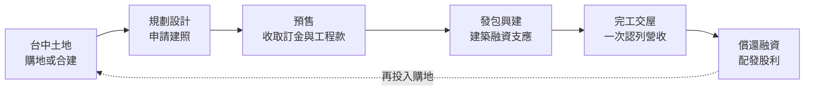
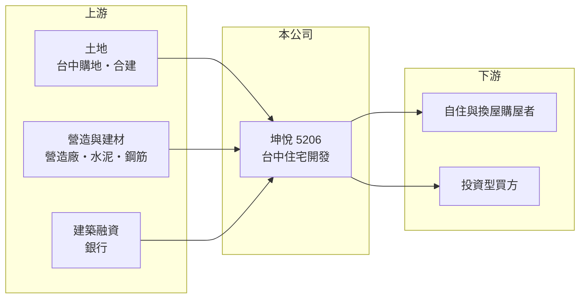

# 5206 坤悅

> 上櫃｜[[產業索引-建材營造業|建材營造業]]｜上市（櫃）日期 2001/10/08

# 第一章：企業模式與商業藍圖

> [!info] 撰寫說明
> 本文由 Claude 依公開資料整理，架構比照 [[2330台積電]] 的四章研究，資料截至 2026-10-08。財務數字來源：MoneyDJ 理財網年度財務比率與損益表、櫃買中心開放資料（基本資料、2026 年第二季財報、本益比殖利率）；業務描述參考聯合新聞網、工商時報、富果研究法說會頁面的新聞標題。公開資料有限，個別建案內容未逐案查證。#待校對

在評估一家建商的長期價值時，第一步是看懂它的土地布局、推案規模與交屋節奏。本章針對坤悅開發（股票代號：5206，以下簡稱坤悅）的商業模式進行定性分析，說明一家以台中為基地的建商，如何在近幾年把營收規模推升到新的高度。

## 一、核心定位：深耕台中的住宅開發商

坤悅成立於 1975 年，2001 年在櫃買中心掛牌，總部位於台中市西屯區市政路，董事長兼總經理為陳丕岳，實收資本額約 18.0 億元。公司以台中地區的住宅大樓開發與銷售為主，屬於區域型建商。

* **案量擴大：** 依聯合新聞網標題，坤悅曾規劃約 96 億元的案量在下半年進場，並預期當年營收獲利續創新高。2025 年營收約 37.8 億元，是 2022 年的九倍多，代表公司近年推案規模明顯擴大。
* **營收在交屋時認列：** 和所有建商一樣，坤悅採[[建案交屋]]認列營收，營收集中在交屋年度。2022 年營收只有約 4.0 億元並出現虧損，2023 年後才進入連續交屋期。

## 二、資本轉化邏輯：高槓桿擴大推案

* **[[預售屋]]與建築融資：** 坤悅以預售收取的分期款與銀行建築融資支應工程，自有資金只占總投入的一小部分。這讓公司可以用相對小的股本推動大規模建案。
* **高槓桿結構：** 負債比率由 2018 年的 56% 升到 2025 年的 79%。2026 年第二季底總資產約 176 億元，負債約 135 億元，股東權益約 41.0 億元，槓桿放大了報酬，也放大了風險。

## 三、長期方向：維持連續交屋、平滑營收

坤悅近年的轉變是從「偶爾交屋」走向「連續交屋」。2023 至 2025 年營收分別約 33.7 億、24.4 億、37.8 億元，三年都維持在一定規模，2026 年上半年又有約 22.8 億元。若能維持每年穩定推案，營收與股利的波動就會縮小，公司也較能建立長期的資本市場信任。

# 第二章：護城河深度與競爭優勢

護城河是企業抵禦競爭、長期維持超額利潤的機制。本章分析坤悅在台中市場的競爭優勢、主要對手，以及這些優勢能守住多少。

## 一、坤悅護城河的核心組成要素

* **1. 在地經營歷史：** 公司成立超過五十年，在台中累積的地主關係與市場經驗，有助於取得土地與掌握各區的價格帶。
* **2. 產品毛利提升：** [[毛利率]]由 2021 年的 17% 升到 2024 至 2025 年的約 32%，2026 年上半年約 40%，代表近年交屋建案的土地成本與售價條件較好。
* **3. 推案規模：** 數十億元的在建與交屋案量，使公司能同時經營多個建案，降低對單一建案的依賴。

## 二、主要競爭對手格局

| 對手 | 定位 | 對坤悅的威脅 |
|---|---|---|
| [[4907富宇]] | 台中住宅建商 | 同區域搶地與搶客 |
| [[5213亞昕]] | 近年重押台中的大型建商 | 推案規模大，提高土地成本 |
| [[2545皇翔]] | 台北與台中高價住宅 | 在台中高價市場競爭 |
| 台中在地建商（如櫻花建設、豐邑等） | 地方型建商 | 產品與價格帶相近 |

## 三、優勢轉化：哪些守得住、哪些守不住

* **守得住：** 已取得的土地與在建建案，若能以目前的毛利水準交屋，未來兩三年的獲利有一定能見度。
* **守不住：** 高負債使公司對房市轉冷與融資收緊很敏感。台中土地競爭激烈，新土地的成本可能逐步上升。
* **觀察重點：** 第一，[[已售未入帳]]金額與預售去化速度；第二，負債比率能否隨交屋下降；第三，[[信用管制]]對台中房市的影響。

# 第三章：財務體質與盈利規模

資料日期：2026-10-08。數字取自 MoneyDJ 理財網年度財務資料與櫃買中心開放資料，表格是撰寫當時的快照；最新月營收、毛利率、累計 EPS 由自動排程寫在本筆記的屬性欄位（月營收、毛利率、累計EPS 等）。#待校對

財務報表是檢驗護城河是否真實存在的最終標準。本章用五年的三率、ROE、營建業指標與資本報酬，檢視坤悅的獲利品質。

## 一、獲利能力的基石：三率

| 年度 | 營收（新台幣） | [[毛利率]] | [[營業利益率]] | EPS（元） | [[ROE]] |
|---|---|---|---|---|---|
| 2021 | 19.4 億 | 17.2% | 4.95% | 0.54 | 2.77% |
| 2022 | 3.97 億 | 26.6% | -28.5% | -0.67 | -3.64% |
| 2023 | 33.7 億 | 25.3% | 12.9% | 2.30 | 12.3% |
| 2024 | 24.4 億 | 32.4% | 16.1% | 2.06 | 10.3% |
| 2025 | 37.8 億 | 31.8% | 19.4% | 3.44 | 17.2% |

資料來源：MoneyDJ 理財網年度損益表與財務比率。2026 年上半年（櫃買中心資料）營收約 22.8 億元、毛利率約 40.2%、營業利益率約 31.2%、EPS 3.20 元。

坤悅的獲利在 2023 年後明顯改善，毛利率與營業利益率逐年提升，2025 年 ROE 達 17%。2021 至 2025 年營收年複合成長率約 18%（推算）。往前看 2018 至 2020 年，公司也曾有營收 14.6 億至 27.4 億元、EPS 1.5 至 3.1 元的獲利期，2021 至 2022 年則是交屋空窗。

## 二、營建業指標：推案量、已售未入帳與存貨

依新聞標題，坤悅曾規劃約 96 億元的案量在下半年進場（年份與內容以原報導為準）。公司完整的[[已售未入帳]]金額與未來推案量未查得。2026 年第二季底流動資產約 175 億元、流動負債約 135 億元，存貨約為 2025 年營收的四至五倍，代表手上仍有大量在建房地。

## 三、[[ROE]] 與股利

2021 至 2025 年平均 ROE 約 7.8%（推算），近三年平均約 13%。依櫃買中心資料，最近一次現金股利為每股 1.5 元，相對 2025 年 EPS 3.44 元，配發率約 44%（推算），保留較多盈餘支應推案。2026 年第二季底保留盈餘約 22.0 億元。

## 四、[[ROIC]] 與 [[WACC]]：價值創造利差

**ROIC 推算：** 2025 年營業利益約 7.33 億元，稅後約 5.86 億元。官方資料只揭露負債總計約 135 億元，假設其中六成為有息負債約 80.9 億元（推估），加上股東權益約 41.0 億元，投入資本約 122 億元，ROIC 約 4.8%（推算）；以 2021 至 2025 年平均營業利益計算約 2.0%（推算）。

**WACC 推算：** 台灣 10 年期公債殖利率取 1.75%、市場風險溢酬 6%、β 取營建同業常見值 0.9（未查得公司實際 β；高槓桿下實際 β 可能更高），股東權益成本約 7.2%。負債成本假設 3%，稅率 20%，稅後約 2.4%。權益約占投入資本 34%，WACC 約 4.0%（推算）。

**結論：** 坤悅 2025 年的 ROIC 已高於 WACC，代表近年的建案開始創造價值；但五年平均仍低於資金成本，反映交屋空窗年度的拖累。若能維持連續交屋，利差有機會穩定在正值；若房市轉冷導致去化延遲，高槓桿會讓 ROIC 迅速回落。

# 第四章：總體風險與地緣政治

任何企業都無法脫離宏觀環境獨立存在。本章分析坤悅長期必須面對的房市週期、政策、營運與財務風險。

## 一、產業週期與政策風險

* **台中房市週期：** 台中房價在過去十年漲幅大，若人口移入或產業投資放緩，房價修正與去化放慢的風險上升。
* **[[信用管制]]：** 2024 年第七波選擇性信用管制後，買方貸款成數與建商土地融資都受限，預售去化變慢。
* **稅制：** 房地合一稅、囤房稅與預售屋轉售限制，會壓抑投資型買盤。

## 二、營運環境的隱性風險

* **土地成本上升：** 大型建商湧入台中，推高土地價格，壓縮新建案毛利。
* **營造成本與工期：** 缺工與建材上漲會推高成本，工期延誤則會延後交屋與營收認列。
* **區域集中：** 業務集中在台中，當地供給過剩時價格競爭加劇。

## 三、財務風險

* **高負債：** 負債比率接近八成，若銷售不如預期，利息與融資到期的壓力會快速升高。
* **利率：** 建築融資利率上升，會增加持有土地的成本。
* **股東權益相對小：** 股東權益約 41 億元，對照 176 億元的總資產，房價下跌對淨值的衝擊會被放大。

# 專有名詞解析

## 金融

- **[[信用管制]]**：央行限制購屋與建商貸款成數的政策，會影響房市成交與建商資金。
- **[[ROIC]]**：投入資本報酬率，稅後營業利益除以股東權益加有息負債，衡量本業運用資本的效率。
- **[[WACC]]**：加權平均資金成本，股東與債權人要求報酬率的加權平均，是 ROIC 要超越的門檻。

## 產業

- **[[建案交屋]]**：建商在房屋完工並交付買方時才認列營收，因此營建公司的營收常集中在交屋年度。
- **[[已售未入帳]]**：已經賣出、但尚未完工交屋而未認列營收的建案金額，是建商未來營收的主要能見度指標。
- **[[預售屋]]**：房屋在興建完成前就先銷售，買方分期繳款，建商可藉此降低資金與銷售風險。

# 核心供應鏈

## 1. 上游：土地、營造與資金
- 土地來源：台中購地與合建
- 營造：外部發包營造廠（合作對象未查得），台中營造廠如 [[5511德昌]]；建材如 [[1101台泥]]、[[2002中鋼]]
- 資金：銀行建築融資

## 2. 中游：坤悅與同業
- 台中住宅同業：[[4907富宇]]、[[5213亞昕]]、[[2545皇翔]]

## 3. 下游：客戶
- 台中自住、換屋與投資型購屋者

## 最新新聞
<!-- news:start -->
<!-- news:end -->

## 相關連結
- [公開資訊觀測站](https://mopsov.twse.com.tw/mops/web/t05st03?step=1&firstin=1&co_id=5206)
- [Goodinfo](https://goodinfo.tw/tw/StockDetail.asp?STOCK_ID=5206)
- [Yahoo 股市](https://tw.stock.yahoo.com/quote/5206)
- [鉅亨網新聞](https://www.cnyes.com/twstock/5206/news)
