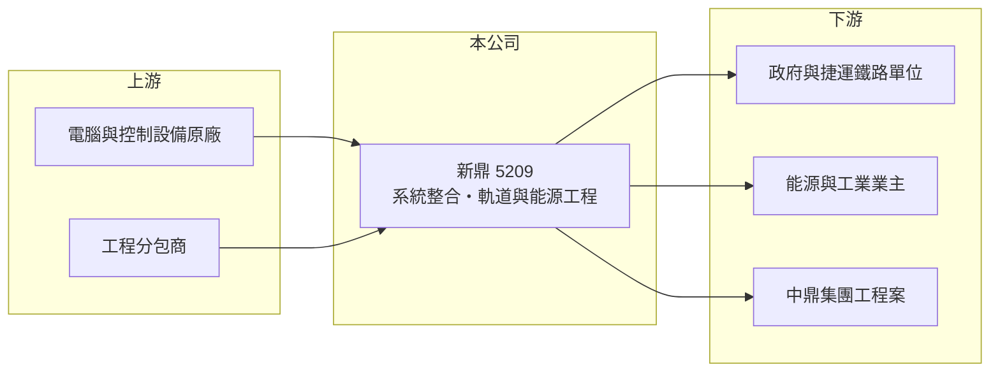

# 5209 新鼎

> 上櫃｜[[產業索引-其他業|其他業]]｜上市（櫃）日期 2002/02/25

# 第一章：企業模式與商業藍圖

> [!info] 撰寫說明
> 精簡版，由 Claude 依公開資料整理，架構比照 [[2330台積電]]，資料截至 2026-10-07。來源：nStock 新鼎公司簡介、winvest 營收快訊。#待校對

新鼎系統是中鼎集團旗下的系統整合公司，承接電腦控制系統、軌道與能源工程。

- **核心業務：** 提供電腦與控制系統的規劃、設計、採購、安裝、測試與維護，並承作[[軌道工程]]、能源技術、自動控制與土木工程規劃設計，屬於[[系統整合]]業者。
- **營收結構：** 本次未查到各業務營收比重；營收依工程進度認列，單月波動大。
- **營運據點：** 本次未查到具體營運據點資訊；母公司[[9933中鼎]]持股 43.60%。
- **長期方向：** 受惠軌道建設與能源工程需求，2025 年 EPS 達 16.16 元。

# 第二章：護城河深度與競爭優勢

新鼎的競爭基礎在於工程實績與中鼎集團的資源。

- **競爭優勢：** 大型公共工程投標重視過往實績，新鼎累積系統整合經驗，並可與母公司中鼎合作承攬（推估）。
- **主要對手：** 國內其他機電與系統整合工程商（本次未查到具體名單）。
- **觀察重點：** 新標案取得與[[在手訂單]]變化，以及 2026 年 8 月營收倍增後的延續性。

# 第三章：財務體質與盈利規模

資料日期：2026-10-07，以下數字是撰寫當時的快照；最新月營收、毛利率、累計 EPS 由自動排程寫在本筆記的屬性欄位（月營收、毛利率、累計EPS 等）。#待校對

新鼎 2025 年獲利亮眼，2026 年上半年營收較低但獲利率維持高檔。

- **營收規模：** 2025 年全年營收 53.44 億元；2026 年 1 至 8 月累計 29.34 億元，6 月 3.56 億元（年減 28.53%），8 月 7.81 億元（年增 92.18%）。
- **獲利：** 2025 年全年 EPS 16.16 元；2026 年上半年累計 EPS 8.72 元，第二季 EPS 5.37 元，[[毛利率]] 20.44%、[[營業利益率]] 15.8%、[[淨利率]] 16.48%。
- **財務特色：** 工程業營收依進度認列，季度間起伏大；第二季營業利益率接近毛利率，推估有費用迴轉或高毛利案件完工。

# 第四章：總體風險與地緣政治

新鼎的風險在於標案取得與工程執行。

- **產業週期：** 營收依賴政府公共工程與大型民間投資，預算與標案時程影響營收。
- **營運風險：** 工程延誤、成本超支或驗收爭議可能造成虧損或認列延後。
- **其他風險：** 進口設備成本受匯率影響；集團內交易與母公司策略變動也會影響業務。

# 專有名詞解析

## 金融

- **[[毛利率]]**：毛利除以營收，反映產品或服務本身的獲利能力。
- **[[營業利益率]]**：營業利益除以營收，反映本業扣除營業費用後的獲利能力。
- **[[淨利率]]**：稅後淨利除以營收，包含業外損益與稅負後的最終獲利能力。

## 產業

- **[[系統整合]]**：把不同廠牌的硬體、軟體與控制設備整合成一套可運作的系統，並負責安裝測試。
- **[[軌道工程]]**：捷運、鐵路的號誌、通訊、供電等機電系統建置工程。
- **[[在手訂單]]**：已簽約但尚未完成認列的工程或訂單金額，用來預估未來營收。

# 核心供應鏈

- 上游：國外電腦與控制設備原廠、工程分包商（推估）
- 下游／客戶：政府與軌道營運單位、能源與工業業主、[[9933中鼎]]集團工程案（推估）
- 同業：國內機電與系統整合工程商（本次未查到具體名單）

## 最新新聞
<!-- news:start -->
<!-- news:end -->

## 相關連結
- [公開資訊觀測站](https://mopsov.twse.com.tw/mops/web/t05st03?step=1&firstin=1&co_id=5209)
- [Goodinfo](https://goodinfo.tw/tw/StockDetail.asp?STOCK_ID=5209)
- [Yahoo 股市](https://tw.stock.yahoo.com/quote/5209)
- [鉅亨網新聞](https://www.cnyes.com/twstock/5209/news)
