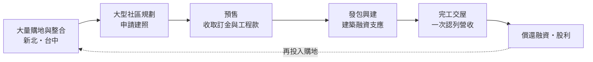
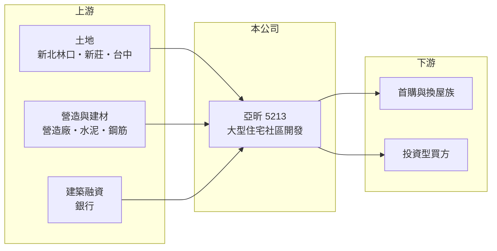

# 5213 亞昕

> 上櫃｜[[產業索引-建材營造業|建材營造業]]｜上市（櫃）日期 2003/04/24

# 第一章：企業模式與商業藍圖

> [!info] 撰寫說明
> 本文由 Claude 依公開資料整理，架構比照 [[2330台積電]] 的四章研究，資料截至 2026-10-08。財務數字來源：MoneyDJ 理財網年度財務比率與損益表、櫃買中心開放資料（基本資料、2026 年第二季財報、本益比殖利率）；業務描述參考聯合新聞網、經濟日報、今周刊、Yahoo 股市的新聞標題。公開資料有限，推案金額以新聞標題為準，個別建案未逐案查證。#待校對

在評估一家建商的長期價值時，第一步是看懂它的土地庫存規模與推案策略。本章針對亞昕國際開發（股票代號：5213，以下簡稱亞昕）的商業模式進行定性分析，說明一家從新北林口、新莊起家的建商，如何把重心擴展到台中，並成為上櫃建商中資產規模較大的一家。

## 一、核心定位：大量囤地、大規模推案的住宅建商

亞昕成立於 1995 年，2003 年在櫃買中心掛牌，總部位於新北市新莊區，董事長為姚政岳，總經理為余世浩，實收資本額約 72.1 億元。依新聞標題，集團總裁為姚連地，董事長屬於年輕一代，公司以「持續大獵地」聞名。

* **規模大：** 2026 年第二季底總資產約 700 億元，在上櫃建商中名列前茅。2025 年營收約 180 億元，是 2022 年的六倍。
* **策略轉向台中：** 依聯合新聞網與經濟日報標題，亞昕近年「推案重押台中」、「台中 5 年推 6 案」，並表示已準備約 500 億元的案量；另有報導指出公司當年推案約 220 億元、隔年規劃加碼到 330 億元以上。亞昕原本以新北林口、新莊等地的大型社區聞名，台中成為第二個主要市場。

## 二、資本轉化邏輯：土地庫存驅動的長週期開發

* **以土地庫存換取成長：** 亞昕的策略是在土地價格相對低時大量取得土地，再分年推出。土地庫存越大，未來的推案與營收就越有延續性，但持有期間的資金成本也越高。
* **槓桿經營：** 負債比率長期在 70% 至 80% 之間，2025 年約 76%。2026 年第二季底負債約 542 億元、股東權益約 159 億元。

## 三、長期方向：雙核心市場與穩定交屋

亞昕的長期方向是建立新北與台中兩個核心市場，讓推案與交屋不再集中在單一區域。依新聞標題，公司也升級了企業總部，顯示有長期深耕台中的打算。若 500 億元級的案量能依序推出並交屋，亞昕將從過去營收大起大落的建商，轉變為每年都有一定交屋量的大型開發商。

# 第二章：護城河深度與競爭優勢

護城河是企業抵禦競爭、長期維持超額利潤的機制。本章分析亞昕在住宅開發市場的競爭優勢、主要對手，以及這些優勢能守住多少。

## 一、亞昕護城河的核心組成要素

* **1. 大量低成本土地庫存：** 建商的利潤在買地時就決定大半。亞昕多年持續獵地，若土地是在前幾年以較低成本取得，未來交屋時就能維持較好的[[毛利率]]，2023 年毛利率約 33%，2025 年約 27%。
* **2. 大型社區開發能力：** 大型社區需要整合大片土地、規劃公共設施與長期分期銷售，能做的建商不多。亞昕在林口等地累積了大型社區的開發經驗。
* **3. 規模帶來的議價力：** 推案量大，可以向營造廠與建材商取得較好的發包條件，也較容易取得銀行融資。

## 二、主要競爭對手格局

| 對手 | 定位 | 對亞昕的威脅 |
|---|---|---|
| [[2542興富發]] | 全台大型建商，案量大 | 在新北與台中都直接競爭 |
| [[2545皇翔]] | 台北與台中高價住宅 | 在台中高價市場競爭 |
| [[5522遠雄]] | 新北與林口大型開發 | 林口與新北大型社區的主要對手 |
| [[5206坤悅]]、[[4907富宇]] | 台中在地建商 | 熟悉台中土地與客群 |

## 三、優勢轉化：哪些守得住、哪些守不住

* **守得住：** 已在手的大量土地是未來數年營收的基礎，只要房市不出現大幅反轉，交屋量具備延續性。
* **守不住：** 高槓桿與大量土地庫存，在房市轉冷時會變成負擔。台中市場競爭者眾多，新推案的售價與去化不一定能維持過去水準。
* **觀察重點：** 第一，台中各建案的預售去化率；第二，[[已售未入帳]]金額與交屋時程；第三，[[信用管制]]下的融資條件與利息負擔。

# 第三章：財務體質與盈利規模

資料日期：2026-10-08。數字取自 MoneyDJ 理財網年度財務資料與櫃買中心開放資料，表格是撰寫當時的快照；最新月營收、毛利率、累計 EPS 由自動排程寫在本筆記的屬性欄位（月營收、毛利率、累計EPS 等）。#待校對

財務報表是檢驗護城河是否真實存在的最終標準。本章用五年的三率、ROE、營建業指標與資本報酬，檢視亞昕的獲利品質。

## 一、獲利能力的基石：三率

| 年度 | 營收（新台幣） | [[毛利率]] | [[營業利益率]] | EPS（元） | [[ROE]] |
|---|---|---|---|---|---|
| 2021 | 30.5 億 | 26.6% | 9.61% | 0.73 | 3.02% |
| 2022 | 29.3 億 | 25.9% | 9.01% | 0.67 | 2.39% |
| 2023 | 55.9 億 | 33.0% | 22.7% | 2.59 | 10.9% |
| 2024 | 86.9 億 | 30.4% | 18.6% | 1.65 | 7.05% |
| 2025 | 180.3 億 | 27.4% | 18.3% | 3.06 | 12.9% |

資料來源：MoneyDJ 理財網年度損益表與財務比率。2026 年上半年（櫃買中心資料）營收約 46.1 億元、毛利率約 31.3%、營業利益率約 18.3%、業外損失約 2.56 億元、EPS 0.30 元。

亞昕在 2023 至 2025 年進入交屋放量期，營收連續三年大幅成長，2021 至 2025 年營收年複合成長率約 56%（推算），但這主要反映交屋時點，不代表能年年維持。毛利率長期穩定在 24% 至 33%，顯示產品定價與土地成本控制相對一致。2026 年上半年營業利益率仍有 18%，但業外損失（推估以利息為主）使 EPS 只有 0.30 元，凸顯高槓桿建商在交屋較少的期間，利息會吃掉大部分本業獲利。

## 二、營建業指標：推案量、已售未入帳與存貨

依新聞標題，亞昕表示已準備約 500 億元的案量，並曾規劃單年推案約 220 億元、隔年 330 億元以上；完整的[[已售未入帳]]金額未查得。2026 年第二季底流動資產約 645 億元，約為 2025 年營收的 3.6 倍，主要是土地與在建房地；流動負債約 427 億元、非流動負債約 115 億元。

## 三、[[ROE]] 與股利

2021 至 2025 年平均 ROE 約 7.3%（推算），近三年平均約 10%。依櫃買中心資料，最近一次現金股利為每股 2.8 元，相對 2025 年 EPS 3.06 元，配發率約九成（推算）。另有新聞標題提到亞昕曾出現「12 年來首見股利掛蛋」的年度，顯示股利會隨交屋獲利大幅變動，穩定度中等偏低。

## 四、[[ROIC]] 與 [[WACC]]：價值創造利差

**ROIC 推算：** 2025 年營業利益約 33.0 億元，稅後約 26.4 億元。官方資料只揭露負債總計約 542 億元，假設其中六成為有息負債約 325 億元（推估），加上股東權益約 159 億元，投入資本約 484 億元，ROIC 約 5.5%（推算）；以 2021 至 2025 年平均營業利益計算約 2.2%（推算）。

**WACC 推算：** 台灣 10 年期公債殖利率取 1.75%、市場風險溢酬 6%、β 取營建同業常見值 0.9（未查得公司實際 β），股東權益成本約 7.2%。負債成本假設 3%，稅率 20%，稅後約 2.4%。權益約占投入資本 33%，WACC 約 4.0%（推算）。

**結論：** 亞昕在 2025 年交屋高峰時 ROIC 高於 WACC，但五年平均仍低於資金成本。大量土地庫存的價值要靠未來數年的交屋實現，若台中與新北的推案能以目前毛利率順利去化，ROIC 可望穩定高於 WACC；若房市轉冷，龐大的土地與融資會成為拖累。

# 第四章：總體風險與地緣政治

任何企業都無法脫離宏觀環境獨立存在。本章分析亞昕長期必須面對的房市週期、政策與財務風險。

## 一、產業週期與政策風險

* **房市週期：** 亞昕的土地庫存大，對房價與成交量的變化特別敏感。房市熱絡時，土地庫存是成長引擎；房市冷卻時，則是持有成本與跌價風險。
* **[[信用管制]]：** 2024 年第七波選擇性信用管制後，買方貸款與建商融資都受限，大量推案的建商最需要融資支援。
* **台中供給：** 多家大型建商同時加碼台中，若同一時期推案量過大，可能出現價格競爭與去化放慢。

## 二、營運環境的隱性風險

* **營造成本與工期：** 大型社區工期長，缺工與建材上漲的影響會被放大，也可能延後交屋。
* **跨區管理：** 同時經營新北與台中兩個市場，對團隊、營造協力廠與銷售通路的管理要求更高。

## 三、財務與治理風險

* **高負債與利息：** 負債約 542 億元，利率每上升 0.5 個百分點，利息負擔就可能增加億元以上（推估）。2026 年上半年業外損失約 2.56 億元，已顯示利息對獲利的影響。
* **家族經營與世代交替：** 公司由姚家經營，年輕董事長接班後的決策風格與資本配置，是長期觀察重點。
* **非控制權益：** 部分建案透過子公司開發，歸屬母公司的權益約 144 億元，投資人應以歸屬母公司的獲利評估。

# 專有名詞解析

## 金融

- **[[信用管制]]**：央行限制購屋與建商貸款成數的政策，會影響房市成交與建商資金。
- **[[ROIC]]**：投入資本報酬率，稅後營業利益除以股東權益加有息負債，衡量本業運用資本的效率。
- **[[WACC]]**：加權平均資金成本，股東與債權人要求報酬率的加權平均，是 ROIC 要超越的門檻。

## 產業

- **[[建案交屋]]**：建商在房屋完工並交付買方時才認列營收，因此營建公司的營收常集中在交屋年度。
- **[[已售未入帳]]**：已經賣出、但尚未完工交屋而未認列營收的建案金額，是建商未來營收的主要能見度指標。
- **[[預售屋]]**：房屋在興建完成前就先銷售，買方分期繳款，建商可藉此降低資金與銷售風險。

# 核心供應鏈

## 1. 上游：土地、營造與資金
- 土地來源：新北林口、新莊與台中購地及整合
- 營造：外部發包營造廠（合作對象未查得）；建材如 [[1101台泥]]、[[2002中鋼]]
- 資金：銀行建築融資

## 2. 中游：亞昕與同業
- 同業：[[2542興富發]]、[[2545皇翔]]、[[5522遠雄]]、[[5206坤悅]]、[[4907富宇]]

## 3. 下游：客戶
- 新北與台中的首購、換屋與投資型購屋者

## 最新新聞
<!-- news:start -->
<!-- news:end -->

## 相關連結
- [公開資訊觀測站](https://mopsov.twse.com.tw/mops/web/t05st03?step=1&firstin=1&co_id=5213)
- [Goodinfo](https://goodinfo.tw/tw/StockDetail.asp?STOCK_ID=5213)
- [Yahoo 股市](https://tw.stock.yahoo.com/quote/5213)
- [鉅亨網新聞](https://www.cnyes.com/twstock/5213/news)
