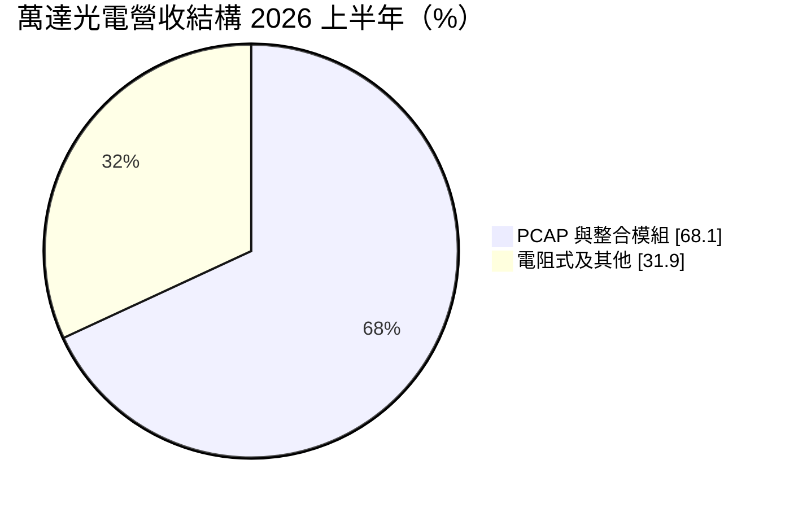
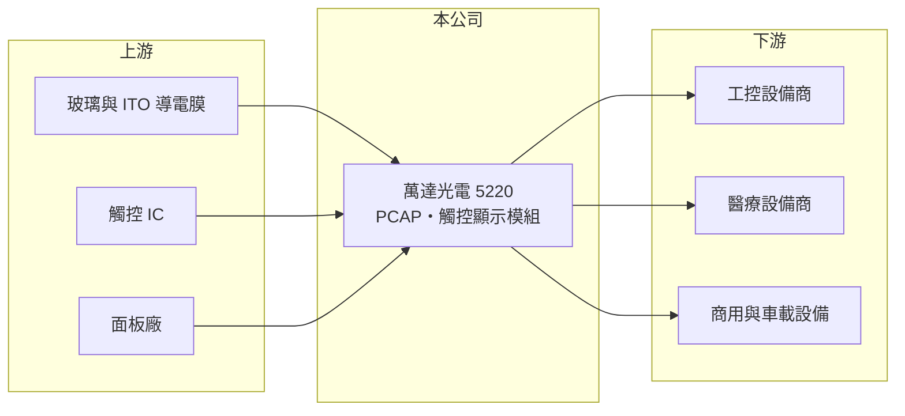

# 5220 萬達光電

> 上櫃｜[[產業索引-光電業|光電業]]｜上市（櫃）日期 2018/04/26

# 第一章：企業模式與商業藍圖

> [!info] 撰寫說明
> 精簡版，由 Claude 依公開資料整理，架構比照 [[2330台積電]]，資料截至 2026-10-07。來源：富果研究 萬達光電 2026 年 9 月法說會整理、winvest.tw 營收快訊。#待校對

萬達光電是宜蘭的[[觸控面板]]廠，從電阻式觸控起家，現以投射電容式與觸控顯示模組為主力。

- **核心業務：** 產品包括傳統電阻式觸控面板、投射電容式觸控（[[PCAP]]）與整合模組、觸控顯示模組（TDM），並於 2026 年推出斷碼式 [[In-cell]] 觸控顯示技術。
- **營收結構：** 2026 年上半年 PCAP 與整合模組合計占營收 68.1%，年增 43.3%；應用以工控為主，工控應用年增 47.9%。
- **營運據點：** 宜蘭總部負責研發、生產與組裝，桃園與中國崑山設有業務與技術支援辦公室。
- **長期方向：** 2026 年機構組裝線量產、2025 年取得 ISO 13485 醫療認證，朝工控與醫療整合模組發展，並以 AI 優化製程排程與品管。

# 第二章：護城河深度與競爭優勢

萬達光電避開消費性大廠的戰場，專攻工控與醫療等少量多樣的利基市場。

- **競爭優勢：** 工控與醫療客戶重視耐用與長期供貨，加上醫療認證，形成一定轉換成本。
- **主要對手：** 台灣觸控同業如 [[3149正達]]、[[3622洋華]]，以及中國觸控模組廠。
- **觀察重點：** 整合模組與醫療產品占比能否持續提高，以及歐洲市場（上半年年增 49.4%）的延續性。

# 第三章：財務體質與盈利規模

資料日期：2026-10-07，以下數字是撰寫當時的快照；最新月營收、毛利率、累計 EPS 由自動排程寫在本筆記的屬性欄位（月營收、毛利率、累計EPS 等）。#待校對

萬達光電 2026 年上半年營收大幅成長並維持獲利。

- **營收規模：** 2026 年上半年合併營收 5.33 億元，年增 34%；6 月單月 9,451 萬元，年增 76.04%。
- **獲利：** 上半年毛利 1.11 億元（年增 29.8%，換算[[毛利率]]約 20.8%）、營業利益 2,900 萬元、稅後淨利 2,640 萬元；EPS 本次未查到。
- **財務特色：** 營收規模小，營業利益率約 5%（推估），規模擴大時具營運槓桿。

# 第四章：總體風險與地緣政治

萬達光電的風險在於規模小與工控景氣波動。

- **產業週期：** 工控與商用設備的投資週期起伏，會影響觸控模組出貨。
- **營運風險：** 營收規模小，單一大客戶或專案變動對營收影響大；新產線量產初期良率與成本控制。
- **其他風險：** 歐元與美元匯率波動，以及玻璃、ITO 導電膜等原料價格變化。

# 專有名詞解析

## 金融

- **[[毛利率]]**：營業毛利占營收的比例，反映產品的定價能力與成本控制。

## 產業

- **[[觸控面板]]**：偵測手指或觸控筆位置的輸入元件，常與顯示器整合成觸控顯示模組。
- **[[PCAP]]**：投射電容式觸控，可多點觸控、透光率高，是手機與工控觸控螢幕的主流技術。
- **[[In-cell]]**：把觸控感測線路直接做進液晶面板內部的技術，可讓模組更薄、成本更低。

# 核心供應鏈

- 上游：玻璃與 ITO 導電膜、觸控 IC、面板供應商（推估）
- 下游／客戶：工控、醫療與商用設備廠，歐洲客戶比重上升
- 同業：[[3149正達]]、[[3622洋華]]

## 最新新聞
<!-- news:start -->
<!-- news:end -->

## 相關連結
- [公開資訊觀測站](https://mopsov.twse.com.tw/mops/web/t05st03?step=1&firstin=1&co_id=5220)
- [Goodinfo](https://goodinfo.tw/tw/StockDetail.asp?STOCK_ID=5220)
- [Yahoo 股市](https://tw.stock.yahoo.com/quote/5220)
- [鉅亨網新聞](https://www.cnyes.com/twstock/5220/news)
