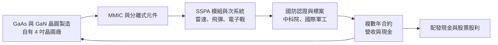
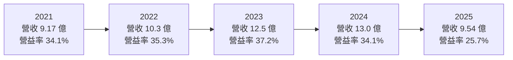
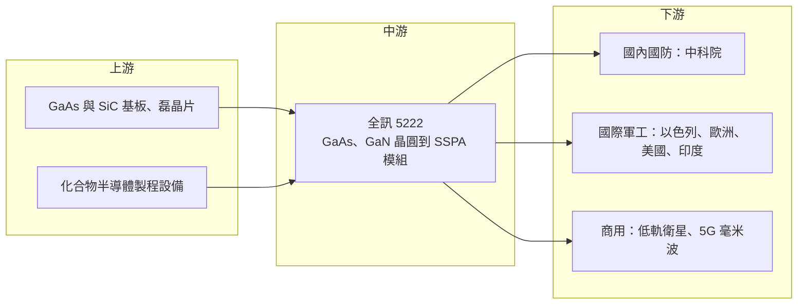

# 5222 全訊

> 上市｜[[產業索引-半導體業|半導體業]]｜上市（櫃）日期 2021/10/25

# 第一章：企業模式與商業藍圖

> [!info] 撰寫說明
> 本文由 Claude 依公開資料整理，架構比照 [[2330台積電]] 的四章研究，資料截至 2026-10-08。財務數字來源：Goodinfo 年度經營績效、股利政策與基本資料頁，poorstock 整理之全訊法說會簡報重點，數位時代（2021 年上市報導）、工商時報、優分析、財訊；產業描述為整理性內容，尚未逐條比對原始文件。#待校對

在評估單一個股的長期投資價值時，首要步驟是拆解企業的底層獲利邏輯。本章針對全訊科技（股票代號：5222，以下簡稱全訊）的商業模式進行定性分析，說明一家以軍規微波元件為主的小型化合物半導體公司，如何在台灣的國防自主政策與全球軍工需求中找到位置。

## 一、核心定位：台灣少見的微波功率放大器 IDM

全訊成立於 1998 年，總部位於新竹科學園區，英文名稱為 Transcom，2012 年登錄興櫃，2021 年 10 月在證交所上市，董事長為張全生。全訊的核心技術是 [[GaAs]]（砷化鎵）與 [[GaN]]（氮化鎵）的微波功率放大器，也就是把無線電訊號放大、讓雷達與通訊設備能把訊號送得更遠的關鍵元件。

全訊最特別的地方是商業模式。依 2021 年上市時的報導，它是國內唯一專業的砷化鎵 [[IDM]] 公司，從晶圓設計、晶圓製造、封裝測試，一路做到功率放大器模組與次系統。這與多數台灣化合物半導體公司只做代工或只做設計不同。這個定位有兩個商業意義：

* **掌握製程等於掌握性能：** 軍用功率放大器講究在極端環境下的功率、效率與可靠度，自有晶圓廠讓全訊可以針對特定頻段調整製程，做出標準代工品難以達到的規格。
* **符合國防供應鏈的自主要求：** 國防客戶要求關鍵元件可追溯、可長期供貨，且最好不依賴境外產能。全訊從晶圓到模組都在台灣完成，正好符合這個要求。

## 二、終端應用與產品板塊

全訊的營收以軍用市場為主，依優分析報導，軍用比重超過八成；商用與航太通訊同步拓展，但公司未揭露確切比重，因此本文不畫營收圓餅圖。產品可分成三個層次：

* **微波半導體元件：** 分離式元件與 [[MMIC]]（單晶微波積體電路），例如 Ka 頻段 3W MMIC、5G 毫米波功率放大器 MMIC。這是全訊技術的根基。
* **[[SSPA]] 固態功率放大器模組與次系統：** 包括 X 頻段 GaN 500W 等高功率產品，用於飛彈、雷達與電子戰系統。依財訊報導，全訊的高功率 SSPA 是天弓飛彈系統與[[主動相列雷達]]的關鍵元件。
* **電子干擾與反制系統：** [[無人機]]干擾模組（0.4 至 6 GHz）與反無人機系統，已有台灣與多國訂單，毛利率較高。

商用方面，全訊布局 [[低軌衛星]]通訊用 MMIC（例如 29 GHz 3W、14 GHz 4W）與 5G 毫米波小型基地台功率放大器，並以 GaN 大功率放大器取代傳統的行波管放大器。行波管是真空元件，體積大、壽命短，以固態 GaN 元件取代是長期的技術趨勢。

## 三、資本轉化邏輯：軍規認證換取長期訂單

全訊的獲利邏輯建立在「認證」上。軍用元件要先通過國防部的[[軍品認證]]與客戶的長期測試，才能進入標案名單。依優分析報導，全訊在 2025 年上半年取得國防部軍品認證證書，高頻 SSPA、升頻器、都卜勒放大器與接收器等產品完成測試，可以爭取 SSPA 與雷達相關的軍用標案。認證過程耗時，但一旦通過，同一型號武器系統的後續生產與維修都會延續採購，形成多年期的訂單。

這種模式的代價是營收時程不穩定。國防標案的交貨時點取決於政府預算與驗收進度，認證或標案遞延時，單一年度營收可能大幅下滑。2025 年營收由前一年的 13.0 億元降到 9.54 億元，主因就是軍品認證時程與標案出貨遞延。

產能方面，依法說會資料，一廠面積約 1,100 坪，GaAs PHEMT 與 GaN HEMT 無塵室年產能約 1 萬片晶圓；二廠面積約 1,350 坪，2021 年報導指出二廠完工後總產能可望增加一倍以上。

## 四、企業長期藍圖

* **國防自主的長期受惠者：** 台灣政府提高國防預算、推動國產武器與本土無人機，國防元件國產化是長期政策方向。全訊是少數同時通過政府與國際大廠認證的軍規 SSPA 供應商。
* **國際軍工市場：** 法說會簡報列出的國際客戶包括以色列 IAI/Elta、Rafael、Elbit，美國 Teledyne、CPI、Keysight、Microchip，歐洲 Thales、SAAB，以及印度 BEL。2024 年下半年取得歐洲軍工客戶的大型無人機與軍用雷達 SSPA 訂單，代表全訊正從國內標案供應商，擴展為國際軍工供應鏈的一員。
* **低軌衛星與 5G／6G：** 以國防規格技術切入高階商用市場，例如低軌衛星地面站與毫米波通訊，分散對單一國防客戶的依賴。
* **GaN 取代行波管：** 以壽命長、效率高、維護成本低的 GaN 固態放大器取代行波管，是全訊長期最大的技術機會。

# 第二章：護城河深度與競爭優勢

護城河決定企業能否長期守住獲利。本章分析全訊在軍規微波元件市場的競爭優勢，以及這些優勢能否轉化成穩定的長期成長。

## 一、護城河的核心組成要素

* **軍品認證與長期驗證紀錄：** 國防元件的認證需要數年測試，且客戶重視過去的實戰與部署紀錄。全訊已打入國內飛彈與雷達系統，並取得國際軍工客戶的認證，後進者很難在短時間內取得同等資格。
* **從晶圓到次系統的垂直整合：** 自有 GaAs 與 GaN 晶圓廠，讓全訊能控制元件性能、交期與保密性。國際軍工客戶對供應鏈安全要求高，能在單一公司內完成晶圓到模組，是重要的加分條件。
* **小量多樣的客製化能力：** 軍用產品數量小、規格多、要求高，大型化合物半導體代工廠通常不願投入。全訊以客製化開發切入，與歐洲、台灣多家客戶共同開發電子偵防系統用 SSPA，形成深度合作關係。
* **地緣政治下的「可信任供應商」地位：** 在美中對抗與俄烏戰爭後，歐美軍工體系更重視非中國的元件來源，台灣供應商因此獲得更多機會。

## 二、全球主要競爭對手格局

| 對手 | 定位 | 對全訊的威脅 |
|---|---|---|
| Qorvo、Wolfspeed 等美國化合物半導體廠 | GaAs 與 GaN 射頻元件大廠，深度參與美國國防 | 技術與規模領先，主導美國本土軍工市場 |
| 歐洲與以色列軍工集團內部射頻部門 | 系統廠自製或內部供應 | 部分客戶可能選擇自製關鍵元件 |
| [[3105穩懋]]、[[8086宏捷科]] | 台灣 GaAs 晶圓代工 | 製程能力強，但以商用代工為主，與全訊多為不同定位 |
| 國內國防與無人機供應鏈廠 | 系統整合與無人機製造 | 部分為合作夥伴，也可能在次系統層級競爭 |

## 三、優勢轉化：哪些市場守得住、哪些守不住

* **守得住：** 國內飛彈、雷達與電子戰系統的 SSPA，以及已通過認證的國際軍工專案。這些市場有認證門檻與長期合約，客戶不會輕易更換供應商。
* **守不住：** 一般商用 5G 與消費性射頻元件。這類市場重視規模與成本，全訊的小型 4 吋晶圓廠難以與大型代工廠競爭。
* **觀察重點：** 第一是國際軍工訂單占比能否持續提升，降低對國內標案時程的依賴；第二是反無人機與低軌衛星產品能否成為穩定的第二成長來源；第三是 GaN 大功率放大器取代行波管的進度。

# 第三章：財務體質與盈利規模

資料日期：2026-10-08。數字取自 Goodinfo 年度經營績效與股利政策頁、poorstock 法說會整理，表格是撰寫當時的快照；最新月營收、毛利率、累計 EPS 由自動排程寫在本筆記的屬性欄位（月營收、毛利率、累計EPS 等）。#待校對

財務報表是檢驗護城河是否真實存在的最終標準。本章用五年的三率、[[ROE]]、股利與資本報酬，檢視全訊在國防標案週期中的獲利品質。

## 一、獲利能力的基石：三率

| 年度 | 營收（新台幣） | [[毛利率]] | [[營業利益率]] | EPS（元） | [[ROE]] |
|---|---|---|---|---|---|
| 2021 | 9.17 億 | 54.0% | 34.1% | 4.04 | 17.2% |
| 2022 | 10.3 億 | 54.6% | 35.3% | 3.71 | 12.5% |
| 2023 | 12.5 億 | 55.6% | 37.2% | 5.88 | 20.5% |
| 2024 | 13.0 億 | 52.5% | 34.1% | 4.84 | 16.8% |
| 2025 | 9.54 億 | 52.3% | 25.7% | 2.51 | 9.06% |

全訊最突出的財務特徵是毛利率的穩定。依 Goodinfo，2019 至 2025 年毛利率一直在 52% 至 56% 之間，即使 2025 年營收下滑超過兩成，毛利率仍維持 52.3%。這代表軍規產品的定價權相當穩固，營收波動來自標案時程，而不是價格競爭。

營業利益率則隨營收規模變動：2023 至 2024 年營收創新高時約 34% 至 37%，2025 年營收下滑後降到 25.7%，顯示固定費用（研發與晶圓廠折舊）帶來的[[營運槓桿]]。拉長來看，營收由 2016 年的 3.37 億元成長到 2024 年高峰的 13.0 億元，2016 至 2025 年營收年複合成長率約 12.3%（推算），2020 至 2025 年約 6.2%（推算）。

EPS 的解讀需要注意股本膨脹。全訊多年配發股票股利，股本由 2020 年的 4.13 億元增加到 2025 年的 9.09 億元，目前資本額約 10 億元，因此每股盈餘的成長幅度小於淨利的成長幅度。

## 二、[[ROE]]：資本效率

2021 至 2025 年平均 ROE 約 15.2%（推算）。全訊的財務槓桿很低，2025 年 ROA 7.59% 與 ROE 9.06% 接近，ROE 主要由本業獲利決定。以化合物半導體 IDM 需要自建晶圓廠的資本密集度來看，平均 15% 左右的 ROE 屬於不錯的水準，但會隨標案時程大幅起伏。

## 三、資本支出與[[自由現金流]]

與 Fabless 公司不同，全訊擁有自己的晶圓廠，需要定期投入設備與廠房，二廠建置就是一例（具體資本支出金額未查得）。長期[[自由現金流]]大致為正（推估），但在擴廠年度或標案收款延遲時可能轉弱。

股利方面，依 Goodinfo，2021 至 2025 年度現金股利分別為 3.5、3、4、4、2.5 元，另 2022 至 2025 年度每年配發 1 元[[股票股利]]。對照 EPS，現金[[配息率]]約為 87%、81%、68%、83%、100%（推算）。全訊自 2018 年度起每年配息，現金股利占盈餘比重高，但同時發放股票股利，使股本持續擴大。長期而言，若獲利成長跟不上股本擴張，每股盈餘與 ROE 都會被稀釋。

## 四、[[ROIC]] 與 [[WACC]]：價值創造利差

**ROIC 推算：** 2025 年營業利益約 2.45 億元（9.54 億 × 25.7%），以 20% 稅率計算，稅後營業利益約 1.96 億元。投入資本以股東權益計算，用淨利 2.25 億元與 ROE 9.06% 回推權益約 24.8 億元（有息負債不重大），ROIC 約 7.9%（推算）。2023 年稅後營業利益約 3.72 億元（12.5 億 × 37.2% × 0.8），權益約 21.3 億元，ROIC 約 17.5%（推算）。

**WACC 推算：** 權益成本用 CAPM 估計，假設台灣 10 年期公債殖利率 1.75%、市場風險溢酬 6%、β 取半導體元件同業常見值 1.0，權益成本約 7.75%。公司沒有重大有息負債，WACC 約 7.75%（推算）。

**結論：** 全訊在 2021 至 2024 年的 ROIC 約 12% 至 18%（推算），明顯高於約 7.75% 的資金成本，代表本業長期創造價值；2025 年因標案遞延，ROIC 降到與 WACC 相近的水準。這說明全訊的價值創造能力取決於標案能否如期交貨，而非產品競爭力。隨著國際軍工訂單比重上升、出貨來源分散，ROIC 的波動有機會縮小。

# 第四章：總體風險與地緣政治

任何企業都無法脫離宏觀環境獨立存在。本章分析全訊未來必須面對的地緣政治、產業週期、營運與技術風險。

## 一、地緣政治

* **地緣政治同時是需求來源與風險：** 台海與國際緊張局勢推高國防預算，是全訊需求的主要來源；但兩岸情勢若惡化到影響台灣生產，全訊位於新竹的晶圓廠與模組產線也會受衝擊。
* **出口管制與軍品輸出規範：** 國防元件出口需要遵守台灣與客戶所在國的軍品管制規定，國際關係變化可能影響特定國家的訂單。國際客戶集中在以色列、歐美與印度，各地區的政治情勢都會影響採購。

## 二、產業週期與市場結構

* **國防預算與標案時程：** 全訊的營收週期不是跟著消費景氣，而是跟著政府預算編列、標案發包與驗收進度。認證延遲或預算刪減，都會讓單一年度營收大幅下滑，2025 年即為一例。
* **客戶集中：** 中科院等國內國防單位與少數國際軍工集團占營收大宗，單一客戶的專案進度會明顯影響公司業績。
* **市場規模有限：** 軍規微波元件市場專業但規模不大，公司要持續成長，需要成功打入更多國際系統廠與商用衛星市場。

## 三、營運環境的隱性風險

* **股本稀釋：** 持續配發股票股利使股本擴大，若獲利沒有同步成長，每股價值會被稀釋。
* **晶圓廠規模與良率：** 4 吋化合物半導體晶圓廠規模小，設備老化或關鍵人才流失，都可能影響良率與交期。
* **匯率與原物料：** 海外軍品以外幣計價，匯率波動影響獲利；砷化鎵、氮化鎵等材料與基板價格也會影響成本。

## 四、科技或法規演進

* **GaN 的技術競賽：** GaN 是軍用雷達與電子戰的主流方向，國際大廠投入大量資源。全訊需要持續提升 GaN 功率與效率，才能在國際競爭中維持地位。
* **無人機與反無人機技術的快速演變：** 無人機作戰的戰術與頻段變化快，干擾與反制系統必須快速更新。這帶來新商機，但也代表產品生命週期可能縮短。
* **低軌衛星標準化：** 若低軌衛星終端走向大量生產的標準化設計，價格競爭會加劇，全訊的客製化優勢可能減弱。

# 專有名詞解析

## 半導體

- **[[GaAs]]**：砷化鎵，化合物半導體材料，電子移動速度快，適合製作高頻的射頻與微波元件。
- **[[GaN]]**：氮化鎵，能承受高電壓與高功率的化合物半導體，用於雷達、基地台與快充。
- **[[IDM]]**：整合元件製造，從晶片設計、晶圓製造到封裝測試都由同一家公司完成。
- **[[MMIC]]**：單晶微波積體電路，把放大器等微波電路整合在一顆化合物半導體晶片上。
- **[[SSPA]]**：固態功率放大器，以半導體元件放大微波訊號，用來取代體積大、壽命短的行波管。

## 應用

- **[[無人機]]**：無人駕駛的飛行器，近年大量用於軍事偵察與攻擊，也帶動反無人機干擾系統需求。
- **[[低軌衛星]]**：在距地表約 500 至 2,000 公里軌道運行的通訊衛星，傳輸延遲低，需要大量地面站與終端設備。
- **[[主動相列雷達]]**：以大量小型收發模組電子控制波束方向的雷達，每個模組都需要功率放大器。

## 金融

- **[[股票股利]]**：公司以發行新股的方式分配盈餘，股東持股數增加，但股本也會擴大、稀釋每股盈餘。
- **[[營運槓桿]]**：固定費用占比高的公司，營收增加時利潤增幅會大於營收增幅，營收減少時利潤也會放大下滑。
- **[[配息率]]**：現金股利占每股盈餘的比例，反映公司把多少盈餘發給股東。
- **[[ROE]]**：股東權益報酬率，稅後淨利除以股東權益，衡量股東投入的資金每年賺回多少。
- **[[ROIC]]**：投入資本報酬率，稅後營業利益除以股東權益加有息負債，衡量本業運用資本的效率。
- **[[WACC]]**：加權平均資金成本，股東與債權人要求報酬率的加權平均，是 ROIC 需要超越的門檻。

## 產業

- **[[軍品認證]]**：國防單位對元件性能、可靠度與供應穩定性的審查，通過後才能參與軍用標案。

# 核心供應鏈

## 1. 上游：基板、磊晶與設備
- 化合物半導體基板與磊晶片：公開資料未揭露具體供應商，台灣磊晶廠代表為 [[3016嘉晶]]、[[4971IET-KY]]（產業參考，非公司揭露之供應商）

## 2. 中游：全訊本身
- 自有 GaAs PHEMT 與 GaN HEMT 晶圓廠，產品涵蓋 MMIC、SSPA 模組、干擾系統

## 3. 下游：國防與商用客戶
- 國內：中科院（飛彈、雷達系統）
- 以色列：IAI/Elta、Rafael、Elbit
- 美國：Teledyne、CPI、Keysight、Microchip
- 歐洲：Thales、SAAB；印度：BEL

## 4. 同業與相關公司
- 台灣化合物半導體：[[3105穩懋]]、[[8086宏捷科]]
- 國際射頻大廠：Qorvo、Wolfspeed

## 最新新聞
<!-- news:start -->
<!-- news:end -->

## 相關連結
- [公開資訊觀測站](https://mopsov.twse.com.tw/mops/web/t05st03?step=1&firstin=1&co_id=5222)
- [Goodinfo](https://goodinfo.tw/tw/StockDetail.asp?STOCK_ID=5222)
- [Yahoo 股市](https://tw.stock.yahoo.com/quote/5222)
- [鉅亨網新聞](https://www.cnyes.com/twstock/5222/news)
