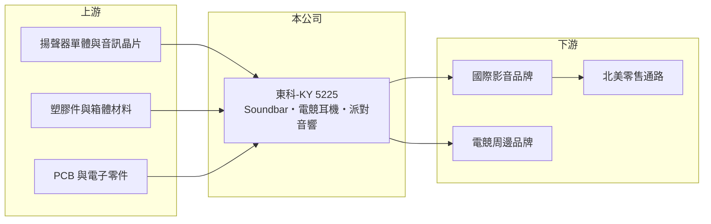

# 5225 東科-KY

> 上市｜[[產業索引-其他電子業|其他電子業]]｜上市（櫃）日期 2012/11/05

# 第一章：企業模式與商業藍圖

> [!info] 撰寫說明
> 精簡版，由 Claude 依公開資料整理，架構比照 [[2330台積電]]，資料截至 2026-10-07。來源：工商時報（2026 年 2 月東科 2025 年財報報導）、winvest.tw 營收快訊。營收比重與客戶名單未查到。#待校對

東科是影音揚聲器的代工廠，產品以 Soundbar、電競耳機與派對音響為主。

- **核心業務：** 東科-KY 為影音揚聲器系統 [[ODM]] 製造商，產品包括 [[Soundbar]]、電競耳機與新一代派對音響（Partybox）。
- **營收結構：** 本次未查到產品與客戶比重；客戶為國際影音品牌（推估）。
- **營運據點：** 本次未查到詳細生產據點資料；公司為海外註冊的 [[KY股]]。
- **長期方向：** 積極開發派對音響商機，並爭取北美零售大廠訂單。

# 第二章：護城河深度與競爭優勢

東科的優勢在聲學設計與量產經驗，但代工模式議價能力有限。

- **競爭優勢：** 揚聲器需要聲學調校、箱體結構與電子整合，多年代工經驗讓東科能協助品牌客戶縮短開發時程。
- **主要對手：** [[2439美律]] 等台灣聲學代工廠，以及歌爾等中國電聲代工大廠。
- **觀察重點：** [[2352佳世達]]斥資約 32 億元間接取得約 35% 股權成為最大股東，後續雙方在通路與製造上的合作方式。

# 第三章：財務體質與盈利規模

資料日期：2026-10-07，以下數字是撰寫當時的快照；最新月營收、毛利率、累計 EPS 由自動排程寫在本筆記的屬性欄位（月營收、毛利率、累計EPS 等）。#待校對

東科年營收約 110 億元，配息率高。

- **營收規模：** 2025 年全年營收 110.39 億元、年減 11%；2026 年 6 月營收 9.48 億元、年增 17.8%，8 月 11.83 億元、年減 8.97%。
- **獲利：** 2025 年稅後純益約 8 億元、EPS 10.26 元（史上次高），[[毛利率]] 16.4%。2026 年季度 EPS 本次未查到。
- **財務特色：** 2025 年度現金股利 7.2 元，配發率 70.2%。

# 第四章：總體風險與地緣政治

東科的風險在於消費電子需求、客戶集中與匯率。

- **產業週期：** 影音與電競產品屬消費性電子，旺季集中在下半年，終端需求轉弱時品牌會砍單去庫存。
- **營運風險：** 代工廠客戶集中於少數品牌（推估），單一客戶訂單變化影響大；股權結構改變後的經營策略需觀察。
- **其他風險：** 2025 年營收下滑部分來自匯率影響；美國關稅政策與生產據點所在國家的政策風險。

# 專有名詞解析

## 應用

- **[[Soundbar]]**：條形音響，把多個揚聲器整合在一支長條箱體內，搭配電視使用以提升音效。

## 金融

- **[[KY股]]**：在海外註冊、回台灣掛牌的公司，股票名稱後加註 KY。
- **[[毛利率]]**：毛利除以營收，代表產品扣除直接成本後的獲利空間。

## 產業

- **[[ODM]]**：原廠委託設計製造，代工廠負責產品設計與生產，再以客戶品牌出貨。

# 核心供應鏈

- 上游：揚聲器單體、音訊晶片、塑膠與箱體材料、PCB 供應商
- 下游／客戶：國際影音與電競周邊品牌（名單本次未查到），最終銷往北美等零售通路
- 同業：[[2439美律]]、歌爾
- 股東：[[2352佳世達]]（約 35%）

## 最新新聞
<!-- news:start -->
<!-- news:end -->

## 相關連結
- [公開資訊觀測站](https://mopsov.twse.com.tw/mops/web/t05st03?step=1&firstin=1&co_id=5225)
- [Goodinfo](https://goodinfo.tw/tw/StockDetail.asp?STOCK_ID=5225)
- [Yahoo 股市](https://tw.stock.yahoo.com/quote/5225)
- [鉅亨網新聞](https://www.cnyes.com/twstock/5225/news)
