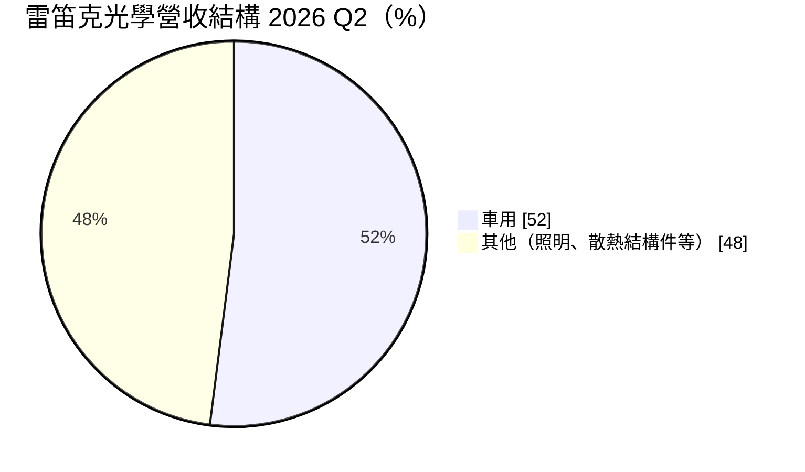
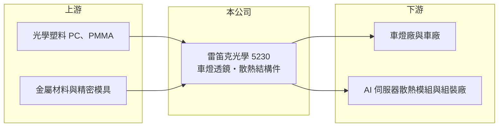

# 5230 雷笛克光學

> 上櫃｜[[產業索引-光電業|光電業]]｜上市（櫃）日期 2012/06/05

# 第一章：企業模式與商業藍圖

> [!info] 撰寫說明
> 精簡版，由 Claude 依公開資料整理，架構比照 [[2330台積電]]，資料截至 2026-10-07。來源：優分析「車用透鏡與AI伺服器雙引擎發威 雷笛克光學Q3營運看好更上層樓」。#待校對

雷笛克光學以 LED 二次光學透鏡起家，目前以車燈透鏡為主，並跨入 [[AI伺服器]]散熱結構件。

- **核心業務：** 主要產品為車用頭燈等高階光學透鏡，包括矩陣式頭燈中的[[自適應頭燈]]透鏡，另供應 AI 伺服器精密散熱與結構件。
- **營收結構：** 2026 年第二季車用領域占營收 52%，較去年同期的 46% 提升。
- **營運據點：** 生產據點本次未查到明細，本文不推測。
- **長期方向：** 公司以「高階車用新案量產」與「AI 伺服器精密散熱結構件」為雙成長動能，後者涉及輝達 B 系列與 Vera Rubin 平台相關產品。

# 第二章：護城河深度與競爭優勢

雷笛克的優勢在於光學設計與精密成型，車用案量產後轉換成本高。

- **競爭優勢：** 車燈透鏡需配合車廠與車燈廠共同開發，通過[[車規驗證]]後通常跟著車型供貨數年。
- **主要對手：** 光學透鏡與 LED 光學同業，以及散熱結構件領域的 [[3017奇鋐]] 等大廠；本次未查到公司自述對手名單。
- **觀察重點：** 車用新案量產進度、AI 散熱結構件能否放量，以及毛利率能否延續改善。

# 第三章：財務體質與盈利規模

資料日期：2026-10-07，以下數字是撰寫當時的快照；最新月營收、毛利率、累計 EPS 由自動排程寫在本筆記的屬性欄位（月營收、毛利率、累計EPS 等）。#待校對

雷笛克 2026 年第二季營收與毛利率回升，但獲利仍薄。

- **營收規模：** 2026 年第二季合併營收 3.53 億元，季增 16%、年增 7%，為近 11 年同期次高。
- **獲利：** 第二季 EPS 0.1 元，歸屬母公司淨利 565 萬元；[[毛利率]] 27.6%（年增 6.5 個百分點）、[[營業利益率]] 1.2%。
- **財務特色：** 毛利率改善但營業費用吸收大部分毛利，營收放大後才有明顯的營運槓桿。

# 第四章：總體風險與地緣政治

雷笛克的風險在於車市景氣與新事業的執行。

- **產業週期：** 車用營收過半，全球汽車銷量與車廠新車型推出節奏影響出貨。
- **營運風險：** AI 散熱結構件屬新事業，需與大廠競爭並通過客戶驗證，放量時點不確定。
- **其他風險：** 匯率、光學塑料原料價格，以及美中關稅對車用供應鏈的影響。

# 專有名詞解析

## 應用

- **[[自適應頭燈]]**：可依路況與對向來車自動調整照射範圍的車燈，又稱 ADB，需要高精度光學透鏡。
- **[[AI伺服器]]**：搭載 GPU 等加速晶片、用於訓練與推論 AI 模型的伺服器，功耗與散熱需求遠高於一般伺服器。
- **[[車規驗證]]**：車用零件須通過可靠度測試與車廠認證，流程常需 2 至 3 年，因此轉換成本高。

## 金融

- **[[毛利率]]**：營業毛利占營收的比例，反映產品的定價能力與成本控制。

# 核心供應鏈

- 上游：PC、PMMA 光學塑料，金屬材料與精密模具供應商（推估）
- 下游／客戶：車燈廠如 [[1522堤維西]]（推估）、AI 伺服器散熱與組裝供應鏈，終端平台為 [[NVDA輝達]]
- 同業：[[3017奇鋐]]（散熱）、LED 光學透鏡同業

## 最新新聞
<!-- news:start -->
<!-- news:end -->

## 相關連結
- [公開資訊觀測站](https://mopsov.twse.com.tw/mops/web/t05st03?step=1&firstin=1&co_id=5230)
- [Goodinfo](https://goodinfo.tw/tw/StockDetail.asp?STOCK_ID=5230)
- [Yahoo 股市](https://tw.stock.yahoo.com/quote/5230)
- [鉅亨網新聞](https://www.cnyes.com/twstock/5230/news)
