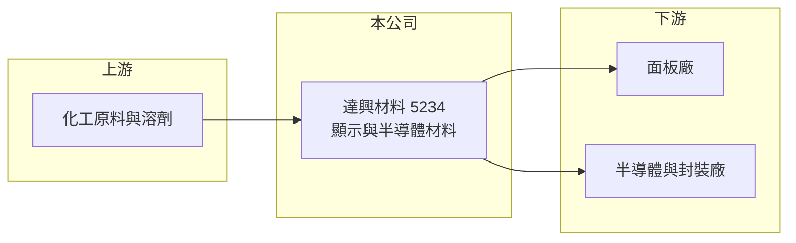

# 5234 達興材料

> 上市｜[[產業索引-光電業|光電業]]｜上市（櫃）日期 2012/07/16

# 第一章：企業模式與商業藍圖

> [!info] 撰寫說明
> 精簡版，由 Claude 依公開資料整理，架構比照 [[2330台積電]]，資料截至 2026-10-07。來源：nstock.tw 達興材料公司概況；產品細項為一般產業資訊整理，屬推估。各產品營收比重本次未查到。#待校對

達興材料是供應面板與半導體製程化學材料的材料廠，產品打進客戶製程後黏著度高。

- **核心業務：** 公司主要從事半導體與光電產業用化學材料的研究、設計、開發、製造與銷售。
- **營收結構：** 本次未查到各產品比重；一般認為以面板用液晶配向膜、[[光阻]]等顯示材料為基礎，半導體與[[先進封裝]]材料是成長中的部分（推估）。
- **營運據點：** 主要研發與生產在台灣，營運據點細節本次未查到。
- **長期方向：** 由顯示材料延伸到半導體製程材料，降低對面板景氣的依賴（推估）。

# 第二章：護城河深度與競爭優勢

材料廠的護城河來自配方技術與漫長的客戶驗證。

- **競爭優勢：** 化學材料一旦通過客戶產線驗證，客戶更換供應商的成本與風險高，訂單相對穩定。
- **主要對手：** 日本、韓國的大型化學材料廠是主要競爭者，國內則與其他特用化學廠在部分產品重疊。
- **觀察重點：** 半導體材料營收占比能否持續提高，以及面板廠稼動率變化。

# 第三章：財務體質與盈利規模

資料日期：2026-10-07，以下數字是撰寫當時的快照；最新月營收、毛利率、累計 EPS 由自動排程寫在本筆記的屬性欄位（月營收、毛利率、累計EPS 等）。#待校對

達興材料獲利能力在同業中屬於高檔，2026 年營收維持成長。

- **營收規模：** 2025 年全年營收 46.3 億元；2026 年 1 至 8 月累計 33.83 億元，年增 11.28%；8 月營收 4.53 億元，年增 18.52%。
- **獲利：** 2025 年全年 EPS 7.37 元；2026 年第二季 EPS 2.23 元，[[毛利率]] 42.91%，[[營業利益率]] 20.09%，淨利率 17.85%。
- **財務特色：** 資本額約 10.27 億元，市值約 320 億元；近五年平均現金股利 4.84 元，配息穩定。

# 第四章：總體風險與地緣政治

達興材料的風險主要來自面板景氣與半導體材料的驗證進度。

- **產業週期：** 顯示材料需求跟著面板廠稼動率起伏，面板景氣下行時出貨量與價格都可能受壓。
- **營運風險：** 新的半導體材料需要長時間驗證，若進度不如預期，成長動能會放慢；客戶集中在少數面板與半導體廠也是風險（推估）。
- **其他風險：** 化學原料價格、匯率與環保法規變動，以及日韓競爭者的價格策略。

# 專有名詞解析

## 半導體

- **[[光阻]]**：塗布在基板上、經曝光顯影後形成圖案的感光材料，是面板與晶片製程的關鍵耗材。
- **[[先進封裝]]**：把多顆晶片以高密度方式整合封裝的技術，需要專用的接合與保護材料。

## 金融

- **[[毛利率]]**：毛利占營收的比例，反映產品定價能力與成本控制。

# 核心供應鏈

- 上游：化工原料、單體與溶劑供應商
- 下游／客戶：[[3481群創]]、[[2409友達]] 等面板廠，以及半導體與封裝廠（推估）
- 同業：日韓化學材料廠、國內特用化學廠

## 供應鏈關係
- 供應給 [[2330台積電]]：半導體先進封裝材料（台積電供應鏈 › 上游：關鍵耗材、特用化學品與氣體）

## 最新新聞
<!-- news:start（自動產生，請勿手動編輯此範圍） -->
- 2026-10-07 📰 媒體 10:49｜達興材料Q3獲利估相當Q2，全年成長可期｜[台視全球資訊網](https://news.google.com/rss/articles/CBMinAFBVV95cUxPRkdhWm95RG1NYzZnWmgxNFRyQXFQa3RjNTdYRlZmMUZjTVdzbkc4MjBuZ2ZuQ0tyZHgxTWY1Y0cxTHZoYXpPdWtLZ0swR1Ztd1NqX1RkN1VUYW5wRTROWk9FS0MwWGpoZ280RVRZeFVrMTRPc2E1aXpBT0pqbFVBUnJ6YlZxTS1XUmxjVVVKQUdmVWxMczA1TzF0VUo?oc=5)
- 2026-10-07 📰 媒體 09:03｜達興材料Q3獲利估相當Q2，全年成長可期- 新聞｜[MoneyDJ理財網](https://news.google.com/rss/articles/CBMikgFBVV95cUxNc05aRGp2dTAtY2YtTXY3MDVqbWYydDVZZ0NLQVdRU1kwQTE2alM2NW0wWTF1RGtobFY1NWljQS1UMWNSWHBWU3p3NDItcDh1V01VaXFvY2RXT1k4NXJMR1ZXVHVBdjVURkpYLTJZVFhmWHlSNUFMV1NrMksxRFNNd1htb2liYUxsNWROU0NnZW9lQQ?oc=5)
- 2026-10-06 📰 媒體 03:00｜達興材料、山太士9月營收登頂- 日報｜[工商時報](https://news.google.com/rss/articles/CBMiX0FVX3lxTE1jRDVPTVBfNFVyUks5TGw0V2hzcVo1Y1ZXQm5henVRZGttVmZpWnFCZnZVYXpUUUZRSEZ3UkhQTS1Ub0ZRVUpHeWJPbm0zOEEyYjNRUC1faC1OcC1TNlBB?oc=5)
- 2026-10-05 📰 媒體 14:55｜個股：半導體新品放量，達興材料(5234)9月營收4.82億元，改寫歷史新猷｜[富聯網](https://news.google.com/rss/articles/CBMiiAFBVV95cUxOS0o5RzFPU3Q2RDdMOWJmMmNvRTRpYUwxVS1iZ1dER3plcU8zWVVNb1FoU25GT3FrUjVkMnFGZnZuRGNXdlZXRGpSSDd3NXBiMXcySHdsa2pBcjNQc08zc3BRZ1FuclZUaXhEaVR3OHVsMGg2dEl3MU5sSWRFRUo4ZzVZNFlRa0hW?oc=5)
- 2026-10-05 📰 媒體 14:40｜《業績-光電》達興材料9月營收為4.82億元，年增19.54%｜[富聯網](https://news.google.com/rss/articles/CBMiiAFBVV95cUxQaVhxd3dRM2UxODNIYU1qTEVuWjRWRTlSSE8zbUFRdmUwUFlncHFiMWdOTURDRHJOSkFfWDlVWVp0M0xKcUJVUnJKaEp5TGUyc1UxdkJTaFBiOHFibzZYRGpZd3F1WHFVdXlXVUhMRWs4dTN4elpUQWZZRTlIX01NZmhsUmREc3Bp?oc=5)

完整紀錄：[[5234達興材料 新聞]]
<!-- news:end -->

## 相關連結
- [公開資訊觀測站](https://mopsov.twse.com.tw/mops/web/t05st03?step=1&firstin=1&co_id=5234)
- [Goodinfo](https://goodinfo.tw/tw/StockDetail.asp?STOCK_ID=5234)
- [Yahoo 股市](https://tw.stock.yahoo.com/quote/5234)
- [鉅亨網新聞](https://www.cnyes.com/twstock/5234/news)
