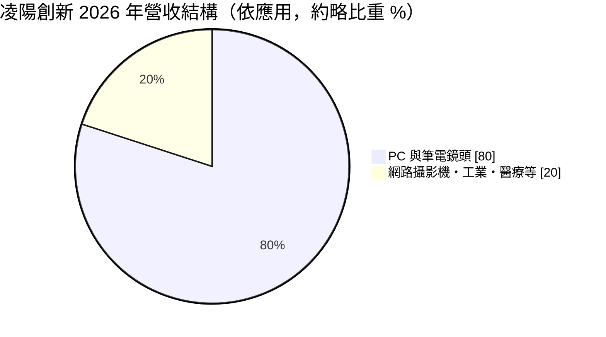
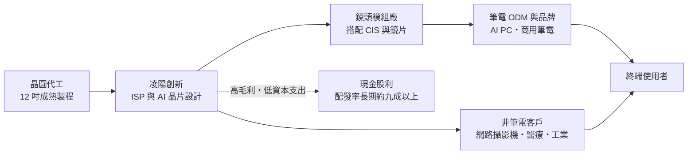
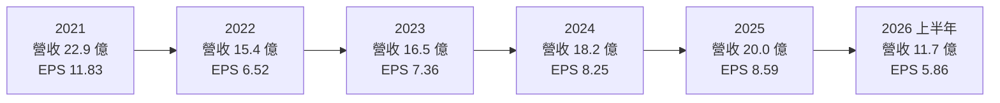
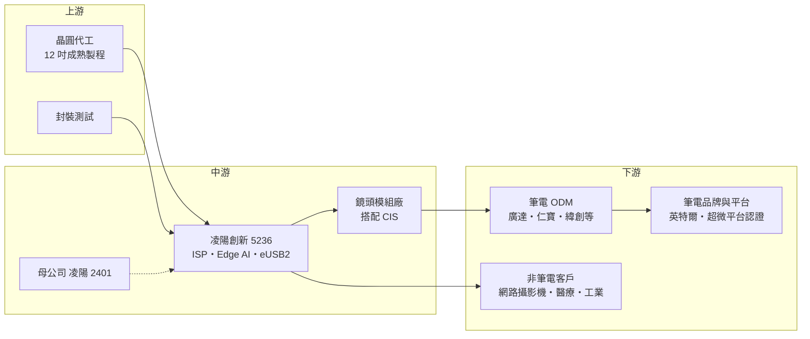

# 5236 凌陽創新

> 上櫃｜[[產業索引-半導體業|半導體業]]｜上市（櫃）日期 2021/07/29

# 第一章：企業模式與商業藍圖

> [!info] 撰寫說明
> 本文由 Claude 依公開資料整理，架構比照 [[2330台積電]] 的四章研究，資料截至 2026-10-08。財務數字來源：聚財網年度財報與季損益表、nStock 公司資料、中央社與經濟日報法說會報導、科技新報、理財周刊、玩股網公司基本資料；產業描述為整理性內容，尚未逐條比對原始文件。#待校對

在評估一家 IC 設計公司的長期價值時，第一步是弄清楚它到底賣什麼、賣給誰，以及為什麼客戶願意持續買單。本章針對凌陽創新科技（股票代號：5236，以下簡稱凌陽創新）的商業模式進行定性分析，說明它如何從母公司凌陽科技分割出來，在筆記型電腦鏡頭這個看似不起眼的利基市場，做到全球前兩大的位置。

## 一、核心定位：筆電鏡頭影像處理晶片的雙寡頭之一

凌陽創新成立於 2006 年 12 月，前身是 [[2401凌陽]] 的控制與週邊事業群，母公司依企業併購法把這個事業群分割出來成立新公司；2009 年凌陽多媒體再把 PC 攝影機（PC CAM）產品線分割併入，形成今天的主體。公司於 2021 年 7 月在櫃買中心掛牌，依 nStock 的公司資料，2026 年 7 月起轉列臺灣證券交易所上市。董事長為黃洲杰，總經理為蔡建忠。

凌陽創新是一家 [[Fabless]] 公司，本身不擁有晶圓廠，核心產品是筆記型電腦內建鏡頭使用的影像訊號處理器（[[ISP]]）。筆電上方那顆小小的鏡頭，由影像感測器（[[CIS]]）把光線轉成電訊號，再交給 ISP 做曝光、色彩、降噪與壓縮，最後透過 USB 傳給電腦。ISP 的好壞直接決定視訊會議畫面是否清楚、暗處是否有雜訊、耗電是否夠低，因此雖然單價不高，卻是筆電品牌在規格表上很在意的零件。

依科技新報 2021 年的報導，凌陽創新過去在全球筆電 ISP 市場的占有率約 25% 至 30%，明顯落後市占超過 45% 的 [[2379瑞昱]]；2020 年疫情帶動遠距工作與線上教學，凌陽創新的市占提升到 40% 以上，與瑞昱幾乎並駕齊驅。換句話說，這是一個由兩家台灣公司主導的雙寡頭市場，這個結構是理解凌陽創新長期獲利能力的起點。

## 二、終端應用與產品板塊：筆電為主、非筆電為輔

依中央社 2026 年轉上市前法說會的報導，公司營收約八成來自 PC 與筆電，其餘約兩成來自外接式網路攝影機、工業與醫療等多元應用。

**筆電鏡頭晶片是獲利主體。** 筆電市場每年出貨量雖然成長有限，但鏡頭規格持續升級，從過去的 HD 往 FHD、500 萬畫素（5M）移動，並加入[[人體存在偵測]]（HPD）等 AI 功能。依經濟日報的法說會報導，2025 年第二季 5M 產品年增 59%、FHD 年增 26%、AI 產品年增 143%，HD 產品則年減 30%。這代表凌陽創新的成長主要來自「單價提升」而不是「數量增加」，公司對 2026 年的說法也是「量平價升」。

**非筆電應用是第二條腿。** 公司把 ISP 技術延伸到外接式攝影機、會議系統自動追蹤、車用鏡頭、內視鏡、文件攝影機與智慧電表等產品。科技新報 2021 年的報導指出，2020 年非 PC 營收約成長一倍、毛利率超過 50%，當時 PC 與非 PC 的比重約為 63:37；但隨著筆電鏡頭升級帶動 PC 業務放大，到 2023 年以後非筆電比重又回到約兩成。非筆電業務的意義在於分散對單一終端市場的依賴，並讓技術在醫療、工業等驗證期較長的市場累積口碑。

**新產品線接力。** 中央社報導列出三個新方向：一是 [[Edge AI]] 晶片，內嵌在鏡頭裡處理人臉偵測、自動取景等 AI 功能，第二代已量產；二是 [[eUSB2]] 介面晶片，配合先進製程處理器的低電壓需求，已取得英特爾與超微平台的認證，預計 2026 年下半年開始貢獻、2027 年較完整；三是[[熱成像]]晶片，2026 年小量試產，規劃 2028 年起導入工業檢測、無人機、機器人等應用，2030 年進一步爭取車用前裝。這三條產品線構成公司口中的短、中、長期成長接力。

## 三、資本轉化邏輯：輕資產設計公司把研發轉成高毛利

凌陽創新的營運模式可以分成三個環節來理解。

**第一，把製造外包、把資源集中在設計。** 晶片交由晶圓代工廠生產，公司不需要投資晶圓廠，資本支出主要是研發設備與光罩費用。這讓它的[[毛利率]]長期維持在 55% 至 65% 之間，在台灣 IC 設計公司中屬於偏高的水準，原因是 ISP 需要長年累積的影像調校經驗與演算法，不是單純比晶片成本。

**第二，提早轉進 12 吋製程，換來供貨彈性。** 依科技新報 2021 年報導，公司約在 2018 年決定把產品從多數同業使用的 8 吋成熟製程轉到 12 吋製程，理由是效率較高、耗電較低。2020 年疫情期間 8 吋產能嚴重吃緊，凌陽創新因為已在 12 吋，有較多產能可以持續供貨，因而從競爭對手手中搶到訂單。這個案例說明，對 Fabless 公司來說，產能布局本身就是競爭力的一部分。

**第三，獲利大部分以現金股利回饋股東。** 由於資本支出低，公司每年大部分盈餘可以發放出去。依 nStock 資料，近五年平均現金股利約 8.15 元，2025 年度現金股利 9 元，高於當年每股盈餘 8.59 元。

## 四、企業長期藍圖：從筆電鏡頭走向「會看的晶片」

凌陽創新的長期方向，是把自己從「筆電鏡頭的影像處理供應商」轉成「邊緣端視覺 AI 晶片供應商」。這個轉型的邏輯在於：筆電鏡頭的數量天花板很明顯，但鏡頭的功能越來越多，從單純拍照變成要判斷使用者是否在座位上、是否有人偷看螢幕、是否需要自動調整取景，這些都需要在鏡頭端就近處理的低功耗 AI 運算。

公司在 [[AI PC]] 的趨勢中扮演的是周邊角色：處理器本身的 NPU 負責大型 AI 運算，而鏡頭端的小型 AI 晶片負責省電、隨時在線的感知任務。這種分工如果成為筆電標準配備，凌陽創新的單機價值就能持續提升。中長期則以 eUSB2 與熱成像開拓新的產品類別，讓營收不再只綁在筆電出貨量。

這個藍圖的關鍵觀察點有兩個：一是新產品能否在 2027 年後占營收一定比重，二是在熱成像、車用這些驗證期很長的市場，公司能否撐過初期投入期，把技術轉成穩定訂單。

# 第二章：護城河深度與競爭優勢

在長期價值投資中，「護城河」指企業抵禦競爭、維持超額利潤的保護機制。本章分析凌陽創新的護城河構成、主要競爭對手，以及這些優勢能否在筆電市場成熟後繼續撐住高毛利。

## 一、凌陽創新護城河的核心組成要素

凌陽創新的護城河屬於「窄但穩」的類型，主要由三個要素組成。

**1. 影像調校經驗與軟體累積。** ISP 的核心價值在於演算法與參數調校，同一顆感測器搭配不同 ISP，畫面品質可能差很多。這些調校經驗需要和鏡頭模組廠、筆電品牌長期合作才能累積，新進者即使能設計出晶片，也很難在短時間內取得筆電品牌的信任。這是凌陽創新能長期維持接近六成毛利率的主要原因。

**2. 筆電平台認證與設計導入週期。** 筆電零件必須通過處理器平台與品牌的驗證，一款機種一旦選定 ISP，通常整個產品週期都不會更換。像 eUSB2 這類新介面還需要通過英特爾、超微的平台認證清單，凌陽創新宣稱是業界首家取得雙平台認證的廠商。認證門檻本身就是一道進入障礙。

**3. 雙寡頭市場結構。** 筆電 ISP 市場主要由凌陽創新與瑞昱分食，品牌廠通常需要兩家供應商互相制衡。只要凌陽創新的技術與交期不明顯落後，就能穩定保有相當的市占。這種結構讓價格競爭不至於失控。

## 二、全球主要競爭對手格局

| 對手 | 定位 | 對凌陽創新的影響 |
|---|---|---|
| [[2379瑞昱]] | 網通與 PC 周邊晶片大廠，筆電 ISP 市占長期第一 | 產品線廣，可與音效、網通晶片整包銷售給筆電廠 |
| 中國 ISP 與影像晶片業者 | 價格較低，主攻中國品牌與外接攝影機 | 在非筆電與低階市場造成價格壓力 |
| 處理器內建 ISP | 部分處理器平台把影像處理整合進主晶片 | 長期可能侵蝕獨立 ISP 的必要性 |
| [[2401凌陽]] 集團內其他事業 | 母公司另有車用與多媒體晶片 | 屬集團分工，並非直接競爭 |

## 三、優勢轉化：守得住與守不住的地方

**守得住的部分：** 商用筆電與高階 AI 筆電的鏡頭晶片。這類機種重視視訊品質、AI 功能與穩定供貨，品牌廠願意為規格升級付費，凌陽創新在 5M、AI 產品的成長正好反映這個趨勢。只要鏡頭持續升級，單價上升可以抵銷筆電出貨量的停滯。

**守不住或需要警惕的部分：** 一是低階 HD 產品，正在被市場淘汰，價格也最競爭；二是外接式攝影機與消費性產品，面臨中國業者的價格壓力；三是如果處理器廠把更多影像處理功能整合進主晶片，獨立 ISP 的角色可能被壓縮。

**觀察重點：** 第一，毛利率能否維持在 55% 以上，這是護城河是否仍有效的最直接指標；第二，AI 與 5M 產品在營收中的比重是否持續提高；第三，eUSB2 與熱成像能否在 2027 至 2030 年形成具規模的新營收來源，降低公司對筆電市場的依賴。

# 第三章：財務體質與盈利規模

資料日期：2026-10-08。數字取自聚財網年度財報與季損益表（營收為四季加總）、nStock 公司資料與法說會報導，表格是撰寫當時的快照；最新月營收、毛利率、累計 EPS 由自動排程寫在本筆記的屬性欄位（月營收、毛利率、累計EPS 等）。#待校對

財務報表是檢驗護城河是否真實存在的最終標準。本章用五年的三率、[[ROE]]、現金流與資本報酬，檢視凌陽創新在筆電景氣循環中的獲利品質。

## 一、獲利能力的基石：三率

| 年度 | 營收（新台幣） | [[毛利率]] | [[營業利益率]] | EPS（元） | [[ROE]] |
|---|---|---|---|---|---|
| 2021 | 22.9 億 | 62.91% | 33.83% | 11.83 | 32.67% |
| 2022 | 15.4 億 | 61.26% | 28.35% | 6.52 | 14.76% |
| 2023 | 16.5 億 | 61.60% | 28.74% | 7.36 | 17.10% |
| 2024 | 18.2 億 | 59.77% | 28.59% | 8.25 | 18.82% |
| 2025 | 20.0 億 | 57.80% | 28.14% | 8.59 | 19.59% |
| 2026 上半年 | 11.7 億 | 約 60.6% | 約 33.2% | 5.86 | 未查得 |

五年數字呈現出一個典型的「疫情高峰、庫存修正、緩步回升」軌跡。2021 年遠距需求帶動營收達 22.9 億元，2022 年筆電庫存調整，營收跌到 15.4 億元，其中 2022 年第三季單季營收只有 2.07 億元、營業利益率降到 5.6%。之後每年穩定回升，2025 年回到 20.0 億元。以 2021 至 2025 年計算，營收年複合成長率約 -3.3%（推算），但若以 2022 年的低點為基期，2022 至 2025 年年複合成長率約 9.1%（推算）。

值得注意的是毛利率的穩定度。即使營收在 2022 年大跌三成，全年毛利率仍維持在 61% 以上；2025 年降到 57.8%，主因是產品組合與價格競爭，但 2026 年上半年又回升到 60% 左右。營業利益率則在 2022 至 2025 年穩定落在 28% 上下，代表研發與營業費用控制得相當一致。

## 二、[[ROE]]：資本效率

2021 至 2025 年平均 ROE 約 20.6%（推算）。2021 年的 32.7% 較特殊，因為當年掛牌前的股東權益基數較小；2022 年以後 ROE 從 14.8% 逐年上升到 19.6%。依聚財網資料，負債比率長期在 15% 上下、利息保障倍數數百倍以上，幾乎沒有借款，ROE 完全來自本業獲利，沒有靠財務槓桿放大。

每股淨值五年間大致維持在 42 至 44 元，沒有明顯增加，原因是公司把大部分盈餘以現金股利發出，而不是保留在公司內再投資。這對股東而言是可預期的現金回報，但也意味著公司未來若要大幅擴張新產品線，資金主要靠每年新增的盈餘。

## 三、資本支出與自由現金流

作為 Fabless 公司，凌陽創新不需要建廠，資本支出主要是研發用設備、光罩與軟體授權，具體金額未查得。從財報結構推估，營業現金流長期為正，且足以支應資本支出與現金股利（推估）。

股利方面，依 nStock 與理財周刊資料：2022 年度 EPS 6.52 元、配發現金股利 7 元，配發率約 107%；2024 年度配發現金股利 7.73 元另加股票股利 0.27 元；2025 年度配發現金股利 9 元，高於 EPS 8.59 元。近五年平均現金股利約 8.15 元。配發率長期接近或超過 100%，說明經營層的資本配置習慣是「不囤現金、盈餘盡量發還股東」。

## 四、[[ROIC]] 與 [[WACC]]：價值創造利差

**ROIC 推算：** 2025 年營業利益約 5.63 億元（20.0 億 × 28.14%），以稅率 20% 計算，稅後營業利益約 4.50 億元。股東權益約 26.6 億元（每股淨值 44.35 元 × 約 0.60 億股），公司幾乎沒有有息負債，投入資本以股東權益計，ROIC 約 16.9%（推算）。若扣除帳上現金（金額未查得），以實際營運資本計算的 ROIC 會更高。以同樣方法回推 2022 年低谷期，稅後營業利益約 3.50 億元（15.4 億 × 28.35% × 0.8），股東權益約 25.4 億元，ROIC 約 13.8%（推算）。

**WACC 推算：** 股東權益成本用 CAPM 估計，假設台灣 10 年期公債殖利率 1.75%、市場風險溢酬 6%、β 取 IC 設計同業常見值 1.1（未查得公司實際 β），股東權益成本約 8.35%。公司沒有有息負債，WACC 約 8.35%（推算）。

**結論：** 即使在 2022 年的庫存修正低谷，凌陽創新的 ROIC 仍明顯高於 WACC，2025 年的利差約 8 個百分點以上（推算）。這說明它的獲利不是靠景氣高峰撐起來的，而是筆電 ISP 雙寡頭結構與高毛利帶來的持續性超額報酬。未來要觀察的是：新產品研發投入增加時，營業利益率能否維持在 25% 以上，讓 ROIC 繼續高於資金成本。

# 第四章：總體風險與地緣政治

任何企業都無法脫離宏觀環境獨立存在。本章分析凌陽創新未來必須面對的地緣政治、產業週期、營運與技術風險。

## 一、地緣政治風險

**關稅與供應鏈轉移。** 筆電的組裝大多集中在中國與東南亞，美國關稅政策會影響品牌廠的拉貨節奏。依經濟日報法說會報導，2025 年第一季營收高於第二季，部分原因是客戶為因應關稅提前拉貨。這類政策性的訂單前移與遞延，會讓季度營收波動加大，但長期影響主要取決於筆電整體需求，而不是凌陽創新本身的競爭力。

**台灣與中國的雙重暴露。** 晶片在台灣設計、委外生產，客戶卻大量在中國組裝，若兩岸或中美關係惡化，物流、出口管制或客戶在地化採購要求，都可能影響出貨。

## 二、產業週期與市場結構風險

**筆電出貨的週期性。** 公司約八成營收來自 PC 與筆電，筆電市場在 2021 年疫情高峰後經歷明顯修正，凌陽創新 2022 年營收因此下滑約三成。筆電換機潮通常與作業系統更新、處理器平台世代、企業汰換週期有關，AI PC 雖然是新的換機理由，但能否帶動大規模換機仍不確定。

**[[長鞭效應]]。** 筆電品牌、ODM、模組廠層層備貨，終端需求的小幅變化傳到上游 IC 設計公司時會被放大，這也是 2022 年第三季單季營收驟降到約 2 億元的原因。

## 三、營運環境的隱性風險

**客戶集中度。** 筆電市場由少數品牌與 ODM 主導，任何一家大客戶轉單或改用處理器內建方案，對營收都有明顯影響，具體客戶比重未查得。

**新產品投入的回收期。** 熱成像、車用與醫療應用的驗證期長，研發費用會先發生，營收則要數年後才會出現。若新產品延遲，研發費用可能壓縮目前接近 30% 的營業利益率。

**高配息的另一面。** 配發率接近或超過 100%，代表公司內部保留的資金有限，若未來需要較大的研發或併購投資，彈性會比保留較多現金的同業小。

## 四、科技演進風險

最大的技術風險是「整合」。如果處理器、[[CIS]] 感測器或鏡頭模組把影像處理與 AI 功能整合進去，獨立 ISP 的存在價值可能下降。凌陽創新的對策是把 ISP 升級為具備 AI 運算能力的感知晶片，並開發 eUSB2 這類處理器平台需要的介面晶片。這條路能否走通，關鍵在於公司能否持續比整合方案提供更好的畫質、更低的耗電與更快的導入時間。

# 專有名詞解析

## 半導體

- **[[ISP]]**：影像訊號處理器，把影像感測器輸出的原始訊號做曝光、色彩、降噪與壓縮處理，決定鏡頭畫面品質。
- **[[CIS]]**：CMOS 影像感測器，把光線轉成電訊號的晶片，是手機、筆電與車用鏡頭的核心元件。
- **[[Fabless]]**：只做晶片設計、把製造委外給晶圓代工廠的 IC 設計公司模式。
- **[[eUSB2]]**：嵌入式 USB 2.0 介面，以 1 伏特左右的低電壓傳輸，讓先進製程處理器不必再支援傳統 3.3 伏特 I/O，需要額外的轉接或中繼晶片。
- **[[Edge AI]]**：在終端裝置本身執行的人工智慧運算，不必把資料傳回雲端，優點是低延遲、省電與保護隱私。

## 應用

- **[[AI PC]]**：內建 NPU 等 AI 加速硬體、可在本機執行 AI 功能的個人電腦，被視為帶動筆電換機的新理由。
- **[[人體存在偵測]]**：透過鏡頭或感測器判斷使用者是否在電腦前，自動喚醒或鎖定螢幕，可省電並提高資安。
- **[[熱成像]]**：偵測物體發出的紅外線熱輻射並轉成影像，可在黑暗或煙霧中辨識人與物體，用於工業檢測、救災與車用夜視。

## 金融

- **[[毛利率]]**：毛利除以營收，反映產品定價能力與成本控制，IC 設計公司毛利率高通常代表技術門檻較高。
- **[[營業利益率]]**：營業利益除以營收，扣除研發、管銷費用後的本業獲利能力。
- **[[ROE]]**：股東權益報酬率，稅後淨利除以股東權益，衡量公司運用股東資金的效率。
- **[[ROIC]]**：投入資本報酬率，稅後營業利益除以投入資本（股東權益加有息負債），衡量本業創造報酬的能力。
- **[[WACC]]**：加權平均資金成本，股東與債權人要求報酬率的加權平均，ROIC 高於 WACC 才代表創造價值。
- **[[長鞭效應]]**：終端需求的小幅變動，沿供應鏈往上游傳遞時被逐級放大，造成上游庫存與訂單劇烈波動。

# 核心供應鏈

## 1. 上游：晶圓代工與封測
- 晶片委由 12 吋成熟製程晶圓廠生產，實際代工夥伴未查得；封裝測試同樣委外。

## 2. 中游：凌陽創新本身與集團
- 母公司與集團：[[2401凌陽]]
- 鏡頭模組端：與 [[CIS]] 感測器搭配，由鏡頭模組廠組裝後交給筆電廠，具體模組廠名單未查得。

## 3. 下游：筆電平台與客戶
- 平台認證：eUSB2 取得 [[INTC英特爾]] 與 [[AMD超微]] 平台認證。
- 筆電代工廠：[[2382廣達]]、[[2324仁寶]]、[[3231緯創]] 等筆電 ODM 為產業上常見的出貨對象（推估，公司未揭露客戶名單）。

## 4. 同業與競爭者
- 筆電 ISP 主要對手：[[2379瑞昱]]

## 最新新聞
<!-- news:start -->
<!-- news:end -->

## 相關連結
- [公開資訊觀測站](https://mopsov.twse.com.tw/mops/web/t05st03?step=1&firstin=1&co_id=5236)
- [Goodinfo](https://goodinfo.tw/tw/StockDetail.asp?STOCK_ID=5236)
- [Yahoo 股市](https://tw.stock.yahoo.com/quote/5236)
- [鉅亨網新聞](https://www.cnyes.com/twstock/5236/news)
