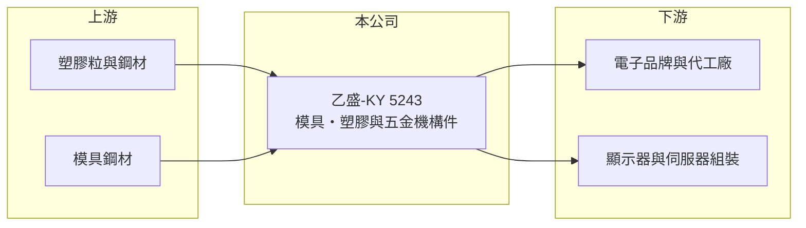

# 5243 乙盛-KY

> 上市｜[[產業索引-光電業|光電業]]｜上市（櫃）日期 2013/11/25

# 第一章：企業模式與商業藍圖

> [!info] 撰寫說明
> 精簡版，由 Claude 依公開資料整理，架構比照 [[2330台積電]]，資料截至 2026-10-07。來源：nstock.tw 乙盛-KY 公司概況、winvest.tw 營收快訊。各產品營收比重與客戶本次未查到。#待校對

乙盛-KY 是以模具開發為核心、提供塑膠與五金機構件的代工廠。

- **核心業務：** 公司設計、研發、生產與銷售模具、塑膠與五金製品，以及新型電子元器件與平板顯示器相關零組件。
- **營收結構：** 本次未查到各產品比重；產品應用涵蓋顯示器、消費性電子與伺服器等機構件（推估）。
- **營運據點：** 公司為 KY 股，生產基地以中國大陸為主（推估），細節本次未查到。
- **長期方向：** 從消費性電子機構件逐步擴大到伺服器機殼等較高附加價值產品（推估）。

# 第二章：護城河深度與競爭優勢

乙盛-KY 的競爭力在於模具開發與量產整合能力。

- **競爭優勢：** 自行開發[[精密模具]]，可縮短客戶新品開發時程，並整合塑膠射出與五金沖壓。
- **主要對手：** 國內外機構件與機殼廠，以及數量眾多的中國大陸模具與沖壓廠（推估）。
- **觀察重點：** 2026 年 8 月營收年增 54% 的成長是否延續，以及新產品線對毛利率的影響。

# 第三章：財務體質與盈利規模

資料日期：2026-10-07，以下數字是撰寫當時的快照；最新月營收、毛利率、累計 EPS 由自動排程寫在本筆記的屬性欄位（月營收、毛利率、累計EPS 等）。#待校對

乙盛-KY 2026 年營收與獲利都維持成長，近月營收明顯加速。

- **營收規模：** 2025 年全年營收 120.01 億元；2026 年 1 至 8 月累計 90.08 億元，年增 10.26%；8 月營收 13.73 億元，年增 54.12%。
- **獲利：** 2025 年全年 EPS 4.4 元；2026 年第二季 EPS 1.53 元，上半年累計 3 元；第二季[[毛利率]] 25.45%，[[營業利益率]] 11.97%。
- **財務特色：** 資本額約 16.85 億元，市值約 149 億元；2026 年配發現金股利 2.2 元，近五年平均 1.82 元。

# 第四章：總體風險與地緣政治

乙盛-KY 的風險來自客戶集中與終端需求變化。

- **產業週期：** 消費性電子與顯示器需求有明顯循環，伺服器需求則受雲端業者資本支出影響。
- **營運風險：** 機構件代工議價力有限，若客戶集中度高，訂單轉移會直接影響營收（推估）。
- **其他風險：** 中國大陸生產基地面臨地緣政治與關稅風險，[[非紅供應鏈]]需求可能要求轉移產能；人民幣匯率與原物料價格也會影響成本。

# 專有名詞解析

## 金融

- **[[營業利益率]]**：營業利益占營收的比例，反映本業扣除營運費用後的獲利能力。

## 產業

- **[[精密模具]]**：用來大量生產塑膠或金屬零件的高精度模具，品質決定零件尺寸與良率。
- **[[非紅供應鏈]]**：客戶要求生產與零組件來源避開中國大陸，以降低地緣政治與關稅風險。

# 核心供應鏈

- 上游：塑膠粒、鋼材與模具鋼材供應商
- 下游／客戶：電子品牌、代工廠與顯示器、伺服器組裝廠（推估）
- 同業：國內外機構件與機殼廠、中國大陸模具廠

## 最新新聞
<!-- news:start -->
<!-- news:end -->

## 相關連結
- [公開資訊觀測站](https://mopsov.twse.com.tw/mops/web/t05st03?step=1&firstin=1&co_id=5243)
- [Goodinfo](https://goodinfo.tw/tw/StockDetail.asp?STOCK_ID=5243)
- [Yahoo 股市](https://tw.stock.yahoo.com/quote/5243)
- [鉅亨網新聞](https://www.cnyes.com/twstock/5243/news)
