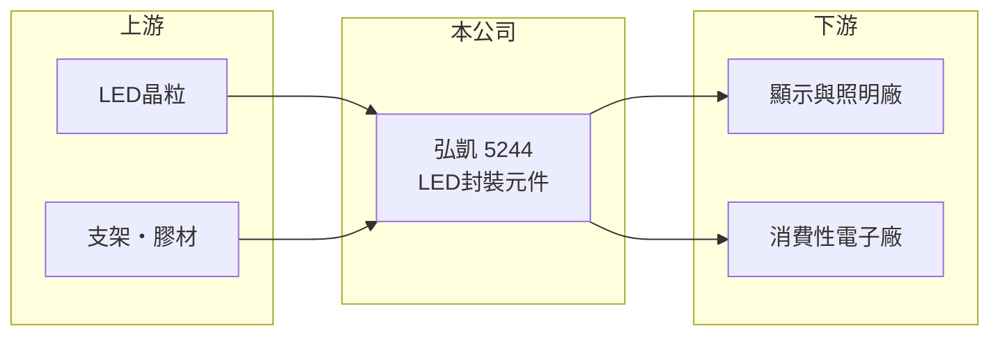

# 5244 弘凱

> 上市｜[[產業索引-光電業|光電業]]｜上市（櫃）日期 2022/01/19

# 第一章：企業模式與商業藍圖

> [!info] 撰寫說明
> 精簡版，由 Claude 依公開資料整理，架構比照 [[2330台積電]]，資料截至 2026-10-07。來源：nstock.tw 弘凱公司概況、winvest.tw 營收快訊。公開資料有限，產品比重與客戶本次未查到。#待校對

弘凱光電是規模不大的 LED 元件廠，近年營收在 8 億元上下。

- **核心業務：** 弘凱主要從事 LED 元件的[[LED封裝]]與銷售，產品應用於顯示、照明與消費性電子（推估）。
- **營收結構：** 本次未查到各應用比重。
- **營運據點：** 總部位於桃園，並設有子公司弘凱光電（深圳），中國大陸為主要生產與銷售據點之一。
- **長期方向：** 小型 LED 廠普遍朝利基型產品發展，例如顯示用 RGB 元件或特殊光源，以避開與大廠的價格競爭（推估）。

# 第二章：護城河深度與競爭優勢

弘凱規模有限，競爭優勢偏向利基市場與客製化服務。

- **競爭優勢：** 規模小、彈性高，可承接少量多樣的客製訂單（推估）。
- **主要對手：** [[2393億光]]、[[3437榮創]] 等國內 LED 封裝廠，以及中國大陸大型 LED 封裝廠。
- **觀察重點：** 2026 年下半年營收回升能否轉為獲利，以及毛利率能否維持在兩成以上。

# 第三章：財務體質與盈利規模

資料日期：2026-10-07，以下數字是撰寫當時的快照；最新月營收、毛利率、累計 EPS 由自動排程寫在本筆記的屬性欄位（月營收、毛利率、累計EPS 等）。#待校對

弘凱 2025 年小幅獲利，2026 年上半年轉為虧損，7 月營收回升。

- **營收規模：** 2025 年全年營收 8.42 億元；2026 年 1 至 7 月累計 4.67 億元；7 月營收約 0.9 億元，年增 31.6%。
- **獲利：** 2025 年全年 EPS 0.51 元；2026 年第二季 EPS -0.25 元，上半年累計 -0.73 元；第二季[[毛利率]] 25.02%。
- **財務特色：** 資本額約 6.82 億元，市值約 23 億元；營收規模小，費用比重高時容易由盈轉虧，具[[營運槓桿]]特性。

# 第四章：總體風險與地緣政治

弘凱面對的是成熟且價格競爭激烈的 LED 產業。

- **產業週期：** LED 產品已進入成熟期，需求隨消費性電子與照明景氣波動，報價長期有下壓壓力。
- **營運風險：** 中國大陸同業產能龐大，價格競爭可能壓縮毛利；營收規模小，虧損時對淨值影響較大。
- **其他風險：** 中國大陸據點面臨地緣政治與匯率風險，晶粒與貴金屬等原物料價格也會影響成本。

# 專有名詞解析

## 半導體

- **[[LED封裝]]**：把 LED 晶粒固定、打線並以膠體包覆，做成可安裝在電路板上的發光元件。

## 金融

- **[[營運槓桿]]**：固定成本占比高時，營收小幅變動就會讓獲利大幅增減；營收萎縮時虧損也會被放大。
- **[[毛利率]]**：毛利占營收的比例，反映產品定價能力與成本控制。

# 核心供應鏈

- 上游：LED晶粒、支架與封裝膠材供應商
- 下游／客戶：顯示、照明與消費性電子廠商（推估）
- 同業：[[2393億光]]、[[3437榮創]]、中國大陸 LED 封裝廠

## 最新新聞
<!-- news:start -->
<!-- news:end -->

## 相關連結
- [公開資訊觀測站](https://mopsov.twse.com.tw/mops/web/t05st03?step=1&firstin=1&co_id=5244)
- [Goodinfo](https://goodinfo.tw/tw/StockDetail.asp?STOCK_ID=5244)
- [Yahoo 股市](https://tw.stock.yahoo.com/quote/5244)
- [鉅亨網新聞](https://www.cnyes.com/twstock/5244/news)
