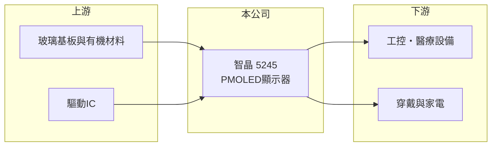

# 5245 智晶

> 上櫃｜[[產業索引-光電業|光電業]]｜上市（櫃）日期 2015/05/25

# 第一章：企業模式與商業藍圖

> [!info] 撰寫說明
> 精簡版，由 Claude 依公開資料整理，架構比照 [[2330台積電]]，資料截至 2026-10-07。來源：nstock.tw 智晶公司概況、winvest.tw 營收快訊。公開資料有限，產品比重、客戶與營運據點本次未查到。#待校對

智晶是專攻被動式有機發光顯示器的小型顯示器廠。

- **核心業務：** 智晶研究、設計、開發、製造與銷售[[PMOLED]]（被動式[[OLED]]）顯示器及相關電子零組件。
- **營收結構：** 本次未查到各應用比重；PMOLED 多用於工控儀表、穿戴裝置、醫療與家電等小尺寸顯示（推估）。
- **營運據點：** 營運與生產據點本次未查到。
- **長期方向：** 小尺寸利基顯示市場量不大但型號多，公司需在工控、醫療等穩定應用累積客戶（推估）。

# 第二章：護城河深度與競爭優勢

智晶的優勢在於小尺寸利基顯示的客製能力，但規模小、獲利不穩。

- **競爭優勢：** PMOLED 具自發光、高對比、低功耗特性，適合小型裝置；少量多樣的客製需求較少大廠爭搶（推估）。
- **主要對手：** 國內外小尺寸 OLED 與 LCD 模組廠，以及中國大陸 PMOLED 廠。
- **觀察重點：** 2026 年 8 月營收年增 46.66% 能否延續，以及毛利率能否回升到損益兩平以上。

# 第三章：財務體質與盈利規模

資料日期：2026-10-07，以下數字是撰寫當時的快照；最新月營收、毛利率、累計 EPS 由自動排程寫在本筆記的屬性欄位（月營收、毛利率、累計EPS 等）。#待校對

智晶營收持平，2026 年第二季毛利率偏低並出現虧損。

- **營收規模：** 2025 年全年營收 7.76 億元；2026 年 1 至 8 月累計 5.46 億元，年減 0.53%；8 月營收 0.78 億元，年增 46.66%。
- **獲利：** 2026 年第二季 EPS -0.65 元，[[毛利率]] 8.92%，[[營業利益率]] -8.55%，淨利率 -13.21%。
- **財務特色：** 資本額約 4.51 億元，市值約 9 億元；2025 年度未配發股利。

# 第四章：總體風險與地緣政治

智晶的風險在於技術替代與規模過小。

- **產業週期：** 小尺寸顯示需求隨工控、消費性電子景氣起伏。
- **營運風險：** 主動式 OLED 與 LCD 價格下滑可能侵蝕 PMOLED 市場；毛利率偏低，持續虧損會侵蝕淨值。
- **其他風險：** 中國大陸同業價格競爭、匯率與原物料價格變動。

# 專有名詞解析

## 金融

- **[[營業利益率]]**：營業利益占營收的比例，反映本業扣除營運費用後的獲利能力。

## 產業

- **[[OLED]]**：有機發光二極體顯示技術，每個像素自行發光，不需背光。
- **[[PMOLED]]**：被動矩陣驅動的 OLED，結構簡單、成本低，多用於小尺寸或單色顯示。

# 核心供應鏈

- 上游：玻璃基板、有機發光材料與驅動IC供應商
- 下游／客戶：工控、醫療、穿戴與家電廠商（推估）
- 同業：國內外小尺寸 OLED 與 LCD 模組廠

## 最新新聞
<!-- news:start -->
<!-- news:end -->

## 相關連結
- [公開資訊觀測站](https://mopsov.twse.com.tw/mops/web/t05st03?step=1&firstin=1&co_id=5245)
- [Goodinfo](https://goodinfo.tw/tw/StockDetail.asp?STOCK_ID=5245)
- [Yahoo 股市](https://tw.stock.yahoo.com/quote/5245)
- [鉅亨網新聞](https://www.cnyes.com/twstock/5245/news)
