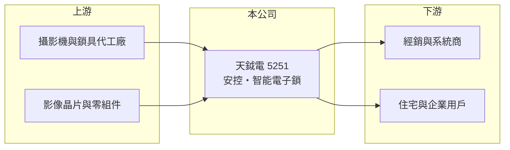

# 5251 天鉞電

> 上櫃｜[[產業索引-光電業|光電業]]｜上市（櫃）日期 2012/11/26

# 第一章：企業模式與商業藍圖

> [!info] 撰寫說明
> 精簡版，由 Claude 依公開資料整理，架構比照 [[2330台積電]]，資料截至 2026-10-07。來源：nstock.tw 天鉞電公司概況、winvest.tw 營收快訊。公開資料有限，產品比重、客戶與營運據點本次未查到。#待校對

天鉞電是銷售安全監控產品與智能電子鎖的小型公司。

- **核心業務：** 公司主要業務為安全監控產品與[[智能電子鎖]]的銷售。
- **營收結構：** 本次未查到安控與電子鎖的營收比重。
- **營運據點：** 營運與銷售據點本次未查到。
- **長期方向：** 安控與門禁逐漸走向聯網與智慧家庭整合，公司可望隨之擴大電子鎖等產品線（推估）。

# 第二章：護城河深度與競爭優勢

天鉞電規模小，競爭力取決於產品組合與通路。

- **競爭優勢：** 同時經營監控與電子鎖，可提供門禁與監控的組合方案（推估）。
- **主要對手：** 國內外安控設備商與電子鎖品牌，包含中國大陸大型安控廠。
- **觀察重點：** 第二季淨利率明顯高於營業利益率，需留意獲利是否來自本業以外的[[業外收益]]。

# 第三章：財務體質與盈利規模

資料日期：2026-10-07，以下數字是撰寫當時的快照；最新月營收、毛利率、累計 EPS 由自動排程寫在本筆記的屬性欄位（月營收、毛利率、累計EPS 等）。#待校對

天鉞電毛利率高，但本業利潤率偏低，第二季獲利有業外貢獻。

- **營收規模：** 2025 年全年營收 3.05 億元；2026 年 1 至 8 月累計 2.25 億元，年增 7.43%；8 月營收 0.22 億元，年增 9.69%。
- **獲利：** 2026 年第二季 EPS 0.69 元，[[毛利率]] 43.01%，[[營業利益率]] 4.01%，淨利率 24.36%。
- **財務特色：** 資本額約 3.37 億元，市值約 10 億元；近五年沒有配息紀錄。

# 第四章：總體風險與地緣政治

天鉞電的風險來自規模小與獲利來源不穩定。

- **產業週期：** 安控與電子鎖需求跟著建案、裝修與企業資本支出變化。
- **營運風險：** 營業費用占比高，本業獲利微薄；業外收益若不持續，EPS 可能明顯下滑。
- **其他風險：** 中國大陸安控產品價格競爭、資安法規要求，以及進口零組件的匯率變動。

# 專有名詞解析

## 應用

- **[[智能電子鎖]]**：以密碼、指紋、感應卡或手機開啟的門鎖，可連網整合門禁與監控。

## 金融

- **[[業外收益]]**：本業以外的收入，例如投資、處分資產或匯兌利益，持續性通常較低。
- **[[營業利益率]]**：營業利益占營收的比例，反映本業扣除營運費用後的獲利能力。

# 核心供應鏈

- 上游：攝影機、鎖具代工廠與影像晶片零組件供應商（推估）
- 下游／客戶：經銷商、系統整合商與住宅、企業用戶（推估）
- 同業：[[5484慧友]] 等國內安控廠、國內外電子鎖品牌

## 最新新聞
<!-- news:start -->
<!-- news:end -->

## 相關連結
- [公開資訊觀測站](https://mopsov.twse.com.tw/mops/web/t05st03?step=1&firstin=1&co_id=5251)
- [Goodinfo](https://goodinfo.tw/tw/StockDetail.asp?STOCK_ID=5251)
- [Yahoo 股市](https://tw.stock.yahoo.com/quote/5251)
- [鉅亨網新聞](https://www.cnyes.com/twstock/5251/news)
