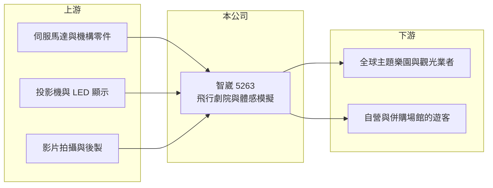

# 5263 智崴

> 上櫃｜[[產業索引-文化創意業|文化創意業]]｜上市（櫃）日期 2012/12/18

# 第一章：企業模式與商業藍圖

> [!info] 撰寫說明
> 精簡版，由 Claude 依公開資料整理，架構比照 [[2330台積電]] 的四章研究，資料截至 2026-10-08。來源：Goodinfo 年度經營績效頁、nStock 公司簡介、櫃買中心開放資料（基本資料、2026 年第二季資產負債與綜合損益、每月營收、本益比殖利率）；產品與併購描述為整理性內容，尚未逐條比對原始文件。#待校對

本章拆解智崴資訊科技（股票代號：5263，以下簡稱智崴）的商業模式。智崴是台灣少見的主題樂園設備公司，以[[飛行劇院]]系統打入全球遊樂園，近年從「賣設備」逐步延伸到「自己經營場館」。

- **核心業務：** 智崴 2001 年在高雄成立，2012 年上櫃，創辦人歐陽志宏擔任董事長兼總經理。依公司介紹，業務是體感模擬遊樂設備及其關鍵組件、3D 與虛擬實境即時成像、多螢幕無縫整合系統與影音軟體的研發、設計、生產與銷售。代表產品是 i-Ride 飛行劇院：觀眾坐在可多軸擺動的座椅上，面對巨型球幕，搭配影片與風、水、氣味等特效，模擬飛越城市與自然景觀的體驗。
- **營收結構：** 公司未揭露營收比重。收入大致可分三類：一是銷售飛行劇院等設備給主題樂園與觀光業者，屬專案型收入；二是為設備製作的影片內容與授權；三是自營或合資經營的體驗場館門票收入（推估分類）。設備專案金額大、認列時點集中，是營收年度波動大的主因。
- **營運據點：** 總部與工廠在高雄前鎮。設備銷往北美、中東、亞洲等地，2023 年取得加拿大飛行影院整場建置與影片拍攝標案。依月營收公告，2026 年起併入荷蘭 Flyover Attractions B.V. 的營收，2026 年 1 至 9 月累計營收約 17 億元，年增約 86%（nStock），海外場館營運的比重明顯提高。
- **長期方向：** 智崴的策略是從一次性的設備銷售，轉向能長期收取門票的場館營運與內容授權，讓收入更穩定。併購海外場館營運商是這個方向的具體行動，但也讓公司的資本需求與經營複雜度同步提高。

# 第二章：護城河深度與競爭優勢

智崴的護城河在於整合機構、影像與內容的系統能力，在全球飛行劇院這個利基市場中具有一定地位。

- **競爭優勢：** 飛行劇院同時需要多軸動態平台、球幕投影、影片拍攝與同步控制軟體，智崴把這些能力整合在同一家公司，能提供主題樂園「從設備到內容」的整套方案。主題樂園採購大型設施時重視過往實績與安全紀錄，已建置的案例本身就是取得下一張訂單的門票。
- **主要對手：** 國際上的對手包括荷蘭 Simworx、美國 Dynamic Attractions、瑞士 Intamin 等遊樂設施與動態模擬廠商，以及迪士尼、環球影城等自行研發設施的大型樂園集團（對手清單待校對）。在台灣上市櫃公司中沒有直接同業。
- **觀察重點：** 2017 至 2019 年營業利益率約 18% 至 22%，2020 至 2025 年受疫情衝擊樂園投資，多數年份本業虧損。觀察重點在於全球樂園投資是否恢復，以及併購後的場館營運能否穩定貢獻獲利，而不只是放大營收。

# 第三章：財務體質與盈利規模

資料日期：2026-10-08，表格是撰寫當時的快照；最新月營收、毛利率、累計 EPS 由自動排程寫在本筆記的屬性欄位（月營收、毛利率、累計EPS 等）。#待校對

本章用十年數據檢視智崴專案型收入的波動與疫情後的復原。

| 年度 | 營收（新台幣） | [[毛利率]] | [[營業利益率]] | EPS（元） | [[ROE]] |
|---|---|---|---|---|---|
| 2016 | 8.82 億 | 50.5% | 12.3% | 2.30 | 4.13% |
| 2017 | 15.1 億 | 47.9% | 22.5% | 6.00 | 9.95% |
| 2019 | 20.8 億 | 47.4% | 20.2% | 6.57 | 12.9% |
| 2020 | 10.6 億 | 47.3% | -2.12% | -0.88 | -1.82% |
| 2021 | 7.88 億 | 47.8% | -22.9% | -2.31 | -4.69% |
| 2022 | 8.04 億 | 41.1% | -30.8% | -0.99 | -2.00% |
| 2023 | 8.63 億 | 41.9% | -26.0% | -2.79 | -5.67% |
| 2024 | 13.9 億 | 42.9% | -0.78% | 1.10 | 2.05% |
| 2025 | 13.4 億 | 41.9% | -9.95% | -2.87 | -5.12% |
| 2026 上半年 | 8.56 億 | 44.3% | 4.7% | 1.08 | 不適用（半年） |

- **營收規模：** 2019 年營收 20.8 億元為高峰，疫情期間跌到 8 億元左右，2024 年回升到 13.9 億元。2021 至 2025 年年複合成長率約 14.2%（推算），但起點是疫情低谷，2026 年併入海外場館後營收才可能超越疫情前。
- **獲利：** 毛利率長期在 41% 至 50% 之間，相對穩定；營業利益率的起伏主要來自營收規模，研發與管理費用固定，營收不足時就虧損。2021 至 2025 年平均 ROE 約 -3.1%（推算）。2026 年上半年營業利益率回到 4.7%，淨利 0.77 億元中有部分來自業外收入（櫃買中心資料）。
- **財務特色：** 2026 年第二季底總資產約 64.9 億元、負債約 26.6 億元、股東權益約 38.3 億元。股東權益規模遠大於年營收，ROE 即使在獲利年份也只有一成左右，代表公司過去累積的資本並未充分轉化為獲利。Goodinfo 統計歷年一般平均現金股利約 1.63 元，近年多未配息。

**[[ROIC]] 與 [[WACC]]：** 以 2026 年上半年營業利益約 0.40 億元年化為 0.80 億元，稅後約 0.64 億元；投入資本以股東權益約 38.3 億元加上假設的有息負債約 15 億元（推估，含併購相關借款）計算約 53 億元，ROIC 約 1.2%（推算）。即使以 2019 年高峰的營業利益約 4.2 億元、稅後約 3.4 億元套用目前資本，ROIC 也只有約 6.3%（推算）。WACC 假設公債 1.75%、市場風險溢酬 6%、β 取 1.0（假設），股東權益成本約 7.75%；負債成本 2.5%、稅後 2.0%，權益與負債約七比三，WACC 約 6.0%（推算）。近年 ROIC 明顯低於 WACC，只有回到疫情前的獲利水準才可能打平，代表智崴目前仍處於「投入大於回收」的階段。

# 第四章：總體風險與地緣政治

智崴的風險來自主題樂園投資週期與併購整合。

- **產業週期：** 設備銷售取決於全球主題樂園與觀光開發的投資意願，受景氣、利率與疫情等事件影響很大。疫情期間營收腰斬就是這種週期性的體現。
- **營運風險：** 設備專案金額大、驗收時點集中，單一專案延遲就會讓年度營收大幅波動。併購海外場館後，需要管理跨國營運、人力與當地法規，整合不順可能造成商譽減損。
- **其他風險：** 海外營收以美元、歐元等外幣計價，匯率影響明顯；觀光場館依賴旅客人潮，地緣政治與旅遊需求變化會直接反映在門票收入上。

# 專有名詞解析

## 金融

- **[[商譽減損]]**：併購價格高於被併公司淨資產的部分列為商譽，若被併公司表現不如預期就須減記並認列損失。
- **[[ROIC]]**：投入資本報酬率，稅後營業利益除以股東權益加有息負債，衡量本業運用資本的效率。
- **[[WACC]]**：加權平均資金成本，股東與債權人要求報酬的加權平均，ROIC 高於它才代表創造價值。

## 產業

- **[[飛行劇院]]**：觀眾坐在可多軸擺動的座椅上、面對巨型球幕觀賞影片，模擬飛行體驗的遊樂設施。
- **[[體感模擬]]**：以動態平台搭配影像與音效，讓使用者感受到加速、傾斜與震動的技術，用於遊樂設施與訓練模擬器。
- **[[專案型收入]]**：依單一大型合約完成進度或驗收認列的收入，金額大但時點集中，容易造成年度營收波動。

# 核心供應鏈

- 上游：伺服馬達、致動器與機構零件供應商；投影機與 LED 顯示器廠商（2023 年曾與 [[2409友達]] 合作戶外裸視 3D LED 螢幕）；影片拍攝與後製團隊。
- 下游／客戶：全球主題樂園、觀光景點與城市觀光開發商；自營與併購場館（含 Flyover Attractions B.V.）的遊客。
- 同業：Simworx、Dynamic Attractions 等國際遊樂設施與動態模擬廠商（待校對）。

## 最新新聞
<!-- news:start（自動產生，請勿手動編輯此範圍） -->
- 2026-10-08 📰 媒體 19:51｜營收速報 - 智崴(5263)9月營收2.93億元年增率高達124.19％｜[鉅亨網](https://news.cnyes.com/news/id/6625889)

完整紀錄：[[5263智崴 新聞]]
<!-- news:end -->

## 相關連結
- [公開資訊觀測站](https://mopsov.twse.com.tw/mops/web/t05st03?step=1&firstin=1&co_id=5263)
- [Goodinfo](https://goodinfo.tw/tw/StockDetail.asp?STOCK_ID=5263)
- [Yahoo 股市](https://tw.stock.yahoo.com/quote/5263)
- [鉅亨網新聞](https://www.cnyes.com/twstock/5263/news)
