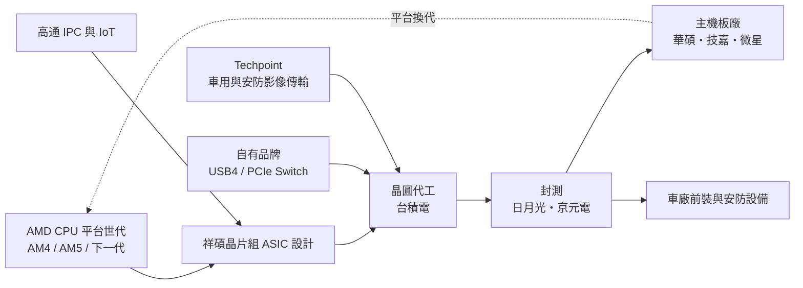
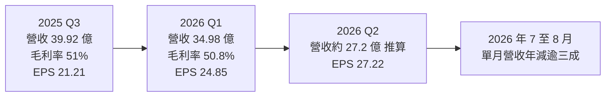
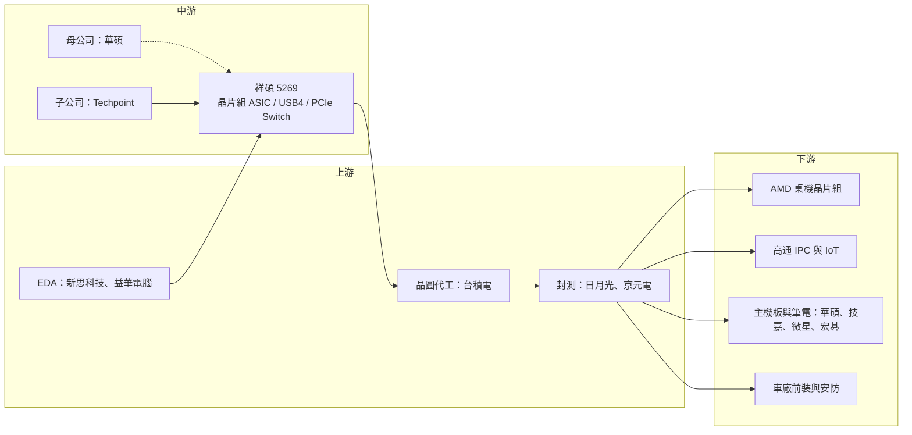

# 5269 祥碩

> 上市｜[[產業索引-半導體業|半導體業]]｜上市（櫃）日期 2012/12/12

# 第一章：企業模式與商業藍圖

> [!info] 撰寫說明
> 本文由 Claude 依公開資料整理，架構比照 [[2330台積電]] 的四章研究，資料截至 2026-10-07。財務數字來源：祥碩 2025 年第三季、2026 年第一季法說會報導（科技新報、聯合新聞網、富果研究）、2026 年股東會報導（科技新報）、月營收與第二季 EPS 快訊（科技新報、winvest、HiStock）；產業描述為整理性內容，尚未逐條比對原始文件。三大業務的精確營收比重本次未查得，因此未繪製營收結構圓餅圖。#待校對

在評估單一個股的長期投資價值時，首要步驟是拆解企業的底層獲利邏輯。本章針對祥碩科技（股票代號：5269，以下簡稱祥碩）的商業模式進行定性分析，說明這家華碩體系出身的 IC 設計公司，如何靠替 AMD 設計晶片組建立獲利基礎，又如何透過自有品牌與併購降低對單一客戶的依賴。

## 一、核心定位：華碩體系出身的高速傳輸介面 IC 設計公司

祥碩成立於 2004 年 3 月，由 [[2357華碩]] 轉投資設立，華碩持股約四成，加上相關投資公司合計超過五成，是華碩集團旗下最重要的 IC 設計子公司。祥碩屬於 [[Fabless]] 模式，自己不擁有晶圓廠，晶圓主要委由 [[2330台積電]] 代工。

祥碩的專長是「高速傳輸介面」，也就是讓電腦裡的 CPU、儲存裝置、外接裝置彼此高速溝通的晶片，包括 USB 控制器、[[PCIe]] 橋接與 [[PCIe Switch]]、SATA 控制器等。這類晶片的技術門檻在於：

* **高速類比電路：** 高速 [[SerDes]] 的設計能力，決定能否跟上每一代 USB 與 PCIe 規格的頻寬倍增。
* **相容性驗證：** 必須和眾多主機板、外接裝置、作業系統互通，並取得 USB-IF 與 Intel／AMD 平台認證，經驗需要長年累積。

## 二、終端應用／產品板塊：ASIC 代工、自有品牌、Techpoint 三支柱

* **[[ASIC]]／[[晶片組]]代工服務：** 祥碩最大的營收來源。祥碩長期替 [[AMD超微]] 設計與供應桌上型電腦主機板的晶片組（市場俗稱 Promontory 系列），目前同時出貨 AM4 與 AM5 平台產品。下一代平台（法說會稱為「Olympic」）已完成設計投片，依 2026 年股東會報導，下一代合作案已送樣，預計 2027 年下半年貢獻營收。第二家 ASIC 合作夥伴為 [[QCOM高通]]，產品鎖定 IPC（網路攝影機）與 [[IoT]] 市場，2026 年下半年逐步放量。
* **自有品牌高速介面 IC：** USB 3.x／[[USB4]] 控制器、PCIe 橋接與 PCIe Packet Switch 等，客戶涵蓋主機板廠、筆電廠與外接儲存品牌。公司在 2026 年第一季法說會表示，目標是讓 PCIe Packet Switch 與 USB4 自有品牌產品今年占營收提高到約 10%，明年再倍增，應用從 PC 延伸到 AI 邊緣運算、eGPU 外接顯示卡盒、高效能儲存與 AI 加速器互連。
* **Techpoint（車用與安防影像傳輸）：** 祥碩在 2025 年 6 月完成以約 3.9 億美元（約新台幣 129 億元，每股 20 美元）收購日本掛牌的 Techpoint，其存託股份於 2025 年 5 月 29 日自東京證券交易所下市。Techpoint 主力是車用攝影與安防監控的類比高畫質影像傳輸晶片，已打入日本、韓國、中國及印度的車廠前裝市場，應用包括車載攝影、電子後視鏡與環景系統，2026 年起貢獻全年營收。

公開報導未給出三大業務的精確營收比重，但從法說會敘述看，ASIC 代工仍是最大宗，自有品牌與 Techpoint 是分散風險的主要方向。

## 三、資本轉化邏輯：跟著 CPU 平台世代走的設計服務

* **平台綁定：** 晶片組必須與 CPU 平台同步開發、同步驗證，平台一旦定案，整個世代的出貨都跟著走。祥碩的營收因此與 AMD 桌機平台的出貨高度連動。
* **營運據點與製程：** 總部位於新北市，研發以台灣團隊為主，Techpoint 併入後增加美國與日本的類比與影像處理團隊。下一代 PCIe Gen 5 與 USB4 V2（80Gbps）產品規劃採台積電 12 奈米製程，預計 2026 年下半年完成投片；PCIe Gen 6／Gen 7 測試晶片預計 2027 年第一季推出。

## 四、企業長期藍圖：從「PC 晶片組供應商」走向「高速互連平台」

* **降低對 PC 主機板的依賴：** 公司在 2026 年第一季法說會坦言，受 DRAM 價格上漲與 CPU 供應吃緊影響，2026 年 PC 主機板市場可能衰退 15% 至 20%，DIY 市場回溫可能延到 2027 年底，因此需要用 AI 邊緣運算、車用、安防等新應用分散。
* **往更高速的 PCIe 與 USB 規格前進：** PCIe Switch 被視為 AI 伺服器與邊緣 AI 裝置中連接 GPU、網卡、SSD 的關鍵元件，是祥碩切入 AI 供應鏈的主要產品線。
* **車用布局：** 透過 Techpoint 取得車廠前裝客戶，並開發車用 SerDes [[IP]]（預計 2026 年底完成），希望把車用影像傳輸從類比升級到數位高速介面。公司也設定 2026 年中國市場營收成長 10% 至 20% 的目標。

# 第二章：護城河深度與競爭優勢

在長期價值投資中，「護城河」指企業抵禦競爭、維持超額利潤的保護機制。本章分析祥碩的護城河構成、高速介面與車用影像傳輸的競爭格局，以及祥碩的優勢在 PC 景氣轉弱時能守住多少。

## 一、護城河的核心組成要素

祥碩的護城河屬於「窄到中等」，由四個要素組成：

* **1. 與 AMD 的長期 ASIC 合作關係：** 祥碩從 AMD Ryzen 平台初期就參與晶片組設計，累積多代合作經驗。平台換代時，AMD 若要更換供應商，需要重新驗證整個主機板生態系，轉換成本很高。這是祥碩獲利能力的基礎，也是最大的集中風險。
* **2. 高速 SerDes 與相容性驗證經驗：** USB4、PCIe Gen4／Gen5 對訊號完整性要求極高，祥碩多年累積的相容性資料庫與認證經驗是新進者難以快速複製的。
* **3. 華碩集團與主機板廠生態：** 母公司華碩是全球主要主機板品牌，祥碩的晶片能在第一時間取得實際平台驗證，並透過主機板廠擴散到其他品牌。
* **4. 併購取得的車用客戶：** Techpoint 已在多家車廠完成前裝驗證，[[車規驗證]]期長，一旦導入通常會持續數年。

## 二、全球主要競爭對手格局

| 對手 | 定位 | 對祥碩的威脅 |
|---|---|---|
| [[INTC英特爾]] | Thunderbolt／USB4 控制器主要供應者 | 在筆電 USB4 市場有平台整合優勢 |
| [[AVGO博通]]（含 PLX）、Microchip | PCIe Switch 領導廠商 | 在資料中心與伺服器擁有大量既有客戶，是祥碩切入 AI 伺服器的主要對手 |
| [[4966譜瑞-KY]] | 台灣高速介面同業 | 在筆電與資料中心 Retimer、USB-C 部分重疊 |
| [[MRVL邁威爾]]、[[2379瑞昱]]、[[2458義隆]] | USB、儲存控制或周邊介面晶片 | 部分產品線重疊 |
| Analog Devices、德州儀器、中國安防晶片廠 | 車用與安防影像傳輸（GMSL、FPD-Link） | 與 Techpoint 直接競爭 |
| 中國本土介面 IC 廠 | USB 3.x 等成熟規格 | 以低價競爭中國市場 |

## 三、優勢轉化：哪些市場守得住、哪些守不住

* **守得住：** AMD 晶片組 ASIC 的地位在可見的平台世代內相對穩固，2026 年股東會也確認下一代合作案已送樣。USB4 裝置端控制器方面，祥碩是少數能量產的非英特爾供應商之一。
* **守不住：** PCIe Switch 在資料中心市場由博通主導，祥碩目前較可能先從邊緣 AI、工作站與 eGPU 等中小型市場切入，短期內很難正面挑戰博通的高階 Switch。
* **集中風險：** 2026 年前八個月營收年減約 6.9%，7、8 月單月營收年減超過三成，顯示 PC 主機板需求轉弱對祥碩的衝擊直接且快速。
* **觀察重點：** 自有品牌占比能否如公司目標提升到 10% 以上並在 2027 年倍增、高通 ASIC 案能否在 2026 年下半年放量、AMD 下一代平台晶片組能否如期在 2027 年下半年貢獻營收，以及 Techpoint 車用前裝客戶的擴展速度。

# 第三章：財務體質與盈利規模

資料日期：2026-10-07。數字取自公司法說會與財經媒體整理（科技新報、聯合新聞網、富果研究、winvest、HiStock），表格是撰寫當時的快照；最新月營收、毛利率、累計 EPS 由自動排程寫在本筆記的屬性欄位（月營收、毛利率、累計EPS 等）。#待校對

財務報表是檢驗護城河是否真實存在的最終標準。本章用三率、ROE、現金流與資本報酬，檢視祥碩的獲利品質，特別是本業與業外收益之間的落差。

## 一、獲利能力的基石：三率

| 項目 | 2025 全年 | 2025 Q3 | 2026 Q1 | 2026 Q2 |
|---|---|---|---|---|
| 營收（新台幣） | 134.15 億 | 39.92 億 | 34.98 億 | 約 27.2 億（由月營收推算） |
| [[毛利率]] | 未查得全年值（各季約 51% 至 55%） | 51% | 50.8% | 未查得 |
| [[營業利益率]] | 未查得 | 未查得 | 23.1% | 未查得 |
| 稅後淨利 | 54.26 億 | 15.82 億 | 18.5 億 | 未查得 |
| EPS（元） | 72.7 | 21.21 | 24.85 | 27.22 |

* **[[毛利率]]：** 長期維持在五成上下，公司長期目標毛利率 50% 至 55%，顯示高速介面晶片的定價能力穩定。
* **[[營業利益率]]：** 2026 年第一季 23.1%，較前一年同期的約 30% 下滑約 6.9 個百分點，反映 Techpoint 併入後的費用與研發投入增加；公司長期目標為 25% 至 30%。
* **[[業外收益]]的影響：** 2026 年第一季 EPS 24.85 元創單季新高，但其中約 10.53 億元來自轉投資的業外收益。第二季 EPS 27.22 元，季增約 10%、年增約 81%，上半年 EPS 合計 52.07 元；但依月營收推算第二季營收低於第一季，因此第二季 EPS 的成長推估主要來自業外收益，而非本業擴張。
* **2025 年：** 營收年增約 66%，創歷史新高，主要來自 AMD 晶片組 ASIC 出貨成長與 Techpoint 自 2025 年 6 月起併入。

## 二、[[ROE]]：資本效率

祥碩屬於輕資產的 IC 設計公司，主要支出是研發人力與光罩費用，因此資本效率高。由淨利與 EPS 推算股本約 7.5 億元（推估），每股淨值累積快速。ROE 精確數字本次未查得，以近年 EPS 水準推估長期維持在 20% 以上；但若排除業外收益，本業 ROE 會明顯較低。

## 三、資本支出與自由現金流

* **[[CapEx]]：** 主要為研發設備、[[EDA]] 工具與光罩，規模相對營收很小，本次未查得具體金額。
* **併購支出：** 2025 年最大的現金支出是收購 Techpoint 的約 3.9 億美元，主要以自有資金完成，之後需觀察[[商譽]]與無形資產攤銷對獲利的影響。
* **研發費用上升：** 下一代 12 奈米產品與 PCIe Gen6／Gen7 開發，會讓光罩與研發費用持續上升，這是營業利益率由三成降到兩成出頭的原因之一。
* **股利政策：** 2026 年股東會通過配發每股現金股利 45 元（實際除息金額依股本調整為每股約 45.38 元），以 2025 年 EPS 72.7 元計算，配發率約六成。

## 四、[[ROIC]] 與 [[WACC]]：價值創造利差

在不含併購的情況下，祥碩的投入資本很小，ROIC 遠高於資金成本（推估）。收購 Techpoint 後，投入資本增加約新台幣 129 億元，若 Techpoint 的營業利益貢獻不如預期，集團 ROIC 會被稀釋，具體數值本次未查得。

# 第四章：總體風險與地緣政治

任何企業都無法脫離宏觀環境獨立存在。本章分析祥碩未來必須面對的地緣政治、產業週期、營運與技術風險。

## 一、地緣政治風險

* **中國市場的雙面性：** 祥碩自有品牌與 Techpoint 安防產品在中國都有一定比重，公司也設定中國市場成長目標。但中國本土介面晶片廠在國產替代政策下崛起，加上美中科技管制可能擴及更多晶片類別，中國業務存在不確定性。
* **台灣晶圓製造集中：** 晶圓主要在台積電台灣廠生產，若兩岸情勢升溫或供應中斷，祥碩缺乏立即可替代的產能。
* **美國關稅：** PC 主機板與筆電多在中國、東南亞組裝後銷往美國，關稅政策會透過終端需求間接影響祥碩出貨。

## 二、產業週期與市場結構風險

* **PC 市場週期：** 公司預估 2026 年主機板市場衰退 15% 至 20%，DRAM 漲價與 CPU 供應短缺壓抑 DIY 與桌機需求。若 PC 需求在 2027 年仍未回溫，營收可能持續承壓。
* **規格換代時程：** USB4、PCIe Gen5 的普及速度取決於 CPU 平台與 OEM 採用意願，若普及延後，新產品貢獻會晚於預期。
* **車用與安防需求：** Techpoint 業務受車市景氣與安防設備（中國比重較高）需求影響。

## 三、營運環境的隱性風險

* **客戶集中：** ASIC 代工高度依賴 AMD 桌機平台，AMD 若改變晶片組策略（例如自行整合或更換供應商），對祥碩營收影響重大。
* **獲利品質：** 近幾季 EPS 有相當比重來自業外投資收益，本業獲利成長與 EPS 成長並不一致。
* **併購整合：** Techpoint 溢價約 170% 收購，若車用前裝擴展不如預期，可能面臨商譽減損風險。
* **母公司關係：** 華碩為最大股東，關係人交易與公司治理透明度是長期投資人會關注的面向。

## 四、科技演進風險

PCIe 每兩到三年翻倍頻寬，USB4 V2 也已進入 80Gbps。祥碩必須持續投入先進製程與高速 SerDes 研發，若 PCIe Gen6／Gen7 或 USB4 V2 產品延後，可能讓博通、英特爾或其他對手搶先卡位。此外，AI 伺服器的互連架構可能走向 [[CXL]] 或專屬互連協定，祥碩能否跟上也是長期觀察重點。

# 專有名詞解析

## 半導體

- **[[Fabless]]**：無晶圓廠的 IC 設計公司，只負責設計晶片，生產委由晶圓代工廠與封測廠完成。
- **[[ASIC]]**：特定應用積體電路，為單一客戶或單一用途量身設計的晶片，例如雲端業者自用的 AI 加速器。
- **[[晶片組]]**：主機板上協助 CPU 管理 USB、SATA、PCIe 等周邊介面的晶片，AMD 桌機平台的晶片組由祥碩設計。
- **[[SerDes]]**：串列器與解串器，把平行資料轉成高速串列訊號傳輸的電路，是晶片間高速互連的核心 IP。
- **[[PCIe Switch]]**：PCIe 交換器，讓一個 PCIe 連接埠分出多條通道，連接多顆 GPU、SSD 或網卡的晶片。
- **[[IP]]**：矽智財，可重複授權使用的電路設計模組，例如 SerDes、記憶體介面。
- **[[EDA]]**：電子設計自動化軟體，晶片設計必備的工具，主要由新思科技與益華電腦提供。

## 應用

- **[[PCIe]]**：周邊元件高速互連標準，電腦與伺服器內 CPU、GPU、SSD、網卡之間的主要連接介面，每一代頻寬約倍增。
- **[[USB4]]**：USB 規格的第四代，以 Thunderbolt 技術為基礎，單一接頭可傳輸資料、影像與電力，速度達 40Gbps 以上。
- **[[CXL]]**：建立在 PCIe 之上的高速互連協定，讓 CPU、加速器與記憶體共享資料，是資料中心新一代互連架構。
- **[[IoT]]**：物聯網，把感測器、攝影機與家電等裝置連上網路，彼此交換資料。
- **[[車規驗證]]**：車用晶片須通過 AEC-Q100 等可靠度測試與車廠認證，流程常需 2 至 3 年，因此轉換成本高。

## 金融

- **[[業外收益]]**：本業營運以外的收益或損失，例如轉投資收益、匯兌與評價損益，波動大且不一定能持續。
- **[[商譽]]**：併購價格高於被併公司可辨認淨資產的部分，若被併事業表現不佳，須認列減損損失。

# 核心供應鏈

## 1. 上游：晶圓代工、封測與 IP
- 晶圓代工：[[2330台積電]]
- 封裝測試：[[3711日月光投控]]、[[2449京元電子]]
- EDA 工具：[[SNPS新思科技]]、[[CDNS益華電腦]]

## 2. 中游：祥碩本身與集團關係
- 母公司與主機板夥伴：[[2357華碩]]
- 車用與安防影像子公司：Techpoint（2025 年收購）

## 3. 下游：主要客戶
- 晶片組 ASIC：[[AMD超微]]
- IPC 與物聯網 ASIC：[[QCOM高通]]
- 主機板與筆電：[[2357華碩]]、[[2376技嘉]]、[[2377微星]]、[[2353宏碁]]
- 車用與安防：日、韓、中、印度車廠前裝供應鏈（未具名）

## 4. 同業與競爭者
- 國外：[[INTC英特爾]]、[[AVGO博通]]、Microchip
- 國內：[[4966譜瑞-KY]]、[[2379瑞昱]]

延伸閱讀：[[台積電供應鏈]]

## 最新新聞
<!-- news:start -->
<!-- news:end -->

## 相關連結
- [公開資訊觀測站](https://mopsov.twse.com.tw/mops/web/t05st03?step=1&firstin=1&co_id=5269)
- [Goodinfo](https://goodinfo.tw/tw/StockDetail.asp?STOCK_ID=5269)
- [Yahoo 股市](https://tw.stock.yahoo.com/quote/5269)
- [鉅亨網新聞](https://www.cnyes.com/twstock/5269/news)
