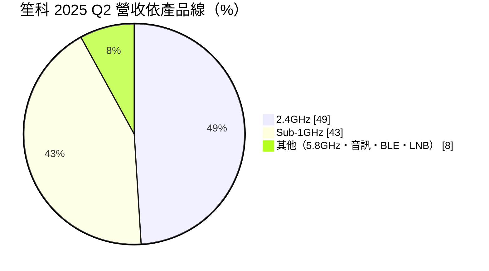
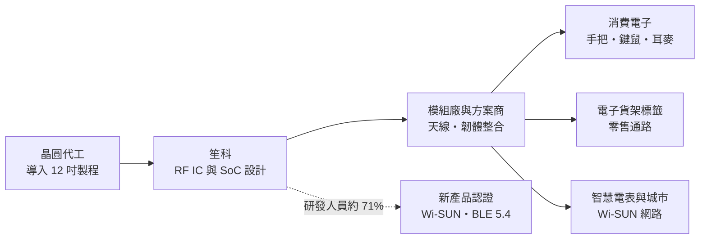
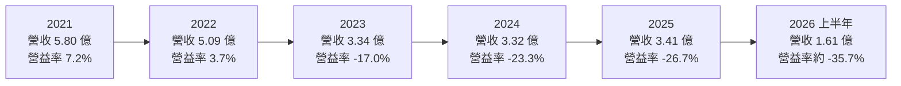
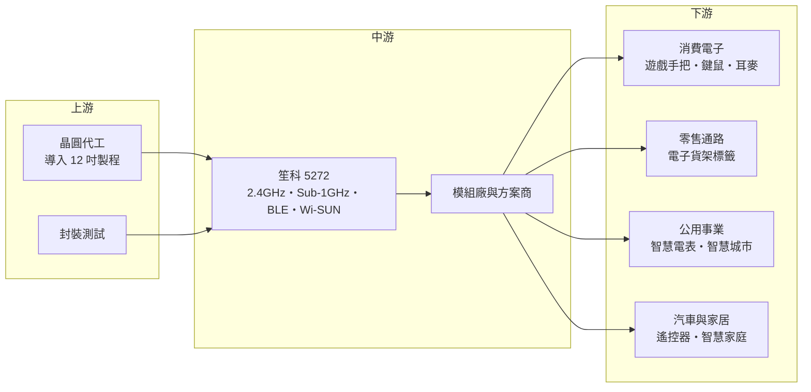

# 5272 笙科

> 上櫃｜[[產業索引-半導體業|半導體業]]｜上市（櫃）日期 2013/05/30

# 第一章：企業模式與商業藍圖

> [!info] 撰寫說明
> 本文由 Claude 依公開資料整理，架構比照 [[2330台積電]] 的四章研究，資料截至 2026-10-08。財務數字來源：聚財網年度財報與季損益表、富果研究與 poorstock 的 2025 年 9 月法說會整理、櫃買中心公開資料；產業描述為整理性內容，尚未逐條比對原始文件。#待校對

無線連接是物聯網時代最基本的需求：遊戲手把要連主機、電子標籤要接收價格更新、智慧電表要把用電資料傳回電力公司。本章針對笙科電子（股票代號：5272，以下簡稱笙科）的商業模式進行定性分析，說明這家小型射頻 IC 設計公司在哪些利基市場生存，以及它面對的結構性挑戰。

## 一、核心定位：專注低功耗私有協定的射頻 IC 設計公司

笙科成立於 2005 年 9 月，2013 年在櫃買中心掛牌，總部位於新竹縣竹北市，另在台北、深圳、上海與日本設有據點，董事長為曾三田。依 poorstock 整理的法說會資料，公司員工約 99 人，其中約 71% 是研發人員，約 51% 具碩士以上學歷，是一家典型以研發為核心的小型 [[Fabless]] 公司。

笙科的產品是[[射頻 IC]]（RF IC）與射頻系統單晶片（[[SoC]]），功能是把數位資料轉成無線電波發送出去，或把收到的無線電波轉回數位資料。和 Wi-Fi、藍牙這類由國際大廠主導、追求高速傳輸的通訊晶片不同，笙科的強項在於 2.4GHz 與 [[Sub-1GHz]] 頻段的「私有協定」與低功耗應用：傳輸量不大，但要求省電、穩定、低延遲與低成本，例如遊戲手把、無線鍵盤滑鼠、汽車遙控器與智慧電表。

這個定位有好處也有限制。好處是應用非常分散，單一客戶或單一產品的波動影響有限；限制是這些市場單價低、規模小，而且中國有大量射頻 IC 業者以低價競爭，笙科很難像大廠一樣靠規模經濟壓低成本。

## 二、終端應用與產品板塊：2.4GHz 與 Sub-1GHz 雙主軸

依富果研究整理的 2025 年 9 月法說會資料，2025 年第二季的產品營收結構如下：

**2.4GHz 產品線（約 49%）。** 應用在遊戲手把、無線鍵鼠、電競耳麥、嬰兒監視器與[[電子貨架標籤]]（ESL）。這是笙科最大的產品線，客戶多為消費性電子與電競周邊廠商，需求會隨消費景氣與遊戲主機世代起伏。2025 年推出的 A3130M0 是符合 [[BLE]] 5.4 規格的 SoC，專門針對電子貨架標籤，代表公司正把 2.4GHz 技術往標準協定延伸。

**Sub-1GHz 產品線（約 43%）。** 應用在[[智慧電表]]、智慧城市、汽車遙控器與智慧家居。Sub-1GHz 頻段的訊號傳得遠、穿牆能力好，適合大範圍部署的公用事業網路。笙科多款產品已取得 [[Wi-SUN]] FAN 認證，依法說會資料，兩家客戶已導入 Wi-SUN FAN 產品設計，預計 2026 年量產。這條產品線是公司提升附加價值的主要方向，因為電表與公用事業網路的驗證期長、產品週期也長。

**其他產品（約 8%）。** 包括 5.8GHz 無線影音與電競耳麥、中國 ETC 電子收費、無線音訊、藍牙低功耗，以及衛星接收器的 LNB 切換開關。這些屬於規模較小的利基產品。

地區結構的變化同樣值得注意。依 poorstock 整理，香港與中國的營收比重從 2024 年的 60% 降到 2025 年第二季的 41%，韓國、歐洲與新加坡則從 13% 升到 40%，台灣約 19%。公司明確表示要深耕海外市場、降低對中國的依賴，原因是中國市場的價格競爭是毛利率下滑的主因。

## 三、資本轉化邏輯：研發人力換取多樣化的小訂單

笙科的營運模式是把有限的研發人力投入多個射頻產品線，每條產品線服務多個中小型客戶。晶片委外生產，新產品已開始導入 12 吋晶圓製程，期望藉此降低成本與功耗。由於沒有自己的工廠，公司的主要成本是研發人員薪資，營業費用相對固定。

這種模式的財務特性是「營運槓桿大」：營收超過損益兩平點時，多出來的毛利大部分會轉成利潤；但營收低於損益兩平點時，固定的研發費用就會造成虧損。從聚財網資料看，2021 年營收 5.8 億元時營業利益率約 7%，2023 年以後營收降到 3.3 至 3.4 億元，營業利益率就跌到 -17% 至 -27%。損益兩平所需的營收規模推估約在 5 億元上下（推估，依歷年營收與營業利益率關係）。

## 四、企業長期藍圖：往標準協定與公用事業網路移動

笙科的長期策略可以歸納成三點。

**第一，從私有協定走向標準協定。** 過去笙科的優勢在私有協定，但物聯網市場逐漸往 BLE、Wi-SUN 這類國際標準集中，因為標準協定讓不同廠牌的設備可以互通。公司推出 BLE 5.4 與 Wi-SUN FAN 產品，目的就是搭上標準化的趨勢。

**第二，從消費性市場走向公用事業與零售基礎設施。** 智慧電表與電子貨架標籤的共同特點是「部署量大、更換週期長、驗證門檻高」，一旦打進電力公司或零售通路的供應鏈，訂單可延續數年。這比遊戲周邊的短週期訂單更穩定。

**第三，降低中國市場依賴。** 地區結構已大幅轉向韓國、歐洲與新加坡，這與電子貨架標籤的主要市場在歐洲、智慧電表在日本與亞洲的需求一致。

這個藍圖能否成功，要看 Wi-SUN 客戶 2026 年的量產進度，以及新產品能否把毛利率從目前約 38% 至 42% 拉回過去 50% 以上的水準。

# 第二章：護城河深度與競爭優勢

在長期價值投資中，「護城河」指企業抵禦競爭、維持超額利潤的保護機制。本章分析笙科的競爭優勢來源、全球主要競爭對手，以及這些優勢能否抵擋中國業者的價格競爭。

## 一、笙科護城河的核心組成要素

坦白說，笙科的護城河很窄，主要來自以下三點。

**1. 射頻設計經驗與產品廣度。** 射頻電路對製程變異、溫度、天線設計都很敏感，需要長期累積的設計經驗。笙科在 2.4GHz、Sub-1GHz、5.8GHz 都有產品，可以讓同一批客戶在不同產品上重複採用。這種經驗不容易被新創公司快速複製，但對有規模的國際大廠或中國同業而言並非無法跨越的門檻。

**2. 標準協定認證。** Wi-SUN FAN 認證與 BLE 5.4 規格需要投入時間與資源完成測試，認證本身形成短期門檻。尤其電表市場重視長期供貨與互通性，取得認證的供應商較容易被電力公司的系統商列入名單。

**3. 小量多樣的服務彈性。** 國際大廠通常不會為小客戶客製化，笙科可以替中小型品牌提供較彈性的技術支援與客製化射頻方案。法說會資料也提到公司會與策略夥伴合作開發客製化射頻 IC。

## 二、全球主要競爭對手格局

| 對手 | 定位 | 對笙科的影響 |
|---|---|---|
| Nordic Semiconductor | 低功耗藍牙與 2.4GHz 私有協定的國際領導者 | 在電競周邊與 BLE 市場擁有品牌與生態系優勢 |
| Silicon Labs、德州儀器 | Sub-1GHz、Wi-SUN 與多協定無線 SoC | 在智慧電表與工業物聯網有完整產品線 |
| 中國射頻 IC 業者 | 以低價供應 2.4GHz 與藍牙晶片 | 是笙科毛利率從 55% 降到 40% 左右的主因 |
| 台灣同業 | 部分 IC 設計公司也有 2.4GHz 與藍牙產品 | 在台灣與中國消費性市場直接競爭 |

上表中國際業者為產業常見的競爭者整理，公司法說會並未具名列出競爭對手，僅提到中國市場的價格競爭。

## 三、優勢轉化：守得住與守不住的地方

**守得住的部分：** 需要認證與長期供貨的 Wi-SUN 智慧電表、電子貨架標籤，以及笙科已長期合作的歐洲、韓國客戶。這些客戶重視穩定性，價格敏感度較低。

**守不住的部分：** 一般消費性 2.4GHz 晶片。依法說會資料，毛利率從 2022 年約 55% 降到 2025 年第二季約 43%（前二季累計），主因就是中國市場的價格競爭。只要產品沒有足夠的差異化，價格就會被持續壓低。

**觀察重點：** 第一，毛利率能否止跌回升到 45% 以上；第二，Wi-SUN 客戶 2026 年是否如期量產；第三，營收能否回到損益兩平所需的規模。如果三者都沒有改善，研發費用會持續侵蝕股東權益。

# 第三章：財務體質與盈利規模

資料日期：2026-10-08。數字取自聚財網年度財報與季損益表（營收為四季加總）、富果研究與 poorstock 法說會整理、櫃買中心財報資料，表格是撰寫當時的快照；最新月營收、毛利率、累計 EPS 由自動排程寫在本筆記的屬性欄位（月營收、毛利率、累計EPS 等）。#待校對

財務報表是檢驗護城河是否真實存在的最終標準。本章用五年的三率、[[ROE]]、現金流與資本報酬，檢視笙科的獲利品質。

## 一、獲利能力的基石：三率

| 年度 | 營收（新台幣） | [[毛利率]] | [[營業利益率]] | EPS（元） | [[ROE]] |
|---|---|---|---|---|---|
| 2021 | 5.80 億 | 51.52% | 7.18% | 0.96 | 5.25% |
| 2022 | 5.09 億 | 54.77% | 3.68% | 0.88 | 4.43% |
| 2023 | 3.34 億 | 48.32% | -16.97% | -0.56 | -2.83% |
| 2024 | 3.32 億 | 45.85% | -23.31% | -0.09 | -0.48% |
| 2025 | 3.41 億 | 41.83% | -26.70% | -1.33 | -7.90% |
| 2026 上半年 | 1.61 億 | 約 37.8% | 約 -35.7% | -1.06 | 未查得 |

五年數字顯示笙科面臨「營收縮水、毛利率下滑」的雙重壓力。營收從 2021 年的 5.80 億元降到 2025 年的 3.41 億元，年複合成長率約 -12.4%（推算）。毛利率從 2022 年的 54.8% 一路降到 2025 年的 41.8%，2026 年上半年再降到 38% 左右。

營業利益率的惡化比毛利率更劇烈，原因是營運槓桿：研發費用主要是人力成本，不會隨營收下降而等比例減少。2024 年營業利益率 -23.3%，但全年 EPS 只虧 0.09 元，是因為當年有業外收益（第二季單季 EPS 為正 0.48 元），具體來源未查得；評估本業時應以營業利益為準。

## 二、[[ROE]]：資本效率

2021 至 2025 年平均 ROE 約 -0.3%（推算），等於五年下來幾乎沒有為股東賺到報酬。每股淨值從 2023 年的 20.02 元降到 2025 年的 15.63 元，2026 年第二季再降到 14.88 元，主因是連續虧損。依聚財網資料，負債比率長期在 12% 至 15%，公司財務結構保守，沒有借款壓力，但淨值持續被虧損侵蝕。

## 三、資本支出與自由現金流

Fabless 模式不需建廠，資本支出低，具體金額未查得。依 poorstock 整理，總資產從 2023 年的 12.59 億元降到 2025 年第二季的 10.69 億元，權益從 11.07 億元降到 9.25 億元，代表虧損期間公司主要動用過去累積的資金支應營運（推估）。

股利方面，依 poorstock 整理，2021 年度配發 0.86 元、2022 年度配發 0.71 元，2023 與 2024 年度未配發。公司在獲利時配息率偏高，虧損時則停止配息，股利政策跟著本業獲利走。

## 四、[[ROIC]] 與 [[WACC]]：價值創造利差

**ROIC 推算：** 2025 年營業利益約 -0.91 億元（3.41 億 × -26.70%），營業虧損不計稅。股東權益約 8.64 億元（每股淨值 15.63 元 × 約 0.553 億股），公司沒有明顯有息負債，以股東權益作為投入資本，ROIC 約 -10.5%（推算）。以同樣方法回推 2021 年，稅後營業利益約 0.33 億元（5.80 億 × 7.18% × 0.8），股東權益約 10.5 億元，ROIC 約 3.2%（推算）。

**WACC 推算：** 股東權益成本用 CAPM 估計，假設台灣 10 年期公債殖利率 1.75%、市場風險溢酬 6%、β 取 IC 設計同業常見值 1.1（未查得公司實際 β），股東權益成本約 8.35%。公司沒有有息負債，WACC 約 8.35%（推算）。

**結論：** 即使在 2021 年的景氣高點，笙科的 ROIC 約 3%，仍低於約 8% 的資金成本；2023 年以後 ROIC 更轉為明顯負值。這代表在目前的規模與產品組合下，笙科長期沒有創造經濟價值。要扭轉這個結論，公司需要同時做到兩件事：讓營收回到損益兩平以上的規模，並靠 Wi-SUN、電子貨架標籤等較高附加價值的產品把毛利率拉回 50% 左右。

# 第四章：總體風險與地緣政治

任何企業都無法脫離宏觀環境獨立存在。本章分析笙科未來必須面對的地緣政治、產業週期、營運與技術風險。

## 一、地緣政治風險

**中國市場的雙面性。** 香港與中國過去占笙科營收的一半以上，是最大的市場，但也是價格競爭最激烈、受中美關係影響最大的市場。中國品牌在政策鼓勵下傾向採用本土晶片，台灣業者在中國消費性市場的空間會持續被壓縮。公司把營收重心轉向韓國、歐洲與新加坡，是降低這項風險的主要做法。

**關稅與客戶拉貨。** 法說會資料指出，2025 年下半年客戶可能因關稅延後拉貨。笙科的客戶多為消費電子品牌與代工廠，美國關稅政策改變會直接影響它們的備貨節奏。

## 二、產業週期與市場結構風險

**消費性電子週期。** 遊戲手把、鍵鼠、耳麥等產品需求與消費景氣、遊戲主機世代高度相關。2021 至 2022 年的居家需求高峰後，2023 年營收大幅下滑三成以上，說明這類市場的循環非常明顯。

**市場結構不利小廠。** 物聯網無線晶片市場一端是擁有完整生態系的國際大廠，另一端是成本極低的中國業者，中間規模的業者很容易被兩邊擠壓。這是笙科最根本的結構性挑戰。

## 三、營運環境的隱性風險

**規模不足與人才成本。** 公司員工約百人，研發人員占七成，人才成本隨產業薪資上升而增加，但營收規模不足以攤提。若虧損持續，公司可能被迫縮減研發，進一步削弱競爭力。

**淨值侵蝕。** 每股淨值已從約 20 元降到 15 元以下，若虧損延續，長期會影響公司承接大型專案與爭取國際客戶的信用條件。

## 四、科技演進風險

物聯網無線通訊正往標準協定整合，例如 BLE、Wi-SUN、Thread 與 Matter 等，私有協定的空間逐漸縮小。笙科已推出 BLE 5.4 與 Wi-SUN FAN 產品，方向正確，但標準協定市場的競爭者更多、生態系更重要。公司能否在標準協定市場找到足夠大的利基，決定了它長期的生存空間。

# 專有名詞解析

## 半導體

- **[[射頻 IC]]**：處理無線電訊號收發的晶片，把數位資料調變成無線電波發送，或把收到的電波轉回數位資料。
- **[[SoC]]**：系統單晶片，把處理器、記憶體、射頻與周邊電路整合在同一顆晶片上，可縮小體積並降低成本。
- **[[Fabless]]**：只做晶片設計、把製造委外給晶圓代工廠的 IC 設計公司模式。

## 應用

- **[[Sub-1GHz]]**：1GHz 以下的無線頻段，傳輸距離遠、穿牆能力好但速度較低，常用於智慧電表、遙控器與物聯網感測器。
- **[[BLE]]**：藍牙低功耗，專為省電設計的藍牙規格，廣泛用於穿戴裝置、電子標籤與智慧家居。
- **[[Wi-SUN]]**：針對智慧電網與智慧城市設計的無線網狀網路標準，以 IEEE 802.15.4g 為基礎，可讓大量電表互相轉傳資料。
- **[[電子貨架標籤]]**：以電子紙顯示商品價格、可透過無線網路遠端更新的貨架標籤，歐洲零售通路採用最積極。
- **[[智慧電表]]**：可雙向傳輸用電資料的電表，讓電力公司遠端抄表並做需量管理，部署量大、更換週期長。

## 金融

- **[[毛利率]]**：毛利除以營收，反映產品定價能力與成本控制，IC 設計公司毛利率下滑通常代表價格競爭加劇。
- **[[營業利益率]]**：營業利益除以營收，扣除研發、管銷費用後的本業獲利能力。
- **[[ROE]]**：股東權益報酬率，稅後淨利除以股東權益，衡量公司運用股東資金的效率。
- **[[ROIC]]**：投入資本報酬率，稅後營業利益除以投入資本（股東權益加有息負債），衡量本業創造報酬的能力。
- **[[WACC]]**：加權平均資金成本，股東與債權人要求報酬率的加權平均，ROIC 高於 WACC 才代表創造價值。

# 核心供應鏈

## 1. 上游：晶圓代工與封測
- 晶片委外生產，新產品導入 12 吋晶圓製程；實際代工與封測夥伴未查得。

## 2. 中游：笙科本身與通路
- 笙科本身：2.4GHz、Sub-1GHz、5.8GHz、BLE 與 Wi-SUN 射頻晶片。
- 代理通路：笙科產品列於 [[3702大聯大]] 旗下代理商的產品線之一（依大聯大網站產品線頁面）。

## 3. 下游：應用客戶
- 消費性電子、電子貨架標籤、智慧電表與智慧家居業者；公司未揭露主要客戶名稱。

## 4. 同業與競爭者
- 國際：Nordic Semiconductor、Silicon Labs、TXN德州儀器（產業常見競爭者，公司未具名）
- 中國射頻 IC 業者（以價格競爭為主）

## 最新新聞
<!-- news:start -->
<!-- news:end -->

## 相關連結
- [公開資訊觀測站](https://mopsov.twse.com.tw/mops/web/t05st03?step=1&firstin=1&co_id=5272)
- [Goodinfo](https://goodinfo.tw/tw/StockDetail.asp?STOCK_ID=5272)
- [Yahoo 股市](https://tw.stock.yahoo.com/quote/5272)
- [鉅亨網新聞](https://www.cnyes.com/twstock/5272/news)
