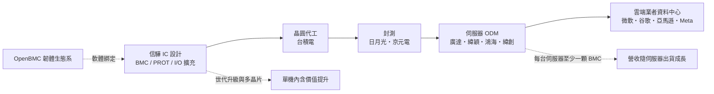
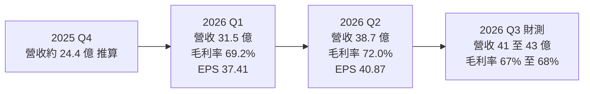
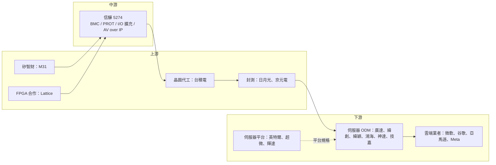

# 5274 信驊

> 上櫃｜[[產業索引-半導體業|半導體業]]｜上市（櫃）日期 2013/04/30

# 第一章：企業模式與商業藍圖

> [!info] 撰寫說明
> 本文由 Claude 依公開資料整理，架構比照 [[2330台積電]] 的四章研究，資料截至 2026-10-07。財務數字來源：信驊 2025 年財報、2026 年第一季與第二季財報及法說會相關報導（NOWnews、ETtoday 財經雲、富果研究、旺得富、poorstock 法說整理）；產業描述為整理性內容，尚未逐條比對原始文件。BMC 與其他產品的精確營收比重本次未查得，因此未繪製營收結構圓餅圖。#待校對

在評估單一個股的長期投資價值時，首要步驟是拆解企業的底層獲利邏輯。本章針對信驊科技（股票代號：5274，以下簡稱信驊）的商業模式進行定性分析，說明一顆單價不高、卻是每台伺服器標準配備的管理晶片，如何讓信驊成為台股獲利能力最強的公司之一。

## 一、核心定位：全球伺服器 BMC 晶片龍頭

信驊是台灣的 [[Fabless]] IC 設計公司，總部位於新竹，股價長年居台股之冠，被稱為「股王」。信驊的核心產品是基板管理控制晶片（[[BMC]]）：每一台伺服器主機板上都有一顆 BMC，負責在主系統之外獨立監控溫度、風扇、電源、硬體狀態，並讓資料中心管理員能遠端開關機、更新韌體、排除故障。

信驊在 BMC 市場居全球第一，同時也是 [[AV over IP]] 與商用 360 度相機晶片的市占龍頭。這個定位有兩個商業意義：

* **營收直接連動伺服器出貨：** BMC 是伺服器的標準配備，信驊的營收幾乎直接反映全球伺服器出貨量，以及每台伺服器內含的 BMC 與周邊晶片數量。
* **AI 帶來的不只是 GPU 伺服器：** AI 伺服器、運算托盤與交換器都需要管理晶片；2026 年[[代理式 AI]]興起，也帶動傳統 CPU 伺服器需求回溫。

## 二、終端應用／產品板塊：BMC 為主，周邊晶片提高單機價值

* **BMC 晶片：** 主力產品，包括 AST2600 與新一代 AST2700 系列，AST2700 於 2026 年下半年放量，次世代 AST2755 已啟動客戶設計導入。BMC 占營收絕大多數（具體比重本次未查得）。
* **伺服器周邊晶片：** 安全晶片 PROT（AST1060 出貨中、AST1080 即將推出，屬[[硬體信任根]]）、I/O 擴充晶片 AST1700（因應伺服器模組化設計）、SMC 晶片 AST1040（預計 2027 年第一季量產），以及與 Lattice 合作、整合 [[eFPGA]] 的 AST1840。這些產品的目的都是「提高每片主機板的內含價值」。
* **Cupola360 與 AV over IP：** 360 度 8K 相機晶片與影音延伸產品，2025 年營收約 2.2 億元，占比很小。

依旺得富引述的外資預估，2026 年信驊 BMC 出貨量約 3,100 萬顆，年增 63%；2027 年預估達 4,460 萬顆，年增 44%，成長動能來自美國與中國的 CPU、GPU 與 [[ASIC]] 伺服器。

## 三、資本轉化邏輯：每台伺服器一顆起跳的「過路費」

* **輕資產：** 信驊沒有晶圓廠，晶片委由 [[2330台積電]] 等晶圓代工廠生產，再交由封測廠封裝測試。股本小、獲利高，2025 年 EPS 首度突破百元。
* **客戶結構：** 主要是伺服器主機板與整機代工廠（ODM），以及美國大型雲端服務業者（[[CSP]]）直接指定採用的白牌伺服器供應鏈。
* **成長來自兩個乘數：** 伺服器出貨量乘以每台伺服器的晶片內含價值。前者跟著資料中心投資走，後者靠產品世代升級與周邊晶片擴展。

## 四、企業長期藍圖：提升單機內含價值與世代升級

* **AI 伺服器帶動：** 每台伺服器、每個運算托盤與交換器都需要管理晶片，AI 基礎設施擴張直接帶動 BMC 需求。
* **提升單機內含價值：** 從一顆 BMC 擴展到安全晶片、I/O 擴充、SMC 等多顆晶片，讓每台伺服器貢獻的營收增加。
* **新世代產品升級：** AST2700 採更先進製程、單價較高，世代轉換有助於提升[[平均售價]]。
* **策略投資：** 2026 年 8 月董事會決議參與 [[6643M31]] 私募，投資約 1.87 億元，強化矽智財合作。

# 第二章：護城河深度與競爭優勢

在長期價值投資中，「護城河」指企業抵禦競爭、維持超額利潤的保護機制。本章分析信驊的護城河構成、BMC 市場的競爭格局，以及信驊的寡占地位在中國國產化與雲端業者自研的趨勢下能守住多少。

## 一、護城河的核心組成要素

信驊的護城河屬於「寬護城河」，是台灣 IC 設計公司中少數具備高市占、高毛利特徵的例子：

* **1. 近乎獨占的市場地位：** 全球 BMC 市占率第一，主流伺服器平台與雲端業者大多採用信驊方案。
* **2. 軟體生態系綁定：** BMC 需要與 [[OpenBMC]] 等韌體、伺服器管理軟體、資料中心管理系統長期整合，雲端業者與 ODM 已經在信驊的平台上累積大量程式碼與驗證，更換供應商的成本極高。
* **3. 驗證週期長：** 伺服器平台一旦選定 BMC，通常沿用整個平台世代，新進者很難在短期內切入。
* **4. 定價能力：** 2026 年 4 月調漲價格後，第二季毛利率升至 72%，顯示客戶對價格的敏感度低。BMC 占整台伺服器成本比例極小，客戶更在乎穩定性而非價格。

## 二、全球主要競爭對手格局

| 對手 | 定位 | 對信驊的威脅 |
|---|---|---|
| [[4919新唐]] | 台灣 MCU 公司，提供 BMC 產品 | 在部分伺服器平台與信驊競爭，但市占遠低於信驊 |
| [[2379瑞昱]] 等台灣 IC 設計公司 | 曾被市場討論跨入 BMC | 尚未形成規模 |
| 中國本土 BMC 業者 | 受伺服器國產化政策支持 | 可能逐步替代信驊在中國市場的份額 |
| 雲端業者自研團隊 | 大型 CSP 自行開發管理晶片或採用其他架構 | 長期潛在威脅 |

## 三、優勢轉化：哪些市場守得住、哪些守不住

* **守得住：** 在全球主流伺服器與雲端資料中心，信驊的軟體生態系與驗證優勢明顯，短期內難以被取代。漲價後毛利率不降反升，就是護城河的直接證據。
* **守不住：** 中國市場的國產替代政策可能讓信驊在中國伺服器的市占逐步流失；大型 CSP 若轉向自研或整合方案，也可能侵蝕部分需求。
* **觀察重點：** AST2700 放量進度、每台伺服器內含晶片數量的提升、毛利率能否維持在 67% 以上，以及中國市場的市占變化。

# 第三章：財務體質與盈利規模

資料日期：2026-10-07。數字取自財報與法說會相關財經報導（NOWnews、ETtoday 財經雲、富果研究、旺得富），表格是撰寫當時的快照；最新月營收、毛利率、累計 EPS 由自動排程寫在本筆記的屬性欄位（月營收、毛利率、累計EPS 等）。#待校對

財務報表是檢驗護城河是否真實存在的最終標準。本章用三率、ROE、現金流與資本報酬，檢視信驊作為「寬護城河」公司的獲利品質。

## 一、獲利能力的基石：三率

| 項目 | 2025 全年 | 2026 Q1 | 2026 Q2 | 2026 Q3 財測 |
|---|---|---|---|---|
| 營收（新台幣） | 90.9 億 | 31.5 億 | 38.7 億 | 41～43 億 |
| [[毛利率]] | 未查得 | 69.2% | 72.0% | 67%～68% |
| [[營業利益率]] | 未查得 | 52.7% | 未查得 | — |
| 稅後淨利 | 39.3 億 | 約 14.1 億 | 18.4 億 | — |
| EPS（元） | 103.92 | 37.41 | 40.87 | — |

* **[[毛利率]]：** 近七成，第二季提升到 72% 主要反映 4 月漲價效益；公司給的第三季毛利率財測 67% 至 68%，以美元兌新台幣 32.0 為假設。
* **[[營業利益率]]：** 2026 年第一季 52.7%，代表每 100 元營收有超過 50 元變成營業利益，是 IC 設計業中極少見的水準。
* **2025 年：** 營收年增 40.6%，稅後淨利年增 52.8%，EPS 103.92 元創歷史新高。
* **2026 年：** 第一季營收年增 52.4%、季增 28.8%（據此推算 2025 年第四季營收約 24.4 億元）。第二季營收季增 23%、年增 72.3%，營收與獲利創歷史新高；上半年營收 70.2 億元，稅後淨利 32.6 億元，EPS 合計 78.28 元。部分整理網站列出的第二季 EPS 為 44.27 元，與 ETtoday 報導的 40.87 元不一致，此處採用與上半年合計相符的 40.87 元。
* **最新動態：** 7 月營收 15.24 億元，年增 97.6%，創單月新高。外資估第三季營收約 44.9 億元，可能優於公司財測（法人預估）。

## 二、[[ROE]]：資本效率

信驊股本小、毛利率近七成、營業利益率超過五成，是台股資本效率最高的公司之一。具體 ROE 數值本次未查得，但以 EPS 與高配發率觀之，ROE 長期維持在極高水準（推估）。

## 三、資本支出與自由現金流

* **[[CapEx]]：** 信驊為 Fabless，資本支出很低，主要用於研發設備與辦公據點。
* **[[自由現金流]]：** 營業現金流大部分以股利形式回饋股東。研發費用快速成長，poorstock 整理資料提到研發費用年增約 92%，反映新產品線的投入。
* **股利政策：** 董事會決議以 2025 年度盈餘每股配發現金股利 80 元，並以資本公積每股配發股票股利 1 元，現金股利發放率約 77%。

## 四、[[ROIC]] 與 [[WACC]]：價值創造利差

信驊投入的資本主要是研發與營運資金，營業利益率超過五成，ROIC 推估遠高於資金成本，是典型的「價值創造型」公司（推估，具體數值未查得）。利差能否維持，取決於定價能力與新產品研發投入的報酬。

# 第四章：總體風險與地緣政治

任何企業都無法脫離宏觀環境獨立存在。本章分析信驊未來必須面對的地緣政治、產業週期、營運與技術風險。

## 一、地緣政治風險

* **中國伺服器國產化：** 中國推動伺服器與資料中心國產化，本土 BMC 晶片可能逐步替代信驊在中國市場的份額。
* **美國出口管制：** AI 伺服器出口管制若擴大，可能影響中國伺服器市場的整體規模，也影響信驊在中國的出貨。
* **台灣供應鏈集中：** 晶圓代工與封測主要在台灣，面臨兩岸風險。

## 二、產業週期與市場結構風險

* **伺服器景氣週期：** 營收與全球伺服器出貨高度連動，雲端業者若縮減資本支出，BMC 需求會立即反映。
* **供應鏈瓶頸：** 公司提到第四季供應鏈改善才會帶來顯著成長，代表上游晶圓、載板或其他零組件供給是出貨的限制因素之一。
* **匯率：** 營收以美元計價，財測以美元兌新台幣 32.0 為假設，新台幣升值會壓縮毛利率。

## 三、營運環境的隱性風險

* **客戶與產品集中：** BMC 占營收絕大多數，產品線集中度高。
* **價格與毛利：** 2026 年漲價推升毛利率，但若客戶議價能力增強或競爭者出現，毛利率可能回落。
* **研發費用快速成長：** 新產品線投入使研發費用大幅增加，若新產品放量不如預期，將侵蝕獲利率。

## 四、科技演進風險

* **伺服器架構改變：** 若未來伺服器管理功能被整合進 CPU、[[DPU]] 或其他晶片，獨立 BMC 的需求可能下降（推估）。
* **雲端業者自研：** 大型 CSP 自研管理晶片或採用開放架構替代方案，是長期潛在風險。

# 專有名詞解析

## 半導體

- **[[Fabless]]**：無晶圓廠的 IC 設計公司，只負責設計晶片，生產委由晶圓代工廠與封測廠完成。
- **[[BMC]]**：基板管理控制器，伺服器主機板上獨立於主系統的管理晶片，負責監控溫度、電源並讓管理員遠端操作。
- **[[硬體信任根]]**：在開機最早階段驗證韌體是否遭竄改的安全晶片或電路，是伺服器資安的第一道防線。
- **[[eFPGA]]**：嵌入式可程式化邏輯陣列，把可重新設定電路的 FPGA 區塊做進晶片中，出貨後仍能調整功能。
- **[[ASIC]]**：特定應用積體電路，為單一客戶或單一用途量身設計的晶片，例如雲端業者自用的 AI 加速器。
- **[[DPU]]**：資料處理器，專門處理資料中心網路、儲存與安全工作的晶片，可分擔 CPU 負載。

## 應用

- **[[AV over IP]]**：把影音訊號透過一般網路線與 IP 網路傳輸的技術，用於會議室、廣播與數位看板。
- **[[OpenBMC]]**：由雲端業者推動的開放原始碼 BMC 韌體專案，讓不同伺服器的管理功能採用共同軟體基礎。
- **[[CSP]]**：雲端服務供應商，例如亞馬遜、微軟、谷歌，是 AI 伺服器與客製化晶片的最大買家。
- **[[代理式 AI]]**：能自行規劃步驟、呼叫工具並完成多步驟任務的 AI 系統，執行時需要大量一般 CPU 伺服器支援。

## 金融

- **[[平均售價]]**：總營收除以出貨數量，產品世代升級或漲價會推升平均售價。
- **[[自由現金流]]**：營業活動現金流減去資本支出，代表企業可自由用於配息、還債或併購的現金。

# 核心供應鏈

## 1. 上游：晶圓代工、封測與 IP
- 晶圓代工：[[2330台積電]]
- 封裝測試：[[3711日月光投控]]、[[2449京元電子]]
- 矽智財：[[6643M31]]
- FPGA 合作：Lattice

## 2. 中游：信驊本身
- BMC、安全晶片、I/O 擴充晶片、Cupola360 與 AV over IP 晶片

## 3. 下游：伺服器 ODM 與品牌
- 伺服器代工：[[2382廣達]]、[[3231緯創]]、[[6669緯穎]]、[[2317鴻海]]、[[3706神達]]、[[2376技嘉]]
- 伺服器平台：[[INTC英特爾]]、[[AMD超微]]、[[NVDA輝達]]

## 4. 下游：雲端服務業者
- [[MSFT微軟]]、[[GOOGL谷歌]]、[[AMZN亞馬遜]]、[[META臉書]]

## 5. 同業與競爭者
- [[4919新唐]]、中國本土 BMC 業者

延伸閱讀：[[台積電供應鏈]]

## 最新新聞
<!-- news:start（自動產生，請勿手動編輯此範圍） -->
- 2026-10-05 📰 媒體 18:50｜營收速報 - 信驊(5274)9月營收16.36億元年增率高達100.93％｜[鉅亨網](https://news.cnyes.com/news/id/6621912)

完整紀錄：[[5274信驊 新聞]]
<!-- news:end -->

## 相關連結
- [公開資訊觀測站](https://mopsov.twse.com.tw/mops/web/t05st03?step=1&firstin=1&co_id=5274)
- [Goodinfo](https://goodinfo.tw/tw/StockDetail.asp?STOCK_ID=5274)
- [Yahoo 股市](https://tw.stock.yahoo.com/quote/5274)
- [鉅亨網新聞](https://www.cnyes.com/twstock/5274/news)
