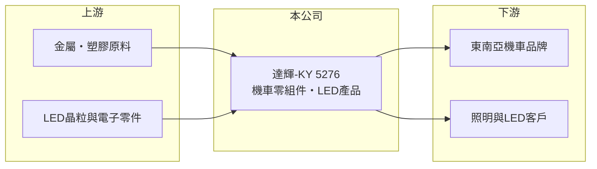

# 5276 達輝-KY

> 上櫃｜[[產業索引-其他業|其他業]]｜上市（櫃）日期 2014/06/12

# 第一章：企業模式與商業藍圖

> [!info] 撰寫說明
> 精簡版，由 Claude 依公開資料整理，架構比照 [[2330台積電]]，資料截至 2026-10-07。來源：nStock 達輝-KY公司簡介、winvest 營收快訊。公開資料有限。#待校對

達輝-KY 是海外註冊的機車零組件與 LED 產品廠，營運重心推估在馬來西亞。

- **核心業務：** 生產與銷售[[機車零組件]]及 LED 產品。
- **營收結構：** 本次未查到兩項產品的營收比重。
- **營運據點：** 子公司分布在英屬維京群島與馬來西亞等地，推估生產基地在馬來西亞。
- **長期方向：** 2026 年營收較 2025 年成長，觀察東南亞機車市場與 LED 照明需求。

# 第二章：護城河深度與競爭優勢

達輝-KY 的競爭基礎在於區域機車供應鏈的客戶關係。

- **競爭優勢：** 機車零組件須通過車廠認證，進入供應鏈後關係較穩定（推估）。
- **主要對手：** 東南亞與台灣的機車零組件廠，以及中國 LED 照明廠（推估）。
- **觀察重點：** 第二季[[營業利益率]]與[[淨利率]]落差大，觀察業外損失的來源。

# 第三章：財務體質與盈利規模

資料日期：2026-10-07，以下數字是撰寫當時的快照；最新月營收、毛利率、累計 EPS 由自動排程寫在本筆記的屬性欄位（月營收、毛利率、累計EPS 等）。#待校對

達輝-KY 營收成長，本業獲利不錯，但第二季受業外拖累。

- **營收規模：** 2025 年全年營收 9.16 億元；2026 年 1 至 8 月累計 6.9 億元，4 月營收 9,403.7 萬元（年增 76.16%），8 月 8,373.8 萬元（年增 7.22%）。
- **獲利：** 2025 年全年 EPS 1.14 元；2026 年上半年累計 EPS 0.5 元；第二季[[毛利率]] 19.15%、營業利益率 11.18%、淨利率 -0.97%。
- **財務特色：** 營業利益為正但淨利為負，推估受匯兌或其他業外損失影響。

# 第四章：總體風險與地緣政治

達輝-KY 的風險在於區域市場集中與匯率。

- **產業週期：** 機車需求受東南亞經濟與消費信貸影響；LED 產品價格競爭激烈。
- **營運風險：** 推估客戶集中於少數機車品牌，車款換代可能影響訂單。
- **其他風險：** 營運以馬來西亞令吉計價、財報以新台幣表達，匯率波動會造成業外損益；[[KY股]]資訊揭露也較有限。

# 專有名詞解析

## 金融

- **[[KY股]]**：在海外註冊、來台第一上市櫃的公司，代號名稱後加註 KY。
- **[[毛利率]]**：毛利除以營收，反映產品或服務本身的獲利能力。
- **[[營業利益率]]**：營業利益除以營收，反映本業扣除營業費用後的獲利能力。
- **[[淨利率]]**：稅後淨利除以營收，包含業外損益與稅負後的最終獲利能力。

## 產業

- **[[機車零組件]]**：機車使用的車體、電裝、燈具等零件，供應給機車品牌組裝。

# 核心供應鏈

- 上游：金屬與塑膠原料、LED 晶粒與電子零件供應商（推估）
- 下游／客戶：東南亞機車品牌、照明產品客戶（推估）
- 同業：東南亞與台灣機車零組件廠、LED 照明廠（本次未查到具體名單）

## 最新新聞
<!-- news:start -->
<!-- news:end -->

## 相關連結
- [公開資訊觀測站](https://mopsov.twse.com.tw/mops/web/t05st03?step=1&firstin=1&co_id=5276)
- [Goodinfo](https://goodinfo.tw/tw/StockDetail.asp?STOCK_ID=5276)
- [Yahoo 股市](https://tw.stock.yahoo.com/quote/5276)
- [鉅亨網新聞](https://www.cnyes.com/twstock/5276/news)
