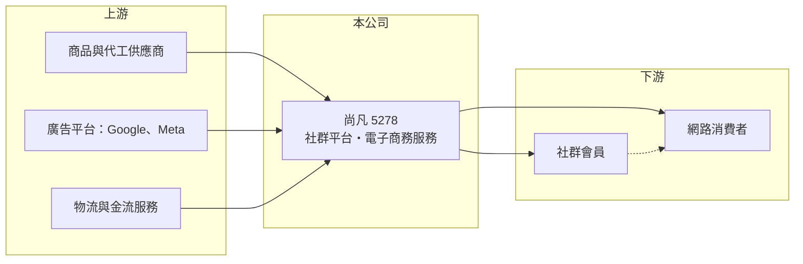

# 5278 尚凡

> 上櫃｜[[產業索引-數位雲端|數位雲端]]｜上市（櫃）日期 2013/06/04

# 第一章：企業模式與商業藍圖

> [!info] 撰寫說明
> 精簡版，由 Claude 依公開資料整理，架構比照 [[2330台積電]]，資料截至 2026-10-08。來源：櫃買中心開放資料（基本資料、資產負債、綜合損益、本益比殖利率、每月營收）、富邦 e 點通（MoneyDJ）公司基本資料、nStock 公司簡介。公開資料有限，電商服務的產品、營運地區與 2024 年以前的年度營收、毛利率未查得。#待校對

本章說明尚凡（5278）從社群交友平台起家，轉向電子商務服務的經營模式。

- **核心業務：** 尚凡國際創新科技成立於 2002 年，2013 年 6 月上櫃，創辦人暨董事長舒雨凡。公司以社群交友網站「愛情公寓」起家，2016 年更名為現在的名稱。依 MoneyDJ 2025 年營收比重，[[電子商務]]服務占 100%，nStock 的公司簡介則列出社群交友網路平台服務等業務，顯示公司把社群經營累積的流量與會員基礎延伸到電商。
- **股本特色：** 尚凡的普通股每股面額為新台幣 1 元，不是一般台股的 10 元，實收資本額約 3 億元、流通股數約 3 億股（依櫃買中心資料推算）。這使每股盈餘、每股淨值與股利的數字看起來比一般公司小，與同業比較時要先換算。
- **營收結構：** 2025 年全年營收約 26.3 億元，2026 年 1 至 8 月累計約 19.1 億元，較前一年同期成長約 19%。2026 年第二季毛利率約 57%，以電商來說屬於高毛利，推估公司銷售的是自有品牌或高附加價值商品與服務，而非低毛利的通路型電商（實際品類未查得）。
- **長期方向：** 社群平台轉型電商的優勢，是能用社群內容與會員數據降低獲客成本；挑戰則是電商競爭激烈、廣告成本持續上升。尚凡的長期價值取決於能否把高毛利維持下去，並把營業利益率從目前的 15% 至 18% 進一步提高。

# 第二章：護城河深度與競爭優勢

本章分析尚凡的競爭條件與限制。

- **競爭優勢：** 長期經營社群平台累積的會員基礎、內容經營與數據分析能力，是一般網路賣家較難複製的資產；高毛利顯示產品或服務有一定的品牌溢價。公司負債比例約 37%，財務體質穩健，有能力持續投入行銷與產品開發。
- **主要對手：** 電商市場的競爭者包括大型平台如 [[8454富邦媒]]、[[8044網家]]，以及大量以社群行銷為主的品牌電商；社群交友領域則面對國際交友 App 的競爭。由於實際銷售品類未查得，直接競爭者難以具體指出。
- **觀察重點：** 第一是營收成長能否延續 2026 年的雙位數成長。第二是合併淨利與歸屬母公司淨利之間的差距，2026 年上半年合併淨利約 2.6 億元，但每股盈餘 0.63 元換算歸屬母公司淨利約 1.9 億元，推估部分獲利屬於子公司的[[非控制權益]]（需校對）。第三是配息水準，近兩年現金股利相較過去大幅下降。

# 第三章：財務體質與盈利規模

資料日期：2026-10-08，表格是撰寫當時的快照；最新月營收、毛利率、累計 EPS 由自動排程寫在本筆記的屬性欄位（月營收、毛利率、累計EPS 等）。#待校對

本章整理尚凡可查得的財務數字，2024 年以前的年度資料未查得。

| 年度 | 營收（新台幣） | [[毛利率]] | [[營業利益率]] | EPS（元） | [[ROE]] |
|---|---|---|---|---|---|
| 2023 | 未查得 | 未查得 | 未查得 | 未查得 | 未查得 |
| 2024 | 未查得 | 未查得 | 未查得 | 未查得 | 未查得 |
| 2025 | 26.3 億 | 未查得 | 未查得 | 1.05 | 約 8.7%（推算） |
| 2026 上半年 | 14.0 億 | 55.7% | 15.3% | 0.63 | 未查得 |

- **營收規模：** 2025 年營收約 26.3 億元；依櫃買中心資料，2026 年上半年營收約 14.0 億元、營業利益約 2.1 億元、合併淨利約 2.6 億元，EPS 0.63 元。由於多年度資料未查得，無法計算長期年複合成長率。
- **獲利：** 2025 年 EPS 1.05 元，以約 3 億股換算歸屬母公司淨利約 3.2 億元，除以 2026 年第二季權益約 36.6 億元，ROE 約 8.7%（推算）。MoneyDJ 所列 2026 年第二季單季 ROE 為 2.6%、稅前淨利率 24.6% 高於營業利益率 18.0%，代表有一定比例的業外收益（推估為利息或投資收益）。
- **財務特色：** 2026 年第二季歸屬母公司權益約 36.6 億元，每股淨值 12.50 元，總負債約 30.7 億元（流動 27.7 億、非流動 3.0 億），MoneyDJ 所列負債比例約 37%。現金股利 2019 至 2023 年度（民國 108 至 112 年）每股 9.29 至 15.58 元，2024 年度 0.80 元、2025 年度 1.22 元；前後落差約十倍，推估與面額由 10 元改為 1 元、股數增加十倍有關（需校對），若換算後配息水準大致延續。
- **[[ROIC]] 與 [[WACC]]：** 以 2026 年上半年營業利益約 2.14 億元年化為 4.3 億元，以稅率 20% 計稅後約 3.4 億元；投入資本以權益約 36.6 億元計，有息負債未查得、假設極少，ROIC 約 9.3%（推算；權益中含現金，實際營運資本報酬應更高）。WACC 以 CAPM 推估：無風險利率 1.75%、市場風險溢酬 6%，MoneyDJ 的 β 為 0.22 不具代表性，改用網路服務股常見值 1.0，股東權益成本約 7.75%；幾乎無有息負債，WACC 約 7.7%（推算）。ROIC 略高於 WACC，代表目前仍在創造價值，但利差不大，獲利率若下滑就可能轉為負利差。

# 第四章：總體風險與地緣政治

本章整理尚凡長期必須面對的風險。

- **產業週期：** 電商消費跟著景氣與消費信心走，高毛利的品牌或非必需商品在景氣下滑時，需求通常降得更快。社群平台的流量也會隨使用者轉向新 App 而流失。
- **營運風險：** 電商業務高度依賴廣告投放與社群流量，Google、Meta 等平台的演算法或廣告費率改變，會直接影響獲客成本。部分獲利屬於子公司少數股東，一般股東的實際報酬可能低於合併數字所呈現。
- **其他風險：** 個人資料保護與網路交易法規趨嚴，增加社群與電商的合規成本；若營運涉及海外市場，匯率與當地法規也是風險；面額 1 元的股本結構，使股利與 EPS 與同業比較時容易被誤讀。

# 專有名詞解析

## 應用

- **[[電子商務]]**：透過網路平台銷售商品，帶動小量多樣的倉儲與宅配需求。

## 金融

- **[[非控制權益]]**：子公司中不屬於母公司持有的股權，合併報表中對應的淨利不計入母公司每股盈餘。
- **[[ROIC]]**：投入資本報酬率，稅後營業利益除以投入資本，衡量本業運用資金創造報酬的能力。
- **[[WACC]]**：加權平均資金成本，股東與債權人要求報酬率的加權平均，ROIC 高於 WACC 才代表創造價值。

# 核心供應鏈

- 上游：商品與代工供應商、[[GOOGL谷歌]] 與 [[META臉書]] 等廣告平台、物流與金流服務（實際合作對象未查得）。
- 下游／客戶：社群平台會員與網路消費者。
- 同業：品牌電商與大型電商平台，例如 [[8454富邦媒]]、[[8044網家]]；社群交友 App 業者。

## 最新新聞
<!-- news:start -->
<!-- news:end -->

## 相關連結
- [公開資訊觀測站](https://mopsov.twse.com.tw/mops/web/t05st03?step=1&firstin=1&co_id=5278)
- [Goodinfo](https://goodinfo.tw/tw/StockDetail.asp?STOCK_ID=5278)
- [Yahoo 股市](https://tw.stock.yahoo.com/quote/5278)
- [鉅亨網新聞](https://www.cnyes.com/twstock/5278/news)
