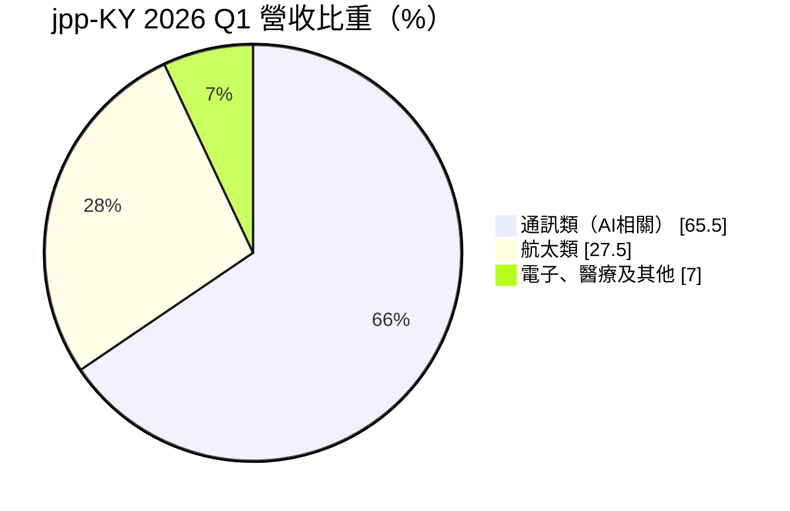
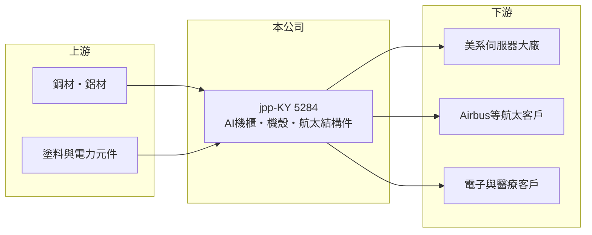

# 5284 jpp-KY

> 上市｜[[產業索引-其他業|其他業]]｜上市（櫃）日期 2017/03/09

# 第一章：企業模式與商業藍圖

> [!info] 撰寫說明
> 精簡版，由 Claude 依公開資料整理，架構比照 [[2330台積電]]，資料截至 2026-10-07。來源：富果研究 2026 年 5 月法說會摘要、winvest 營收快訊。#待校對

jpp-KY 是泰國的金屬鈑金與機殼製造商，近年因 AI 伺服器機櫃需求而快速成長，另有法國航太子公司。

- **核心業務：** 生產通訊與 [[AI伺服器]]用機櫃、機殼與電力系統，以及航太結構件，另有電子與醫療產品。
- **營收結構：** 2026 年第一季通訊類（AI 相關）占 65.5%，其中 AI 機櫃、機殼與電力系統約占總營收 50% 至 55%；航太類 27.5%；電子、醫療及其他 7%。
- **營運據點：** 泰國 JINPAO 為主要生產基地，第一季營收 9.4 億元、員工約 1,600 人；法國 AGILITEAM 負責研發與航太，第一季營收 2.2 億元、員工約 250 人。
- **長期方向：** 採 AI 與航太雙引擎策略，第二座噴烤漆廠第三季投產，並推進 Airbus A350 整機結構件製程認證，預計 2 至 3 年內成為成長動力。

# 第二章：護城河深度與競爭優勢

jpp-KY 的護城河來自美系客戶認證與泰國的[[非紅供應鏈]]產能。

- **競爭優勢：** 核心客戶為美系伺服器大廠，泰國產地符合客戶分散中國產能的需求；航太件需長期認證，進入門檻高。
- **主要對手：** 台灣伺服器機殼與機櫃廠如[[8210勤誠]]，以及鴻海等組裝廠的自製機構件（推估）。
- **觀察重點：** 美系客戶承諾產能 400 台以上機櫃的出貨進度，以及 A350 認證進展。

# 第三章：財務體質與盈利規模

資料日期：2026-10-07，以下數字是撰寫當時的快照；最新月營收、毛利率、累計 EPS 由自動排程寫在本筆記的屬性欄位（月營收、毛利率、累計EPS 等）。#待校對

jpp-KY 2026 年第一季營收與毛利率同步提升。

- **營收規模：** 2026 年第一季營收 11.66 億元，年增 44.67%；8 月營收 3.62 億元，年增 13.17%。
- **獲利：** 2026 年第一季 EPS 4.13 元，[[毛利率]] 37.51%，較去年同期提升 2.7 個百分點。
- **財務特色：** 擴建噴烤漆廠等產能需持續資本支出，AI 業務占比提高帶動毛利率上升。

# 第四章：總體風險與地緣政治

jpp-KY 的風險在於客戶集中與 AI 資本支出循環。

- **產業週期：** AI 機櫃需求跟隨雲端業者資本支出，景氣反轉時訂單可能快速下滑，存在[[長鞭效應]]。
- **營運風險：** 營收高度集中於美系伺服器大廠，客戶轉單或平台更替影響大。
- **其他風險：** 營運以泰銖與歐元計價，匯率波動影響損益；美國關稅政策也可能影響出貨成本。

# 專有名詞解析

## 應用

- **[[AI伺服器]]**：搭載 GPU 或 AI 加速器、用於訓練與推論 AI 模型的伺服器，功耗遠高於一般伺服器。

## 金融

- **[[毛利率]]**：毛利除以營收，反映產品或服務本身的獲利能力。
- **[[長鞭效應]]**：終端需求的小幅變動，沿供應鏈往上游傳遞時被逐級放大，造成上游庫存與訂單劇烈波動。

## 產業

- **[[非紅供應鏈]]**：生產據點設在中國以外的供應鏈，用來分散地緣政治與關稅風險。

# 核心供應鏈

- 上游：鋼材、鋁材、塗料與電力元件供應商（推估）
- 下游／客戶：美系伺服器大廠、Airbus 等航太供應鏈、電子與醫療客戶
- 同業：[[8210勤誠]]等伺服器機殼廠（推估）

## 最新新聞
<!-- news:start -->
<!-- news:end -->

## 相關連結
- [公開資訊觀測站](https://mopsov.twse.com.tw/mops/web/t05st03?step=1&firstin=1&co_id=5284)
- [Goodinfo](https://goodinfo.tw/tw/StockDetail.asp?STOCK_ID=5284)
- [Yahoo 股市](https://tw.stock.yahoo.com/quote/5284)
- [鉅亨網新聞](https://www.cnyes.com/twstock/5284/news)
