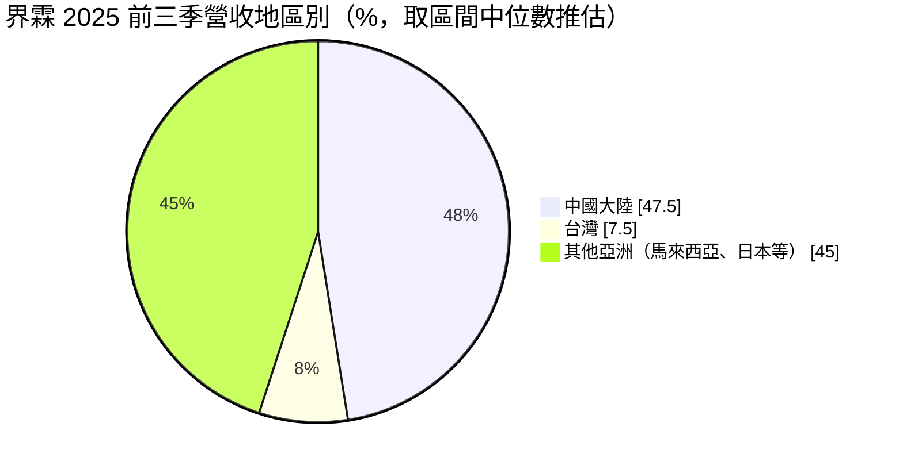
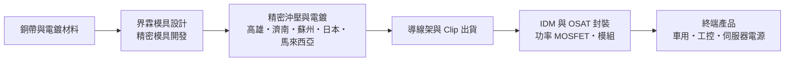
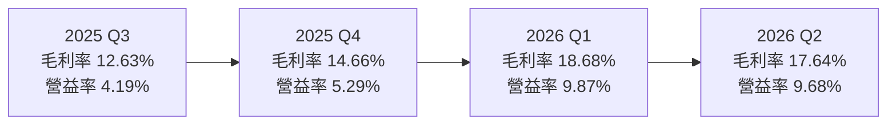
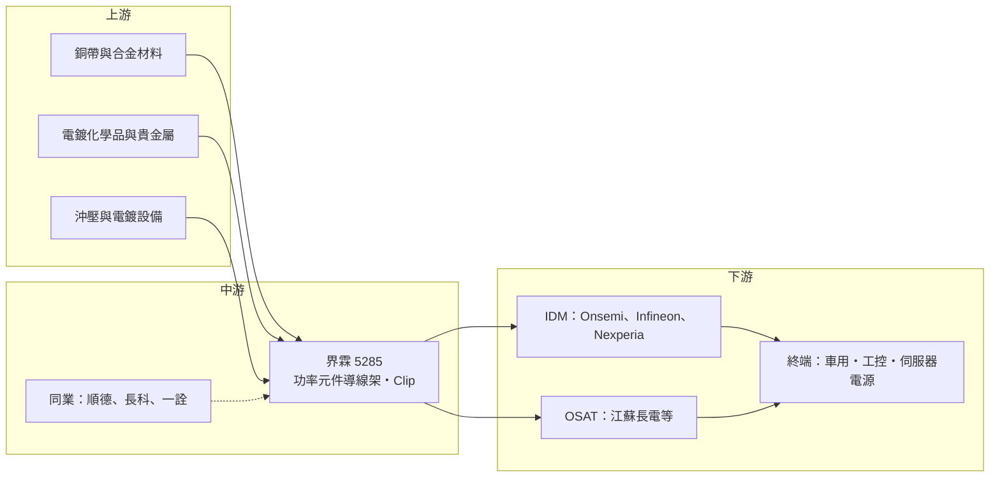

# 5285 界霖

> 上市｜[[產業索引-半導體業|半導體業]]｜上市（櫃）日期 2014/02/25

# 第一章：企業模式與商業藍圖

> [!info] 撰寫說明
> 本文由 Claude 依公開資料整理，架構比照 [[2330台積電]] 的四章研究，資料截至 2026-10-08。財務數字來源：HiStock 嗨投資（歷年每股盈餘、季度利潤比率、季度報酬率、月營收）、櫃買中心與證交所 OpenAPI（2026 年上半年損益與資產負債、股利）、富果研究 2025 年 11 月法說會整理、nstock 公司資料頁；產業描述為整理性內容，尚未逐條比對原始文件。#待校對

在評估單一個股的長期投資價值時，首要步驟是拆解企業的底層獲利邏輯。本章針對界霖科技（股票代號：5285，以下簡稱界霖）的商業模式進行定性分析，說明一家從模具起家的導線架廠，如何把自己嵌進國際功率半導體大廠的封裝流程，以及這個位置的獲利天花板在哪裡。

## 一、核心定位：功率元件導線架的專業供應商

界霖成立於 2000 年，總部位於高雄楠梓，2014 年上市。公司的主要營業項目是模具製造與半導體[[導線架]]的製造銷售。導線架是晶片封裝時用來承載晶粒、並把晶片訊號與電流引出到電路板的金屬骨架，材料以銅為主。界霖的產品集中在高功率電晶體與功率 IC 使用的導線架，這類產品要承受大電流與高溫，對銅材厚度、沖壓精度與電鍍品質的要求，比一般消費性 IC 的導線架高。

界霖在產業鏈中屬於「上游材料供應商」。它不設計晶片，也不做封裝，而是把導線架賣給負責封裝的 [[IDM]] 大廠與專業封測代工廠（[[OSAT]]）。這個位置的特點是：單一產品的金額不高，但一旦被客戶寫進封裝製程的物料清單，就很少輕易更換，因為更換導線架供應商需要重新做可靠度驗證。

界霖的核心技術是精密模具開發與精密沖壓，並在此基礎上發展電鍍與表面處理能力。導線架的生產方式主要有沖壓與蝕刻兩種，沖壓適合大量、外形相對簡單、厚度較厚的功率元件導線架，正好是界霖所專注的領域。公司自行開發模具，代表它能較快配合客戶的新封裝外型開模，這是一般只做加工的同業較難做到的。

## 二、終端應用板塊：車用與工控為主

依 2025 年 11 月法說會整理，2025 年前三季界霖的營收以車用電子為最大宗，約占五成；工業控制為第二大應用，伺服器相關比重持續增加；消費性電子的成長力道相對較弱。地區別方面，台灣內銷約占 5% 至 10%，中國大陸約占 45% 至 50%，其餘為馬來西亞、日本等亞洲其他地區。公司未揭露完整的應用別百分比，因此以下圓餅圖只呈現已知的地區別結構（取區間中位數，屬推估）。

* **車用電子：** 電動車與油電車的逆變器、車載充電器、電池管理與各種馬達控制都大量使用功率 [[MOSFET]] 與功率模組，這些元件的封裝需要厚銅、高散熱的導線架。車用是界霖最重要的需求來源，也是長期成長的主軸，因為每輛車使用的功率元件數量隨電動化而增加。
* **工業控制與伺服器：** 工業馬達、變頻器、電源供應器與 AI 伺服器的電源架構同樣仰賴功率元件。伺服器電源功率密度持續提高，帶動對大電流封裝的需求，這是界霖近年比重上升的板塊。
* **消費性電子：** 家電、PC 電源等應用的導線架價格競爭較激烈，界霖在這一塊的成長較慢，也不是公司刻意擴張的方向。

在產品別上，公司的重點產品為模組（Module）與嵌合式導線架（[[Clip]]）。Clip 是用一片銅片直接連接晶片表面與導線架，取代傳統的細金屬線，可以降低電阻、提升散熱，是功率元件封裝提升效率的重要技術。界霖的馬來西亞廠專精 Clip 產品的生產。

## 三、資本轉化邏輯：模具加沖壓的製造服務

界霖的獲利模式可以用「接單生產、按片計價」來理解。客戶提出新封裝外型後，界霖先開發模具，通過客戶驗證後進入量產，之後依出貨量收費。這種模式有三個財務特性。

* **材料成本占比高：** 導線架的主要原料是銅，銅價波動會直接影響成本。業界通常會用報價調整機制把部分銅價轉嫁給客戶，但轉嫁有時間落差，因此銅價急漲的期間毛利率往往被壓縮。2025 年法說會即提到人工與材料成本上漲讓毛利較前一年微幅減少。
* **固定資產投入適中：** 沖壓與電鍍設備的資本支出遠低於晶圓廠。2025 年前三季資本支出約 1.1 億元，全年預計約 1.5 億元，主要用於產線優化與自動化，相對於 50 億元以上的年營收規模並不沉重。
* **多據點供貨：** 生產據點分布在台灣高雄、中國濟南與蘇州、日本與馬來西亞。公司的目標是讓單一產品至少能由兩個據點供貨，讓客戶在地緣政治或天災時有替代產地，這也是國際 IDM 選擇供應商時越來越看重的條件。

## 四、企業長期藍圖：跟著功率半導體升級

界霖的長期方向是以模具製造為基礎，與國際 IDM 共同開發高階製程，強化電鍍與沖壓能力。近年國際 IDM 增加委外封裝，中國的專業封測廠也成為主要客戶，代表界霖的客戶結構從過去以歐、美、日 IDM 為主，逐漸擴大到 OSAT。在中國市場，公司選擇與當地同業策略合作，而不是全面打價格戰。

長期來看，界霖的成長取決於三件事：第一，電動車與 AI 伺服器電源帶動的功率元件需求能否持續成長；第二，Clip 與模組等高附加價值產品的比重能否提高；第三，[[SiC]] 與 [[GaN]] 等寬能隙功率元件普及後，界霖能否開發出對應的封裝材料。這三點決定公司能否從一般導線架廠，升級為功率封裝的關鍵材料夥伴。

# 第二章：護城河深度與競爭優勢

在長期價值投資中，「護城河」指企業抵禦競爭、維持超額利潤的保護機制。本章分析界霖的護城河構成、主要競爭對手，以及這些優勢在材料成本上升與中國同業競爭下能守住多少。

## 一、界霖護城河的核心組成要素

界霖的護城河屬於「窄護城河」，來源是客戶驗證與製造經驗，而不是專利或品牌。

* **1. 客戶驗證與轉換成本：** 功率元件尤其是車用元件，封裝材料一旦通過客戶與車廠的[[車規驗證]]，更換供應商就要重新跑可靠度測試，時間與成本都高。因此界霖與 Onsemi、Infineon、Nexperia 等國際大廠的長期合作，本身就是一道門檻。這也解釋了為什麼車用比重較高的導線架廠，訂單通常比消費性導線架穩定。
* **2. 自製模具的開發速度：** 導線架的外型由模具決定，能自行設計與維修模具，代表新產品從開模到量產的時間較短，也能依客戶需求小幅修改設計。對於需要頻繁推出新封裝外型的功率元件客戶而言，這種配合度很重要。
* **3. 多國生產布局：** 台灣、中國、日本與馬來西亞的據點讓界霖能就近服務不同地區的封裝廠，並提供「同一產品兩地供貨」的選項。在供應鏈分散化的趨勢下，這種布局有助於留住國際客戶。

這些優勢的限制也很明顯。導線架本身是標準化程度相對高的產品，技術差異不如晶片設計大，價格最終仍受同業競爭影響。界霖近年毛利率多落在 12% 至 19% 之間，說明它的定價能力有限，比較像是「穩定但不暴利」的製造服務業。

## 二、全球主要競爭對手格局

| 對手 | 定位 | 對界霖的威脅 |
|---|---|---|
| [[2351順德]] | 台灣導線架大廠，產品涵蓋 IC 與功率元件 | 在台灣與中國的功率元件導線架直接競爭 |
| [[6548長科]] | 台灣導線架大廠，以蝕刻導線架與 IC 封裝為主 | 產品線較偏 IC，與界霖部分重疊 |
| [[2486一詮]] | 台灣導線架與 LED 支架廠 | 規模較小，在部分功率元件市場競爭 |
| 日本與新加坡大廠（三井高科技、新光電氣、ASMPT 材料事業等） | 國際導線架領導廠，技術與客戶基礎深厚 | 在高階車用與 IDM 客戶上的主要對手 |
| 中國本土導線架廠 | 受惠中國封測產業擴張，價格較低 | 壓低中國市場報價，是界霖中國業務最大的價格壓力 |

## 三、優勢轉化：哪些市場守得住、哪些守不住

* **守得住：** 已通過驗證的國際 IDM 車用與工控訂單。這些客戶看重可靠度與交期，價格敏感度較低，而且轉換供應商的成本高，界霖只要維持品質與交期，訂單就相對穩定。Clip 與模組等需要較高沖壓與電鍍能力的產品，也是較能維持毛利的領域。
* **守不住：** 中國市場的一般功率元件導線架。中國本土封測廠擴張很快，本土導線架供應商也跟著成長，在價格上更有彈性。界霖選擇與當地同業合作而非全面競爭，本身就說明這一塊很難靠單打獨鬥守住。
* **觀察重點：** 第一是車用與伺服器的營收占比能否繼續提高；第二是 Clip 與模組產品的比重；第三是毛利率能否穩定站在 15% 以上。2026 年上半年毛利率回升到約 18%，若能維持，代表產品組合升級確實發揮作用。

# 第三章：財務體質與盈利規模

資料日期：2026-10-08。數字取自 HiStock 嗨投資歷年財報頁、櫃買中心與證交所 OpenAPI 及富果研究法說會整理，表格是撰寫當時的快照；最新月營收、毛利率、累計 EPS 由自動排程寫在本筆記的屬性欄位（月營收、毛利率、累計EPS 等）。#待校對

財務報表是檢驗護城河是否真實存在的最終標準。本章用三率、ROE、現金流與資本報酬，檢視界霖在功率半導體週期中的獲利品質。

## 一、獲利能力的基石：三率

下表的年度毛利率、營業利益率與 ROE 是用 HiStock 的四季數字推算（毛利率與營業利益率取四季平均，ROE 取四季單季 ROE 加總），與公司年報的年度數字可能有小幅差異。

| 年度 | 營收（新台幣） | [[毛利率]] | [[營業利益率]] | EPS（元） | [[ROE]] |
|---|---|---|---|---|---|
| 2021 | 未查得 | 約 17.7%（推算） | 約 9.7%（推算） | 4.82 | 約 18.9%（推算） |
| 2022 | 62.74 億 | 約 15.0%（推算） | 約 6.9%（推算） | 4.08 | 約 14.1%（推算） |
| 2023 | 51.32 億 | 約 14.0%（推算） | 約 4.4%（推算） | 1.75 | 約 6.3%（推算） |
| 2024 | 50.27 億 | 約 13.8%（推算） | 約 4.3%（推算） | 2.52 | 約 9.0%（推算） |
| 2025 | 53.48 億 | 約 13.3%（推算） | 約 4.4%（推算） | 1.53 | 約 5.5%（推算） |
| 2026 上半年 | 29.82 億 | 18.11% | 9.77% | 2.01 | 約 6.9%（兩季加總，未年化） |

* **[[毛利率]]：** 2021 年單季毛利率最高接近 20%，之後隨 2022 下半年起的半導體庫存調整一路降到 12% 至 15% 的區間，2025 年仍在低檔。2026 年上半年回升到約 18%，主因是營收成長帶來的產能利用率提升與產品組合改善。導線架廠的毛利率對稼動率很敏感，因為沖壓與電鍍產線的折舊與人力是相對固定的成本。
* **[[營業利益率]]：** 2023 至 2025 年營業利益率都在 4% 左右，2026 年上半年回到接近 10%。營業費用規模相對穩定，所以毛利率每提高幾個百分點，營業利益率就同步明顯改善，這是典型的[[營運槓桿]]。
* **業外與匯率：** 界霖的營收以外幣計價比重高，匯兌損益會讓稅後淨利與營業利益出現落差。例如 2025 年第二季營業利益率 4.30%，稅後淨利率只有 0.21%；2024 年第四季則反過來，營業利益率 3.59%、稅後淨利率 7.04%。評估本業時應以營業利益為準。

**長期指標：** 2022 至 2025 年營收從 62.74 億元降到 53.48 億元，三年營收年複合成長率約 -5.2%（推算），反映 2022 年的高基期與之後的庫存調整。近五年（2021 至 2025）推算 ROE 平均約 10.8%，但趨勢由近 19% 下滑到 5% 至 9%。

## 二、[[ROE]]：資本效率

界霖的 ROE 在 2021 至 2022 年景氣高峰期間接近或超過 15%，2023 年以後落到 5% 至 9%。主要原因是毛利率下滑，而不是財務槓桿改變：依法說會資料，公司負債比率近三年維持在 43% 至 46%，流動比率約 304%，財務結構穩健。換句話說，界霖的 ROE 高低幾乎完全由功率半導體景氣與銅價決定，股東權益本身沒有大幅擴張或縮水。

## 三、資本支出與自由現金流

* **[[CapEx]]：** 2025 年全年資本支出預計約 1.5 億元，以產線優化與自動化為主。相對於年營收 50 億元以上、年折舊規模，這屬於維持性與小幅升級的投資，沒有大型擴廠計畫。
* **[[自由現金流]]：** 在資本支出偏低的情況下，營業現金流大致足以支應投資與配息（推估，未查得逐年現金流數字）。
* **股利政策：** 依 nstock 資料，近五年平均現金股利約 2.6 元。2024 年度配發 2 元，現金配發率約 79%；2025 年度配發 1.5 元，其中 0.6 元來自盈餘、0.9 元來自資本公積（證交所股利資料），代表在 2025 年 EPS 只有 1.53 元的情況下，公司仍動用資本公積維持股利水準。這反映經營層重視穩定配息，但也說明股利要長期維持，需要獲利回到較高水準。

## 四、[[ROIC]] 與 [[WACC]]：價值創造利差

**ROIC（推算）：** 以 2026 年上半年營業利益 2.91 億元年化為 5.83 億元，乘以（1－20% 稅率）得稅後營業利益約 4.66 億元；投入資本以 2026 年 6 月底權益總計 30.83 億元加非流動負債 13.66 億元（作為有息負債的近似值，實際有息負債未查得）合計約 44.49 億元。ROIC 約 10.5%（推算）。若用 2025 年全年推算，營業利益率約 4.4%、營業利益約 2.35 億元，稅後約 1.88 億元，ROIC 只有約 4% 至 5%（推算）。

**WACC（推算）：** 以 CAPM 估算股東權益成本：無風險利率取台灣 10 年期公債約 1.75%，市場風險溢酬 6%，β 取電子零組件同業常見值 1.0（非來源數字），股東權益成本約 7.75%。負債成本假設 2.5%，稅後約 2.0%；資本結構假設負債占 20%、權益占 80%。WACC 約 0.8×7.75%＋0.2×2.0%＝6.6%（推算）。

**解讀：** 界霖的 ROIC 在景氣高峰時（2021 至 2022 年）明顯高於 WACC，在 2023 至 2025 年的低谷期則低於或接近 WACC，2026 年上半年回到 WACC 之上。這代表界霖不是一家「隨時都在創造價值」的公司，而是在功率半導體景氣好、產能利用率高時創造價值，景氣差時只能勉強打平資金成本。長期投資人要看的是：產品組合升級後，景氣低谷時的 ROIC 能否不再跌破資金成本。

# 第四章：總體風險與地緣政治

任何企業都無法脫離宏觀環境獨立存在。本章分析界霖未來必須面對的地緣政治、產業週期與營運風險。

## 一、地緣政治風險

* **中國營收占比高：** 中國大陸約占營收四成五到五成，生產據點也包括濟南與蘇州。若美中關係惡化、中國推動封裝材料國產化，或兩岸關係緊張影響貨物往來，界霖在中國的業務會直接受衝擊。
* **客戶的「中國以外」要求：** 反過來看，國際 IDM 要求供應鏈分散到中國以外，界霖的馬來西亞、日本與台灣據點有機會承接移轉訂單。地緣政治對界霖是風險也是機會，關鍵在於它能否把非中國產能做大。
* **關稅：** 導線架本身多半出貨到亞洲封裝廠，受美國關稅直接影響有限，但終端車用與工控產品若被課徵關稅，需求下降會間接傳導到上游。

## 二、產業週期與市場結構風險

* **功率半導體庫存週期：** 2022 年下半年起，功率元件客戶進入長達數年的庫存調整，界霖的營收從 2022 年的 62.74 億元降到 2023 年的 51.32 億元。功率元件的需求同時受車用、工控與消費電子影響，任何一個領域轉弱，都會透過[[長鞭效應]]放大到導線架訂單。
* **電動車滲透速度：** 車用占營收約五成，電動車銷售若放緩，或車廠延後新車款，對界霖的影響比其他應用更大。
* **中國產能過剩：** 中國功率半導體與封測產業快速擴張，本土材料商也跟著擴產，若供過於求，價格壓力會持續存在。

## 三、營運環境的隱性風險

* **銅價與電鍍材料成本：** 銅是導線架最主要的原料，電鍍則會用到銀、鎳等金屬。原料價格急漲時，報價調整往往落後，會壓縮毛利率。
* **匯率：** 營收以外幣為主，新台幣升值會降低以台幣計價的營收與毛利，匯兌損益也讓季度淨利波動加大。
* **人力成本與環保：** 沖壓與電鍍屬於勞力與化學品密集的製程，各國工資上漲與電鍍廢水法規趨嚴，都會墊高營運成本。

## 四、科技演進風險

功率元件正從傳統矽元件逐步轉向 [[SiC]] 與 [[GaN]] 等寬能隙材料，封裝方式也從打線轉向 Clip、銅燒結與雙面散熱模組。這些變化對導線架的材料、厚度與表面處理提出新要求。若界霖能跟上這些新封裝形式，產品單價與毛利有機會提升；若無法跟上，傳統導線架的市場可能被新式封裝材料取代。另一個長期觀察點是基板型封裝的普及，部分高階功率模組改用陶瓷基板或嵌入式封裝，可能減少對傳統導線架的需求。

# 專有名詞解析

## 半導體

- **[[OSAT]]**：專業封裝測試代工廠，替其他公司封裝與測試晶片，例如日月光、江蘇長電。
- **[[IDM]]**：整合元件製造廠，從設計、製造到封裝都自己做的半導體公司，例如英飛凌、安森美。
- **[[MOSFET]]**：金屬氧化物半導體場效電晶體，最常見的功率開關元件，用於電源轉換與馬達控制。
- **[[SiC]]**：碳化矽，一種寬能隙半導體材料，耐高壓高溫，用於電動車逆變器與充電設備。
- **[[GaN]]**：氮化鎵，一種寬能隙半導體材料，切換速度快，用於快充與伺服器電源。

## 應用

- **[[車規驗證]]**：車用零件須通過 AEC-Q 系列可靠度測試與車廠認證，流程常需 1 至 3 年，因此轉換成本高。

## 金融

- **[[營運槓桿]]**：固定成本占比高的企業，營收增加時利潤增加的幅度會大於營收成長幅度。
- **[[毛利率]]**：營業毛利除以營收，反映產品扣除直接成本後的獲利空間。
- **[[長鞭效應]]**：終端需求的小幅變動，沿供應鏈往上游傳遞時被逐級放大，造成上游庫存與訂單劇烈波動。

## 產業

- **[[導線架]]**：晶片封裝時承載晶粒、並把訊號與電流引出到電路板的金屬框架，功率元件多用厚銅導線架以利散熱。
- **[[精密模具]]**：用來沖壓或成型金屬零件的高精度模具，導線架的外型與精度主要由模具決定。
- **[[Clip]]**：以整片銅片直接連接晶片與導線架，取代細金屬線打線，可降低電阻並提升散熱，常用於功率元件封裝。

# 核心供應鏈

## 1. 上游：原料與設備
- 銅帶與銅合金材料：主要供應商名稱未查得
- 電鍍化學品與銀、鎳等貴金屬材料：供應商名稱未查得
- 精密沖壓與電鍍設備：界霖自行開發模具

## 2. 中游：界霖本身與同業
- 功率元件導線架、Clip 與模組：界霖（高雄、濟南、蘇州、日本、馬來西亞）
- 台灣同業：[[2351順德]]、[[6548長科]]、[[2486一詮]]

## 3. 下游：功率元件 IDM 客戶
- 國際 IDM：Onsemi（安森美）、Infineon（英飛凌）、Nexperia（安世半導體）

## 4. 下游：封測代工與終端
- 中國專業封測廠：江蘇長電
- 終端應用：電動車、工業控制、伺服器電源

## 最新新聞
<!-- news:start -->
<!-- news:end -->

## 相關連結
- [公開資訊觀測站](https://mopsov.twse.com.tw/mops/web/t05st03?step=1&firstin=1&co_id=5285)
- [Goodinfo](https://goodinfo.tw/tw/StockDetail.asp?STOCK_ID=5285)
- [Yahoo 股市](https://tw.stock.yahoo.com/quote/5285)
- [鉅亨網新聞](https://www.cnyes.com/twstock/5285/news)
