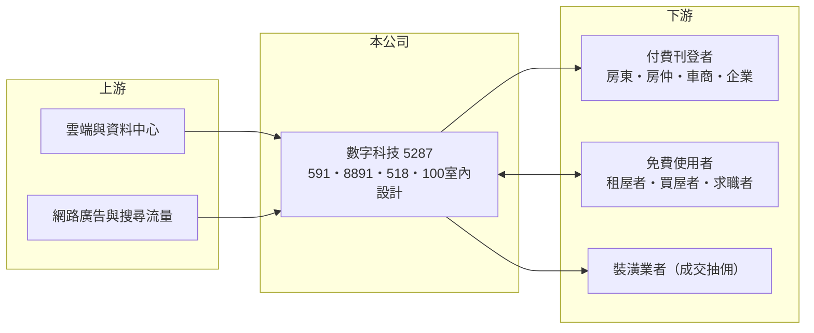

# 5287 數字

> 上櫃｜[[產業索引-數位雲端|數位雲端]]｜上市（櫃）日期 2014/01/20

# 第一章：企業模式與商業藍圖

> [!info] 撰寫說明
> 精簡版，由 Claude 依公開資料整理，架構比照 [[2330台積電]]，資料截至 2026-10-08。來源：櫃買中心開放資料（基本資料、資產負債、綜合損益、本益比殖利率、每月營收）、Goodinfo 年度經營績效、富邦 e 點通（MoneyDJ）公司基本資料。旗下網站名稱（591、8891、518 熊班、100 室內設計）為整理性內容，各網站營收占比未查得。#待校對

本章說明數字科技（5287）如何以多個垂直[[分類資訊平台]]，向刊登者收取廣告與服務費的商業模式。

- **核心業務：** 數字科技成立於 2007 年，2014 年上櫃，董事長廖世芳，實收資本額約 6.0 億元。公司經營多個垂直領域的網路平台，最主要的是租屋與房屋買賣的「591 房屋交易網」，另有汽車交易的「8891」、求職的「518 熊班」與裝潢媒合的「100 室內設計」等。依 MoneyDJ 2025 年營收比重，網路服務占 85.1%，平台佣金占 14.9%。
- **商業模式：** 平台向房東、房仲、車商與企業收取刊登與曝光費用，租屋者、買屋者與求職者則免費使用，屬於[[雙邊平台]]。刊登費多半是小額、高頻、預先付款，客戶數量龐大而分散，單一客戶流失對營收影響很小，這讓營收非常穩定。
- **營收結構：** 網路服務是刊登與加值曝光收入，平台佣金則是媒合成交後依比例收取的費用（推估主要來自裝潢媒合等服務）。2020 至 2025 年營收從 15.4 億元成長到 23.2 億元，毛利率維持在 69% 至 78%。
- **長期方向：** 591 在台灣租屋與房屋資訊市場已具領導地位，長期成長來自兩個方向：一是提高每位刊登者的付費金額（加值曝光、數據工具），二是把同樣的平台模式複製到汽車、求職、裝潢等其他垂直領域，從「刊登收費」延伸到「成交抽佣」。

# 第二章：護城河深度與競爭優勢

本章分析數字科技的護城河與競爭者。

- **競爭優勢：** 第一是[[網路效應]]，591 擁有最多的物件與瀏覽者，房東與房仲為了曝光必須刊登，租屋者為了找到物件必須使用，新平台很難突破。第二是品牌與搜尋習慣，「591」已成為找房子的代名詞。第三是輕資產，平台不需要持有房屋或車輛，獲利主要被人力與系統成本消耗，因此營業利益率長期維持在 39% 至 47%。
- **主要對手：** 房屋資訊領域有樂屋網、好房網、信義房屋與永慶房屋等仲介自有平台；汽車有各大二手車平台；求職有 [[3130一零四]]、1111 人力銀行；裝潢則有多個設計媒合網站。在房屋領域，數字的地位最穩固；在其他領域則多半是追趕者。
- **觀察重點：** 第一是 591 刊登費的調價能力，這反映平台的定價權。第二是汽車、求職與裝潢等新平台能否成為第二成長引擎。第三是業外收益的來源與穩定性，2026 年第二季稅前淨利率 56% 遠高於營業利益率 38%，獲利中有相當比例來自本業以外。

# 第三章：財務體質與盈利規模

資料日期：2026-10-08，表格是撰寫當時的快照；最新月營收、毛利率、累計 EPS 由自動排程寫在本筆記的屬性欄位（月營收、毛利率、累計EPS 等）。#待校對

本章用六年數字檢視數字科技平台模式的獲利品質與股東回報。

| 年度 | 營收（新台幣） | [[毛利率]] | [[營業利益率]] | EPS（元） | [[ROE]] |
|---|---|---|---|---|---|
| 2020 | 15.4 億 | 77.6% | 46.9% | 14.74 | 34.5% |
| 2021 | 16.8 億 | 73.3% | 42.0% | 12.13 | 31.7% |
| 2022 | 19.6 億 | 70.6% | 38.7% | 13.12 | 33.7% |
| 2023 | 21.5 億 | 69.9% | 38.8% | 12.74 | 35.8% |
| 2024 | 22.6 億 | 69.7% | 38.6% | 12.67 | 34.6% |
| 2025 | 23.2 億 | 69.2% | 39.9% | 13.93 | 34.2% |

- **營收規模：** 2020 至 2025 年營收年複合成長率約 8.5%（推算）。依櫃買中心資料，2026 年上半年營收約 11.4 億元、營業利益約 4.4 億元、合併淨利約 4.6 億元、EPS 7.68 元；1 至 8 月累計營收與前一年同期大致持平（約 -1.3%）。
- **獲利：** 近五年（2021 至 2025）平均 ROE 約 34.0%（推算），是台股中少數長期維持 3 成以上 ROE 的公司。毛利率從 2020 年的 77.6% 緩步降到 69% 左右，推估與新平台投入、人力成本上升有關，但營業利益率仍穩定在 4 成上下。
- **財務特色：** 2026 年第二季歸屬母公司權益約 27.8 億元，每股淨值 46.07 元，總負債約 18.2 億元（流動 13.2 億、非流動 5.0 億），MoneyDJ 所列負債比例約 39%，以預收刊登費等合約負債為主（推估）。依櫃買中心資料，最近年度現金股利約每股 11.15 元，以 2025 年 EPS 13.93 元計算[[配息率]]約 80%（推算），Goodinfo 統計平均現金股利約 11.51 元，公司並已改為半年配息。資產負債表上股本約 6.57 億元，高於基本資料的實收資本額 6.03 億元，推估有待登記的配股或增資（需校對）。
- **[[ROIC]] 與 [[WACC]]：** 2025 年營業利益約 9.3 億元（23.2 億 × 39.9%），以稅率 20% 計稅後約 7.4 億元；投入資本以股東權益約 27.8 億元計，有息負債未查得、依商業模式假設為零，ROIC 約 27%（推算；權益中含現金與投資，扣除後的營運資本報酬更高）。WACC 以 CAPM 推估：無風險利率 1.75%、市場風險溢酬 6%，MoneyDJ 的 β 為 0.11 不具代表性，改用網路服務股常見值 0.8，股東權益成本約 6.55%；無有息負債，WACC 約 6.5%（推算）。ROIC 長期高出 WACC 約 20 個百分點，是以輕資產平台持續創造價值的典型。

# 第四章：總體風險與地緣政治

本章整理數字科技長期必須面對的風險。

- **產業週期：** 房屋買賣刊登量跟著房市景氣走，[[信用管制]]或利率上升導致交易量下滑時，房仲與屋主的刊登需求會減少；不過租屋需求相對穩定，可以部分抵銷買賣市場的波動。
- **營運風險：** 營收高度集中在 591，若主要房仲品牌轉向自有平台，或新型態平台（例如社群租屋、人工智慧搜尋）改變使用者習慣，網路效應可能被削弱。新平台的投入若長期無法獲利，會拉低整體利潤率。
- **其他風險：** 租屋與房屋資訊的真實性涉及消費者保護與詐騙防制法規，政府可能要求平台承擔更多審核責任；個資保護法規趨嚴會增加合規成本；高配息政策使公司保留盈餘有限，大型併購需要另行籌資。

# 專有名詞解析

## 金融

- **[[信用管制]]**：央行限制房貸成數、寬限期與土建融條件的政策，用來抑制房市過熱。
- **[[配息率]]**：現金股利占每股盈餘的比例，反映公司把多少獲利發還股東。
- **[[ROIC]]**：投入資本報酬率，稅後營業利益除以投入資本，衡量本業運用資金創造報酬的能力。
- **[[WACC]]**：加權平均資金成本，股東與債權人要求報酬率的加權平均，ROIC 高於 WACC 才代表創造價值。

## 產業

- **[[分類資訊平台]]**：依房屋、汽車、求職等類別讓使用者刊登與搜尋資訊的網站，主要向刊登者收費。
- **[[雙邊平台]]**：同時服務兩群使用者（例如乘客與司機）的平台，一邊使用者增加會吸引另一邊加入。
- **[[網路效應]]**：使用者越多、服務對每位使用者越有價值的現象，是平台型企業最主要的護城河。

# 核心供應鏈

- 上游：雲端與資料中心服務，以及 [[GOOGL谷歌]]、[[META臉書]] 等網路廣告與搜尋流量來源。
- 下游／客戶：付費刊登的房東、房仲、車商與徵才企業，以及透過平台媒合成交的裝潢業者；租屋者、買屋者與求職者免費使用。
- 同業：樂屋網、好房網等房屋資訊平台，[[3130一零四]] 等求職平台，以及各類二手車與裝潢媒合平台。

## 最新新聞
<!-- news:start -->
<!-- news:end -->

## 相關連結
- [公開資訊觀測站](https://mopsov.twse.com.tw/mops/web/t05st03?step=1&firstin=1&co_id=5287)
- [Goodinfo](https://goodinfo.tw/tw/StockDetail.asp?STOCK_ID=5287)
- [Yahoo 股市](https://tw.stock.yahoo.com/quote/5287)
- [鉅亨網新聞](https://www.cnyes.com/twstock/5287/news)
