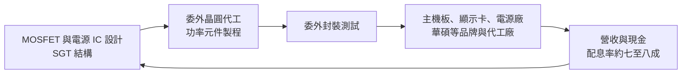
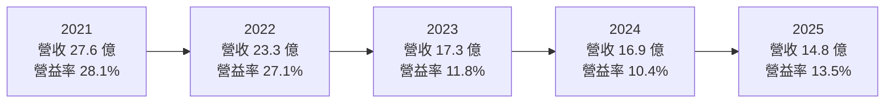
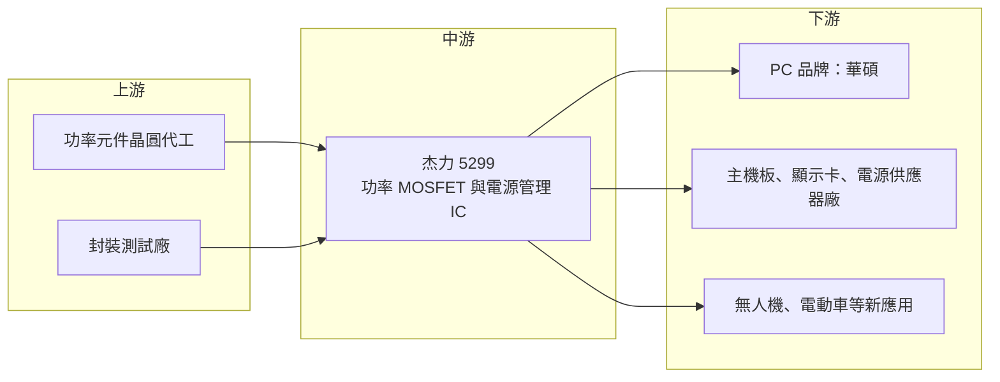

# 5299 杰力

> 上櫃｜[[產業索引-半導體業|半導體業]]｜上市（櫃）日期 2018/01/23

# 第一章：企業模式與商業藍圖

> [!info] 撰寫說明
> 本文由 Claude 依公開資料整理，架構比照 [[2330台積電]] 的四章研究，資料截至 2026-10-08。財務數字來源：Goodinfo 年度經營績效、股利政策與基本資料頁，科技新報（2017 年）、工商時報（2022、2023 年）、財訊 MOSFET 族群報導；產業描述為整理性內容，尚未逐條比對原始文件。#待校對

在評估單一個股的長期投資價值時，首要步驟是拆解企業的底層獲利邏輯。本章針對杰力科技（股票代號：5299，以下簡稱杰力）的商業模式進行定性分析，說明一家以華碩為重要股東的 [[MOSFET]] 設計公司，如何在 PC 與主機板供應鏈中建立地位，以及它面臨的成長瓶頸。

## 一、核心定位：PC 供應鏈裡的功率開關供應商

杰力成立於 2008 年，總部位於新竹，英文簡稱 EMC，2012 年登錄興櫃、2018 年 1 月在櫃買中心掛牌。董事長李啟隆曾任尼克森 MOSFET 團隊總經理，總經理吳嘉連主導研發，多數高階主管來自尼克森的 MOSFET 團隊。依 2017 年科技新報報導，尼克森過去供應華碩約八成的 MOSFET，團隊出走成立杰力後，[[2357華碩]] 成為杰力的大股東，持股約兩成；公開說明書也列出美國上市的萬國半導體（Alpha and Omega）持股約一成。

杰力的產品是功率 MOSFET，也就是電子設備中負責「開關電流」的元件。每一片主機板、顯示卡、電源供應器上，都有數十顆 MOSFET 負責把電源轉換成處理器與記憶體需要的電壓。杰力的定位有兩個特點：

* **與品牌大廠的深度綁定：** 華碩既是股東也是長期客戶，讓杰力在主機板與顯示卡的供應鏈中有穩定的基本盤。這種關係在新產品設計初期就能參與，是一般零件供應商難以取得的優勢。
* **MOSFET 與電源 IC 垂直整合：** 依 2017 年報導，杰力同時設計 MOSFET 與 [[電源管理IC]]，而多數台灣同業只專注其中一項。整合設計可以提高兩者的相容性，協助客戶解決整體電源設計問題。

## 二、終端應用與產品板塊

杰力專注於低壓與中壓功率 MOSFET 以及電源管理 IC，主要技術為低導通電阻的 [[SGT]] 結構 MOSFET。公司未揭露產品或應用別的營收比重，因此本文不畫營收圓餅圖。依公開報導，主要應用包括：

* **主機板與顯示卡：** 處理器與顯示晶片的供電模組需要大量低壓 MOSFET，高階電競與商用 PC 是杰力的主力市場。
* **電源供應器與電池管理：** 電源供應器與電池管理系統（[[BMS]]）需要中壓 MOSFET 處理較高電壓的轉換。
* **非消費性新應用：** 杰力較早切入無人機，依 2017 年報導曾供應大疆無人機使用的 MOSFET；2022 年法說會提到布局電動車，已加入 MIH 與工研院平台，推廣車用電動座椅與資通訊娛樂系統的 MOSFET，並研發充電樁用的 650V [[SiC]] 二極體。

## 三、資本轉化邏輯：輕資產設計，靠產能與客戶關係取勝

杰力是 [[Fabless]] 模式，晶片設計完成後委託晶圓代工與封測廠生產（合作廠商未揭露）。對功率 MOSFET 設計公司而言，最關鍵的資源是晶圓代工產能。2021 年全球晶圓產能吃緊時，杰力表示產能供不應求，且國際大廠把產能轉往車用，使非車用 MOSFET 供應減少；這個背景讓杰力 2021 年營收大增、毛利率衝上 41.7%。相反地，當產能寬鬆、同業擴產時，MOSFET 就會回到價格競爭。

股利方面，杰力把大部分盈餘以現金股利發還股東。2023 年股本由 3.59 億元增加到 5.09 億元（增資原因未查得），使帳上資金增加，也稀釋了之後的 EPS 與 ROE。

## 四、企業長期藍圖

* **守住 PC 與主機板主力市場：** 這是杰力的現金來源，關鍵在於跟上處理器與顯示晶片功耗提升帶來的供電規格升級。
* **擴大到高功率與 [[AI伺服器]]：** AI 伺服器與高階顯示卡的供電需求遠高於一般 PC，對 MOSFET 的效率與散熱要求更高。財訊報導指出，杰力在 AI 伺服器營收占比與中高壓產品放量的公開揭露較少，這是外界評估其轉型進度的主要缺口。
* **車用與第三代半導體：** 車用 MOSFET 與 SiC 元件驗證期長，但一旦打入，生命週期也長，可以平衡 PC 市場的波動。
* **持續累積專利：** 2026 年杰力仍持續取得功率 MOSFET 結構相關專利，顯示公司在元件結構上維持研發投入。

# 第二章：護城河深度與競爭優勢

護城河決定企業能否長期守住獲利。本章分析杰力在台灣競爭激烈的 MOSFET 族群中依靠什麼生存，以及這些優勢是否足以抵擋同業與國際大廠。

## 一、護城河的核心組成要素

* **股東與客戶的雙重關係：** 華碩持股約兩成，既提供穩定訂單，也讓杰力能在產品設計初期參與規格討論。品牌客戶的長期認證與合作，是新進者難以取得的資源。
* **團隊經驗：** 經營團隊來自尼克森的 MOSFET 部門，董事長自稱是台灣最早做 MOSFET 的團隊之一。功率元件的結構設計與製程調校需要長期經驗累積，這是杰力的技術基礎。
* **MOSFET 加電源 IC 的整合能力：** 能同時提供開關元件與控制晶片，讓客戶的電源設計更容易最佳化。
* **低導通電阻技術：** SGT 結構 MOSFET 的導通電阻低、發熱少，適合高電流的處理器與顯示卡供電。

不過，MOSFET 本質上是標準化程度很高的元件，規格公開、替代品多，杰力的護城河主要建立在客戶關係與交期，而非難以複製的技術。這也是它的毛利率會隨產能鬆緊在 26% 至 42% 之間大幅擺盪的原因。

## 二、全球主要競爭對手格局

| 對手 | 定位 | 對杰力的威脅 |
|---|---|---|
| [[6435大中]] | 台灣 MOSFET 設計公司，PC 與消費性應用 | 在主機板與筆電 MOSFET 直接競爭 |
| [[8261富鼎]] | 台灣 MOSFET 設計公司，產品線廣 | 在 PC、伺服器與電源應用競爭 |
| [[3317尼克森]] | 杰力團隊的前東家，MOSFET 老牌廠 | 客戶重疊，價格競爭 |
| [[2481強茂]]、[[5425台半]] | 擁有自有產能的分離式元件廠 | 具產能優勢，在產能吃緊時較有保障 |
| 萬國半導體、英飛凌、安森美等國際大廠 | 全球功率元件大廠 | 在高階伺服器與車用市場具技術與規模優勢 |
| 中國 MOSFET 廠 | 本土替代與價格競爭 | 在中低階 MOSFET 壓低全球報價 |

## 三、優勢轉化：哪些市場守得住、哪些守不住

* **守得住：** 華碩等長期合作品牌的主機板與顯示卡 MOSFET。這些訂單有認證與關係基礎，只要交期與品質穩定，不容易被替換。
* **守不住：** 一般消費性 MOSFET 的價格。產能寬鬆時，台灣與中國同業的價格競爭會快速壓縮毛利率，2023 年杰力毛利率從前一年的 40.8% 掉到 26.1%，就是這種壓力的結果。
* **觀察重點：** 第一是 AI 伺服器與中高壓產品的營收比重能否提高並公開揭露；第二是車用與 SiC 產品能否在驗證後放量；第三是 2025 年毛利率回升到 34.8% 是否能延續，代表產品組合真正升級。

# 第三章：財務體質與盈利規模

資料日期：2026-10-08。數字取自 Goodinfo 年度經營績效與股利政策頁，表格是撰寫當時的快照；最新月營收、毛利率、累計 EPS 由自動排程寫在本筆記的屬性欄位（月營收、毛利率、累計EPS 等）。#待校對

財務報表是檢驗護城河是否真實存在的最終標準。本章用五年的三率、[[ROE]]、股利與資本報酬，檢視杰力在 MOSFET 景氣循環中的獲利品質。

## 一、獲利能力的基石：三率

| 年度 | 營收（新台幣） | [[毛利率]] | [[營業利益率]] | EPS（元） | [[ROE]] |
|---|---|---|---|---|---|
| 2021 | 27.6 億 | 41.7% | 28.1% | 17.68 | 43.7% |
| 2022 | 23.3 億 | 40.8% | 27.1% | 15.89 | 33.0% |
| 2023 | 17.3 億 | 26.1% | 11.8% | 5.13 | 10.6% |
| 2024 | 16.9 億 | 28.3% | 10.4% | 5.93 | 9.48% |
| 2025 | 14.8 億 | 34.8% | 13.5% | 4.58 | 7.17% |

杰力的財務走勢可以分成三段。第一段是 2016 至 2020 年的成長期：依 Goodinfo，營收由 6.13 億元成長到 19.5 億元，毛利率由約 25% 升到約 33%，營業利益率由約 6% 升到約 22%，說明公司在上櫃前後快速打開市場。第二段是 2021 至 2022 年的產能短缺高峰，毛利率超過 40%，ROE 達 33% 至 44%。第三段是 2023 年以後的回落期，營收連續三年下滑，2025 年降到 14.8 億元。

值得注意的是，2025 年營收雖然下滑，毛利率卻由 28.3% 回升到 34.8%，營業利益率也由 10.4% 回升到 13.5%，可能反映產品組合往較高毛利的應用移動（推估）。2016 至 2025 年營收年複合成長率約 10.3%（推算），但 2020 至 2025 年約 -5.4%（推算），近五年明顯缺乏成長。

## 二、[[ROE]]：資本效率

2021 至 2025 年平均 ROE 約 20.8%（推算），但 2023 至 2025 年平均只有約 9.1%（推算）。造成 ROE 下滑的原因有兩個：一是本業獲利從高峰回落；二是 2023 年股本由 3.59 億元增加到 5.09 億元，股東權益擴大後，相同的獲利只能換到較低的 ROE。杰力財務槓桿低，2025 年 ROA 6.07% 與 ROE 7.17% 接近。

## 三、資本支出與[[自由現金流]]

杰力屬 Fabless 模式，資本支出很低（具體金額未查得），[[自由現金流]]在多數年度應為正（推估）。2024 與 2025 年稅後淨利高於稅後營業利益，代表業外收入（推估主要為利息收入）占獲利的比例不低。

股利方面，依 Goodinfo，2021 至 2025 年度現金股利分別為 11.59、8.397、4.11、4.15、3.66 元；對照 EPS，[[配息率]]約為 66%、53%、80%、70%、80%（推算）。杰力自 2016 年度起每年都配發現金股利，近三年配息率約七至八成，但股利金額隨獲利由高峰的 11.59 元降到 3 至 4 元區間。

## 四、[[ROIC]] 與 [[WACC]]：價值創造利差

**ROIC 推算：** 2025 年營業利益約 2.0 億元（14.8 億 × 13.5%），以 20% 稅率計算，稅後營業利益約 1.6 億元。投入資本以股東權益計算，用淨利 2.33 億元與 ROE 7.17% 回推權益約 32.5 億元（有息負債不重大），ROIC 約 4.9%（推算）。2021 年稅後營業利益約 6.2 億元（27.6 億 × 28.1% × 0.8），以淨利 6.28 億元與 ROE 43.7% 回推權益約 14.4 億元，ROIC 約 43%（推算）。若扣除帳上現金，實際營運資本的報酬率會較高，但現金部位未查得。

**WACC 推算：** 權益成本用 CAPM 估計，假設台灣 10 年期公債殖利率 1.75%、市場風險溢酬 6%、β 取功率元件同業常見值 1.1，權益成本約 8.35%。公司沒有重大有息負債，WACC 約 8.4%（推算）。

**結論：** 杰力在 2017 至 2022 年的 ROIC 遠高於 WACC，是典型的價值創造期；2023 至 2025 年 ROIC 約 4% 至 7%（推算），低於約 8.4% 的資金成本，代表擴大後的資本沒有被充分利用。要重新創造價值，杰力需要讓營收回到成長軌道，或是把多餘資本以更高的股利、減資等方式回饋股東。

# 第四章：總體風險與地緣政治

任何企業都無法脫離宏觀環境獨立存在。本章分析杰力未來必須面對的地緣政治、產業週期、營運與技術風險。

## 一、地緣政治

* **PC 供應鏈的地理轉移：** 杰力的客戶多為台灣品牌與代工廠，生產基地過去集中在中國。美國關稅促使 PC 與伺服器組裝移往東南亞、墨西哥與台灣，杰力需要跟著客戶調整出貨與服務據點。
* **中國 MOSFET 廠的本土替代：** 中國政府扶植功率半導體，本土廠商在中國市場逐步取代台灣供應商，並以低價外銷，對全球 MOSFET 報價形成長期壓力。

## 二、產業週期與市場結構

* **PC 週期主導營收：** 主機板、顯示卡與電源供應器都跟隨 PC 與電競市場的換機週期，景氣下行時需求同步收縮。
* **產能週期主導價格：** MOSFET 價格高度取決於晶圓代工產能鬆緊。2021 年產能短缺推升毛利率，2023 年產能寬鬆使毛利率大跌，這種循環未來仍會重演。
* **[[長鞭效應]]：** 品牌與代工廠的庫存調整，會放大成上游 MOSFET 訂單的劇烈波動。

## 三、營運環境的隱性風險

* **客戶與股東高度重疊：** 華碩是大股東也是主要客戶，若華碩調整供應商策略或自身出貨下滑，杰力受影響的程度會高於一般供應商。
* **產能取得：** 杰力沒有自有晶圓廠，產能吃緊時可能排在大客戶之後，影響交期與市占。
* **資本運用效率：** 帳上資金增加但營收沒有成長，若長期找不到高報酬的投資方向，ROE 將持續偏低。

## 四、科技或法規演進

* **AI 伺服器供電規格升級：** AI 伺服器與高階顯示卡的功耗大幅提高，供電架構走向更高電流、更高效率的設計，甚至改用 GaN 等新材料。杰力若無法跟上，可能錯過 PC 以外最大的成長市場。
* **第三代半導體：** SiC 與 GaN 在電動車、充電樁與資料中心電源的滲透率提高，傳統矽 MOSFET 在高壓領域的市場會被逐步取代。杰力已開始研發 SiC 二極體，但與國際大廠相比仍處於早期階段。

# 專有名詞解析

## 半導體

- **[[MOSFET]]**：金氧半場效電晶體，最常見的功率開關元件，用來控制電流通斷與電壓轉換。
- **[[SGT]]**：遮蔽閘極溝槽結構，一種 MOSFET 設計，可以降低導通電阻與切換損耗，適合高電流供電。
- **[[電源管理IC]]**：負責電壓轉換、電力分配與保護的晶片，常與 MOSFET 搭配組成供電電路。
- **[[SiC]]**：碳化矽，耐高壓、耐高溫的第三代半導體材料，用於電動車、充電樁與工業電源。
- **[[Fabless]]**：無晶圓廠 IC 設計公司，只負責設計晶片，生產委託晶圓代工與封測廠完成。

## 應用

- **[[BMS]]**：電池管理系統，監控電池的電壓、溫度與充放電狀態，確保電池安全並延長壽命。
- **[[AI伺服器]]**：搭載 GPU 等 AI 加速器的伺服器，功耗與供電需求遠高於一般伺服器。

## 金融

- **[[配息率]]**：現金股利占每股盈餘的比例，反映公司把多少盈餘發給股東。
- **[[長鞭效應]]**：終端需求的小幅變動，沿供應鏈往上游傳遞時被逐級放大，造成上游庫存與訂單劇烈波動。
- **[[ROE]]**：股東權益報酬率，稅後淨利除以股東權益，衡量股東投入的資金每年賺回多少。
- **[[ROIC]]**：投入資本報酬率，稅後營業利益除以股東權益加有息負債，衡量本業運用資本的效率。
- **[[WACC]]**：加權平均資金成本，股東與債權人要求報酬率的加權平均，是 ROIC 需要超越的門檻。
- **[[自由現金流]]**：營業活動現金流減去資本支出，代表企業可自由用於配息、還債或併購的現金。

# 核心供應鏈

## 1. 上游：晶圓代工與封測
- 功率元件晶圓代工與封裝測試：公開資料未揭露合作廠商名稱，屬委外生產的 Fabless 模式

## 2. 中游：杰力本身
- 產品：低壓與中壓功率 MOSFET（SGT 結構）、電源管理 IC、研發中的 SiC 二極體
- 主要股東：[[2357華碩]]（約兩成，依 2017 年報導）、萬國半導體（約一成，依 2017 年報導）

## 3. 下游：主要客戶與應用
- PC 品牌與主機板、顯示卡：[[2357華碩]]
- 無人機：大疆（依 2017 年報導）

## 4. 同業與競爭者
- [[6435大中]]、[[8261富鼎]]、[[3317尼克森]]、[[2481強茂]]、[[5425台半]]

## 最新新聞
<!-- news:start（自動產生，請勿手動編輯此範圍） -->
- 2026-10-07 🏛️ 重訊 16:39｜公告本公司受邀參加群益金鼎證券舉辦之法人說明會｜[觀測站](https://mops.twse.com.tw/mops/#/web/t05st01)

完整紀錄：[[5299杰力 新聞]]
<!-- news:end -->

## 相關連結
- [公開資訊觀測站](https://mopsov.twse.com.tw/mops/web/t05st03?step=1&firstin=1&co_id=5299)
- [Goodinfo](https://goodinfo.tw/tw/StockDetail.asp?STOCK_ID=5299)
- [Yahoo 股市](https://tw.stock.yahoo.com/quote/5299)
- [鉅亨網新聞](https://www.cnyes.com/twstock/5299/news)
