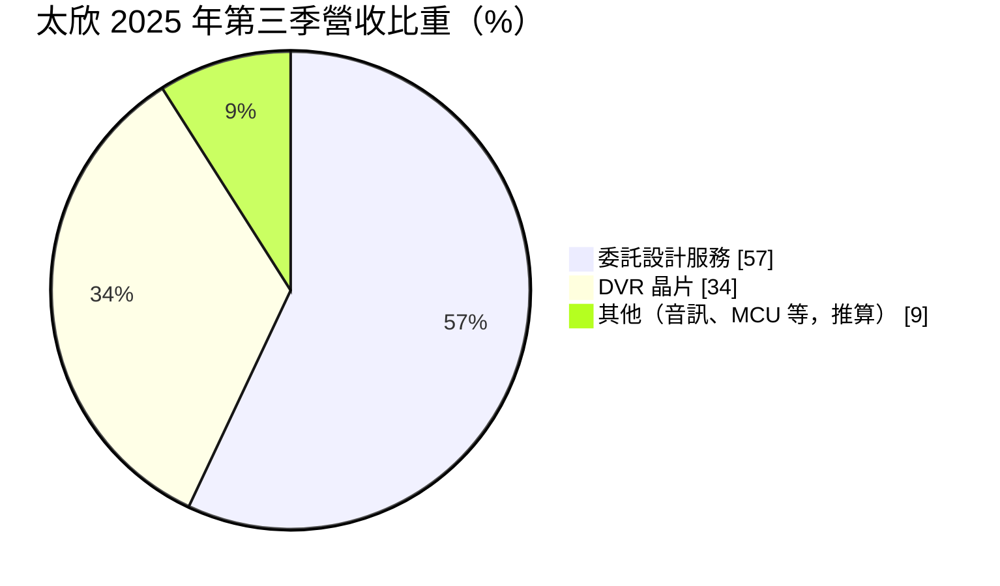
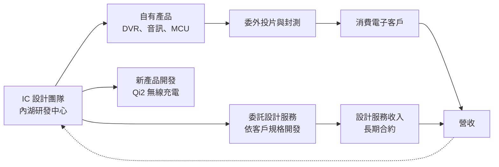
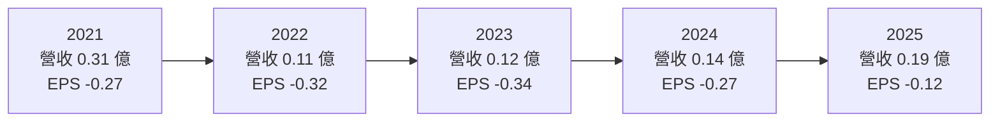
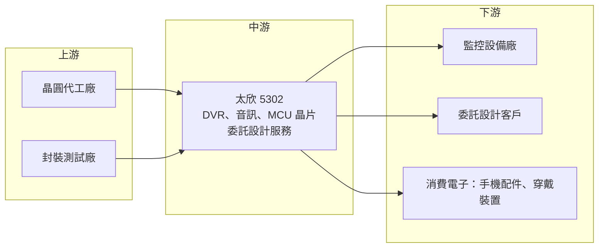

# 5302 太欣

> 上櫃｜[[產業索引-半導體業|半導體業]]｜上市（櫃）日期 1991/01/17

# 第一章：企業模式與商業藍圖

> [!info] 撰寫說明
> 本文由 Claude 依公開資料整理，架構比照 [[2330台積電]] 的四章研究，資料截至 2026-10-08。財務數字來源：Goodinfo 年度經營績效與基本資料頁，富果研究整理之太欣 2025 年 11 月法說會重點，nStock 公司概況頁；產業描述為整理性內容，尚未逐條比對原始文件。#待校對

在評估單一個股的長期投資價值時，首要步驟是拆解企業的底層獲利邏輯。本章針對太欣半導體（股票代號：5302，以下簡稱太欣）的商業模式進行定性分析。太欣是台灣最早的 IC 設計公司之一，但近十年營收持續萎縮、連年虧損，因此本章的重點不在成長故事，而在於理解一家老牌小型 IC 設計公司如何走到今天，以及它嘗試的轉型方向。

## 一、核心定位：台灣 IC 設計的老兵，正在尋找新角色

太欣成立於 1983 年，註冊於新竹科學園區，主要營運據點在台北內湖，英文簡稱 STK，1991 年 1 月在櫃買中心掛牌，是台灣資本市場上歷史最悠久的 IC 設計公司之一。依 Goodinfo，董事長為王國肇，總經理為陳金國，資本額約 16 億元。

太欣是 [[Fabless]] IC 設計公司，長期產品集中在消費性電子：數位錄放影機（[[DVR]]）晶片、音訊晶片、[[MCU]] 與 PC 攝影機晶片。這些市場在 2010 年代後被中國晶片設計公司以低價大量搶占，加上監控設備從類比 DVR 轉向網路攝影機，太欣的營收從 2016 年的 1.87 億元一路降到 2025 年的約 0.19 億元（約 1,900 萬元）。

以目前的營收規模，太欣已經很難被視為一般意義上的成長型 IC 設計公司。它的投資意義主要有兩個面向：

* **轉型中的小型設計團隊：** 2025 年起改以 [[ASIC]] 委託[[設計服務]]作為主要營收來源，並開發無線充電晶片，嘗試以小團隊承接客製化案件。
* **資產面的價值：** 太欣帳上仍有相當規模的股東權益（依 2025 年 ROE 與淨損回推約 12 億元，推算），以及台北內湖的研發大樓。公司正推動內湖大樓的[[資產活化]]，這部分價值與本業營運相對獨立。

## 二、終端應用與產品板塊

依 2025 年 11 月法說會，太欣的營收結構在 2025 年出現明顯轉變。2025 年上半年 DVR 晶片約占營收 65% 至 67%，第三季委託設計服務成為第一大營收來源：

* **DVR 晶片：** 過去最主要的產品，用於監控錄影設備。這個市場已經成熟並逐步被網路攝影機與網路錄影機取代，長期需求呈萎縮趨勢。
* **委託設計服務：** 自 2025 年 5 月起，依客戶規格開發晶片線路，已簽訂一年以上的長期合約。這讓太欣可以用既有的設計團隊創造收入，不需要自行承擔產品開發與庫存風險。
* **音訊晶片、MCU 與 PC 攝影機晶片：** 維持穩定但金額不大的貢獻。
* **無線充電晶片（開發中）：** 開發符合 WPC [[Qi2]] MPP 規範的無線充電發射端控制晶片，目標應用是手機、智慧手錶與無線耳機，已與中國主要客戶進行前期溝通，未來也希望延伸到車載、醫療器材與 AI 邊緣運算裝置。

## 三、資本轉化邏輯：從自有產品轉向設計服務

太欣原本的商業模式是自己定義產品、設計晶片、委外生產，再賣給消費電子客戶。這種模式需要持續推出新產品才能維持營收，一旦產品失去競爭力，營收就會快速萎縮。2025 年起，太欣把部分資源轉向委託設計服務：由客戶出規格、太欣負責設計，收入依合約認列。這種模式的好處是收入較可預期、不必承擔庫存，缺點是附加價值與規模受限於設計團隊的人力。

法說會資料顯示，2025 年前三季總營業費用約 4,857 萬元，其中研發費用約 1,844 萬元；營收只有千萬元級別，費用卻高出好幾倍，這是太欣長年虧損的根本原因。轉型的效果是單季淨損逐季收斂，從第一季約 1,496 萬元降到第三季約 424 萬元。

## 四、企業長期藍圖

太欣在法說會中提出的方向有三個：第一，深化 ASIC 委託設計服務，累積長期合約客戶；第二，推出 Qi2 無線充電發射端晶片，並延伸到車載、醫療與邊緣運算；第三，推動內湖研發大樓的資產活化，大樓擴建工程已完工、正申請使用執照，並已收到潛在買家詢問。

從長期角度看，太欣最大的挑戰是規模。以千萬元級的營收，要支撐一個完整的 IC 設計團隊非常困難；資產活化若能帶來一次性資金，公司如何運用這筆資金（投入新產品、併購、或回饋股東），將決定太欣未來十年的樣貌。

# 第二章：護城河深度與競爭優勢

護城河決定企業能否長期守住獲利。本章誠實評估太欣目前的競爭地位：在主要產品市場中，太欣已不具明顯護城河，因此本章重點放在它還剩下哪些可利用的資源。

## 一、護城河的核心組成要素

* **長期累積的設計經驗：** 太欣有超過 40 年的 IC 設計歷史，在影音處理、音訊與 MCU 領域累積設計能力與 IP。這是它能轉做委託設計服務的基礎。
* **長期合約客戶：** 委託設計服務已簽訂一年以上的長期合約，提供一定的收入能見度。但設計服務的客戶黏著度取決於交付品質，而非技術獨占。
* **資產與財務緩衝：** 帳上權益與內湖不動產，讓太欣在連年虧損下仍能維持營運，不必急於增資。這是「存活能力」而非競爭優勢。

坦白說，太欣在 DVR 與消費性晶片市場已經失去護城河。這些產品的營收從 2016 年起持續萎縮，毛利率雖然仍有 30% 至 40%，但營收規模太小，無法支撐費用。

## 二、全球主要競爭對手格局

| 對手 | 定位 | 對太欣的威脅 |
|---|---|---|
| 中國監控晶片設計公司 | 監控影像 SoC 大量供應，價格低 | 主導 DVR 與網路攝影機晶片市場，是太欣營收萎縮的主因 |
| [[3443創意]]、[[3661世芯-KY]]、[[3035智原]] | 台灣大型 ASIC 設計服務公司 | 定位在先進製程大型專案，與太欣的小型案件市場重疊有限 |
| 中小型設計服務與 IC 設計公司 | 承接成熟製程客製化案件 | 與太欣在小型委託設計案直接競爭 |
| 無線充電晶片廠 | 中國與國際類比晶片廠 | 無線充電發射端市場已有多家成熟供應商 |

## 三、優勢轉化：哪些市場守得住、哪些守不住

* **守得住：** 已簽約的委託設計服務客戶，以及既有音訊、MCU 產品的少量穩定需求。
* **守不住：** DVR 晶片市場。監控產業已轉向網路攝影機，中國廠商主導市場，DVR 營收占比會持續下降。
* **觀察重點：** 第一是委託設計服務能否擴大客戶數，讓營收突破目前的千萬元級別；第二是 Qi2 無線充電晶片能否取得量產訂單；第三是內湖大樓資產活化的方式與所得資金的用途。

# 第三章：財務體質與盈利規模

資料日期：2026-10-08。數字取自 Goodinfo 年度經營績效頁、富果研究法說會整理，表格是撰寫當時的快照；最新月營收、毛利率、累計 EPS 由自動排程寫在本筆記的屬性欄位（月營收、毛利率、累計EPS 等）。#待校對

財務報表是檢驗護城河是否真實存在的最終標準。本章用五年的三率、[[ROE]] 與資本報酬，檢視太欣長期虧損的結構。

## 一、獲利能力的基石：三率

| 年度 | 營收（新台幣） | [[毛利率]] | [[營業利益率]] | EPS（元） | [[ROE]] |
|---|---|---|---|---|---|
| 2021 | 0.31 億 | 47.7% | -213% | -0.27 | -3.11% |
| 2022 | 0.11 億 | 19.7% | -694% | -0.32 | -3.81% |
| 2023 | 0.12 億 | 40.7% | -592% | -0.34 | -4.09% |
| 2024 | 0.14 億 | 35.4% | -472% | -0.27 | -3.44% |
| 2025 | 0.19 億 | 32.0% | -293% | -0.12 | -1.60% |

太欣的營業利益率是負數百分之幾百，代表營業費用是營收的好幾倍。依 Goodinfo，2016 至 2025 年太欣每一年都是營業虧損與稅後虧損，營收從 2016 年的 1.87 億元降到 2022 年谷底的 0.11 億元，2016 至 2025 年營收年複合成長率約 -22%（推算）。

這張表也顯示兩個正面訊號。第一，營收在 2022 年觸底後連續三年回升，2025 年回到 0.19 億元，主要是委託設計服務的貢獻。第二，虧損逐年收斂，2025 年 EPS 為 -0.12 元，是十年來虧損最小的一年；不過其中包含第四季約 1,982 萬元的退休金專戶結算收入，屬[[一次性收益]]，扣除後本業虧損改善幅度較小。

## 二、[[ROE]]：資本效率

2021 至 2025 年 ROE 介於 -1.6% 至 -4.1%，平均約 -3.2%（推算）。由於太欣幾乎沒有負債、權益規模相對虧損金額很大，ROE 的負值不算深，但長期為負代表股東權益每年都在被侵蝕。以 2025 年淨損約 0.19 億元與 ROE -1.6% 回推，股東權益約 12 億元（推算），低於約 16 億元的股本，代表累積虧損已經吃掉部分資本。

## 三、資本支出與[[自由現金流]]

太欣為 Fabless 模式，近年主要的資本支出是內湖研發大樓的擴建（金額未查得）。在本業持續虧損下，營業現金流應為負（推估），[[自由現金流]]長期為負。依 nStock 資料，太欣近五年沒有配發股利。

## 四、[[ROIC]] 與 [[WACC]]：價值創造利差

**ROIC 推算：** 2025 年營業虧損約 0.56 億元（0.19 億 × -293%），稅後營業利益為負，ROIC 為負值（推算）。投入資本以股東權益約 12 億元計算（有息負債不重大），ROIC 約 -4.6%（推算，虧損期間不計稅）。

**WACC 推算：** 權益成本用 CAPM 估計，假設台灣 10 年期公債殖利率 1.75%、市場風險溢酬 6%、β 取 IC 設計同業常見值 1.0，權益成本約 7.75%。公司沒有重大有息負債，WACC 約 7.75%（推算）。

**結論：** 太欣的 ROIC 長期為負，與約 7.75% 的資金成本差距很大，代表本業持續消耗股東價值。對太欣而言，關鍵問題已經不是能否創造超額報酬，而是如何讓本業損益兩平，以及帳上資產與不動產能否透過資產活化，轉成更有效率的用途。

# 第四章：總體風險與地緣政治

任何企業都無法脫離宏觀環境獨立存在。本章分析太欣未來必須面對的地緣政治、產業週期、營運與技術風險。

## 一、地緣政治

* **中國客戶與競爭者的雙重角色：** 太欣的無線充電新產品正與中國主要客戶溝通，DVR 市場也以中國廠商為主。美中科技對抗與中國本土化政策，既可能限制太欣打入中國供應鏈，也可能讓部分非中國客戶尋求台灣供應商。
* **台灣營運集中：** 研發與營運集中在台北內湖與新竹，面臨與其他台灣科技公司相同的兩岸風險。

## 二、產業週期與市場結構

* **消費性電子的長期萎縮市場：** DVR 等產品屬於技術世代交替後的衰退市場，不論景氣好壞，長期需求都在下降。
* **設計服務的景氣連動：** 委託設計服務的需求取決於客戶的新產品開發預算，景氣低迷時客戶會延後或取消開案。

## 三、營運環境的隱性風險

* **規模不足：** 營收只有千萬元級別，無法支撐完整的研發團隊與產品線。若轉型無法擴大營收，虧損將持續侵蝕權益。
* **一次性收益掩蓋本業：** 退休金結算、資產處分等一次性收益會讓帳面虧損縮小，評估本業時需要排除。
* **資產活化的執行與用途：** 內湖大樓的出售或出租方式、價格與時點都有不確定性；所得資金若沒有用在能創造報酬的地方，對股東的長期價值有限。
* **存貨風險：** 2025 年第一季因存貨呆滯提列，毛利率一度只有 4%，顯示舊產品存貨仍有減損風險。

## 四、科技或法規演進

* **監控設備的網路化：** 監控系統從類比 DVR 轉向網路攝影機與雲端錄影，太欣的核心舊產品面臨技術淘汰。
* **無線充電標準更新：** Qi2 等標準持續演進，晶片必須通過認證才能銷售。標準更新速度快，小型設計團隊需要持續投入才能跟上。

# 專有名詞解析

## 半導體

- **[[Fabless]]**：無晶圓廠 IC 設計公司，只負責設計晶片，生產委託晶圓代工與封測廠完成。
- **[[MCU]]**：微控制器，把處理器、記憶體與輸入輸出整合在一顆晶片上，用來控制家電、玩具、工業設備等。
- **[[ASIC]]**：特定應用積體電路，依特定客戶需求量身設計的晶片，相對於通用型標準晶片。
- **[[設計服務]]**：IC 設計公司依客戶規格代為設計晶片，收取設計費或量產費用，不自行承擔產品銷售風險。

## 應用

- **[[DVR]]**：數位錄放影機，把監控攝影機的影像數位化並儲存，正逐步被網路錄影機與雲端錄影取代。
- **[[Qi2]]**：無線充電聯盟（WPC）制定的新一代無線充電標準，加入磁吸對準功能，提高充電效率。

## 金融

- **[[資產活化]]**：把閒置或低效益的土地、廠房出售、出租或重新開發，讓資產產生更高的現金流或報酬。
- **[[一次性收益]]**：出售資產、退休金結算等不會每年重複發生的收益，評估長期獲利時應排除。
- **[[ROE]]**：股東權益報酬率，稅後淨利除以股東權益，衡量股東投入的資金每年賺回多少。
- **[[ROIC]]**：投入資本報酬率，稅後營業利益除以股東權益加有息負債，衡量本業運用資本的效率。
- **[[WACC]]**：加權平均資金成本，股東與債權人要求報酬率的加權平均，是 ROIC 需要超越的門檻。
- **[[自由現金流]]**：營業活動現金流減去資本支出，代表企業可自由用於配息、還債或併購的現金。

# 核心供應鏈

## 1. 上游：晶圓代工與封測
- 晶圓代工與封裝測試：公開資料未揭露合作廠商名稱，屬委外生產的 Fabless 模式

## 2. 中游：太欣本身
- 自有產品：DVR 晶片、音訊晶片、MCU、PC 攝影機晶片
- 新業務：ASIC 委託設計服務、Qi2 無線充電發射端晶片（開發中）

## 3. 下游：客戶
- 監控設備廠與消費電子客戶（公司未揭露具名客戶）
- 委託設計服務客戶（長期合約，未具名）

## 4. 同業與相關公司
- ASIC 設計服務：[[3443創意]]、[[3661世芯-KY]]、[[3035智原]]

## 最新新聞
<!-- news:start -->
<!-- news:end -->

## 相關連結
- [公開資訊觀測站](https://mopsov.twse.com.tw/mops/web/t05st03?step=1&firstin=1&co_id=5302)
- [Goodinfo](https://goodinfo.tw/tw/StockDetail.asp?STOCK_ID=5302)
- [Yahoo 股市](https://tw.stock.yahoo.com/quote/5302)
- [鉅亨網新聞](https://www.cnyes.com/twstock/5302/news)
