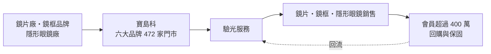
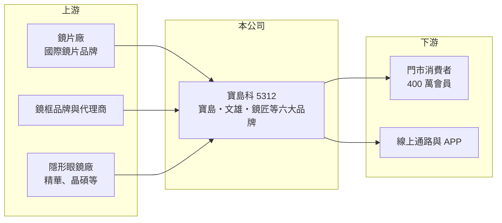

# 5312 寶島科

> 上櫃｜[[產業索引-生技醫療業|生技醫療業]]｜上市（櫃）日期 1996/05/25

# 第一章：企業模式與商業藍圖

> [!info] 撰寫說明
> 本文由 Claude 依公開資料整理，架構比照 [[2330台積電]] 的四章研究，資料截至 2026-10-08。財務數字來源：Goodinfo 年度經營績效表、櫃買中心開放資料（基本資料、2026 年第二季財報、每月營收、本益比殖利率）；門市數、品牌與會員資料取自富果研究整理的法說會摘要（數字為 2024 年第三季，AI 摘要，非公司原始文件）。各品類營收比重與業外收益來源未查得。#待校對

寶島科是台灣規模最大的眼鏡連鎖通路，它賺的是「驗光服務加上鏡片鏡框零售」的錢，門市密度與會員數是核心資產。本章說明寶島光學科技（股票代號：5312，以下簡稱寶島科）的商業模式。

## 一、核心定位：多品牌眼鏡連鎖通路

寶島科成立於 1989 年，1996 年在櫃買中心掛牌，總部位於新北市汐止，董事長為蔡國洲，總經理為蔡宜珊，實收資本額約 6.0 億元。公司以[[連鎖零售]]方式經營眼鏡門市，依 2024 年第三季法說會資料：

* **多品牌布局：** 六大品牌合計 472 家門市（含策略聯盟），其中寶島眼鏡 353 家、文雄眼鏡 66 家、鏡匠眼鏡 26 家、SOLOMAX 8 家、米蘭眼鏡 4 家，另有 La Mode 專櫃 55 櫃；直營店 370 家。不同品牌對應不同價位與客群，可以在同一商圈覆蓋更多消費者。
* **服務帶動零售：** 消費者到門市驗光後購買鏡片、鏡框與[[隱形眼鏡]]，驗光服務是吸引來客的入口。門市需要具備合格的[[驗光師]]，人才培育與證照是經營的基本條件。
* **延伸到眼科相關服務：** 2022 年成立寶島水科技，負責眼科相關業務，把服務範圍從配鏡延伸到眼睛健康。

## 二、資本轉化邏輯：高毛利零售，費用決定獲利

* **毛利高、費用也高：** 眼鏡零售的[[毛利率]]長年約 58% 至 64%，但門市租金、驗光師與店員薪資、行銷費用吃掉大部分毛利，營業利益率只有 2% 至 9%。因此單店營收與坪效決定獲利。
* **會員與回購：** 依法說會資料，會員數超過 400 萬、APP 下載量突破 200 萬，會員黏著度近七成。配鏡有固定的更換週期，會員資料讓公司能在換鏡時機主動提醒消費者回店。

## 三、長期方向：策略聯盟轉直營與複合式門市

依法說會資料，公司在 2024 年啟動策略聯盟店轉直營，當年增加超過 25 家，並推動深耕經營（四大保固）、會員經營、虛實整合（[[OMO]]）與複合式商品四大策略。台灣眼鏡店約 4,100 至 4,200 家，連鎖化程度仍有提升空間，寶島科的長期成長來自提高市占與單店營收，而不是大量新開店。

# 第二章：護城河深度與競爭優勢

護城河是企業抵禦競爭、長期維持超額利潤的機制。本章說明寶島科作為眼鏡通路龍頭的優勢，以及在獨立眼鏡行與電商夾擊下能守住多少。

## 一、寶島科護城河的核心組成要素

* **1. 門市密度與品牌知名度：** 近 500 家門市遍布全台，寶島眼鏡是消費者熟知的品牌。驗光配鏡需要到店服務，門市密度本身就是進入門檻。
* **2. 會員資料與保固服務：** 400 萬以上會員與保固制度，讓消費者更換眼鏡時傾向回到原門市，提高回購率。
* **3. 採購規模：** 大量採購鏡片與鏡框，議價能力高於單店經營的眼鏡行，這是毛利率能維持在 60% 以上的原因之一。
* **4. 人才培育體系：** 法說會資料提到每年編列千萬元以上預算培訓人才，並與 11 所視光院校產學合作，在驗光師供給有限的環境下，穩定的人才來源是競爭力。

## 二、主要競爭對手格局

| 對手 | 定位 | 對寶島科的影響 |
|---|---|---|
| 小林眼鏡 | 第二大眼鏡連鎖品牌 | 在同一商圈直接競爭 |
| 獨立眼鏡行 | 單店或小型連鎖，數量多 | 以在地服務與價格競爭 |
| 平價快時尚眼鏡品牌 | 低價、快速配鏡 | 吸走年輕、價格敏感族群 |
| 隱形眼鏡電商 | 線上販售日拋與彩片 | 分流隱形眼鏡的零售營收 |

## 三、優勢轉化：守得住與守不住的地方

* **守得住：** 營收從 2021 年的 29.1 億元成長到 2025 年的 41.3 億元，毛利率從 60% 緩步升到 63.5%，顯示產品組合往高單價鏡片升級。公司已連續 23 年配息（依法說會資料）。
* **守不住：** 營業利益率在 2025 年降到 7.24%，費用增加速度快於毛利；本業利潤偏薄，獲利有相當比重來自業外收益。
* **觀察重點：** 轉直營後的單店營收、驗光人員法規過渡期結束後的人力成本，以及眼科相關新業務的獲利貢獻。

# 第三章：財務體質與盈利規模

資料日期：2026-10-08，表格是撰寫當時的快照；最新月營收、毛利率、累計 EPS 由自動排程寫在本筆記的屬性欄位（月營收、毛利率、累計EPS 等）。#待校對

財務報表是檢驗護城河是否真實存在的最終標準。本章用五年的三率、ROE 與資本報酬，檢視寶島科的獲利品質，重點是本業利潤與業外收益的比例。

## 一、多年度財務表現

| 年度 | 營收（新台幣） | [[毛利率]] | [[營業利益率]] | EPS（元） | [[ROE]] |
|---|---|---|---|---|---|
| 2021 | 29.1 億 | 60.0% | 2.34% | 4.83 | 10.9% |
| 2022 | 33.0 億 | 61.0% | 5.67% | 2.83 | 6.49% |
| 2023 | 38.6 億 | 61.6% | 8.49% | 6.96 | 15.0% |
| 2024 | 39.7 億 | 62.9% | 8.38% | 8.24 | 15.4% |
| 2025 | 41.3 億 | 63.5% | 7.24% | 6.41 | 10.7% |

資料來源：Goodinfo 年度經營績效（合併報表）。2026 年上半年（櫃買中心資料）營收約 22.22 億元、毛利率約 64.5%、營業利益率約 6.6%、業外收益約 1.14 億元、EPS 3.67 元；2026 年 1 至 8 月累計營收年增約 11.9%。

* **業外占比高：** 2019 至 2021 年每年業外收益約 2.5 億至 2.8 億元，超過營業利益；2023 至 2025 年業外仍有 1.7 億至 2.9 億元，約占稅前利益的三到五成（業外來源未查得）。評估寶島科的本業體質時，應以營業利益為準。
* **長期指標：** 2020 至 2025 年營收年複合成長率約 6.2%（推算）；2021 至 2025 年平均 ROE 約 11.7%（推算）。依櫃買中心資料，近一年每股股利 6.5 元，約等於 2025 年 EPS，配發率接近 100%（推算），屬高配息政策。2026 年第二季底總資產約 99.7 億元，負債約 56.9 億元，權益約 42.9 億元；負債中推估有相當比重為門市租約認列的[[租賃負債]]（待校對）。

## 二、[[ROIC]] 與 [[WACC]]：價值創造利差

**ROIC 推算：** 2025 年營業利益約 2.99 億元，稅率 20% 後約 2.39 億元。官方資料只揭露負債總計約 56.9 億元，假設一半為有息負債與租賃負債約 28.4 億元（推估），加上權益約 42.9 億元，投入資本約 71.3 億元，ROIC 約 3.4%（推算）。

**WACC 推算：** 台灣 10 年期公債殖利率取 1.75%、市場風險溢酬 6%、β 取零售通路常見值 0.6（未查得公司實際 β），股東權益成本約 5.35%。負債成本假設 2.5%，稅後約 2.0%，權益約占投入資本 60%，WACC 約 4.0%（推算）。

**結論：** 只看本業，ROIC 略低於 WACC，代表門市擴張與租約投入的資本，靠本業營業利益還不足以創造超額報酬；股東看到的 10% 以上 ROE 有一部分來自業外收益。寶島科要提升本業價值，需要把營業利益率從 7% 推回 9% 以上。

# 第四章：總體風險與地緣政治

任何企業都無法脫離宏觀環境獨立存在。本章分析寶島科長期必須面對的法規、人力與市場風險。

## 一、法規與人力風險

* **驗光人員法規：** 台灣驗光人員法規定驗光業務需由合格驗光師或驗光生執行，過渡期結束後，門市的人力配置與薪資成本會上升。依法說會資料，公司以產學合作與內部培訓因應。
* **人才供給：** 驗光人才供給有限，連鎖通路與獨立眼鏡行彼此搶人，人事費用是營業利益率最大的變數。

## 二、市場與競爭風險

* **少子化與人口結構：** 年輕族群人數減少，但高齡化帶來老花與多焦鏡片需求，產品組合必須跟著調整。
* **電商與平價品牌：** 隱形眼鏡與平價鏡框的線上銷售持續成長，可能分流部分零售營收。
* **商場租金：** 門市多位於商圈與百貨，租金上漲直接壓縮獲利。

## 三、財務風險

* **業外收益波動：** 獲利有相當部分來自業外，業外收益一旦減少，EPS 與配息能力都會下降。
* **高配息與再投資：** 配發率接近 100%，轉直營與門市更新的資金需求若增加，配息可能需要調整。

# 專有名詞解析

## 應用

- **[[隱形眼鏡]]**：直接配戴在眼球表面的矯正或美容鏡片，屬醫療器材，需取得衛生主管機關許可。

## 金融

- **[[租賃負債]]**：企業租用店面或設備時，依會計準則把未來應付租金折現後認列的負債，連鎖通路通常金額很大。
- **[[ROIC]]**：投入資本報酬率，稅後營業利益除以股東權益加有息負債，衡量本業運用資本的效率。
- **[[WACC]]**：加權平均資金成本，股東與債權人要求報酬率的加權平均，是 ROIC 要超越的門檻。

## 產業

- **[[連鎖零售]]**：以統一品牌、集中採購與標準化管理經營多家門市的零售模式，規模越大議價能力越強。
- **[[驗光師]]**：依驗光人員法取得證照、可執行視力檢查與配鏡驗光的專業人員，台灣眼鏡門市須配置合格人員。
- **[[OMO]]**：線上線下融合，把會員、庫存與行銷在實體門市與網路渠道之間打通的零售經營方式。

# 核心供應鏈

## 1. 上游：鏡片、鏡框與隱形眼鏡
- 國際鏡片品牌與鏡框代理商（名稱未查得）
- 台灣隱形眼鏡廠：[[1565精華]]、[[6491晶碩]]、[[4771望隼]]（實際往來未查得，列為產業供應來源）

## 2. 中游：寶島科與同業
- 眼鏡通路同業：小林眼鏡（未上市）、各地獨立眼鏡行
- 眼科醫療相關：[[3218大學光]]

## 3. 下游：客戶
- 門市驗光配鏡消費者與線上會員

## 最新新聞
<!-- news:start -->
<!-- news:end -->

## 相關連結
- [公開資訊觀測站](https://mopsov.twse.com.tw/mops/web/t05st03?step=1&firstin=1&co_id=5312)
- [Goodinfo](https://goodinfo.tw/tw/StockDetail.asp?STOCK_ID=5312)
- [Yahoo 股市](https://tw.stock.yahoo.com/quote/5312)
- [鉅亨網新聞](https://www.cnyes.com/twstock/5312/news)
