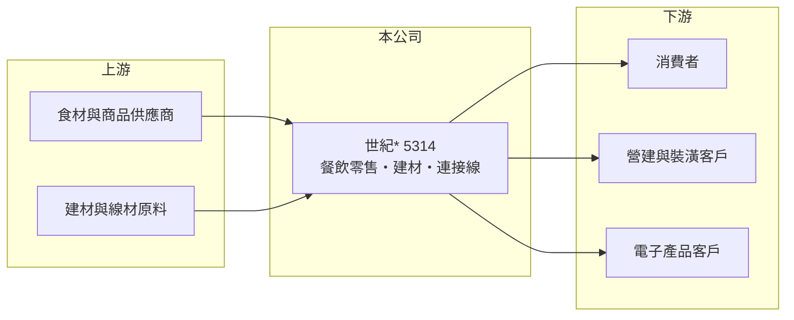

# 5314 世紀

> 上櫃｜[[產業索引-其他業|其他業]]｜上市（櫃）日期 1996/09/16

# 第一章：企業模式與商業藍圖

> [!info] 撰寫說明
> 精簡版，由 Claude 依公開資料整理，架構比照 [[2330台積電]]，資料截至 2026-10-07。來源：nStock 世紀*公司簡介、winvest 營收快訊。公開資料有限，主要營收來源本次未查證。#待校對

世紀*營業項目非常多元，2026 年營收較 2025 年倍增，但主要成長來源本次未查到。

- **核心業務：** 登記營業項目包括餐館與其他餐飲、食品雜貨與飲料零售、建材買賣、室內裝潢、服飾、廣告行銷、保險經紀、[[連接線]]與電腦割字機製造，以及環境工程與中西藥製銷，屬於[[多角化經營]]。
- **營收結構：** 本次未查到各業務營收比重。
- **營運據點：** 公司登記地址位於台南市安平區。
- **長期方向：** 2026 年 4 至 8 月單月營收年增 100% 至 168%，顯示有新業務或新併入的營收來源（推估）。

# 第二章：護城河深度與競爭優勢

世紀*業務分散，目前難以判斷單一業務的護城河。

- **競爭優勢：** 本次未查到明確的技術、品牌或通路優勢。
- **主要對手：** 視業務別而定，餐飲零售、建材與連接線各有不同同業（本次未查到具體名單）。
- **觀察重點：** 營收倍增的來源與持續性，以及第二季毛利率 42.08% 是否反映新業務的結構。

# 第三章：財務體質與盈利規模

資料日期：2026-10-07，以下數字是撰寫當時的快照；最新月營收、毛利率、累計 EPS 由自動排程寫在本筆記的屬性欄位（月營收、毛利率、累計EPS 等）。#待校對

世紀*營收大幅成長，但 2026 年 EPS 明顯低於 2025 年。

- **營收規模：** 2025 年全年營收 30.59 億元；2026 年 1 至 8 月累計 38.86 億元，已超過 2025 年全年；6 月營收 5.79 億元（年增 167.87%），8 月 4.65 億元（年增 102.52%）。
- **獲利：** 2025 年全年 EPS 5.56 元；2026 年上半年累計 EPS 0.66 元，第二季 EPS 0.29 元；第二季[[毛利率]] 42.08%、[[營業利益率]] 13.34%、[[淨利率]] 7.84%。
- **財務特色：** 資本額 6.03 億元、市值約 80.45 億元；2025 年 EPS 遠高於 2026 年上半年，推估 2025 年含[[一次性收益]]，待校對。

# 第四章：總體風險與地緣政治

世紀*的風險在於業務透明度與獲利持續性。

- **產業週期：** 各業務景氣循環不同，餐飲零售受消費景氣影響，建材受房市影響。
- **營運風險：** 營收快速擴張時，管理與整合成本可能上升，獲利不一定同步成長。
- **其他風險：** 業務多元且資訊有限，投資人難以評估各業務的真實獲利能力。

# 專有名詞解析

## 金融

- **[[一次性收益]]**：處分資產或投資等非經常性利益，不會每年重複發生。
- **[[毛利率]]**：毛利除以營收，反映產品或服務本身的獲利能力。
- **[[營業利益率]]**：營業利益除以營收，反映本業扣除營業費用後的獲利能力。
- **[[淨利率]]**：稅後淨利除以營收，包含業外損益與稅負後的最終獲利能力。

## 產業

- **[[連接線]]**：傳輸電力或訊號的線材與接頭組件，用於電腦與電子產品。
- **[[多角化經營]]**：同時經營多個不相關業務，可分散風險，但資源分散時各業務難以形成規模。

# 核心供應鏈

- 上游：食材與商品供應商、建材與線材原料商（推估）
- 下游／客戶：消費者、營建與裝潢客戶、電子產品客戶（推估）
- 同業：依業務別各有不同同業（本次未查到具體名單）

## 最新新聞
<!-- news:start -->
<!-- news:end -->

## 相關連結
- [公開資訊觀測站](https://mopsov.twse.com.tw/mops/web/t05st03?step=1&firstin=1&co_id=5314)
- [Goodinfo](https://goodinfo.tw/tw/StockDetail.asp?STOCK_ID=5314)
- [Yahoo 股市](https://tw.stock.yahoo.com/quote/5314)
- [鉅亨網新聞](https://www.cnyes.com/twstock/5314/news)
