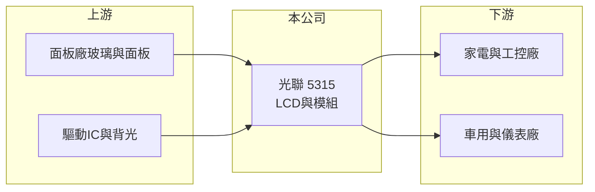

# 5315 光聯

> 上櫃｜[[產業索引-光電業|光電業]]｜上市（櫃）日期 1996/11/02

# 第一章：企業模式與商業藍圖

> [!info] 撰寫說明
> 精簡版，由 Claude 依公開資料整理，架構比照 [[2330台積電]]，資料截至 2026-10-07。來源：nstock.tw 光聯公司概況、winvest.tw 營收快訊。公開資料有限，產品比重、客戶與營運據點本次未查到。#待校對

光聯是製造液晶顯示器與模組的中小型顯示廠，獲利穩定並維持配息。

- **核心業務：** 公司製造、加工與銷售各型[[LCD]]（液晶顯示器）及其模組。
- **營收結構：** 本次未查到各應用比重；中小尺寸 LCD 模組常見於家電、工控與車用儀表（推估）。
- **營運據點：** 營運與生產據點本次未查到。
- **長期方向：** 朝[[工業顯示器]]與車用等規格穩定、生命週期長的應用發展，可降低消費性產品的價格波動（推估）。

# 第二章：護城河深度與競爭優勢

光聯的優勢在於中小尺寸模組的客製與長期供貨。

- **競爭優勢：** 中小尺寸 LCD 模組型號多、需求量分散，客製設計與穩定供貨能力是留住客戶的關鍵（推估）。
- **主要對手：** [[3481群創]]、[[2409友達]]、[[6116彩晶]] 等面板廠的中小尺寸產品，以及中國大陸模組廠。
- **觀察重點：** 2026 年營收年減的趨勢何時止穩，以及毛利率能否維持兩成。

# 第三章：財務體質與盈利規模

資料日期：2026-10-07，以下數字是撰寫當時的快照；最新月營收、毛利率、累計 EPS 由自動排程寫在本筆記的屬性欄位（月營收、毛利率、累計EPS 等）。#待校對

光聯 2026 年營收衰退，但仍維持獲利。

- **營收規模：** 2025 年全年營收 20.03 億元；2026 年 1 至 8 月累計 11.99 億元，年減 8.79%；8 月營收 1.31 億元，年減 25.09%。
- **獲利：** 2025 年全年 EPS 1.9 元；2026 年第二季 EPS 0.26 元，[[毛利率]] 20.1%，[[營業利益率]] 10.75%。
- **財務特色：** 資本額約 10.64 億元，市值約 20 億元；最新現金股利 1.6 元，以當時股價計算現金[[殖利率]]約 6.96%。

# 第四章：總體風險與地緣政治

光聯的風險來自 LCD 產業成熟與營收下滑。

- **產業週期：** LCD 面板價格與供需有明顯循環，上游面板報價變化會直接影響模組成本。
- **營運風險：** 營收持續年減時，固定成本攤提壓力上升，獲利可能進一步下滑。
- **其他風險：** 中國大陸模組廠價格競爭、匯率與關稅政策變動。

# 專有名詞解析

## 應用

- **[[LCD]]**：液晶顯示器，以背光源搭配液晶控制透光，是最普及的平面顯示技術。

## 金融

- **[[殖利率]]**：每股現金股利除以股價，反映以現價買進可領到的現金報酬率。

## 產業

- **[[工業顯示器]]**：用於工控、醫療、交通等場域的顯示器，重視耐用度與長期供貨。

# 核心供應鏈

- 上游：面板廠、驅動IC與背光元件供應商
- 下游／客戶：家電、工控與車用儀表廠商（推估）
- 同業：[[3481群創]]、[[2409友達]]、[[6116彩晶]]、中國大陸 LCD 模組廠

## 最新新聞
<!-- news:start -->
<!-- news:end -->

## 相關連結
- [公開資訊觀測站](https://mopsov.twse.com.tw/mops/web/t05st03?step=1&firstin=1&co_id=5315)
- [Goodinfo](https://goodinfo.tw/tw/StockDetail.asp?STOCK_ID=5315)
- [Yahoo 股市](https://tw.stock.yahoo.com/quote/5315)
- [鉅亨網新聞](https://www.cnyes.com/twstock/5315/news)
