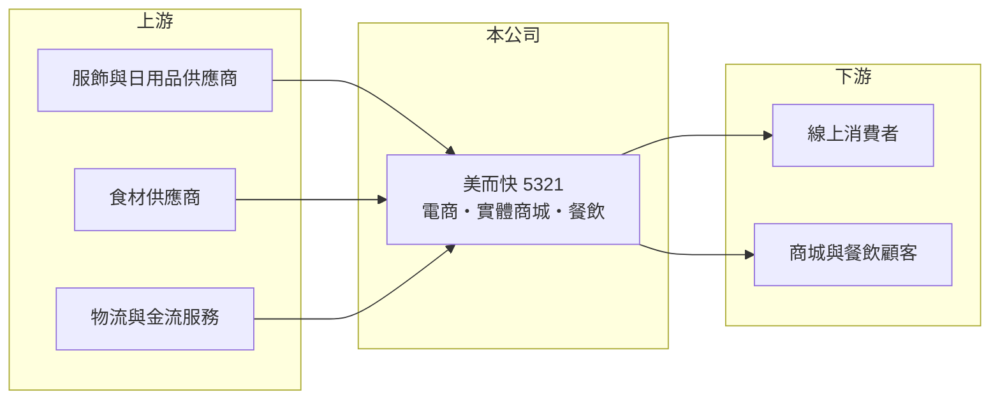

# 5321 美而快

> 上櫃｜[[產業索引-數位雲端|數位雲端]]｜上市（櫃）日期 1996/12/30

# 第一章：企業模式與商業藍圖

> [!info] 撰寫說明
> 精簡版，由 Claude 依公開資料整理，架構比照 [[2330台積電]]，資料截至 2026-10-08。來源：櫃買中心開放資料（基本資料、資產負債、綜合損益）、Goodinfo 年度經營績效、nStock 公司簡介。公開資料有限，各業務營收比重、品牌名稱與主要子公司未查得。#待校對

本章說明美而快（5321）從電子零組件公司轉型為零售與餐飲集團的經營模式。

- **核心業務：** 美而快的前身是 1983 年設立的九德電子，2008 年改名友銓電子，2021 年再改名為美而快國際，名稱的變化反映公司已經離開電子製造業。依 nStock 整理的營業項目，目前主要從事電子商務平台的服飾銷售、日常用品的無店面零售，以及經營實體商城與餐飲。這代表公司的獲利來源已經變成消費者的日常支出，而不是電子產業的訂單週期。
- **營收結構：** 2025 年營收約 28.4 億元，[[毛利率]]約 51%，屬於零售與自有商品的毛利結構，和過去電子業 20% 多的毛利率明顯不同。不過高毛利也伴隨高額的人事、租金與行銷費用，營業利益率只有個位數。各業務（電商、商城、餐飲）的營收占比未查得。
- **營運據點：** 公司登記於台北市南港區。實體商城與餐飲需要承租店面，資產負債表上非流動負債約 21 億元，遠高於股東權益約 8 億元，推估主要是租賃負債與長期借款（細項未查得），這是零售通路常見的資本結構。
- **長期方向：** 零售與餐飲的長期關鍵是坪效、品牌經營與線上線下整合。美而快能否讓電商與實體據點互相導流，並把營業費用率壓下來，是轉型成敗的核心。

# 第二章：護城河深度與競爭優勢

本章分析美而快在零售與餐飲市場的競爭條件。

- **競爭優勢：** 同時擁有電商平台與實體商城，理論上可以用線上數據決定實體選品，也能讓實體門市成為電商的取貨與體驗據點。毛利率由 2020 年的 26% 一路升到 2025 年的 51%，顯示商品組合已經轉向較高附加價值的自有或零售商品。但公開資料沒有揭露品牌與通路規模，護城河深度難以評估。
- **主要對手：** 服飾電商面對蝦皮、momo 等大型平台與快時尚品牌的競爭；實體商城與餐飲則面對百貨、購物中心與連鎖餐飲集團，例如 [[2723美食-KY]]、[[2753八方雲集]] 等。零售業進入門檻低，價格與流量競爭激烈。
- **觀察重點：** 第一是營業利益率能否回到 2021 至 2022 年 7% 以上的水準。第二是 2026 年上半年營收明顯縮小、轉為虧損，背後是否有業務調整或據點關閉（原因未查得）。第三是租賃與借款負擔能否隨獲利改善而下降。

# 第三章：財務體質與盈利規模

資料日期：2026-10-08，表格是撰寫當時的快照；最新月營收、毛利率、累計 EPS 由自動排程寫在本筆記的屬性欄位（月營收、毛利率、累計EPS 等）。#待校對

本章用多年度數字檢視美而快轉型後的獲利能力。

| 年度 | 營收（新台幣） | [[毛利率]] | [[營業利益率]] | EPS（元） | [[ROE]] |
|---|---|---|---|---|---|
| 2021 | 27.2 億 | 35.6% | 7.6% | 3.11 | 28.2% |
| 2022 | 31.7 億 | 36.8% | 7.77% | 4.60 | 30.0% |
| 2023 | 32.6 億 | 37.8% | 5.02% | 1.66 | 13.2% |
| 2024 | 33.8 億 | 45.6% | 3.61% | 0.03 | 3.89% |
| 2025 | 28.4 億 | 51.1% | 4.51% | -0.27 | 1.61% |

- **營收規模：** 2020 至 2025 年營收年複合成長率約 6.4%，但 2025 年起規模回落。依櫃買中心資料，2026 年上半年營收約 11.0 億元，營業損失約 0.48 億元，每股虧損 2.93 元。
- **獲利：** 毛利率逐年提升，但營業利益率反而由 2022 年的 7.8% 降到 4% 上下，代表費用增加的速度快過毛利改善。近五年平均 ROE 約 15.4%，但主要由 2021 至 2022 年貢獻，近三年明顯下滑。
- **財務特色：** 2026 年第二季歸屬母公司權益約 8.0 億元，每股淨值 13.38 元；流動負債約 19.0 億元、非流動負債約 21.2 億元，財務槓桿偏高。依櫃買中心本益比資料，目前每股股利為 0。
- **[[ROIC]] 與 [[WACC]]：** 2025 年營業利益約 1.28 億元（28.4 億 × 4.51%），稅後約 1.02 億元；投入資本以股東權益 8.0 億元加上以非流動負債 21.2 億元作為有息負債的近似值，約 29.2 億元，ROIC 約 3.5%（推算）。WACC 以 CAPM 推估：無風險利率 1.75%、市場風險溢酬 6%、β 用零售業常見值 1.0，股東權益成本約 7.75%；負債成本 2.5%、稅後約 2.0%；股權權重約 27%，WACC 約 3.6%（推算）。2025 年 ROIC 只與 WACC 打平，2026 年上半年又轉為營業虧損，代表目前的轉型尚未穩定創造價值。

# 第四章：總體風險與地緣政治

本章整理美而快長期必須面對的風險。

- **產業週期：** 服飾、日用品與餐飲屬於民生消費，受景氣、薪資與消費信心影響。景氣轉弱時，消費者會減少非必要的服飾與外食支出，零售業的高固定成本會放大獲利波動。
- **營運風險：** 實體商城與餐飲需要長期租約與人力，營收下滑時費用難以同步縮減。電商則面對平台流量成本上升與價格戰。公司財務槓桿偏高，若虧損延續，償債與再融資壓力會增加。
- **其他風險：** 基本工資調漲、食材與原物料價格、租金上漲都會壓縮毛利；服飾進貨若以外幣計價，也有匯率風險。公司經歷多次更名與業務轉換，經營層的策略穩定性需要持續觀察。

# 專有名詞解析

## 金融

- **[[ROIC]]**：投入資本報酬率，稅後營業利益除以投入資本，衡量本業運用資金創造報酬的能力。
- **[[WACC]]**：加權平均資金成本，股東與債權人要求報酬率的加權平均，ROIC 高於 WACC 才代表創造價值。

## 產業

- **[[租賃負債]]**：企業承租店面或設備時，依會計準則把未來租金折現認列的負債，零售與餐飲業金額通常很大。

# 核心供應鏈

- 上游：服飾與日用品的製造商或品牌供應商、餐飲食材供應商，以及電商所需的物流與金流服務（實際合作對象未查得）。
- 下游／客戶：一般消費者，透過電商平台、實體商城與餐廳購買。
- 同業：服飾電商與快時尚品牌、購物中心經營者，以及 [[2723美食-KY]]、[[2753八方雲集]] 等連鎖餐飲。

## 最新新聞
<!-- news:start -->
<!-- news:end -->

## 相關連結
- [公開資訊觀測站](https://mopsov.twse.com.tw/mops/web/t05st03?step=1&firstin=1&co_id=5321)
- [Goodinfo](https://goodinfo.tw/tw/StockDetail.asp?STOCK_ID=5321)
- [Yahoo 股市](https://tw.stock.yahoo.com/quote/5321)
- [鉅亨網新聞](https://www.cnyes.com/twstock/5321/news)
