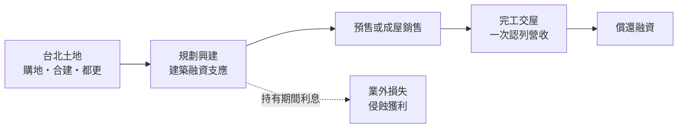
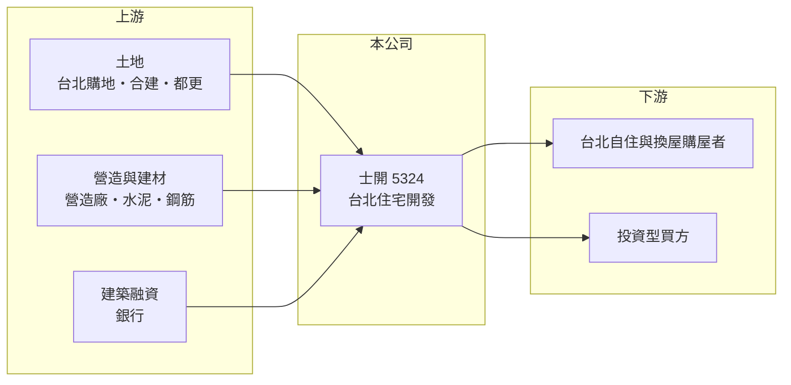

# 5324 士開

> 上櫃｜[[產業索引-建材營造業|建材營造業]]｜上市（櫃）日期 1997/01/30

# 第一章：企業模式與商業藍圖

> [!info] 撰寫說明
> 本文由 Claude 依公開資料整理，架構比照 [[2330台積電]] 的四章研究，資料截至 2026-10-08。財務數字來源：MoneyDJ 理財網年度財務比率與損益表、櫃買中心開放資料（基本資料、2026 年第二季財報）；業務描述參考富果研究法說會頁面、科技新報公司資料頁與 Yahoo 股市公告標題。公開資料有限，個別建案內容與產品線未逐案查證。#待校對

在評估一家建商的長期價值時，第一步是看懂它的獲利能力能否支撐它的負債。本章針對士林開發（股票代號：5324，以下簡稱士開）的商業模式進行定性分析，說明一家台北的老牌中小型建商，在多年虧損後的財務處境與長期課題。

## 一、核心定位：台北的中小型住宅開發商

士開成立於 1984 年，1997 年在櫃買中心掛牌，總部位於台北市中山北路六段，董事長為許玉山，總經理為林信成，實收資本額約 22.6 億元。公司的本業是台北都會區的住宅開發與銷售，屬於中小型建商。

* **營收規模不大且起伏明顯：** 2021 至 2025 年營收在 4.5 億至 25.9 億元之間，只有 2024 年因交屋較多而明顯放大。
* **累積虧損：** 2026 年第二季底保留盈餘約負 5.96 億元，每股淨值約 6.51 元，低於面額 10 元。這代表公司過去的虧損已侵蝕部分股本，是理解士開的核心背景。

## 二、資本轉化邏輯：高槓桿與交屋時點

* **營收在交屋時認列：** 和所有建商一樣，士開採[[建案交屋]]認列營收。交屋空窗年度營收不足以支撐固定費用與利息，就會出現虧損。
* **負債比率高：** 負債比率從 2018 年的 59% 升到 2023 年的 85%，2025 年約 85%。2026 年第二季底總資產約 111 億元、負債約 95.1 億元、股東權益約 15.9 億元。

## 三、長期方向：以交屋回收資金、修復資產負債表

依櫃買中心資料，士開 2026 年上半年[[毛利率]]約 43%，但營業利益率只有約 2%，再扣除業外支出後仍小幅虧損。公司的長期課題不是擴大推案，而是讓在手建案順利交屋、償還融資，並逐步彌補累積虧損。台北市老舊住宅的[[都更]]與危老改建需求長期存在，是台北中小型建商可以爭取的案源，但需要穩健的財務才能參與。

# 第二章：護城河深度與競爭優勢

護城河是企業抵禦競爭、長期維持超額利潤的機制。對財務較弱的中小型建商而言，護城河很淺，本章說明士開的優勢與限制。

## 一、士開可以依靠的競爭要素

* **1. 台北市場的土地價值：** 台北市可開發土地稀少，持有的土地本身具有長期保值性，這是台北建商的共同優勢。
* **2. 產品毛利：** 2023 年毛利率約 50%，2025 年約 40%，代表個別建案的售價與成本之間仍有不錯的利潤空間。
* **3. 長期經營資歷：** 公司成立超過四十年，在台北累積一定的地主與市場經驗。

## 二、主要競爭對手格局

| 對手 | 定位 | 對士開的威脅 |
|---|---|---|
| [[2520冠德]] | 台北老牌建商 | 品牌與資金成本優勢 |
| [[5534長虹]] | 台北住宅與商辦 | 同一市場競爭 |
| [[3512皇龍]] | 台北中小型建商 | 規模相近，財務較穩健 |
| [[2548華固]] | 台北中高價住宅 | 品牌與規模優勢 |

## 三、優勢轉化：哪些守得住、哪些守不住

* **守得住：** 個別建案仍可維持四成左右的毛利率，只要能交屋，就能貢獻毛利。
* **守不住：** 高毛利無法轉化為穩定的淨利。銷管費用與利息吃掉大部分毛利，2018 至 2025 年的八年中有七年稅後虧損或接近損益兩平。
* **觀察重點：** 第一，負債比率能否下降；第二，累積虧損何時彌補完畢、恢復配息能力；第三，在手建案的交屋時程。

# 第三章：財務體質與盈利規模

資料日期：2026-10-08。數字取自 MoneyDJ 理財網年度財務資料與櫃買中心開放資料，表格是撰寫當時的快照；最新月營收、毛利率、累計 EPS 由自動排程寫在本筆記的屬性欄位（月營收、毛利率、累計EPS 等）。#待校對

財務報表是檢驗護城河是否真實存在的最終標準。本章用五年的三率、ROE、營建業指標與資本報酬，檢視士開的獲利品質與財務風險。

## 一、獲利能力的基石：三率

| 年度 | 營收（新台幣） | [[毛利率]] | [[營業利益率]] | EPS（元） | [[ROE]] |
|---|---|---|---|---|---|
| 2021 | 7.36 億 | 19.1% | -24.6% | -0.64 | -10.5% |
| 2022 | 4.52 億 | 31.2% | -40.6% | -0.92 | -13.7% |
| 2023 | 6.09 億 | 49.9% | -9.08% | -0.53 | -7.66% |
| 2024 | 25.9 億 | 28.1% | 8.65% | 0.70 | 10.9% |
| 2025 | 11.6 億 | 39.7% | 5.04% | -0.05 | -0.04% |

資料來源：MoneyDJ 理財網年度損益表與財務比率。2026 年上半年（櫃買中心資料）營收約 4.81 億元、毛利率約 43.4%、營業利益率約 2.1%、EPS 負 0.13 元。

士開的問題不在毛利率，而在費用與財務成本。2023 年毛利率接近 50%，營業利益率卻是負 9%；2025 年營業利益約 0.58 億元，扣除業外支出後稅後只剩約負 0.01 億元。2021 至 2025 年合計稅後淨利約負 3.3 億元（推算），五年中只有 2024 年獲利。

## 二、營建業指標：推案量、已售未入帳與存貨

公司未公開完整的推案量與[[已售未入帳]]金額（未查得）。2026 年第二季底流動資產約 96.4 億元，約為 2025 年營收的八倍；流動負債約 69.7 億元、非流動負債約 25.4 億元。存貨相對營收極高，代表資金回收期長，土地與在建房地的去化速度是關鍵。依公告標題，士開曾向關係人取得使用權資產，屬於租賃安排，細節未查得。

## 三、[[ROE]] 與股利

2021 至 2025 年平均 ROE 約負 4.2%（推算）。依櫃買中心資料，目前未配發現金股利；在保留盈餘轉正之前，依法也難以分配盈餘。自由現金流的完整資料未查得。

## 四、[[ROIC]] 與 [[WACC]]：價值創造利差

**ROIC 推算：** 2025 年營業利益約 0.58 億元，稅後約 0.46 億元。官方資料只揭露負債總計約 95.1 億元，假設其中六成為有息負債約 57.0 億元（推估），加上股東權益約 15.9 億元，投入資本約 73.0 億元，ROIC 約 0.6%（推算）；以 2021 至 2025 年平均營業利益計算約負 0.3%（推算）。

**WACC 推算：** 台灣 10 年期公債殖利率取 1.75%、市場風險溢酬 6%、β 取營建同業常見值 0.9（未查得公司實際 β；高槓桿下實際 β 可能更高），股東權益成本約 7.2%。負債成本假設 3%，稅率 20%，稅後約 2.4%。權益只占投入資本約 22%，WACC 約 3.4%（推算）。

**結論：** 士開的 ROIC 長期明顯低於 WACC，過去五年本業沒有賺回資金成本，持續在消耗股東價值。要改善這個狀況，需要同時做到建案順利交屋、壓低費用與降低負債，任何一項落後都會讓利差持續為負。

# 第四章：總體風險與地緣政治

任何企業都無法脫離宏觀環境獨立存在。本章分析士開長期必須面對的財務、政策與營運風險。

## 一、財務風險

* **高負債與低淨值：** 負債比率約八成五，股東權益只有約 15.9 億元，每股淨值低於面額。若房價下跌或建案去化不順，淨值可能進一步被侵蝕。
* **融資續借：** 高槓桿建商依賴銀行展延建築融資，若銀行收緊不動產放款，公司可能被迫降價出售資產。
* **利率：** 浮動利率的建築融資在升息時會直接加重虧損。

## 二、政策與產業週期風險

* **[[信用管制]]：** 2024 年第七波選擇性信用管制後，台北房市交易量下滑，對財務較弱的建商衝擊最大。
* **稅制：** 房地合一稅、囤房稅與預售屋轉售限制，會延長去化時間。

## 三、營運與治理風險

* **費用結構：** 營收規模小，銷管費用占營收比例高，使高毛利無法轉為淨利。
* **關係人交易：** 依公告標題，公司曾與關係人進行使用權資產交易，投資人宜留意條件是否公允。
* **資訊揭露有限：** 公司規模小，公開資訊少，判斷基本面的不確定性高。

# 專有名詞解析

## 金融

- **[[信用管制]]**：央行限制購屋與建商貸款成數的政策，會影響房市成交與建商資金。
- **[[ROIC]]**：投入資本報酬率，稅後營業利益除以股東權益加有息負債，衡量本業運用資本的效率。
- **[[WACC]]**：加權平均資金成本，股東與債權人要求報酬率的加權平均，是 ROIC 要超越的門檻。

## 產業

- **[[建案交屋]]**：建商在房屋完工並交付買方時才認列營收，因此營建公司的營收常集中在交屋年度。
- **[[已售未入帳]]**：已經賣出、但尚未完工交屋而未認列營收的建案金額，是建商未來營收的主要能見度指標。
- **[[都更]]**：都市更新，由地主與建商合作把老舊建物改建，地主依權利價值分回房地或收益。

# 核心供應鏈

## 1. 上游：土地、營造與資金
- 土地來源：台北購地、合建與都更（具體標的未查得）
- 營造：外部發包營造廠（合作對象未查得）；建材如 [[1101台泥]]、[[2002中鋼]]
- 資金：銀行建築融資

## 2. 中游：士開與同業
- 台北同業：[[2520冠德]]、[[5534長虹]]、[[3512皇龍]]、[[2548華固]]

## 3. 下游：客戶
- 台北自住、換屋與投資型購屋者

## 最新新聞
<!-- news:start -->
<!-- news:end -->

## 相關連結
- [公開資訊觀測站](https://mopsov.twse.com.tw/mops/web/t05st03?step=1&firstin=1&co_id=5324)
- [Goodinfo](https://goodinfo.tw/tw/StockDetail.asp?STOCK_ID=5324)
- [Yahoo 股市](https://tw.stock.yahoo.com/quote/5324)
- [鉅亨網新聞](https://www.cnyes.com/twstock/5324/news)
