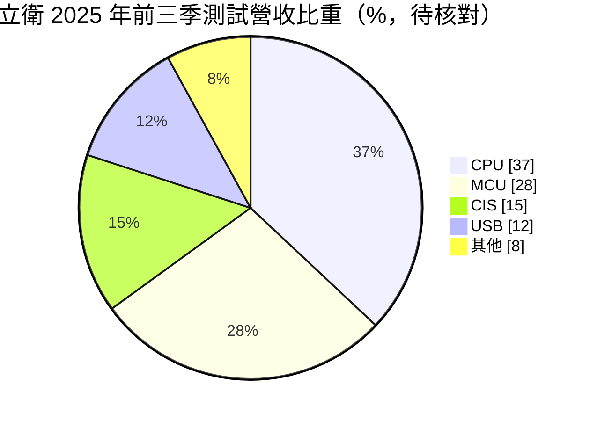
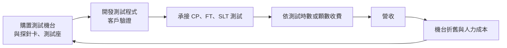
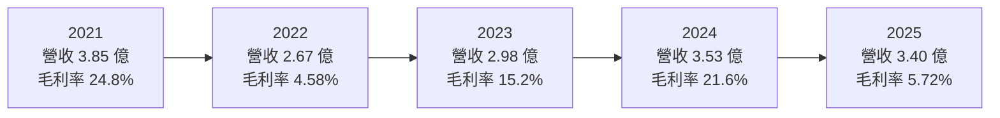
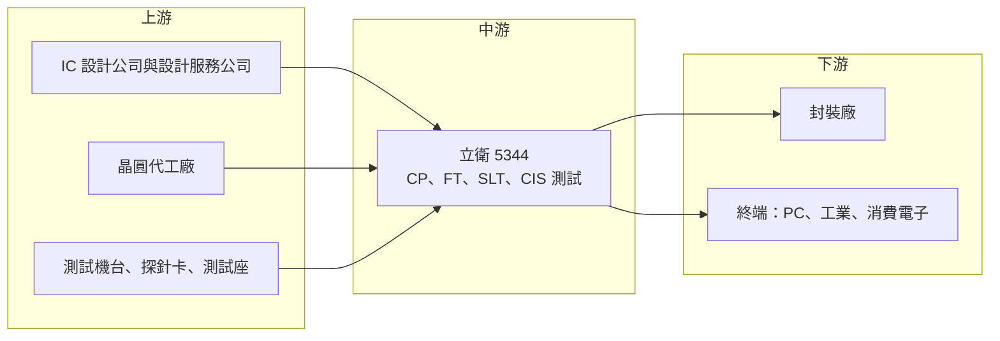

# 5344 立衛

> 上櫃｜[[產業索引-半導體業|半導體業]]｜上市（櫃）日期 1998/03/23

# 第一章：企業模式與商業藍圖

> [!info] 撰寫說明
> 本文由 Claude 依公開資料整理，架構比照 [[2330台積電]] 的四章研究，資料截至 2026-10-08。財務數字來源：Goodinfo 年度經營績效與基本資料頁，立衛公司官網，poorstock 整理之 2025 年第三季法說會資料，工商時報（2024 年 12 月巨有科技合作報導），nStock 公司概況頁；產業描述為整理性內容，尚未逐條比對原始文件。#待校對

在評估單一個股的長期投資價值時，首要步驟是拆解企業的底層獲利邏輯。本章針對立衛科技（股票代號：5344，以下簡稱立衛）的商業模式進行定性分析，說明一家規模很小的專業 IC 測試廠，如何在大型封測集團的夾縫中生存，以及為什麼它的獲利長期難以穩定。

## 一、核心定位：新竹科學園區的小型專業測試廠

立衛成立於 1988 年，位於新竹科學園區，英文簡稱 VATE，1998 年在櫃買中心掛牌。依 Goodinfo，董事長為沈炳輝，總經理為許文景，資本額約 7.94 億元。立衛是專業的 IC 測試代工廠，也就是在晶片封裝前後替客戶檢查晶片功能是否正常，把不良品挑出來。公司另有少量照明設備與燈具的買賣業務。

依官網與法說會資料，立衛提供的服務包括：

* **[[CP]] 晶圓測試：** 在晶圓切割封裝前，用[[探針卡]]逐顆量測晶片電性，及早篩掉不良晶粒，避免浪費封裝成本。
* **[[FT]] 成品測試：** 晶片封裝後再做一次電性與功能測試，確認符合規格才出貨。
* **[[SLT]] 系統級測試：** 把晶片放在接近實際使用的系統環境中測試軟硬體相容性，越來越多高階晶片需要這一道。
* **[[CIS]] 影像感測器測試：** 針對 CMOS 影像感測器的專用測試平台。
* **後段服務：** 掃腳、烘烤、捲帶包裝與雷射修補等。

這個定位的商業意義是：測試廠位在半導體供應鏈的最後一段，業績直接跟隨客戶的晶片出貨量；它不決定需求，只能承接需求。對小型測試廠來說，能否找到大廠不願做或做不來的利基測試項目，是生存的關鍵。

## 二、終端應用與產品板塊

依 poorstock 網站對 2025 年第三季法說會資料的 AI 整理，立衛 2025 年前三季的測試營收比重如下（此比重非公司新聞稿原文，需以原始簡報核對）：

* **處理器測試（約 37%）：** 包括 x86 處理器等產品，是最大的測試類別。
* **[[MCU]] 測試（約 28%）：** 微控制器出貨量大、型號多，適合中小型測試廠承接。
* **CIS 測試（約 15%）：** 影像感測器測試需要專用光源與平台，是立衛的特色服務。
* **USB 與其他介面晶片（約 20%）：** 包括網通、射頻等晶片的測試。

產能方面，法說會資料列出的月產能為：成品測試約 2,000 萬顆、CIS 測試約 1,600 萬顆、捲帶約 1,000 萬顆、系統級測試約 100 萬顆、晶圓測試約 12,000 片。員工約 210 人，廠房約 4,000 坪；官網提到 1998 年啟用一座約 9,000 坪（約 29,750 平方公尺）的新廠，兩個面積數字的差異需以年報核對。

## 三、資本轉化邏輯：以設備換取測試時數

測試代工是資本密集的生意：測試廠必須先購買昂貴的測試機台，再依客戶的晶片開發測試程式與治具，之後依測試時數或顆數向客戶收費。毛利率高低主要取決於[[產能利用率]]，因為機台折舊與人力是固定成本，機台滿載時毛利率會大幅提高，閒置時則可能虧損。

立衛近年也嘗試以合作方式擴大業務。2024 年 12 月工商時報報導，立衛與巨有科技成為策略夥伴，由巨有負責測試程式與治具開發，立衛負責量產，承接巨有台積電 ASIC Turnkey 測試服務的產能擴充，並採用測試設備託管（Consign）模式，也就是由客戶提供機台、立衛提供場地與人力。託管模式可以降低立衛的設備投資風險，但每單位的收費與毛利率通常也較低（推估）。

## 四、企業長期藍圖

立衛沒有在公開資料中提出具體的長期策略，法說會對展望的描述為終端需求緩慢穩健回溫、審慎樂觀。從公開資訊可以歸納出三個方向：

* **與設計服務公司合作：** 透過與巨有科技等設計服務公司合作，接觸台積電體系的 ASIC 客戶，取得較穩定的量產測試訂單。
* **車用與高可靠度認證：** 立衛已取得 [[IATF 16949]] 車用品質系統認證，以及 ISO 9001、ISO 14001、ISO 45001、IECQ QC 080000 等認證，具備承接車用與工業晶片測試的資格。
* **系統級測試：** 高階處理器與 AI 晶片越來越依賴 SLT，立衛已提供 SLT 服務，但產能規模仍小。

# 第二章：護城河深度與競爭優勢

護城河決定企業能否長期守住獲利。本章分析立衛在大型封測集團主導的測試產業中有哪些優勢，以及這些優勢的侷限。

## 一、護城河的核心組成要素

* **測試程式與客戶驗證：** 每一款晶片的測試程式與治具都需要客戶驗證，完成驗證後客戶較少更換測試廠。這是測試產業共通的轉換成本，也是立衛維持既有客戶的基礎。
* **國際大廠的技術認證：** 官網提到立衛取得 TI 與 HP 的技術認證，加上車用品質系統認證，代表測試品質獲得國際客戶認可。
* **小量多樣的彈性：** 大型封測廠偏好大量標準化訂單，小型測試廠可以承接型號多、數量少的 MCU、CIS 與介面晶片測試。

但必須承認，立衛的護城河相當淺。測試服務本質上是以機台與人力提供產能，技術差異化有限；立衛規模小，在議價、設備採購與客戶開發上都處於劣勢。這也是它長期毛利率偏低、經常虧損的原因。

## 二、全球主要競爭對手格局

| 對手 | 定位 | 對立衛的威脅 |
|---|---|---|
| [[2449京元電子]] | 台灣最大專業測試廠 | 規模、機台與客戶群遠大於立衛，主導高階測試 |
| [[3264欣銓]] | 專業晶圓測試廠 | 在晶圓測試與車用、網通晶片測試競爭 |
| [[6257矽格]] | 封測與測試廠，消費與網通晶片為主 | 在 MCU、介面晶片等中階測試競爭 |
| [[3711日月光投控]]、[[6239力成]] | 大型封測集團 | 提供封裝加測試一條龍服務，吸走整合型訂單 |
| 中國封測廠 | 本土替代與低價 | 中國晶片設計公司的測試需求多轉向本地 |

## 三、優勢轉化：哪些市場守得住、哪些守不住

* **守得住：** 已完成驗證的 MCU、CIS 與介面晶片測試，以及與設計服務公司合作的量產測試。這些訂單有客戶驗證門檻。
* **守不住：** 大量標準化晶片與高階 AI 晶片測試。前者會流向成本更低的大廠或中國廠，後者需要大規模資本投入，非立衛能力所及。
* **觀察重點：** 第一是毛利率能否回到 20% 以上並維持；第二是與巨有科技等合作夥伴的訂單能否持續擴大；第三是系統級測試與車用測試能否成為新的利基。

# 第三章：財務體質與盈利規模

資料日期：2026-10-08。數字取自 Goodinfo 年度經營績效頁、poorstock 法說會資料整理，表格是撰寫當時的快照；最新月營收、毛利率、累計 EPS 由自動排程寫在本筆記的屬性欄位（月營收、毛利率、累計EPS 等）。#待校對

財務報表是檢驗護城河是否真實存在的最終標準。本章用五年的三率、[[ROE]] 與資本報酬，檢視立衛作為小型測試廠的獲利穩定度。

## 一、獲利能力的基石：三率

| 年度 | 營收（新台幣） | [[毛利率]] | [[營業利益率]] | EPS（元） | [[ROE]] |
|---|---|---|---|---|---|
| 2021 | 3.85 億 | 24.8% | 14.1% | 0.76 | 11.6% |
| 2022 | 2.67 億 | 4.58% | -12.5% | -0.23 | -3.41% |
| 2023 | 2.98 億 | 15.2% | -0.21% | 0.11 | 1.65% |
| 2024 | 3.53 億 | 21.6% | 7.68% | 0.55 | 8.41% |
| 2025 | 3.40 億 | 5.72% | -11.4% | -0.39 | -6.01% |

這張表清楚顯示測試代工的[[營運槓桿]]。依 Goodinfo，2016 至 2019 年立衛營收只有約 1.6 億至 2.1 億元，毛利率為負，年年虧損；2020 至 2021 年營收跳升到 3.5 億元以上，毛利率回到 20% 以上，才轉為獲利。之後營收只要下滑一成左右，毛利率就可能從二成掉到個位數，2022 年與 2025 年都出現這種情況。

2025 年營收 3.40 億元只比前一年少約 4%，毛利率卻從 21.6% 降到 5.72%。法說會資料顯示，2025 年前三季營業費用反而比前一年同期增加，加上產品組合與價格壓力，造成毛利率大幅下滑。2016 至 2025 年營收年複合成長率約 8.8%（推算），但 2020 至 2025 年約 -0.7%（推算），近五年營收大致持平在 3 億至 4 億元之間。

## 二、[[ROE]]：資本效率

2021 至 2025 年 ROE 在 -6% 至 12% 之間大幅擺盪，平均約 2.4%（推算），長期資本效率偏低。立衛財務槓桿不高，2024 年 ROA 6.88% 與 ROE 8.41% 接近。以 2025 年淨損 0.31 億元與 ROE -6.01% 回推，股東權益約 5.2 億元（推算），低於 7.94 億元的股本，代表過去累積虧損已侵蝕部分資本。

## 三、資本支出與[[自由現金流]]

測試廠需要持續投資機台。法說會資料顯示，不動產、廠房及設備帳面金額由 2024 年底約 2.85 億元，小幅降至 2025 年 9 月底約 2.82 億元，代表近期資本支出大致與折舊相當，沒有大幅擴產（具體資本支出金額未查得）。在虧損年度，[[自由現金流]]可能偏弱（推估）。依 nStock 資料，立衛近五年沒有配發股利。

## 四、[[ROIC]] 與 [[WACC]]：價值創造利差

**ROIC 推算：** 2024 年營業利益約 0.27 億元（3.53 億 × 7.68%），以 20% 稅率計算，稅後營業利益約 0.22 億元。投入資本以股東權益計算，用淨利 0.44 億元與 ROE 8.41% 回推權益約 5.2 億元（有息負債未查得，假設不重大），ROIC 約 4.2%（推算）。2025 年營業虧損約 0.39 億元（3.40 億 × -11.4%），ROIC 約 -7.5%（推算，虧損期間不計稅）。

**WACC 推算：** 權益成本用 CAPM 估計，假設台灣 10 年期公債殖利率 1.75%、市場風險溢酬 6%、β 取封測同業常見值 1.0，權益成本約 7.75%。有息負債假設不重大，WACC 約 7.75%（推算）。

**結論：** 立衛即使在獲利較好的 2024 年，ROIC 約 4% 仍低於約 7.75% 的資金成本；2021 年 ROIC 約 8%（推算，依 3.85 億 × 14.1% × 0.8 ÷ 權益約 5.3 億元）是近十年少數略高於 WACC 的年份。整體而言，立衛長期沒有穩定創造經濟價值。要改變這個局面，需要讓營收規模與產能利用率穩定在較高水準，或找到毛利率較高的利基測試項目。

# 第四章：總體風險與地緣政治

任何企業都無法脫離宏觀環境獨立存在。本章分析立衛未來必須面對的地緣政治、產業週期、營運與技術風險。

## 一、地緣政治

* **台灣產能集中：** 立衛的產能全部在新竹，面臨兩岸風險與天災風險。國際客戶若要求分散測試地點，小型測試廠難以在海外設廠因應。
* **中國測試需求在地化：** 中國晶片設計公司在本土化政策下，測試訂單多轉往中國封測廠，壓縮台灣中小型測試廠的市場。

## 二、產業週期與市場結構

* **跟隨晶片出貨週期：** 測試需求直接跟隨客戶晶片的出貨量，消費電子、PC 與工業晶片的庫存調整會立即反映在立衛的產能利用率。
* **[[長鞭效應]]：** 立衛位在後段，客戶的庫存調整可能造成測試訂單突然大幅減少，而機台與人力成本無法同步調整。
* **產業集中化：** 測試產業的規模經濟明顯，大廠持續擴產與整合，中小型測試廠的生存空間逐漸縮小。

## 三、營運環境的隱性風險

* **高固定成本：** 機台折舊與人力是固定成本，營收小幅下滑就會讓毛利率大跌，獲利波動極大。
* **客戶集中：** 營收規模小，少數客戶的訂單變化就可能影響全年業績（客戶集中度未查得）。
* **人才與設備：** 測試程式開發需要專業工程師，小公司在人才競爭上較不利；新一代測試機台價格高，設備升級的資金壓力大。

## 四、科技或法規演進

* **測試複雜度提高：** AI 晶片、先進封裝與小晶片架構讓測試項目更多、時間更長，系統級測試的重要性上升。這是測試產業的長期成長動力，但也需要大量資本投入，對小型測試廠是挑戰。
* **車用與工業品質要求：** 車用晶片要求零缺陷與完整追溯，測試廠必須維持嚴格的品質系統。立衛已具備車用品質認證，若能取得穩定的車用測試訂單，有機會改善營收波動。

# 專有名詞解析

## 半導體

- **[[CP]]**：晶圓測試，在晶圓切割封裝前，以探針卡逐顆量測晶片電性，及早篩除不良晶粒。
- **[[FT]]**：成品測試，晶片封裝完成後的最終電性與功能測試，確認符合規格才出貨。
- **[[SLT]]**：系統級測試，把晶片放在接近實際使用的系統環境中測試，檢查軟硬體相容性與實際效能。
- **[[CIS]]**：CMOS 影像感測器，把光線轉成電子訊號的晶片，用於手機、車用與監控鏡頭。
- **[[MCU]]**：微控制器，把處理器、記憶體與輸入輸出整合在一顆晶片上，用來控制家電、玩具、工業設備等。
- **[[探針卡]]**：晶圓測試時與晶片接觸的介面，上面有大量細微探針，用來把測試訊號傳進晶片。

## 應用

- **[[IATF 16949]]**：國際汽車產業的品質管理系統標準，車用零組件供應商通常必須取得此認證。

## 金融

- **[[產能利用率]]**：實際使用的產能占總產能的比例，測試廠與晶圓廠的毛利率高度取決於此數字。
- **[[營運槓桿]]**：固定費用占比高的公司，營收增加時利潤增幅會大於營收增幅，營收減少時利潤也會放大下滑。
- **[[長鞭效應]]**：終端需求的小幅變動，沿供應鏈往上游傳遞時被逐級放大，造成上游庫存與訂單劇烈波動。
- **[[ROE]]**：股東權益報酬率，稅後淨利除以股東權益，衡量股東投入的資金每年賺回多少。
- **[[ROIC]]**：投入資本報酬率，稅後營業利益除以股東權益加有息負債，衡量本業運用資本的效率。
- **[[WACC]]**：加權平均資金成本，股東與債權人要求報酬率的加權平均，是 ROIC 需要超越的門檻。
- **[[自由現金流]]**：營業活動現金流減去資本支出，代表企業可自由用於配息、還債或併購的現金。

# 核心供應鏈

## 1. 上游：委託測試的客戶與設備供應商
- 設計服務合作夥伴：巨有科技（台積電 ASIC Turnkey 測試合作，2024 年）
- 晶圓來源：[[2330台積電]] 等晶圓代工廠（透過設計服務合作）
- 測試介面：[[6223旺矽]]、[[6515穎崴]]、[[6510精測]]（產業代表性探針卡與測試座廠，非公司揭露之供應商）

## 2. 中游：立衛本身
- 服務：晶圓測試、成品測試、系統級測試、CIS 測試、掃腳、烘烤與捲帶

## 3. 下游：測試應用
- 處理器、MCU、影像感測器、USB 與網通晶片（公司未揭露具名客戶）

## 4. 同業與競爭者
- [[2449京元電子]]、[[3264欣銓]]、[[6257矽格]]、[[3711日月光投控]]、[[6239力成]]

## 最新新聞
<!-- news:start -->
<!-- news:end -->

## 相關連結
- [公開資訊觀測站](https://mopsov.twse.com.tw/mops/web/t05st03?step=1&firstin=1&co_id=5344)
- [Goodinfo](https://goodinfo.tw/tw/StockDetail.asp?STOCK_ID=5344)
- [Yahoo 股市](https://tw.stock.yahoo.com/quote/5344)
- [鉅亨網新聞](https://www.cnyes.com/twstock/5344/news)
