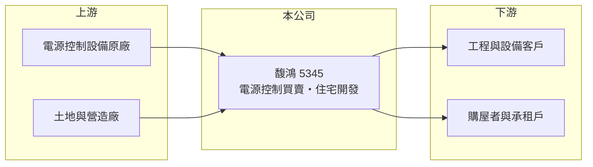

# 5345 馥鴻

> 上櫃｜[[產業索引-其他業|其他業]]｜上市（櫃）日期 1998/03/23

# 第一章：企業模式與商業藍圖

> [!info] 撰寫說明
> 精簡版，由 Claude 依公開資料整理，架構比照 [[2330台積電]]，資料截至 2026-10-07。來源：nstock 公司概況頁、winvest 營收快訊（搜尋結果標題）、富果研究法說會頁面標題。公開資料有限，營收比重、營運據點與客戶未查到。#待校對

馥鴻是營收規模很小的上櫃公司，登記業務橫跨智慧電源控制系統買賣與住宅開發。

- **核心業務：** 公司營運項目為[[智慧電源控制]]系統之買賣，以及住宅及大樓開發租售，屬於小規模的貿易加[[建設業]]型態。
- **營收結構：** 兩項業務的營收比重本次未查到；2025 年全年營收僅約 0.23 億元，任一筆交易都可能改變結構。
- **營運據點：** 營運據點本次未查到，公司資本額約 3.78 億元。
- **長期方向：** 2026 年前 8 月營收已明顯高於 2025 年全年，但絕對金額仍小，業務方向是否確立仍待觀察（推估）。

# 第二章：護城河深度與競爭優勢

馥鴻規模小、業務分散，目前看不出明確的競爭優勢。

- **競爭優勢：** 公開資料未顯示具體技術或通路優勢；電源控制以買賣為主，附加價值有限（推估）。
- **主要對手：** 電源控制系統貿易商與中小型建設公司眾多，具體對手本次未查到。
- **觀察重點：** 營收能否穩定在每月數百萬元以上、建案是否有實際推案與交屋，以及能否轉虧為盈。

# 第三章：財務體質與盈利規模

資料日期：2026-10-07，以下數字是撰寫當時的快照；最新月營收、毛利率、累計 EPS 由自動排程寫在本筆記的屬性欄位（月營收、毛利率、累計EPS 等）。#待校對

馥鴻 2026 年營收年增幅度很大，但基期極低，獲利仍在損益兩平附近。

- **營收規模：** 2026 年 5 月營收 595.7 萬元、6 月 463.3 萬元、7 月 268.5 萬元；1 至 8 月累計約 0.26 億元，年增約 317%。2025 年全年營收約 0.23 億元。
- **獲利：** 2026 年第二季 EPS 0 元，[[毛利率]] 23.57%、營益率 -1.48%；上半年累計 EPS -0.04 元；2025 年全年 EPS -0.32 元。
- **財務特色：** 資本額約 3.78 億元，近五年未配息；營收規模小，費用即可吃掉毛利。

# 第四章：總體風險與地緣政治

馥鴻的主要風險在於營收規模過小與業務不穩定。

- **產業週期：** 建設業務受房市景氣、利率與信用管制影響，電源控制買賣則跟著客戶專案起伏。
- **營運風險：** 營收高度依賴少數交易，月營收波動大，難以支撐固定費用，虧損可能延續。
- **其他風險：** 小型股流動性低、股價波動大；房地產政策（如選擇性信用管制）會影響建案去化。

# 專有名詞解析

## 應用

- **[[智慧電源控制]]**：以感測與通訊技術管理用電設備開關與耗電，用於節能與自動化。

## 金融

- **[[毛利率]]**：營業毛利占營收的比率，反映產品售價扣除直接成本後的獲利空間。

## 產業

- **[[建設業]]**：購地、興建住宅或大樓後銷售或出租，營收在交屋時集中認列。

# 核心供應鏈

- 上游：電源控制設備供應商、土地地主與營造廠（推估）
- 下游／客戶：工程與設備客戶、購屋者，名稱未揭露
- 同業：中小型電源控制貿易商與建設公司，名稱未查到

## 最新新聞
<!-- news:start（自動產生，請勿手動編輯此範圍） -->
- 2026-10-08 🏛️ 重訊 13:45｜公告本公司董事會通過辦理115年第1次私募普通股定價相關事宜｜[觀測站](https://mops.twse.com.tw/mops/#/web/t05st01)
- 2026-10-08 🏛️ 重訊 13:44｜公告本公司董事會通過總經理異動案｜[觀測站](https://mops.twse.com.tw/mops/#/web/t05st01)
- 2026-10-08 🏛️ 重訊 13:44｜公告本公司董事會通過代理發言人異動案｜[觀測站](https://mops.twse.com.tw/mops/#/web/t05st01)
- 2026-10-08 🏛️ 重訊 13:44｜公告董事會通過解除經理人競業禁止之限制｜[觀測站](https://mops.twse.com.tw/mops/#/web/t05st01)

完整紀錄：[[5345馥鴻 新聞]]
<!-- news:end -->

## 相關連結
- [公開資訊觀測站](https://mopsov.twse.com.tw/mops/web/t05st03?step=1&firstin=1&co_id=5345)
- [Goodinfo](https://goodinfo.tw/tw/StockDetail.asp?STOCK_ID=5345)
- [Yahoo 股市](https://tw.stock.yahoo.com/quote/5345)
- [鉅亨網新聞](https://www.cnyes.com/twstock/5345/news)
