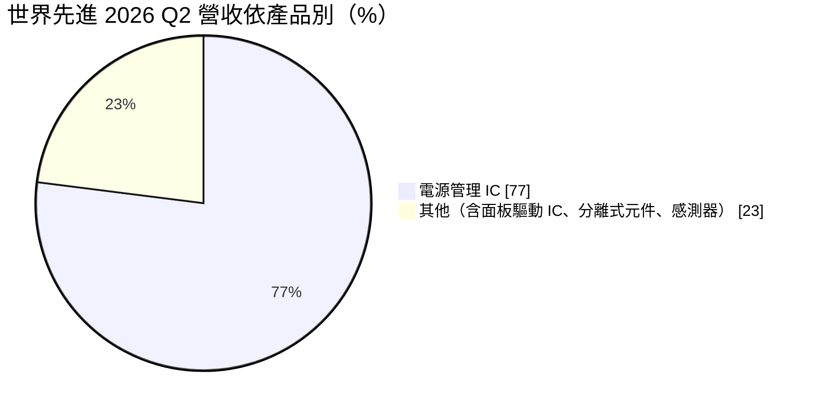
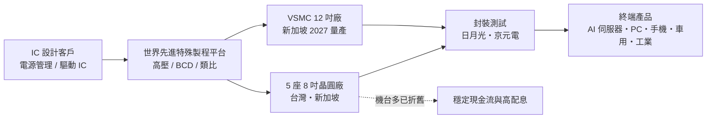
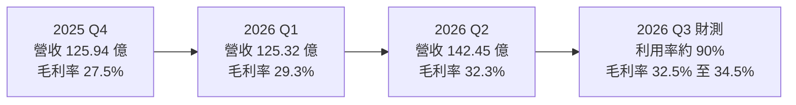
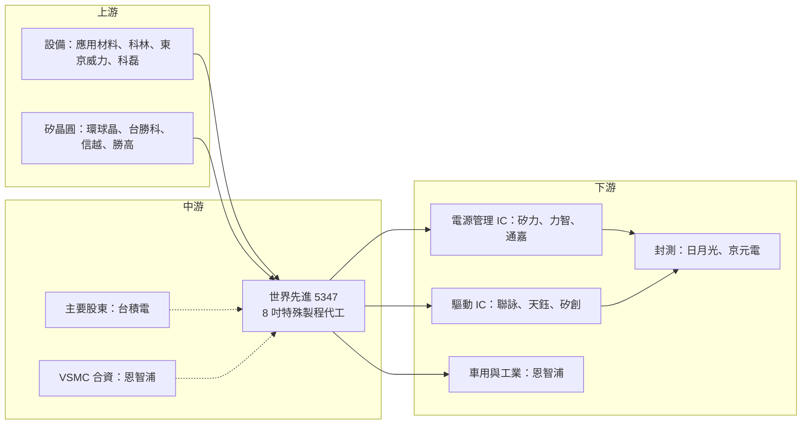

# 5347 世界先進

> 上櫃｜[[產業索引-半導體業|半導體業]]｜上市（櫃）日期 1998/03/25

# 第一章：企業模式與商業藍圖

> [!info] 撰寫說明
> 本文由 Claude 依公開資料整理，架構比照 [[2330台積電]] 的四章研究，資料截至 2026-10-07。財務數字來源：世界先進 2025 年第四季、2026 年第一季與第二季法說會報導（科技新報、工商時報、經濟日報、優分析）、6 月營收快訊（科技新報）、科技新報公司資料、CMoney 公司簡介；產業描述為整理性內容，尚未逐條比對原始文件。#待校對

在評估單一個股的長期投資價值時，首要步驟是拆解企業的底層獲利邏輯。本章針對世界先進積體電路（股票代號：5347，以下簡稱世界先進）的商業模式進行定性分析，說明一家以 8 吋廠為主的晶圓代工廠，如何靠電源管理晶片在 AI 時代找到成長動能，又為何要跨出 8 吋、到新加坡投資 12 吋廠。

## 一、核心定位：以 8 吋為主的特殊製程晶圓代工廠

世界先進成立於 1994 年 12 月，最初是政府科專計畫衍生的 DRAM 製造廠，2004 年停止生產 DRAM 後轉型為專業[[晶圓代工]]。[[2330台積電]] 是主要股東，國家發展基金也持有一定股份，董事長為方略。世界先進 1998 年上櫃，實收資本額約 187.85 億元。依 CMoney 整理，世界先進在全球晶圓代工排名約第九。

世界先進的定位是「[[成熟製程]]裡的[[特殊製程]]專家」，主力是 8 吋晶圓，製程集中在 0.18 微米及更成熟的節點，專長包括高壓、[[BCD]]（電源管理）、類比、射頻與嵌入式記憶體。這個定位有兩個商業意義：

* **不追線寬，追平台穩定度：** 不投入先進製程競賽，靠製程平台的穩定度與客戶黏著度經營，資本支出長期偏低。
* **已折舊 8 吋產能的成本優勢：** 多數機台已折舊完畢，全球 8 吋新設備供給有限，新進者很難以合理成本建立同等產能。

## 二、終端應用／產品板塊：電源管理是絕對主力

2026 年第二季的營收結構如下：

* **電源管理 IC：** 2026 年第二季占營收 77%，是最主要的成長動力，涵蓋 PC、手機、伺服器、車用與工業電源晶片。AI 伺服器的電源架構升級（高壓直流、多相電源）讓這塊需求增加。
* **面板驅動 IC：** 大尺寸與中小尺寸顯示驅動 IC（[[DDI]]），過去合計占比約兩成以上（2023 年第一季大面板 20%、中小面板 6%），近年比重隨電源管理成長而下降。
* **其他：** 分離式元件、感測器、射頻等。

公司在 2026 年第二季法說會表示，AI 相關產品營收上半年占比約為個位數，下半年將提升到雙位數，全年 AI 相關營收較 2025 年「幾乎翻倍」，並預期 2027 年還會有更明顯的成長。0.18 微米及更先進製程的營收比重也在持續提升。

## 三、資本轉化邏輯：已折舊 8 吋產能的現金機器

* **產能布局：** 擁有 5 座 8 吋晶圓廠，分布在台灣與新加坡，多數機台已折舊完畢。公司在 2026 年第二季法說會指出，現有五廠與新加坡廠仍有閒置空間，主要缺口是生產設備，目前正積極尋找可用機台並優化產線。
* **營運槓桿：** 折舊攤提完的產能，在[[產能利用率]]回升時，增加的營收大部分直接轉為利潤。2026 年第二季利用率持續上升，第三季預估達 90%，毛利率也從第一季的 29.3% 升到第二季的 32.3%。

## 四、企業長期藍圖：跨入 12 吋，與恩智浦合資新加坡 VSMC

世界先進最重要的長期布局，是與荷蘭車用晶片大廠恩智浦（NXP）在新加坡合資成立的 12 吋晶圓廠 [[VSMC]]（VisionPower Semiconductor Manufacturing Company）。這是世界先進首座 12 吋廠，鎖定混合訊號、電源管理與類比等成熟特殊製程（製程節點與技術來源細節本次未逐一查證）。

* **時程：** 依 2025 年第四季法說會報導，VSMC 預計 2026 年下半年送樣、年底前通過認證、2027 年第一季量產，2029 年月產能目標約 5.5 萬片 12 吋晶圓。
* **投資規模：** 2026 年資本支出估計達 600 億至 700 億元，大部分投入 VSMC。
* **戰略意義：** 讓世界先進從「8 吋專業廠」升級為「8 吋加 12 吋」的特殊製程代工廠，也具備非台灣、非中國的生產基地，符合國際客戶分散供應鏈的需求。

# 第二章：護城河深度與競爭優勢

在長期價值投資中，「護城河」指企業抵禦競爭、維持超額利潤的保護機制。本章分析世界先進的護城河構成、成熟製程與電源管理代工的競爭格局，以及這些優勢在中國同業擴產下能守住多少。

## 一、護城河的核心組成要素

世界先進的護城河屬於「窄到中等」，主要來自四個要素：

* **1. 特殊製程的客戶黏著度：** 電源管理與驅動 IC 的設計與製程參數高度綁定，車用與工業產品還需通過[[車規驗證]]，一旦在世界先進完成驗證，轉單成本高。
* **2. 低成本 8 吋產能：** 8 吋機台多已折舊完畢，且全球 8 吋新設備供給有限，這讓世界先進在景氣好時能維持穩定毛利。
* **3. 台積電體系背書：** 台積電是主要股東，讓世界先進在技術來源與客戶信任上占有優勢。
* **4. 恩智浦長期綁定：** VSMC 的合資夥伴恩智浦同時是重要客戶，形成穩定的長期需求。

## 二、全球主要競爭對手格局

| 對手 | 定位 | 對世界先進的威脅 |
|---|---|---|
| 中芯國際、華虹半導體 | 中國成熟製程與電源管理代工，受國產替代政策支持 | 以低價擴產，壓低消費性電源晶片報價 |
| 格羅方德、高塔半導體（Tower） | 國際特殊製程代工廠 | 在類比、射頻、電源管理領域重疊，搶歐美客戶 |
| [[2303聯電]] | 8 吋與 12 吋成熟製程同時布局 | 在驅動 IC 與電源管理上重疊 |
| [[6770力積電]] | 台灣 8 吋與 12 吋成熟製程 | 電源管理與驅動 IC 代工重疊 |
| [[2330台積電]] | 主要股東，但也有成熟與特殊製程產能 | 服務部分相同客戶 |

## 三、優勢轉化：哪些市場守得住、哪些守不住

* **守得住：** AI 伺服器、車用與工業電源晶片的驗證門檻高，且國際客戶偏好非中國產能；2026 年第二季產能利用率持續上升，第三季預估達 90%，公司描述整體處於供不應求。
* **守不住：** 消費性電源與驅動 IC 容易受中國同業低價衝擊，2026 年第一季公司曾預期[[平均售價]]季減 3% 至 5%。
* **轉折點：** 第二季起價格回升，第三季展望平均售價季增 2% 至 4%，毛利率預估 32.5% 至 34.5%，顯示 AI 電源需求帶動的漲價效應開始出現。
* **觀察重點：** VSMC 送樣與認證進度、AI 電源相關營收比重能否如期在下半年達雙位數、設備瓶頸何時解除，以及 VSMC 量產後折舊對毛利率的影響。

# 第三章：財務體質與盈利規模

資料日期：2026-10-07。數字取自公司法說會與財經媒體整理（科技新報、工商時報、優分析），表格是撰寫當時的快照；最新月營收、毛利率、累計 EPS 由自動排程寫在本筆記的屬性欄位（月營收、毛利率、累計EPS 等）。#待校對

財務報表是檢驗護城河是否真實存在的最終標準。本章用三率、ROE、現金流與資本報酬，檢視世界先進在成熟製程回升期與 12 吋投資期交會下的獲利品質。

## 一、獲利能力的基石：三率

| 項目 | 2025 全年 | 2025 Q4 | 2026 Q1 | 2026 Q2 |
|---|---|---|---|---|
| 營收（新台幣） | 485.91 億 | 125.94 億 | 125.32 億 | 142.45 億 |
| [[毛利率]] | 28.1% | 27.5% | 29.3% | 32.3% |
| [[營業利益率]] | 16.0% | 14.4% | 16.7% | 20.4% |
| 歸屬母公司淨利 | 79.07 億 | 約 17.5 億 | 22.46 億 | 29.75 億 |
| EPS（元） | 4.3 | 約 0.95 | 1.18 | 1.56 |

* **[[毛利率]]：** 由產能利用率與平均售價共同決定。2025 年 28.1% 為三年新高，2026 年第二季升到 32.3%，第三季財測再上看 32.5% 至 34.5%。
* **[[營業利益率]]：** 費用相對固定，營收回升時擴張比毛利率更快，從 2025 年第四季的 14.4% 升到 2026 年第二季的 20.4%。
* **2025 年：** 營收年增 10.3%，為歷史第二高。
* **2026 年第二季：** 營收季增 13.7%、年增 21.8%，淨利 29.75 億元創 15 季新高。6 月單月營收 59.77 億元創歷史新高，上半年合併營收 267.76 億元、年增 13.23%。
* **第三季展望：** 出貨量季增 1% 至 3%，平均售價季增 2% 至 4%，產能利用率約 90%。

## 二、[[ROE]]：資本效率

世界先進過去以 8 吋已折舊產能經營，資本支出低，ROE 在景氣好時可達雙位數高段（推估，精確值本次未查得）。VSMC 進入量產後，資產規模與折舊會大幅增加，若初期產能利用率不高，ROE 可能短期下滑（推估）。

## 三、資本支出與自由現金流

* **[[CapEx]]：** 2026 年預估 600 億至 700 億元，遠高於過去以 8 吋為主時期的水準，主要投入新加坡 VSMC 12 吋廠。
* **[[自由現金流]]：** 世界先進正從「高現金流、低資本支出」轉為「大規模投資期」，自由現金流將明顯縮小。2027 年起 VSMC 量產後折舊逐步增加，需要靠 AI 電源與車用需求提高產能利用率來吸收。
* **股利政策：** 2025 年度配發每股現金股利 4.5 元，連續第五年維持此水準，[[配發率]]約 104.65%，連續第三年超過當年可分配盈餘。以 2026 年 2 月初股價計算殖利率約 3.3%。在大規模投資 VSMC 期間，能否維持超過 100% 的配發率是需要觀察的重點。

## 四、[[ROIC]] 與 [[WACC]]：價值創造利差

8 吋時代的世界先進，投入資本多已折舊、營業利益穩定，ROIC 推估明顯高於資金成本。VSMC 讓投入資本大幅增加，在 2027 至 2029 年產能爬坡期間，ROIC 可能被稀釋到接近資金成本（推估，具體數值未查得）。12 吋廠能否在 2029 年滿載，是利差能否恢復的關鍵。

# 第四章：總體風險與地緣政治

任何企業都無法脫離宏觀環境獨立存在。本章分析世界先進未來必須面對的地緣政治、產業週期、營運與技術風險。

## 一、地緣政治風險

* **新加坡布局的避險價值：** VSMC 與既有新加坡 8 吋廠提供非台灣、非中國的產能，對國際車用與工業客戶具吸引力。
* **中國競爭與關稅：** 中國同業在成熟製程大舉擴產，若以價格戰搶占電源管理代工市場，世界先進的消費性產品報價會受壓。美國對中國成熟製程晶片的關稅政策，則可能讓部分客戶轉單到台灣與新加坡。
* **台灣集中風險：** 多數 8 吋產能仍在台灣，面臨兩岸情勢與供電穩定等風險。

## 二、產業週期與市場結構風險

* **成熟製程供過於求：** 中國 8 吋與 12 吋成熟製程產能持續開出，2027 年至 2028 年報價可能再度承壓。
* **終端需求週期與[[長鞭效應]]：** 電源管理晶片需求連動 PC、手機、伺服器與車用，消費性電子轉弱時，庫存調整會沿供應鏈放大，直接影響產能利用率。
* **匯率：** 營收以美元計價為主，新台幣升值會壓縮毛利率。

## 三、營運環境的隱性風險

* **VSMC 執行風險：** 12 吋廠的認證、[[良率]]與客戶導入若延後，龐大的資本支出會形成折舊壓力。
* **設備瓶頸：** 公司表示目前主要缺口是生產設備，8 吋二手設備取得困難，可能限制短期擴產速度。
* **高配息與資本支出的平衡：** 大規模投資期間仍維持高配發率，若獲利不如預期，可能需要調整股利或增加舉債。

## 四、科技演進風險

世界先進的製程以 0.18 微米及更成熟節點為主，AI 伺服器電源與車用晶片逐步往 12 吋、90 奈米至 40 奈米製程移動，若 VSMC 的技術轉移與量產順利，能補上這塊缺口；若延後，可能被聯電、格羅方德、中芯等擁有成熟 12 吋產能的對手搶走客戶。另一方面，氮化鎵（[[GaN]]）等第三代半導體在電源轉換的應用擴大，也可能部分取代傳統矽基電源晶片。

# 專有名詞解析

## 半導體

- **[[晶圓代工]]**：替其他公司製造晶片、本身不賣自有品牌晶片的商業模式，代表廠商為台積電、聯電。
- **[[成熟製程]]**：一般指 28 奈米及更大線寬的製程，技術成熟、設備多已折舊，主要用於電源、驅動、車用與物聯網晶片。
- **[[特殊製程]]**：在成熟線寬上加入高壓、嵌入式記憶體、射頻等特殊功能的製程平台，差異化程度高於一般邏輯製程。
- **[[BCD]]**：Bipolar-CMOS-DMOS 製程，把類比、數位與高功率元件整合在同一晶片，主要用於電源管理 IC。
- **[[DDI]]**：顯示驅動 IC，負責控制面板每個像素的電壓，需要高壓製程，聯詠、奇景為主要設計公司。
- **[[VSMC]]**：世界先進與恩智浦在新加坡合資的 12 吋晶圓廠，鎖定混合訊號、電源管理與類比製程，預計 2027 年量產。
- **[[良率]]**：一片晶圓上合格晶片占全部晶片的比例，新廠量產初期良率爬升速度決定獲利何時出現。
- **[[GaN]]**：氮化鎵，第三代半導體材料，耐高壓、切換速度快，用於快充、資料中心電源與車用電源轉換。

## 應用

- **[[車規驗證]]**：車用晶片須通過 AEC-Q100 等可靠度測試與車廠認證，流程常需 2 至 3 年，因此轉換成本高。

## 金融

- **[[產能利用率]]**：實際投片量占總產能的比例，晶圓代工廠的毛利率高度取決於此數字。
- **[[平均售價]]**：總營收除以出貨數量，晶圓代工常以每片晶圓的平均售價觀察報價趨勢。
- **[[配發率]]**：現金股利占當年每股盈餘的比例，超過 100% 代表配發金額高於當年獲利。
- **[[自由現金流]]**：營業活動現金流減去資本支出，代表企業可自由用於配息、還債或併購的現金。
- **[[長鞭效應]]**：終端需求的小幅變動，沿供應鏈往上游傳遞時被逐級放大，造成上游庫存與訂單劇烈波動。

# 核心供應鏈

## 1. 上游：設備、材料與矽晶圓
- 半導體設備：[[AMAT應用材料]]、[[LRCX科林研發]]、[[8035東京威力科創]]、[[KLAC科磊]]
- 矽晶圓：[[6488環球晶]]、[[3532台勝科]]、[[4063信越化學]]、[[3436勝高]]

## 2. 中游：世界先進本身與合作夥伴
- 主要股東：[[2330台積電]]
- 新加坡 VSMC 合資夥伴：恩智浦（NXP）

## 3. 下游：主要 IC 設計客戶（推估，依產業報導整理）
- 電源管理 IC：[[6415矽力-KY]]、[[6719力智]]、[[3588通嘉]]
- 驅動 IC：[[3034聯詠]]、[[4961天鈺]]、[[8016矽創]]
- 車用與工業：恩智浦（NXP）

## 4. 下游：封裝測試
- [[3711日月光投控]]、[[2449京元電子]]

延伸閱讀：[[台積電供應鏈]]

## 供應鏈關係
- 供應給 [[2454聯發科]]：電源管理與驅動 IC 代工（聯發科供應鏈 › 中游：晶圓代工生產夥伴 (Foundry)）

## 最新新聞
<!-- news:start（自動產生，請勿手動編輯此範圍） -->
- 2026-10-09 📰 媒體 17:33｜熱門股》成熟製程需求上揚 世界漲停｜[自由時報](https://news.google.com/rss/articles/CBMiWEFVX3lxTE8yX0x5a211OFMxWDJycDlmQWRUU2VJcG1Uc2dfYTN6WlRIbUlQeFNXWWpIT1hLRmxtdHAtZlhPdll6YzZ5a0xaZjl2V3owd3lsOXJUWVE4Ti0?oc=5)
- 2026-10-09 📰 媒體 12:49｜討論牆 ／ 鉅亨速報 - Factset 最新調查：世界(5347-TW)目標價調降至187元，幅度約3.61%｜[LINE TODAY](https://news.google.com/rss/articles/CBMiZEFVX3lxTFB3MUhhdEo0WWZETUxqT0hxSGRnal84WUd5LUNNWTVnMXB4c0FrLWdtMzJMLXNmZGN4Ynp2cjZtUlF1eTE1UjlsSG5jN3Y2UE1sV0pvOGFxQjl6S01Dc2MyekV2UWo?oc=5)
- 2026-10-09 📰 媒體 12:43｜《半導體》世界Q3營收157.02億 創單季新高｜[富聯網](https://news.google.com/rss/articles/CBMiiAFBVV95cUxNSm9NdzhHNjJxTGlDaGlxZzAwbzFPdGd0aFpiYUlWN09WUTBMQW5NS3NZMWwtNFE0UXZMSXI3cVJic3J6X0ZfbUh1aTVISTlvWWRBWlBaWFlaRmFpOWhtY2J5dkZOTnUxMUVVY0J5N3Y3NW5BSFRZX2pXVnE1bk9OSWppX0pzVENJ?oc=5)
- 2026-10-09 📰 媒體 08:10｜鉅亨速報 - Factset 最新調查：世界(5347-TW)目標價調降至187元，幅度約3.61%｜[鉅亨網](https://news.cnyes.com/news/id/6626606)
- 2026-10-08 📰 媒體 18:00｜世界先進9月營收59億、年增15.5%！新加坡廠試產良率破99% 明年Q1量產｜[FTNN](https://news.google.com/rss/articles/CBMiS0FVX3lxTE1PTk1hci1INV8tS0hCRGpUeHdTY01VS0JFXzBLOTlYQS0yamtHLXNCd0s5TTlXanVFVXo4cGtLWGEzNDhMMTZ0UmhNQQ?oc=5)

完整紀錄：[[5347世界先進 新聞]]
<!-- news:end -->

## 相關連結
- [公開資訊觀測站](https://mopsov.twse.com.tw/mops/web/t05st03?step=1&firstin=1&co_id=5347)
- [Goodinfo](https://goodinfo.tw/tw/StockDetail.asp?STOCK_ID=5347)
- [Yahoo 股市](https://tw.stock.yahoo.com/quote/5347)
- [鉅亨網新聞](https://www.cnyes.com/twstock/5347/news)
