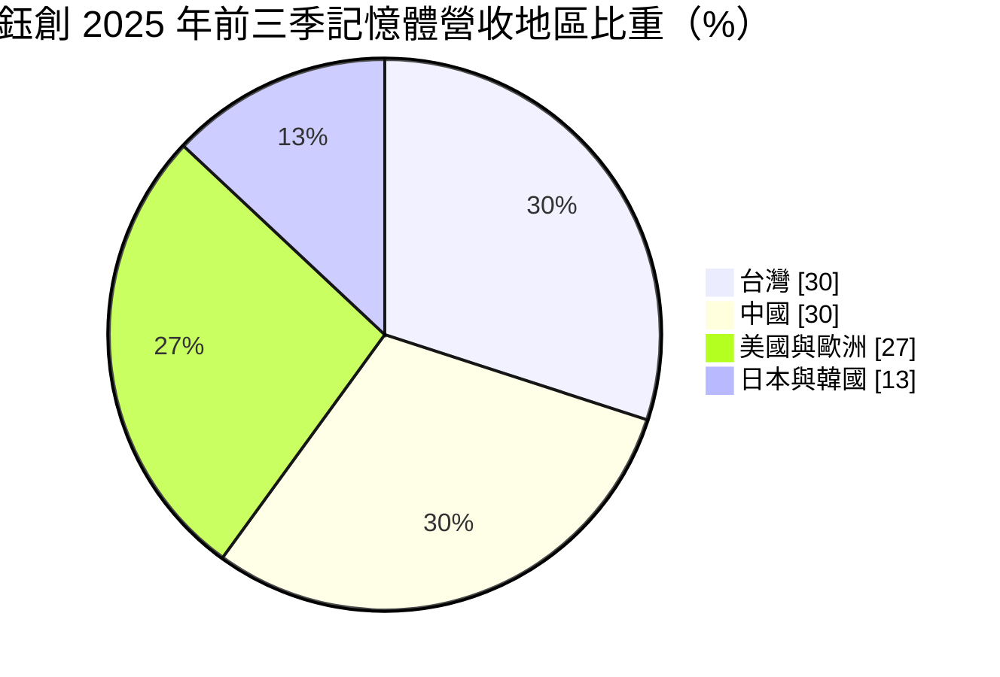
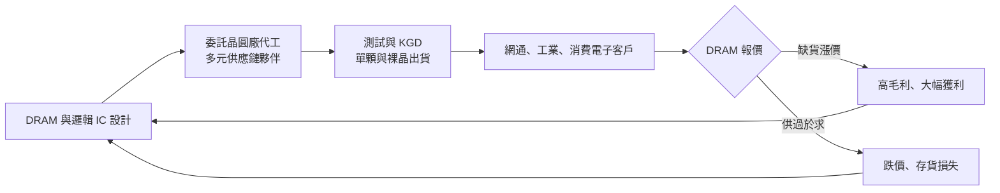
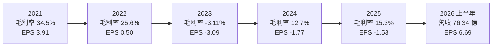
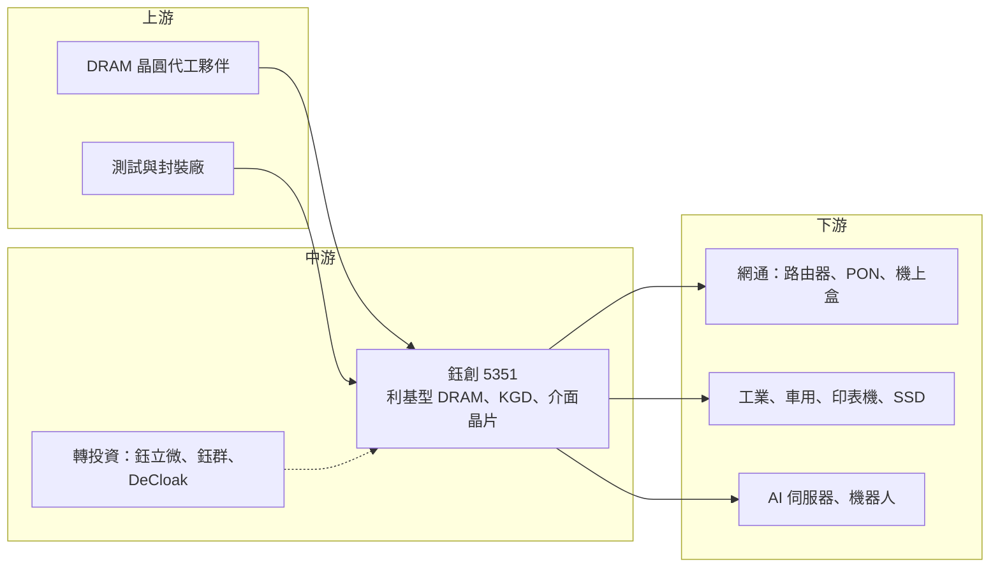

# 5351 鈺創

> 上櫃｜[[產業索引-半導體業|半導體業]]｜上市（櫃）日期 1998/05/15

# 第一章：企業模式與商業藍圖

> [!info] 撰寫說明
> 本文由 Claude 依公開資料整理，架構比照 [[2330台積電]] 的四章研究，資料截至 2026-10-08。財務數字來源：Goodinfo 年度經營績效、股利政策與基本資料頁，鈺創 2025 年第三季法說會簡報（2025 年 11 月），旺得富（中時）2026 年 8 月財報報導；產業描述為整理性內容，尚未逐條比對原始文件。#待校對

在評估單一個股的長期投資價值時，首要步驟是拆解企業的底層獲利邏輯。本章針對鈺創科技（股票代號：5351，以下簡稱鈺創）的商業模式進行定性分析，說明一家不擁有晶圓廠的 [[DRAM]] 設計公司，為什麼獲利會隨記憶體景氣劇烈擺盪，以及它如何嘗試用[[Edge AI]] 記憶體與介面晶片建立第二支柱。

## 一、核心定位：無晶圓廠的利基型記憶體設計公司

鈺創成立於 1991 年，總部位於新竹科學園區，英文名稱為 Etron，1998 年在櫃買中心掛牌。創辦人暨董事長盧超群是台灣半導體界的資深人物，長期主導公司策略，總經理為鄧茂松。

鈺創的核心事業是[[利基型記憶體]]：設計容量較小、規格較舊、但需要長期供貨的 DRAM，例如 SDR、DDR、DDR2、DDR3、[[DDR4]] 與 [[LPDDR]]4/4X，應用在 Wi-Fi 路由器、光纖網路設備、機上盒、網路攝影機、印表機、SSD 與工業電腦。這類產品不是手機與伺服器用的主流 DRAM，而是三星、SK 海力士、美光等大廠逐步淡出、但大量電子設備仍然需要的記憶體。

鈺創和一般 DRAM 廠最大的不同在於它是 [[Fabless]]：自己設計 DRAM，委託晶圓廠代工生產。這個定位有兩個商業意義：

* **資本較輕，但定價權弱：** 不需自建記憶體晶圓廠，資本支出遠低於 DRAM 製造商；但產品價格完全跟著 DRAM 市場行情走，產能也受制於代工夥伴。
* **長期供貨是賣點：** 網通與工業客戶需要同一顆記憶體供貨十年以上，大廠停產舊規格時，鈺創可以補上缺口。

此外，鈺創提供 [[KGD]] 方案，也就是經過完整測試、可直接與客戶晶片封裝在一起的裸晶，讓客戶把記憶體與處理器整合在同一顆封裝內，這是鈺創長期的技術特色。

## 二、終端應用與產品板塊

依 2025 年第三季法說會，2025 年前三季記憶體營收依終端用戶地區分布如下：

在台灣的 30% 中，KGD 占 16%、單顆記憶體占 14%；中國的 30% 中，KGD 占 25%、單顆記憶體占 5%。約七成記憶體營收來自海外。單顆記憶體（Discrete）的客戶更偏向歐美日韓，約占 65%。

產品線可以分成三個層次：

* **利基型 DRAM（主要營收）：** DDR4 容量 4Gb 至 16Gb、LPDDR4/4X 容量 1Gb 至 32Gb，主打長期穩定供應，另有 SPI NAND 與 e.MMC 等產品。
* **Edge AI 記憶體與 MemorAiLink 平台：** 針對邊緣裝置上的小型語言模型設計的寬頻 DRAM，容量 8Gb 起、最高 32Gb，32Gb 方案具 512 個輸入輸出、頻寬 204.8GB/s，宣稱可節省 30% 以上功耗；並提供 DRAM、PHY 與控制器的完整方案，以及異質整合封裝服務。
* **介面晶片與系統方案：** USB Host Controller 已打入台灣一線伺服器供應商的 AI 伺服器；支援 USB4 與 DisplayPort 2.1 傳輸線的 PD 3.2 控制晶片；以及隱私安全人臉辨識引擎與機器人感測平台。

集團轉投資包括 eYs3D（鈺立微，3D 感測與視覺）、eEver（鈺群，傳輸與介面）與 DeCloak（隱私運算），鈺創把它們定位為感知與決策、傳輸與介面、隱私與智能三大領域的布局。

## 三、資本轉化邏輯：記憶體週期決定一切

鈺創的獲利公式很簡單：營收等於出貨量乘以 DRAM 價格，成本則主要是向代工廠買晶圓的價格。當 DRAM 缺貨、價格上漲時，鈺創賣得貴、存貨增值，毛利率大幅提升；當 DRAM 供過於求，價格下跌，存貨就要提列[[存貨跌價損失]]，毛利率甚至可能轉負。2023 年鈺創毛利率為 -3.11%，正是這種情況。

2026 年的發展是這個邏輯的最佳例證。AI 伺服器帶動 [[HBM]] 需求，記憶體大廠把產能轉向 HBM 與高階 DRAM，排擠了 DDR4、DDR3 等舊規格的供給。依旺得富報導，鈺創 2026 年第二季營收約 48.99 億元，上半年營收約 76.34 億元、歸屬母公司淨利約 21.94 億元、EPS 6.69 元，與 2023 至 2025 年連續虧損形成強烈對比。這不是公司本身的結構改變，而是記憶體週期翻轉，投資人需要把它當作週期高點的獲利來理解。

## 四、企業長期藍圖

* **從記憶體供應商轉為記憶體加邏輯的次系統公司：** 鈺創認為自己在客製化記憶體與邏輯晶片整合方面具有相對優勢，希望以 MemorAiLink 平台提供邊緣 AI 裝置完整的記憶體方案。
* **[[Physical AI]] 與機器人：** 法說會引述的研究預估，Physical AI 市場規模將由 2024 年約 38 億美元成長到 2034 年約 680 億美元，鈺創以 XINK 機器人與感測平台切入工業機器人與農業機器人等應用。
* **AI 伺服器周邊：** USB Host Controller 與高功率 PD 控制晶片切入 AI 伺服器與邊緣 AI 伺服器，屬於非記憶體的成長方向。

這些新事業若能形成規模，將降低鈺創對 DRAM 週期的依賴；但到目前為止，公司的損益仍主要由記憶體價格決定。

# 第二章：護城河深度與競爭優勢

護城河決定企業能否長期守住獲利。本章分析鈺創在利基型記憶體市場的競爭優勢，以及在記憶體大廠與中國廠商夾擊下的處境。

## 一、護城河的核心組成要素

* **長期供貨與舊規格的承接能力：** 網通、工業與車用客戶的產品生命週期長，需要記憶體長期供貨。大廠淡出舊規格後，鈺創能提供替代來源，客戶重新驗證新記憶體的成本高，形成一定的轉換成本。
* **KGD 與異質整合經驗：** 長期提供已測試裸晶，讓客戶把 DRAM 與處理器封裝在一起。這需要測試、封裝與設計的整合能力，是一般記憶體模組廠沒有的技術。
* **記憶體加邏輯的設計能力：** 鈺創同時擁有 DRAM、記憶體介面 IP 與邏輯晶片（USB、PD）的設計能力，可以提供客製化記憶體次系統。這是它在邊緣 AI 記憶體上主張的差異化。
* **經營者的產業人脈：** 董事長盧超群長期活躍於國際半導體產業組織，對產業趨勢與供應鏈關係有深厚經驗（定性判斷）。

但鈺創的護城河有一個根本限制：它不擁有晶圓廠，DRAM 產能與成本取決於代工夥伴。當產能吃緊時，代工廠會優先供應自家產品或大客戶；當價格崩跌時，鈺創沒有成本優勢可以承受價格戰。

## 二、全球主要競爭對手格局

| 對手 | 定位 | 對鈺創的威脅 |
|---|---|---|
| [[2344華邦電]] | 擁有自有晶圓廠的利基型 DRAM 與 NOR Flash 大廠 | 自有產能、成本與供貨穩定性優於鈺創 |
| [[2408南亞科]] | 台灣 DRAM 製造商，DDR4 與 DDR5 | 在 DDR4 等標準型利基 DRAM 有規模優勢 |
| [[3006晶豪科]] | 台灣利基型記憶體設計公司 | 商業模式最接近，在網通與消費電子直接競爭 |
| [[6531愛普]] | 客製化記憶體與 IoT RAM 設計公司 | 在邊緣 AI 與客製化記憶體方案競爭 |
| 中國 DRAM 廠 | 政策扶植，擴產 DDR4 與 LPDDR4 | 以低價搶占利基型 DRAM 市場，壓低長期報價 |

## 三、優勢轉化：哪些市場守得住、哪些守不住

* **守得住：** 需要長期供貨的網通、工業與車用客戶，以及需要 KGD 與客製化整合的專案。這些客戶看重供貨承諾與技術支援，價格敏感度較低。
* **守不住：** 一般消費性產品使用的標準型 DDR3、DDR4。中國 DRAM 廠擴產後，標準型利基 DRAM 的長期價格會被壓低，鈺創在這部分缺乏成本優勢。
* **觀察重點：** 第一是 Edge AI 記憶體與 MemorAiLink 平台能否取得量產客戶；第二是 USB 與 PD 等非記憶體產品的營收比重能否提高；第三是 2026 年週期高點的獲利是否被用來強化財務體質，而不是在下一次低谷再度虧損。

# 第三章：財務體質與盈利規模

資料日期：2026-10-08。數字取自 Goodinfo 年度經營績效與股利政策頁、鈺創 2025 年第三季法說會簡報、旺得富財報報導，表格是撰寫當時的快照；最新月營收、毛利率、累計 EPS 由自動排程寫在本筆記的屬性欄位（月營收、毛利率、累計EPS 等）。#待校對

財務報表是檢驗護城河是否真實存在的最終標準。本章用五年的三率、[[ROE]]、現金流與資本報酬，檢視鈺創在記憶體週期中的獲利品質。

## 一、獲利能力的基石：三率

| 年度 | 營收（新台幣） | [[毛利率]] | [[營業利益率]] | EPS（元） | [[ROE]] |
|---|---|---|---|---|---|
| 2021 | 61.5 億 | 34.5% | 18.4% | 3.91 | 28.4% |
| 2022 | 46.8 億 | 25.6% | 1.78% | 0.50 | 1.74% |
| 2023 | 26.6 億 | -3.11% | -44.1% | -3.09 | -25.6% |
| 2024 | 34.7 億 | 12.7% | -18.8% | -1.77 | -15.8% |
| 2025 | 40.4 億 | 15.3% | -14.4% | -1.53 | -14.1% |

把時間拉長，鈺創的財務呈現典型的記憶體週期型態。依 Goodinfo，2016 至 2020 年鈺創連續五年虧損，毛利率只有 12% 至 16%；2021 年記憶體缺貨，毛利率衝上 34.5%，EPS 3.91 元；2023 年記憶體崩跌，毛利率轉負、營業利益率 -44%；2026 年上半年又因 AI 排擠舊規格產能而大幅獲利。過去十年中，鈺創只有 2021、2022 與 2026 年有明顯獲利，多數年份處於虧損。

營業費用是另一個關鍵。2025 年第三季營業費用約 3.31 億元，一年超過 12 億元（推估），在營收 30 億至 40 億元的規模下，毛利率必須超過三成才能損益兩平。這也解釋了為何只有在記憶體缺貨、價格大漲時，鈺創才能獲利。2016 至 2025 年營收年複合成長率約 -5.1%（推算），2020 至 2025 年約 2.6%（推算）。

## 二、[[ROE]]：資本效率

2021 至 2025 年平均 ROE 約 -5.1%（推算），長期資本效率為負。股本方面，2020 年股本由約 43.5 億元降到約 26.8 億元（推估為減資彌補虧損），之後又因增資回升到約 32.6 億元。2025 年 9 月底股東權益約 37.3 億元，負債比率約 45%，比 2024 年底的 36% 上升，長期負債由約 2.1 億元增加到約 15.5 億元，代表連續虧損期間公司透過舉債支應營運。

## 三、資本支出與[[自由現金流]]

鈺創屬 Fabless 模式，資本支出不大，2024 年約 1.67 億元。真正的現金壓力來自營運資金：2025 年 9 月底存貨約 25.7 億元，占總資產約 68.3 億元的三分之一以上；2024 年全年營業現金流約 -0.11 億元，2025 年第一季約 -4.01 億元，[[自由現金流]]在低谷期為負。換句話說，鈺創在記憶體低谷時必須先投入大量資金備貨，等待週期翻轉才能回收。

股利方面，依 Goodinfo，2016 至 2025 年度只有 2021 年度配發現金股利 0.798 元與股票股利 0.499 元、2022 年度配發現金 0.02 元與股票股利 0.14 元，其餘年度都沒有配息。鈺創長期把現金留在公司以支應營運與研發，股利不是它的投資價值來源。

## 四、[[ROIC]] 與 [[WACC]]：價值創造利差

**ROIC 推算：** 2025 年營業虧損約 5.82 億元（40.4 億 × -14.4%），ROIC 為負。投入資本以 2025 年 9 月底股東權益約 37.3 億元加長期負債約 15.5 億元（視為有息負債），約 52.8 億元計算，ROIC 約 -11%（推算，虧損期間不計稅）。對照 2021 年，稅後營業利益約 9.05 億元（61.5 億 × 18.4% × 0.8），以淨利 10.5 億元與 ROE 28.4% 回推權益約 37 億元，ROIC 約 24%（推算，未計入負債）。

**WACC 推算：** 權益成本用 CAPM 估計，假設台灣 10 年期公債殖利率 1.75%、市場風險溢酬 6%、β 取記憶體同業常見值 1.3，權益成本約 9.55%。負債成本假設 2.5%，稅後約 2.0%；資本結構以帳面值估計，權益約 71%、負債約 29%，WACC 約 7.3%（推算）。

**結論：** 鈺創只有在記憶體缺貨的年份（2021 年，以及 2026 年上半年）ROIC 明顯高於 WACC，其餘多數年份 ROIC 為負，長期平均沒有創造經濟價值。投資鈺創本質上是在判斷記憶體週期；若要擺脫這種命運，關鍵在於 Edge AI 記憶體與介面晶片等非週期性業務能否成長到足以支撐固定費用。

# 第四章：總體風險與地緣政治

任何企業都無法脫離宏觀環境獨立存在。本章分析鈺創未來必須面對的地緣政治、產業週期、營運與技術風險。

## 一、地緣政治

* **中國市場的雙重角色：** 約三成記憶體營收來自中國，其中多數為 KGD。中國一方面是重要客戶，另一方面中國 DRAM 廠在政策扶植下擴產利基型 DRAM，長期會壓低價格並搶占市場。
* **美國出口管制：** 美國對中國記憶體產業的管制，可能限制中國 DRAM 廠的先進製程，間接讓中國廠集中火力在成熟的利基型 DRAM，加劇這個市場的競爭。
* **非中國供應鏈需求：** 歐美日韓客戶占單顆記憶體營收約 65%，在供應鏈去中國化的趨勢下，台灣的利基型記憶體供應商有機會取得更多訂單。

## 二、產業週期與市場結構

* **極端的記憶體週期：** DRAM 是全球景氣循環最劇烈的半導體產品之一。2021 年缺貨、2023 年崩跌、2026 年再度缺貨，鈺創的損益在數年間從大賺到大虧再到大賺。
* **AI 帶來的結構性排擠：** 記憶體大廠把產能轉向 HBM 與高階 DRAM，使 DDR4 等舊規格供給減少。這對利基型記憶體是利多，但效果取決於大廠的產能策略，一旦大廠或中國廠重新擴充舊規格產能，價格就可能反轉。
* **[[長鞭效應]]：** 缺貨時客戶會重複下單、擴大庫存，等供給恢復後再大幅去化庫存，放大鈺創的營收與存貨波動。

## 三、營運環境的隱性風險

* **存貨跌價風險：** 存貨占總資產比重高，DRAM 價格下跌時必須提列跌價損失，直接侵蝕毛利率。2023 年毛利率轉負就是例子。
* **產能依賴代工夥伴：** 不擁有晶圓廠，缺貨時可能拿不到足夠產能，跌價時又無法降低晶圓成本。
* **財務體質：** 連續虧損期間負債比率上升，若下一次低谷來臨前沒有利用高峰期改善財務，營運資金壓力可能再度出現。
* **經營層傳承：** 創辦人長期主導公司策略，未來的經營層交接是長期需要關注的議題。

## 四、科技或法規演進

* **舊規格的生命週期：** DDR3、DDR4 終將被 DDR5 與 LPDDR5 取代，鈺創必須持續推出新世代利基產品，才能避免產品線老化。
* **邊緣 AI 記憶體的標準之爭：** 邊緣 AI 裝置需要高頻寬、低功耗的記憶體，鈺創的寬頻 DRAM 能否成為客戶採用的方案，取決於處理器平台與封裝技術的發展。這是機會，也有被大廠標準方案取代的風險。

# 專有名詞解析

## 半導體

- **[[DRAM]]**：動態隨機存取記憶體，電腦與電子設備運算時暫存資料的主要記憶體，斷電後資料會消失。
- **[[利基型記憶體]]**：容量較小、規格較舊但需長期供貨的記憶體，用於網通、工業與消費電子，主流大廠多已淡出。
- **[[DDR4]]**：第四代雙倍資料率 DRAM 標準，主流電腦已轉向 DDR5，但網通與工業設備仍大量使用。
- **[[LPDDR]]**：低功耗 DRAM，原本用於手機，也廣泛用於需要省電的嵌入式與邊緣裝置。
- **[[KGD]]**：已知良好晶粒，經過完整測試確認功能正常的裸晶，可直接與其他晶片封裝在一起。
- **[[HBM]]**：高頻寬記憶體，把多層 DRAM 垂直堆疊，與 AI 加速器封裝在一起，是 AI 伺服器的關鍵元件。
- **[[Fabless]]**：無晶圓廠 IC 設計公司，只負責設計晶片，生產委託晶圓代工與封測廠完成。

## 應用

- **[[Edge AI]]**：在終端設備上直接執行 AI 運算，而不把資料全部送到雲端，可降低延遲與頻寬成本。
- **[[Physical AI]]**：讓 AI 感知並操作實體世界的應用，例如機器人、自動化設備與自駕車。

## 金融

- **[[存貨跌價損失]]**：存貨的市價低於帳面成本時，公司必須認列的損失，記憶體價格下跌時尤其常見。
- **[[長鞭效應]]**：終端需求的小幅變動，沿供應鏈往上游傳遞時被逐級放大，造成上游庫存與訂單劇烈波動。
- **[[ROE]]**：股東權益報酬率，稅後淨利除以股東權益，衡量股東投入的資金每年賺回多少。
- **[[ROIC]]**：投入資本報酬率，稅後營業利益除以股東權益加有息負債，衡量本業運用資本的效率。
- **[[WACC]]**：加權平均資金成本，股東與債權人要求報酬率的加權平均，是 ROIC 需要超越的門檻。
- **[[自由現金流]]**：營業活動現金流減去資本支出，代表企業可自由用於配息、還債或併購的現金。

# 核心供應鏈

## 1. 上游：晶圓代工與封測
- DRAM 晶圓代工：公開資料以「多元供應鏈夥伴」描述，本次未查得具體合作廠商

## 2. 中游：鈺創本身與轉投資
- 產品：利基型 DRAM、KGD、Edge AI 寬頻 DRAM、USB Host Controller、PD 控制晶片
- 轉投資：eYs3D（鈺立微）、eEver（鈺群）、DeCloak

## 3. 下游：主要應用
- 網通設備、機上盒、網路攝影機、印表機、SSD、工業電腦（公司未揭露具名客戶）
- AI 伺服器：USB Host Controller 已打入台灣一線伺服器供應商

## 4. 同業與競爭者
- [[2344華邦電]]、[[2408南亞科]]、[[3006晶豪科]]、[[6531愛普]]

## 最新新聞
<!-- news:start（自動產生，請勿手動編輯此範圍） -->
- 2026-10-06 📰 媒體 19:50｜營收速報 - 鈺創(5351)9月營收24.07億元年增率高達500.29％｜[鉅亨網](https://news.cnyes.com/news/id/6622943)

完整紀錄：[[5351鈺創 新聞]]
<!-- news:end -->

## 相關連結
- [公開資訊觀測站](https://mopsov.twse.com.tw/mops/web/t05st03?step=1&firstin=1&co_id=5351)
- [Goodinfo](https://goodinfo.tw/tw/StockDetail.asp?STOCK_ID=5351)
- [Yahoo 股市](https://tw.stock.yahoo.com/quote/5351)
- [鉅亨網新聞](https://www.cnyes.com/twstock/5351/news)
