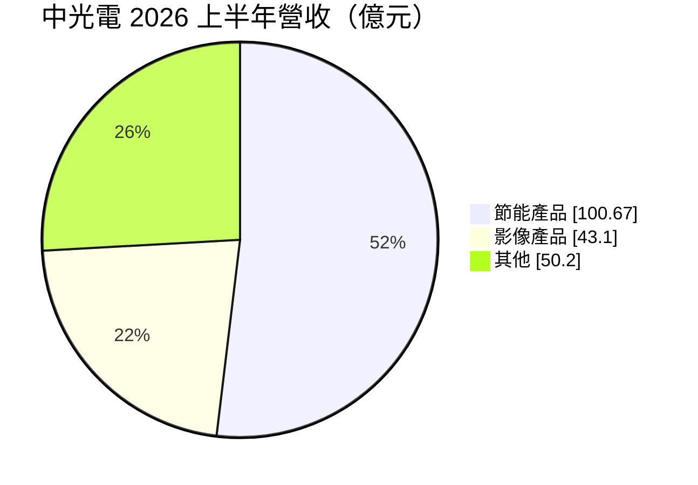
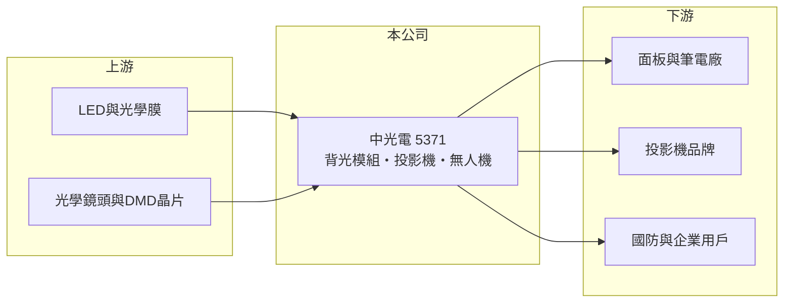

# 5371 中光電

> 上櫃｜[[產業索引-光電業|光電業]]｜上市（櫃）日期 1999/01/20

# 第一章：企業模式與商業藍圖

> [!info] 撰寫說明
> 精簡版，由 Claude 依公開資料整理，架構比照 [[2330台積電]]，資料截至 2026-10-07。來源：聯合新聞網中光電 2026 年第二季法說會報導、理財周刊公司介紹（搜尋摘要）。#待校對

中光電是投影機與液晶背光模組大廠，近年延伸到無人機與機器人。

- **核心業務：** 中光電以影像投影產品與液晶[[背光模組]]（公司稱節能產品）為主，並跨足 AR／VR 光學模組，子公司中光電智能機器人發展[[無人機]]與智慧機器人系統。
- **營收結構：** 2026 年上半年營收 193.97 億元，其中節能產品 100.67 億元（約 52%），影像產品 43.1 億元（約 22%），其餘約 26% 為其他產品（依報導數字換算）。

- **營運據點：** 生產與營運據點本次未查到。
- **長期方向：** 降低對成熟顯示產品的依賴，發展無人機、機器人與 AR／VR 光學等新事業。

# 第二章：護城河深度與競爭優勢

中光電的護城河來自光學設計與大規模量產能力。

- **競爭優勢：** 長期累積光學與投影技術，背光模組出貨量大，具規模經濟。
- **主要對手：** 背光模組有 [[6120達運]] 等同業；投影機有日本與中國大陸品牌與代工廠。
- **觀察重點：** 公司預期 2026 年營運逐季成長，第三季節能產品出貨微幅成長、影像產品季增，需觀察能否轉虧為盈。

# 第三章：財務體質與盈利規模

資料日期：2026-10-07，以下數字是撰寫當時的快照；最新月營收、毛利率、累計 EPS 由自動排程寫在本筆記的屬性欄位（月營收、毛利率、累計EPS 等）。#待校對

中光電營收小幅成長，但 2026 年上半年處於虧損。

- **營收規模：** 2026 年第二季營收 100.35 億元，季增 7%、年增 2%；上半年營收 193.97 億元，年增 6%。
- **獲利：** 第二季 EPS -0.2 元，[[毛利率]] 15.3%，年減 2.8 個百分點；上半年 EPS -0.5 元，稅後淨損 1.91 億元。
- **財務特色：** 節能產品上半年營收年增 24%，影像產品年減 14%、出貨量年減 25%，產品組合變化拉低毛利率。

# 第四章：總體風險與地緣政治

中光電的風險在於投影機需求下滑與成本上升。

- **產業週期：** 投影機市場成熟，需求受企業與教育採購循環影響；背光模組跟著面板與電視出貨波動。
- **營運風險：** 法說會說明第二季受需求遞延、成本上升與國際局勢影響；新事業尚未能彌補本業獲利下滑。
- **其他風險：** 關稅與地緣政治、匯率變動，以及無人機業務受國防與出口法規影響。

# 專有名詞解析

## 應用

- **[[無人機]]**：無人駕駛的飛行器，應用於國防、巡檢、測繪與物流。

## 金融

- **[[毛利率]]**：毛利占營收的比例，反映產品定價能力與成本控制。

## 產業

- **[[背光模組]]**：液晶面板背後的光源組件，包含光源、導光板與光學膜，決定亮度與均勻度。

# 核心供應鏈

- 上游：LED、光學膜、導光板、光學鏡頭與投影晶片供應商
- 下游／客戶：面板與筆電廠、投影機品牌、無人機的國防與企業用戶（推估）
- 同業：[[6120達運]] 等背光模組廠、國內外投影機廠

## 最新新聞
<!-- news:start -->
<!-- news:end -->

## 相關連結
- [公開資訊觀測站](https://mopsov.twse.com.tw/mops/web/t05st03?step=1&firstin=1&co_id=5371)
- [Goodinfo](https://goodinfo.tw/tw/StockDetail.asp?STOCK_ID=5371)
- [Yahoo 股市](https://tw.stock.yahoo.com/quote/5371)
- [鉅亨網新聞](https://www.cnyes.com/twstock/5371/news)
