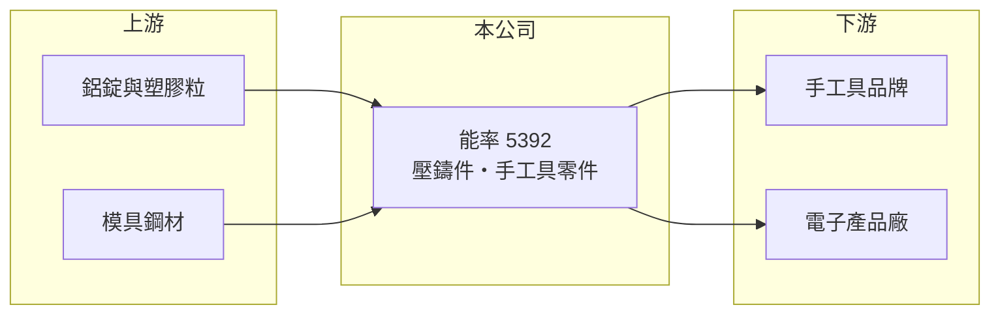

# 5392 能率

> 上櫃｜[[產業索引-光電業|光電業]]｜上市（櫃）日期 1999/06/14

# 第一章：企業模式與商業藍圖

> [!info] 撰寫說明
> 精簡版，由 Claude 依公開資料整理，架構比照 [[2330台積電]]，資料截至 2026-10-07。來源：nstock.tw 能率公司概況、winvest.tw 營收快訊。各產品營收比重與客戶本次未查到。#待校對

能率是以鋁合金與塑膠壓鑄起家的零件製造公司，2026 年獲利回升。

- **核心業務：** 能率製造鋁合金與塑膠[[壓鑄]]件與相關模具，並承作氣動與電動手工具零件加工及進出口貿易。
- **營收結構：** 本次未查到各產品比重；壓鑄件應用於電子產品機殼與工具等領域（推估）。
- **營運據點：** 總部位於台北，1999 年在櫃買中心掛牌；生產據點本次未查到，推估以中國大陸為主。
- **長期方向：** 透過集團轉投資延伸到光學與電子相關事業（推估），本業則持續以模具與壓鑄能力服務工具及電子客戶。

# 第二章：護城河深度與競爭優勢

能率的競爭力在於模具與壓鑄的整合製造能力。

- **競爭優勢：** 自行開發[[精密模具]]並結合壓鑄與後段加工，可一次完成客戶零件需求（推估）。
- **主要對手：** 國內外鋁壓鑄與機構件廠，以及中國大陸壓鑄廠。
- **觀察重點：** 2026 年營收成長能否帶動毛利率回升，以及轉投資損益變化。

# 第三章：財務體質與盈利規模

資料日期：2026-10-07，以下數字是撰寫當時的快照；最新月營收、毛利率、累計 EPS 由自動排程寫在本筆記的屬性欄位（月營收、毛利率、累計EPS 等）。#待校對

能率 2025 年虧損，2026 年第二季轉為獲利，近月營收年增兩位數。

- **營收規模：** 2025 年全年營收 86.83 億元；2026 年 1 至 8 月累計 60.67 億元，年增 6.76%；8 月營收 7.71 億元，年增 15.14%。
- **獲利：** 2025 年全年 EPS -0.26 元；2026 年第二季 EPS 0.7 元，[[毛利率]] 14.59%。
- **財務特色：** 資本額約 18.01 億元，市值約 70.6 億元；營收規模大但毛利率偏低，獲利受轉投資與業外影響較大（推估）。

# 第四章：總體風險與地緣政治

能率的風險在於代工毛利偏低與終端需求波動。

- **產業週期：** 手工具與電子產品需求跟著歐美消費與營建景氣循環。
- **營運風險：** 壓鑄代工議價力有限，鋁價上漲時若無法轉嫁，毛利率會受壓。
- **其他風險：** 鋁錠等原物料價格、中國大陸生產的地緣政治與關稅風險，以及匯率變動。

# 專有名詞解析

## 金融

- **[[毛利率]]**：毛利占營收的比例，反映產品定價能力與成本控制。

## 產業

- **[[壓鑄]]**：把熔化的金屬在高壓下注入模具成形，適合大量生產複雜形狀的金屬零件。
- **[[精密模具]]**：用來大量生產塑膠或金屬零件的高精度模具，品質決定零件尺寸與良率。

# 核心供應鏈

- 上游：鋁錠、塑膠粒與模具鋼材供應商
- 下游／客戶：氣動與電動手工具品牌、電子產品廠（推估）
- 同業：國內外鋁壓鑄與機構件廠

## 最新新聞
<!-- news:start -->
<!-- news:end -->

## 相關連結
- [公開資訊觀測站](https://mopsov.twse.com.tw/mops/web/t05st03?step=1&firstin=1&co_id=5392)
- [Goodinfo](https://goodinfo.tw/tw/StockDetail.asp?STOCK_ID=5392)
- [Yahoo 股市](https://tw.stock.yahoo.com/quote/5392)
- [鉅亨網新聞](https://www.cnyes.com/twstock/5392/news)
