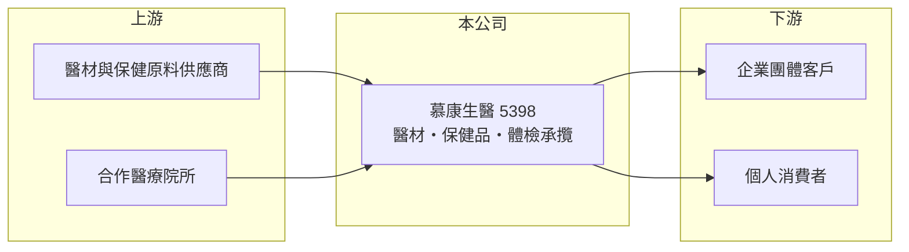

# 5398 慕康生醫

> 上櫃｜[[產業索引-其他業|其他業]]｜上市（櫃）日期 1999/10/11

# 第一章：企業模式與商業藍圖

> [!info] 撰寫說明
> 精簡版，由 Claude 依公開資料整理，架構比照 [[2330台積電]]，資料截至 2026-10-07。來源：nstock 公司概況頁、winvest 營收快訊（搜尋結果標題）。公開資料有限，營收比重、營運據點與合作醫院未查到。#待校對

慕康生醫結合醫療器材、保健產品銷售與健康檢查承攬，是小型的健康服務公司。

- **核心業務：** 公司從事醫療器材、藥品及[[保健食品]]的製造與銷售，並與醫療院所合作承攬國人[[健康檢查]]。
- **營收結構：** 產品銷售與體檢服務的比重本次未查到；2025 年全年營收約 2.3 億元。
- **營運據點：** 以台灣市場為主（推估），掛牌約 27 年，資本額約 4.95 億元。
- **長期方向：** 體檢承攬連結醫療院所與企業客戶，可帶動保健產品銷售，屬於服務加產品的組合（推估）。

# 第二章：護城河深度與競爭優勢

慕康生醫的優勢在於與醫療院所的合作關係，但規模小、產品差異化有限。

- **競爭優勢：** 體檢承攬需要醫院合作與團體客戶通路，長期合作關係有一定黏著度（推估）。
- **主要對手：** 健檢中心、醫院自辦健檢與眾多保健食品品牌，具體對手本次未查到。
- **觀察重點：** 2026 年營收能否止跌回升、體檢業務的季節性高峰（下半年）是否帶動獲利。

# 第三章：財務體質與盈利規模

資料日期：2026-10-07，以下數字是撰寫當時的快照；最新月營收、毛利率、累計 EPS 由自動排程寫在本筆記的屬性欄位（月營收、毛利率、累計EPS 等）。#待校對

慕康生醫 2026 年上半年營收衰退、累計小虧，8 月營收回升。

- **營收規模：** 2026 年 6 月營收 1,596.2 萬元（年減 49.32%）、7 月 1,263.0 萬元（年減 42.18%）、8 月 2,882.2 萬元（年增 15.64%）；1 至 8 月累計約 1.1 億元，年減 26.35%。
- **獲利：** 2026 年第二季 EPS 0.14 元，[[毛利率]] 35.8%、營益率 2.98%，淨利率 18.24% 高於營益率，代表有業外收益；上半年累計 EPS -0.08 元。2025 年全年 EPS 0.35 元。
- **財務特色：** 近五年平均現金股利約 0.03 元，配息能力有限。

# 第四章：總體風險與地緣政治

慕康生醫的風險在於營收波動與本業獲利偏薄。

- **產業週期：** 團體體檢多集中在特定月份，營收有季節性；保健食品需求則受消費景氣影響。
- **營運風險：** 本業營益率低，獲利容易受業外損益左右；合作醫療院所若變動，體檢量會受影響。
- **其他風險：** 醫療器材與保健食品須符合衛福部法規與廣告規範，法規變動會影響銷售。

# 專有名詞解析

## 應用

- **[[健康檢查]]**：針對個人或企業員工的定期身體檢查，常由醫療院所與承攬公司合作執行。

## 金融

- **[[毛利率]]**：營業毛利占營收的比率，反映產品售價扣除直接成本後的獲利空間。

## 產業

- **[[保健食品]]**：以維持健康為訴求的膳食補充產品，受食品與廣告法規規範。

# 核心供應鏈

- 上游：醫療器材與保健原料供應商、合作醫療院所（推估）
- 下游／客戶：企業團體體檢客戶與個人消費者，名稱未揭露
- 同業：健檢中心與保健食品業者，名稱未查到

## 最新新聞
<!-- news:start -->
<!-- news:end -->

## 相關連結
- [公開資訊觀測站](https://mopsov.twse.com.tw/mops/web/t05st03?step=1&firstin=1&co_id=5398)
- [Goodinfo](https://goodinfo.tw/tw/StockDetail.asp?STOCK_ID=5398)
- [Yahoo 股市](https://tw.stock.yahoo.com/quote/5398)
- [鉅亨網新聞](https://www.cnyes.com/twstock/5398/news)
