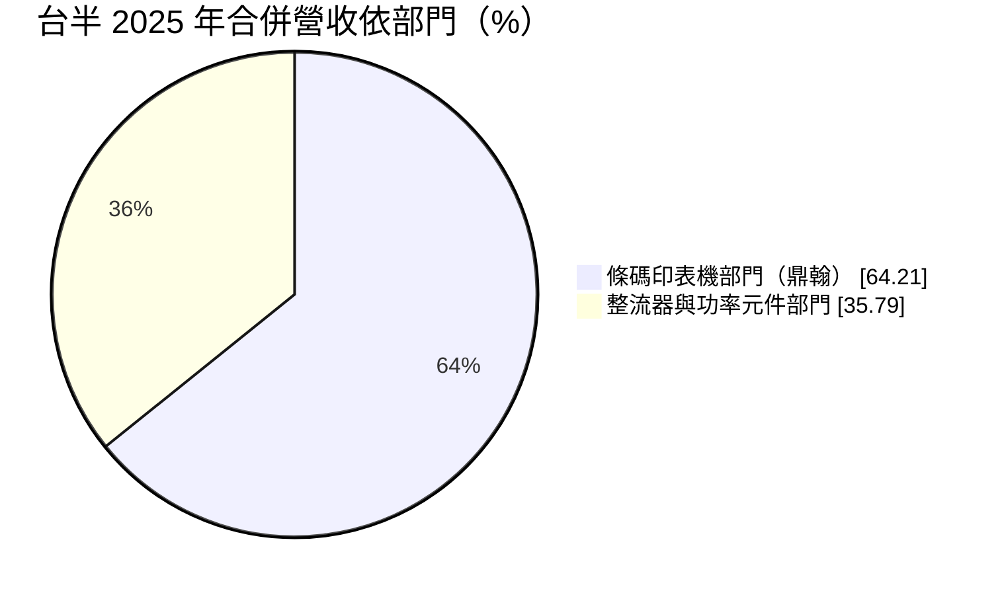
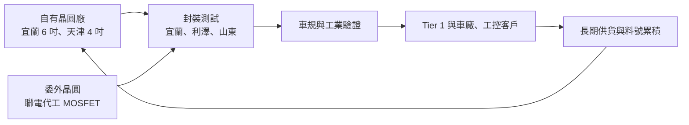
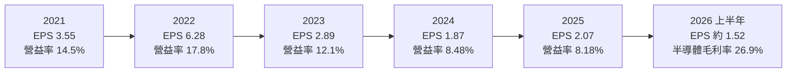
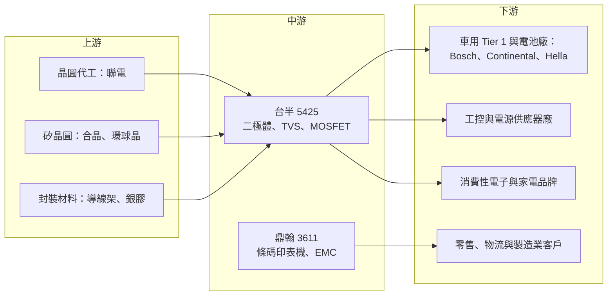

# 5425 台半

> 上櫃｜[[產業索引-半導體業|半導體業]]｜上市（櫃）日期 2000/02/21

# 第一章：企業模式與商業藍圖

> [!info] 撰寫說明
> 本文由 Claude 依公開資料整理，架構比照 [[2330台積電]] 的四章研究，資料截至 2026-10-08。財務數字來源：Goodinfo 台灣股市資訊網年度經營績效與股利政策頁、富邦 MoneyDJ 個股基本資料（2025 年營收比重、β 值）、poorstock 法說會整理（2026 年上半年）、富果研究鼎翰法說會整理、CMoney 研究報告（2021）、理財周刊、Wikipedia；產業描述為整理性內容，尚未逐條比對原始文件。#待校對

在評估單一個股的長期投資價值時，首要步驟是拆解企業的底層獲利邏輯。本章針對台灣半導體股份有限公司（股票代號：5425，以下簡稱台半）的商業模式進行定性分析。台半的特別之處在於它其實是「兩家公司」的合體：本業是車用與工業用的[[功率半導體]]分離元件，另一半營收則來自它持股並合併報表的條碼印表機廠 [[3611鼎翰]]。理解這兩條業務各自的經濟特性，是看懂台半財報的前提。

## 一、核心定位：從整流器起家的車用功率分離元件廠

台半成立於 1979 年 1 月，創辦人王阿瑟（Arthur Wang）最初在台北縣土城生產[[整流器]]，也就是把交流電轉成直流電的基本元件。1987 年設立宜蘭廠，1991 年導入自動化並量產 [[TVS]] 保護元件與橋式整流器，1995 至 1996 年在中國山東與天津設立子公司，2000 年在櫃買中心掛牌。四十多年來，台半的產品從單純的整流二極體，逐步延伸到[[蕭特基二極體]]、TVS、[[MOSFET]]、[[IGBT]]、類比 IC 與 ESD 靜電防護元件，屬於電子產品裡「每台都要用、但單價很低」的基礎零件。

分離元件產業的特性是品項極多、單價低、客戶極分散。一台汽車可能用上數百顆二極體與 MOSFET，任何一顆失效都可能讓整個電子模組故障，因此車廠與 Tier 1 供應商在乎的不是單顆價格，而是長期穩定供貨與失效率。台半的定位正是這個市場：它不追求最尖端的功率晶片，而是用長年累積的品質紀錄與龐大的料號組合，成為汽車與工業客戶「不太會換掉」的供應商。

2019 年 [[2303聯電]] 參與台半私募，雙方合作開發 MOSFET 產品線。台半因此採取所謂的「Fablite」（輕晶圓廠）模式：二極體與 TVS 等成熟產品用自有的宜蘭、天津晶圓廠生產，較高階的 40V、60V 車用 MOSFET 則把晶圓製造委託聯電，自己負責設計、封裝與銷售。這個安排讓台半不必為新產品線大舉投資晶圓廠，又能借用聯電的 12 吋或 8 吋製程能力。

## 二、終端應用與產品板塊：半導體與條碼印表機兩條腿

依富邦 MoneyDJ 資料，2025 年台半合併營收中，條碼印表機部門占 64.21%，整流器（半導體）部門占 35.79%。

這張圖說明了一個常被忽略的事實：以營收規模計算，台半合併報表的大半其實是鼎翰。鼎翰在 2024 年 11 月完成併購韓國企業行動電腦（[[EMC]]）廠 Bluebird，2025 年前三季營收年增 40.7%，Bluebird 貢獻 22.49 億元，這是台半 2025 年合併營收由 148 億元跳升到 180 億元的主要原因。台半對鼎翰的持股約三成多（2021 年研究報告記載為 36.38%），因此鼎翰的獲利大部分歸屬於鼎翰其他股東，在台半報表上列為[[非控制權益]]。

半導體本業的應用結構則持續往車用與工業集中：

* **車用（約 59%）：** 依 2026 年上半年法說會資料，車用占半導體營收約 59%。車用分離元件用於車燈、車身控制、電池管理與各種電源模組，台半已打入歐洲 Tier 1 與電池廠供應鏈。車用訂單驗證期長、生命週期長，是台半最核心的長期護城河來源。
* **工業（約 16%）：** 工控、電源供應器與能源設備使用的元件，規格要求介於消費性與車用之間。2026 年上半年車用加工業合計約 75%，高於 2025 年全年的 72%。
* **消費性與其他（約 25%）：** 家電、電源轉接器等，價格競爭最激烈，是台半有意降低比重的板塊。2021 年第一季時消費性還占 40%、車用 35%，五年內結構明顯翻轉。

## 三、資本轉化邏輯：自有成熟產能＋委外高階晶圓

台半在台灣有兩座晶圓廠與兩座封裝廠，分布在宜蘭與利澤，利澤以 TVS 元件與 6 吋晶圓為主；中國天津廠生產 4 吋晶圓與表面黏著產品，山東廠生產橋式整流器與軸式二極體，另在中國、美國、德國、日本設有服務據點。成熟產品留在自有工廠，可以掌握成本與品質；需要較先進製程的 MOSFET 委外，則把資本支出風險轉給代工夥伴。

這個模式的財務意義是：台半的資本支出遠低於完整 [[IDM]] 同業，但也因此在 MOSFET 這類高成長產品上，毛利率要和代工廠分享。2021 年研究報告指出宜蘭 6 吋廠的損益平衡點約為每月 1.8 萬片，說明自有晶圓廠的獲利對[[產能利用率]]非常敏感。

## 四、企業長期藍圖

台半的長期目標是把應用組合調整為車用 50%、工控 30%、消費性 20%（2021 年研究報告所載目標），目前車用加工業已達七成五，目標大致達成。下一階段的方向有三：

* **高壓與 AI 電源：** 2026 年法說資料顯示，台半正切入 800V [[HVDC]] 資料中心供電架構、伺服器電源機櫃、[[BMS]] 電池管理系統與高壓熱插拔（Hot Swap）應用。AI 資料中心的供電電壓提高後，需要大量耐高壓的保護與切換元件，這是分離元件廠少見的新成長市場。
* **寬能隙材料：** 布局 [[SiC]] 與 [[GaN]] 元件，部分產品仍在開發階段。寬能隙元件效率較高，是電動車與資料中心電源的長期主流方向。
* **持續縮減消費性比重：** 把產能與研發集中在驗證門檻高的車用與工業市場，以換取較穩定的價格。

# 第二章：護城河深度與競爭優勢

本章分析台半的護城河構成、全球主要競爭對手，以及這些優勢在分離元件價格競爭中能守住多少。

## 一、護城河的核心組成要素

台半屬於「窄護城河」企業。分離元件的技術門檻不算高，但它在以下三個面向累積了不易複製的優勢：

* **1. 車規認證與長期品質紀錄：** 車用元件需要通過 AEC-Q101 等可靠度測試與車廠的[[車規驗證]]，導入後通常會用在同一車款數年之久。台半在車用市場耕耘超過二十年，客戶名單涵蓋 Bosch、Hella 等歐洲 Tier 1 與電池廠，這些關係是新進者短時間內拿不到的。
* **2. 料號廣度：** 分離元件客戶偏好向少數供應商一次採購大量品項，以簡化供應鏈管理。台半從整流器、TVS、蕭特基到 MOSFET 都能供應，能和客戶做整包式的長期合作。
* **3. 全球據點與「非中國」產能選項：** 台灣宜蘭與利澤廠提供中國以外的產能，對想分散供應鏈的歐美客戶有吸引力；中國廠則服務當地客戶。這種雙軌布局在地緣政治緊張時是加分項。

## 二、全球主要競爭對手格局

| 對手 | 定位 | 對台半的威脅 |
|---|---|---|
| Vishay、Nexperia（安世）、Rohm | 國際大型分離元件廠，產品線完整、自有晶圓廠 | 在車用高階產品直接競爭，規模與品牌優於台半 |
| onsemi、英飛凌 | 功率半導體龍頭，主攻 MOSFET、IGBT、SiC | 在高壓與寬能隙元件領先，台半較難正面競爭 |
| [[2481強茂]] | 台灣二極體與 MOSFET 同業，採 IDM 模式 | 定位最接近，在車用與 AI 伺服器電源搶同一批客戶 |
| [[3675德微]]、[[8255朋程]] | 台灣保護元件與車用整流二極體廠 | 在 TVS 與車用二極體部分品項重疊 |
| 中國本土分離元件廠 | 政策扶植、價格低 | 壓低消費性與一般工業品價格 |

## 三、優勢轉化：守得住、守不住與觀察重點

* **守得住：** 已通過驗證的車用與工業料號。這些產品一旦用在某個車款或設備上，客戶在整個生命週期內換料的成本與風險都很高，價格相對穩定，是台半毛利率的支撐點。
* **守不住：** 消費性二極體與標準品 MOSFET。這些產品規格公開、可替代性高，中國廠商持續擴產，價格長期向下。台半的毛利率從 2016 至 2018 年約 36% 至 37%，降到 2024 年的 28.6%，部分反映了這種價格壓力，也反映了合併報表中鼎翰占比的變化。
* **觀察重點：** 第一，800V HVDC 與 AI 伺服器電源能否從開發走到量產並占半導體營收的一定比重；第二，與聯電合作的車用 MOSFET 能否持續打入歐系 Tier 1；第三，SiC 與 GaN 是否能在大廠主導的市場中找到利基。這三點決定台半能否從「傳統二極體廠」轉型為「車用與資料中心電源元件供應商」。

# 第三章：財務體質與盈利規模

資料日期：2026-10-08。數字取自 Goodinfo 年度經營績效與股利政策頁、富邦 MoneyDJ 個股基本資料、poorstock 法說會整理，表格是撰寫當時的快照；最新月營收、毛利率、累計 EPS 由自動排程寫在本筆記的屬性欄位（月營收、毛利率、累計EPS 等）。#待校對

財務報表是檢驗護城河是否真實存在的最終標準。本章用十年的三率、[[ROE]]、股利與資本報酬，檢視台半在分離元件週期與鼎翰併表影響下的獲利品質。閱讀這些數字時要記得：合併營收與三率混合了半導體與條碼印表機兩種業務，EPS 則只反映歸屬於台半股東的部分。

## 一、獲利能力的基石：三率

| 年度 | 營收（新台幣） | [[毛利率]] | [[營業利益率]] | EPS（元） | [[ROE]] |
|---|---|---|---|---|---|
| 2016 | 87.0 億 | 36.3% | 17.3% | 3.34 | 16.8% |
| 2017 | 89.9 億 | 36.8% | 18.0% | 3.77 | 18.5% |
| 2018 | 96.1 億 | 36.7% | 17.8% | 3.53 | 17.6% |
| 2019 | 105 億 | 32.0% | 12.4% | 2.29 | 13.7% |
| 2020 | 104 億 | 30.5% | 12.1% | 2.29 | 12.9% |
| 2021 | 132 億 | 31.3% | 14.5% | 3.55 | 16.2% |
| 2022 | 157 億 | 34.1% | 17.8% | 6.28 | 21.8% |
| 2023 | 146 億 | 30.7% | 12.1% | 2.89 | 12.2% |
| 2024 | 148 億 | 28.6% | 8.48% | 1.87 | 8.27% |
| 2025 | 180 億 | 29.5% | 8.18% | 2.07 | 10.1% |

這張表呈現出典型的分離元件週期。2021 至 2022 年疫情後全球缺料，車用與工業客戶積極備貨，台半 EPS 在 2022 年創下 6.28 元的高峰，營業利益率回到 17.8%。2023 年起客戶去化庫存，加上中國同業擴產造成價格競爭，EPS 連續兩年下滑，2024 年只剩 1.87 元。

2025 年營收跳升到 180 億元，但營業利益率仍只有 8.18%。原因是增加的營收主要來自鼎翰併購 Bluebird，而不是半導體本業回升，且鼎翰的獲利有六成多歸屬非控制權益，因此 EPS 只小幅回到 2.07 元。依 poorstock 整理的 2026 年上半年法說資料，台半個體營收約 35.61 億元、年增 9%，毛利率由 22.6% 提升到 26.9%，歸屬母公司淨利約 3.73 億元、EPS 約 1.52 元，顯示半導體本業正在走出低谷。

* **[[毛利率]]：** 2016 至 2018 年約 36% 至 37%，2024 至 2025 年約 29%。合併毛利率受鼎翰占比影響，單看半導體個體毛利率波動更大，2025 年上半年約 22.6%，是近年低點。
* **[[營業利益率]]：** 分離元件廠的研發與管理費用相對固定，營收回升時營業利益率擴張較快，是明顯的[[營運槓桿]]。2026 年上半年個體營業利益約 3.04 億元、年增約 101%，就是營運槓桿的表現。
* **長期成長：** 2016 至 2025 年合併營收年複合成長率約 8.4%（推算），但其中相當部分來自鼎翰的併購與成長；半導體本業的長期成長率未查得，推估低於合併數字。

## 二、[[ROE]]：資本效率

2021 至 2025 年平均 ROE 約 13.7%（推算），2016 至 2025 十年平均約 14.8%（推算）。台半在景氣高峰可達 20% 以上，低谷時落在 8% 至 10%。由於 Goodinfo 的 ROE 以含非控制權益的合併淨利與權益計算，它反映的是「台半加鼎翰」整體集團的資本效率，而非單純歸屬台半股東的報酬。

2026 年第二季台半每股淨值約 31.21 元，負債比例約 50.58%（富邦 MoneyDJ），負債比偏高主要來自鼎翰為併購 Bluebird 而增加的銀行聯貸。這代表台半集團的財務槓桿比過去高，ROE 未來的提升有一部分會來自槓桿，而非純粹的本業改善。

## 三、資本支出與自由現金流

台半採 Fablite 模式，高階 MOSFET 委外代工，自有晶圓廠以 6 吋與 4 吋為主，資本支出規模遠低於 12 吋晶圓廠，具體金額未查得。[[自由現金流]]在多數年度應為正（推估），可以支撐長期穩定的現金股利。

股利方面，依 Goodinfo，2016 至 2025 年度現金股利依序為 2.5、2.981、3、1.5、1.5、2.5、4、2、2.023、2.022 元，十年從未中斷，也未發放股票股利。以 EPS 計算，2021 至 2025 年配息率約為 70%、64%、69%、108%、98%（推算）。2024 與 2025 年配息率接近或超過 100%，代表公司在獲利低谷時仍維持每股約 2 元的股利水準，傾向以穩定股利回饋股東。這種做法在獲利回升時可持續，但如果低谷拉長，配息會逐步消耗累積盈餘。

## 四、[[ROIC]] 與 [[WACC]]：價值創造利差

**ROIC 推算：** 2025 年合併營業利益約 14.7 億元（180 億 × 8.18%），以 20% 稅率計算，稅後營業利益約 11.8 億元。合併淨利約 11.2 億元（180 億 × 淨利率 6.2%），以 ROE 10.1% 回推含非控制權益的平均權益約 110 億元。有息負債未查得，若假設約 30 億至 50 億元（推估，主要為鼎翰併購聯貸），投入資本約 140 億至 160 億元，ROIC 約 7.4% 至 8.4%（推算）；若有息負債不重大，上限約 10.7%（推算）。對照 2022 年，營業利益約 27.9 億元（157 億 × 17.8%），稅後約 22.3 億元，以淨利率 13.9% 與 ROE 21.8% 回推權益約 100 億元，ROIC 約 22%（推算，未計入有息負債）。

**WACC 推算：** 權益成本以 CAPM 估計，假設台灣 10 年期公債殖利率 1.75%、市場風險溢酬 6%、β 取富邦 MoneyDJ 所列 1.20，權益成本約 8.95%。負債成本假設 2.5%，稅後約 2.0%；資本結構假設權益 70%、有息負債 30%（推估）。WACC 約 0.7 × 8.95% ＋ 0.3 × 2.0% ≈ 6.9%（推算）。

**結論：** 台半在 2016 至 2018 年與 2021 至 2022 年的景氣期間，ROIC 明顯高於 WACC，屬於創造價值的階段；2024 至 2025 年 ROIC 約 7% 至 9%，只略高於約 6.9% 的資金成本，利差很薄。台半能否重新拉開利差，關鍵在於半導體本業毛利率能否回到 30% 以上，以及鼎翰併購 Bluebird 後的獲利是否足以覆蓋新增的資本與負債（推算）。

# 第四章：總體風險與地緣政治

任何企業都無法脫離宏觀環境獨立存在。本章分析台半未來必須面對的地緣政治、產業週期與營運風險。

## 一、地緣政治風險

* **中國產能的雙面刃：** 天津與山東廠讓台半能以較低成本服務中國客戶，但美中貿易對抗使「中國製造」的元件在美國面臨關稅。鼎翰法說提到美國對中國產品課徵 27.5% 關稅，已於 2025 年 7 月調整售價；台半半導體部門也面臨類似的產地成本問題。
* **中國同業的國產替代：** 中國政策鼓勵車廠與工業客戶採用本土分離元件，台半在中國市場的消費性與一般工業品可能持續被替代，留下的會是驗證門檻較高的車用料號。
* **台灣產能的價值：** 宜蘭與利澤的台灣產能，在歐美客戶推動「中國以外」供應鏈時是優勢，但台灣本身也有兩岸風險，客戶可能要求台半再增加東南亞或其他地區的產能選項。

## 二、產業週期與市場結構風險

* **分離元件的庫存週期：** 分離元件單價低、交期短，客戶在缺貨時容易重複下單，需求轉弱時又同步砍單，形成明顯的[[長鞭效應]]。2022 年 EPS 6.28 元到 2024 年 1.87 元的落差，就是一次完整的庫存週期。
* **汽車與工業景氣：** 車用與工業合計占半導體營收約七成五，電動車銷售放緩或歐洲工業景氣疲弱，會直接反映在訂單上。
* **匯率：** 半導體與條碼印表機業務都以外銷為主，2021 年研究報告記載外銷比重達 96.57%，新台幣升值會壓縮以台幣計算的營收與毛利率。

## 三、營運環境的隱性風險

* **集團結構的複雜度：** 合併報表中鼎翰占比過半，投資人容易誤以為台半營收成長等同半導體本業成長。鼎翰若因 Bluebird 整合不順或條碼印表機市場轉弱而獲利下滑，也會拖累台半的合併數字與股利來源。
* **財務槓桿上升：** 負債比例約五成，主要來自子公司的併購融資，利率上升或獲利下滑時，利息負擔會侵蝕淨利。
* **代工依賴：** 高階 MOSFET 仰賴聯電代工，若成熟製程產能吃緊、代工價格上漲，台半的 MOSFET 毛利率會被壓縮。

## 四、科技演進風險

功率元件正從矽材料走向 SiC 與 GaN 等寬能隙材料，國際大廠在這些領域投入龐大資本並取得先發優勢。台半的 SiC 與 GaN 布局仍屬早期，若無法在特定應用（例如 AI 伺服器電源的保護與切換元件）建立利基，長期可能只留在矽基分離元件的紅海市場。另一方面，800V HVDC 等新供電架構也是機會：電壓升高後需要更多耐高壓的保護元件，台半在 TVS 與整流器的經驗可以延伸，這是它少數能和大廠差異化競爭的新戰場。

# 專有名詞解析

## 半導體

- **[[功率半導體]]**：負責電能轉換、開關與保護的半導體元件，例如二極體、MOSFET、IGBT，廣泛用於電源、汽車與工業設備。
- **[[整流器]]**：把交流電轉換成直流電的二極體元件，是幾乎所有電子產品電源電路都需要的基礎零件。
- **[[蕭特基二極體]]**：以金屬與半導體接面構成的二極體，切換速度快、壓降低，常用於電源轉換電路以減少耗電。
- **[[TVS]]**：暫態電壓抑制二極體，在電路遇到突波或靜電時迅速導通，保護後端晶片不被高電壓損壞。
- **[[MOSFET]]**：金氧半場效電晶體，用電壓控制電流開關的功率元件，是電源供應器、馬達驅動與電動車的關鍵零件。
- **[[IGBT]]**：絕緣閘雙極電晶體，適合高電壓大電流的功率開關，常用於電動車逆變器與工業馬達。
- **[[SiC]]**：碳化矽，寬能隙半導體材料，耐高壓與高溫，用於電動車與太陽能逆變器的功率元件。
- **[[GaN]]**：氮化鎵，寬能隙半導體材料，切換速度快、體積小，常用於快充與資料中心電源。

## 應用

- **[[HVDC]]**：高壓直流供電，AI 資料中心改以 800V 等高壓直流配電，可降低傳輸損耗並提高供電密度。
- **[[BMS]]**：電池管理系統，監控電池的電壓、溫度與充放電狀態，確保電動車與儲能系統安全運作。
- **[[EMC]]**：企業行動電腦，倉儲、物流與零售人員使用的手持式資料收集裝置，可掃描條碼並連線企業系統。
- **[[車規驗證]]**：車用晶片須通過 AEC-Q 系列可靠度測試與車廠認證，流程常需 2 至 3 年，因此轉換成本高。

## 金融

- **[[非控制權益]]**：子公司中不屬於母公司的股東權益，母公司合併子公司營收時，子公司獲利有一部分歸屬這些股東。
- **[[營運槓桿]]**：固定成本占比高時，營收小幅變動會造成營業利益大幅變動的現象。
- **[[自由現金流]]**：營業活動現金流減去資本支出，代表企業可自由用於配息、還債或併購的現金。
- **[[長鞭效應]]**：終端需求的小幅變動，沿供應鏈往上游傳遞時被逐級放大，造成上游庫存與訂單劇烈波動。

# 核心供應鏈

## 1. 上游：晶圓代工與矽晶圓
- MOSFET 晶圓代工與策略夥伴：[[2303聯電]]
- 功率元件常用的重摻矽晶圓：[[6182合晶]]、[[6488環球晶]]
- 封裝材料：導線架與封裝膠材（供應商未查得）

## 2. 中游：台半本身與子公司
- 條碼印表機與企業行動電腦：[[3611鼎翰]]（台半持股並合併報表，2024 年併購韓國 Bluebird）

## 3. 下游：主要客戶
- 車用 Tier 1：Bosch、Continental、Hella 等歐洲汽車電子供應商（依研究報告與媒體報導，部分為供應鏈消息）
- 電池廠：寧德時代電池二極體供應鏈（2021 年研究報告所載）
- 消費性與照明品牌：[[005930三星電子]]、[[SONY索尼]]、[[2317鴻海]]、Philips、Osram（2021 年研究報告所載）

## 4. 同業與競爭者
- 台灣：[[2481強茂]]、[[3675德微]]、[[8255朋程]]、[[6573虹揚-KY]]
- 國際：Vishay、Nexperia、Rohm、onsemi、英飛凌

## 最新新聞
<!-- news:start -->
<!-- news:end -->

## 相關連結
- [公開資訊觀測站](https://mopsov.twse.com.tw/mops/web/t05st03?step=1&firstin=1&co_id=5425)
- [Goodinfo](https://goodinfo.tw/tw/StockDetail.asp?STOCK_ID=5425)
- [Yahoo 股市](https://tw.stock.yahoo.com/quote/5425)
- [鉅亨網新聞](https://www.cnyes.com/twstock/5425/news)
