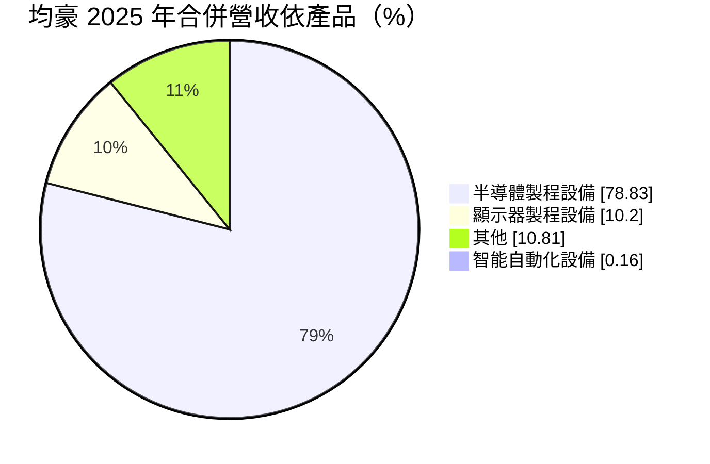
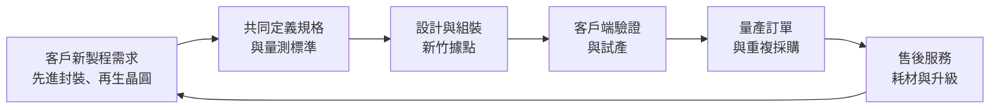
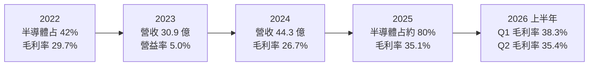
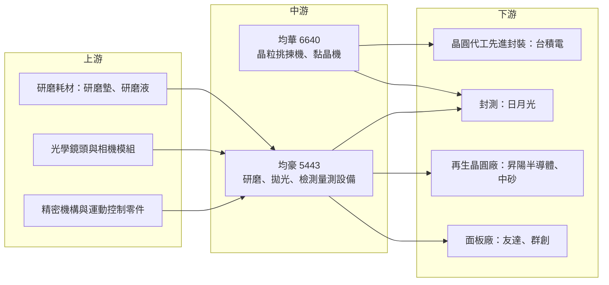

# 5443 均豪

> 上櫃｜[[產業索引-半導體業|半導體業]]｜上市（櫃）日期 1998/02/09

# 第一章：企業模式與商業藍圖

> [!info] 撰寫說明
> 本文由 Claude 依公開資料整理，架構比照 [[2330台積電]] 的四章研究，資料截至 2026-10-08。財務數字來源：Goodinfo 台灣股市資訊網年度與季度經營績效、股利政策與基本資料頁、富邦 MoneyDJ 個股基本資料（2025 年營收比重、β 值）、富果研究 2025 年第三季均豪與均華聯合法說會整理、聯合新聞網（2026 年 4 月）、鉅亨號產業研究文章（2026 年 3 月）；產業描述為整理性內容，尚未逐條比對原始文件。#待校對

在評估單一個股的長期投資價值時，首要步驟是拆解企業的底層獲利邏輯。本章針對均豪精密工業股份有限公司（股票代號：5443，以下簡稱均豪）的商業模式進行定性分析。均豪是台灣少數成功從面板設備轉型到半導體設備的廠商，它本身做研磨、拋光與檢測量測設備，旗下子公司 [[6640均華]] 則做先進封裝的晶粒挑揀與黏晶設備。理解「母公司轉型」與「子公司價值」兩條主線，是看懂均豪的關鍵。

## 一、核心定位：從面板設備走向半導體的設備集團

均豪成立於 1978 年 12 月，1998 年在櫃買中心掛牌，總部位於新竹科學園區。過去二十年，台灣面板產業大舉擴廠，均豪是面板廠的重要在地設備供應商，產品包括面板製程設備、[[AOI]] 自動光學檢測與自動化整合系統。面板產業在 2010 年代後期成長停滯，產能擴張重心移往中國，均豪面臨營收來源萎縮的壓力，因此開始把研磨、拋光、光學檢測等核心技術移植到半導體領域。

轉型的成果相當明顯。依富果整理的 2025 年第三季法說會資料，半導體占均豪合併營收的比重從 2022 年的 42%，提高到 2025 年前三季的 80%。公司把自己的核心技術歸納為「檢測、量測、研磨、拋光」四項，這四項能力原本用在大尺寸面板上，現在則應用在晶圓與封裝製程。

均豪的定位不是和 [[AMAT應用材料]]、[[8035東京威力科創]] 這類前段製程設備巨頭正面競爭，而是切入兩個大廠較少深耕的利基：一是[[先進封裝]]製程中的晶圓研磨與量測，二是[[再生晶圓]]產業的拋光與檢測設備。這些市場規模較小，但客戶需要在地、快速的客製化服務，正好是台灣設備廠的強項。

## 二、終端應用與產品板塊

依富邦 MoneyDJ 資料，2025 年均豪合併營收結構如下：

* **先進封裝設備（含均華）：** 均豪本身提供條狀研磨機（Strip Grinder），用於 AI 與 [[HPC]] 晶片封裝時把晶圓或基板磨薄（[[晶圓薄化]]），以改善散熱；另以 SWLI 白光干涉儀在 [[Bumping]] 與重佈線層（RDL）階段量測凸塊高度與間距。子公司均華則以晶粒挑揀機與黏晶機為兩大產品線，約八成營收來自先進封裝，其中 [[CoWoS]] 相關占比在 2025 年已超過一半（均華法說回應）。
* **再生晶圓設備：** 提供整合拋光與清洗的 [[CMP]] 設備（含超音波清洗模組）與 AOI 檢測設備。公司與再生晶圓大廠合作約三到四年，已由單純設備買賣轉為共同生產的夥伴關係，CMP 設備已進入大量出貨階段。再生晶圓需求跟著晶圓廠測試片用量成長，波動比先進封裝小。
* **顯示器設備：** 傳統本業，2025 年只剩約一成營收。均豪在大尺寸面板的搬運、檢測與研磨經驗，未來可能延伸到 [[FOPLP]] 面板級扇出型封裝，這是面板設備經驗少見的轉用機會。

## 三、資本轉化邏輯：接單生產的設備商模式

設備商的營運模式是「先開發、後接單、再驗收認列」。均豪必須在客戶規劃新製程時就參與規格討論，例如與封測大廠共同定義 SWLI 量測的品質標準，等客戶驗證通過後才取得量產訂單。這種模式的好處是客戶黏著度高：一旦設備寫進客戶的標準製程，後續擴產會優先追加同一型號；缺點是營收高度取決於客戶的資本支出週期，接單到認列之間有時間落差。

均豪也透過 G2C 聯盟（台灣設備廠的合作聯盟）跟隨客戶到美國、日本、馬來西亞、德國等地布局，目的是在客戶海外建廠時提供在地服務。設備業屬於輕資產、重研發與人才的產業，主要投入是工程師與組裝場地，不需要大型廠房。

## 四、企業長期藍圖

依 2025 年第三季法說會，均豪的長期目標包括：半導體營收占比持續高於七成、[[ROE]] 維持 20%、每年配息 2 元。策略上採「雙軸成長」，一軸是先進封裝的研磨與量測，另一軸是再生晶圓的拋光與檢測，並持續與客戶共同開發下一代技術。均華則在開發 [[CPO]] 與 [[Hybrid Bonding]] 相關設備，並表示會擴展 CoWoS 以外的先進封裝應用以分散風險。面板級封裝（FOPLP）是較遠期的機會，均豪的大尺寸面板處理經驗在這個領域可能成為差異化優勢。

# 第二章：護城河深度與競爭優勢

本章分析均豪的護城河構成、全球主要競爭對手，以及這些優勢在半導體設備競爭中能守住多少。

## 一、護城河的核心組成要素

均豪的護城河屬於「窄而正在加深」的類型，主要來自以下三點：

* **1. 跨面板與半導體的製程知識：** 研磨、拋光與光學檢測在面板與晶圓上的物理原理相通，但尺寸、精度與潔淨度要求差異很大。均豪花了近十年把面板經驗轉成半導體能力，這段學習曲線是新進者需要時間才能追上的。面板級封裝興起時，這項跨領域能力的價值會更明顯。
* **2. 與客戶共同定義規格的關係：** 均豪與再生晶圓大廠、封測大廠的合作已進入共同開發階段。設備一旦成為客戶製程標準的一部分，客戶更換供應商需要重新驗證整條產線，轉換成本很高。
* **3. 子公司均華的先進封裝卡位：** 均華的晶粒挑揀與黏晶設備搭上 CoWoS 擴產，2025 年營收 26.91 億元、毛利率 39.08%（聯合新聞網）。透過持股均華，均豪間接參與了台灣先進封裝產業鏈中成長最快的一段。

## 二、全球主要競爭對手格局

| 對手 | 定位 | 對均豪的威脅 |
|---|---|---|
| DISCO（日本） | 晶圓研磨、切割設備全球龍頭 | 在研磨與薄化設備有絕對技術與市占優勢 |
| [[KLAC科磊]]、Camtek、Onto Innovation | 半導體檢測與量測大廠 | 在先進封裝量測與 AOI 直接競爭 |
| 荏原（Ebara）、[[AMAT應用材料]] | CMP 設備大廠 | 在晶圓廠 CMP 主流市場占優，均豪只在再生晶圓利基競爭 |
| [[3131弘塑]]、[[6187萬潤]]、[[3583辛耘]] | 台灣先進封裝設備同業 | 爭取同一批台灣封裝客戶的設備預算 |
| 中國設備廠 | 政策扶植國產設備 | 在中國市場取代外國設備，壓低價格 |

## 三、優勢轉化：守得住、守不住與觀察重點

* **守得住：** 再生晶圓拋光與檢測，以及與台灣封測客戶共同開發的特定量測站點。這些市場規模不大，國際大廠投入意願有限，均豪憑在地服務與客製化能力可以維持領先。
* **守不住：** 標準化程度高的研磨與 CMP 主流市場。DISCO 與荏原在這些設備有長年的品牌與裝機基礎，均豪難以正面爭奪晶圓廠主流製程。
* **觀察重點：** 第一，均豪母公司本身的半導體設備能否在均華之外建立獨立的成長動能；第二，再生晶圓與先進封裝之外，FOPLP 設備能否形成新營收；第三，毛利率能否維持在 2025 年約 35% 的水準，這代表產品組合是否真正往高附加價值移動。

# 第三章：財務體質與盈利規模

資料日期：2026-10-08。數字取自 Goodinfo 年度與季度經營績效、股利政策頁與富邦 MoneyDJ 個股基本資料，表格是撰寫當時的快照；最新月營收、毛利率、累計 EPS 由自動排程寫在本筆記的屬性欄位（月營收、毛利率、累計EPS 等）。#待校對

財務報表是檢驗護城河是否真實存在的最終標準。本章用十年的三率、[[ROE]]、股利與資本報酬，檢視均豪從面板設備轉型到半導體設備的過程中，獲利品質是否真的改善。

## 一、獲利能力的基石：三率

| 年度 | 營收（新台幣） | [[毛利率]] | [[營業利益率]] | EPS（元） | [[ROE]] |
|---|---|---|---|---|---|
| 2016 | 36.7 億 | 29.7% | 8.37% | 1.58 | 11.6% |
| 2017 | 48.4 億 | 27.1% | 9.62% | 1.21 | 8.96% |
| 2018 | 48.7 億 | 26.4% | 8.89% | 2.24 | 15.0% |
| 2019 | 42.4 億 | 29.1% | 8.48% | 1.51 | 10.2% |
| 2020 | 34.6 億 | 23.7% | 2.24% | 0.93 | 5.85% |
| 2021 | 48.1 億 | 23.9% | 6.59% | 1.54 | 11.5% |
| 2022 | 47.3 億 | 29.7% | 8.93% | 2.41 | 16.0% |
| 2023 | 30.9 億 | 25.2% | 5.00% | 1.25 | 6.94% |
| 2024 | 44.3 億 | 26.7% | 7.50% | 1.82 | 8.40% |
| 2025 | 46.7 億 | 35.1% | 10.3% | 2.59 | 6.04% |

這張表的重點不在營收規模，而在毛利率的結構性變化。2016 至 2024 年，均豪營收在 30 億至 49 億元之間來回，毛利率長期落在 24% 至 30%，反映面板設備的價格競爭。2025 年營收只比 2024 年小增，但毛利率一口氣跳到 35.1%，營業利益率達 10.3%，是十年來最高。富果整理的法說內容指出，獲利改善主要來自高毛利半導體設備比重上升。換句話說，2025 年是均豪轉型開始反映在財報上的一年。

* **[[毛利率]]：** 半導體設備的毛利率高於面板設備，2026 年第一季與第二季單季毛利率分別為 38.3% 與 35.4%（Goodinfo 季度資料），維持在新的較高區間。
* **[[營業利益率]]：** 設備業研發費用高，營收規模不足時營業利益率容易被壓縮。2026 年第二季單季營業利益率只有 1.89%，但稅前淨利率達 21.35%（富邦 MoneyDJ），表示該季獲利主要來自[[業外收益]]，本業並未同步成長，需要觀察是否為一次性因素。
* **長期成長：** 2016 至 2025 年營收年複合成長率約 2.7%（推算），營收規模成長有限，均豪的價值改善主要來自產品組合，而不是量的擴張。

## 二、[[ROE]]：資本效率

2021 至 2025 年平均 ROE 約 9.8%（推算），十年平均約 10.0%（推算），與公司「ROE 維持 20%」的目標仍有明顯距離。值得注意的是，2025 年 EPS 創十年新高的 2.59 元，ROE 卻只有 6.04%，低於 2024 年的 8.40%。原因在於權益基數快速膨脹：依 Goodinfo 季度資料，均豪每股淨值從 2025 年第一季的 32.06 元，升到 2025 年第四季的 54.62 元，再到 2026 年第二季的 125.75 元。

淨值暴增的確切原因未查得。由於同期子公司均華股價大漲、每股盈餘與配息大幅提高，推估與均華相關的股權交易或權益變動有關（例如子公司增資使[[非控制權益]]增加，或股權評價變動），但這只是推估，需以均豪財報附註核對。對投資人而言，這代表兩件事：第一，用 ROE 判斷均豪本業效率時，必須區分母公司股東權益與合併權益；第二，均豪的帳面價值有相當部分可能來自均華，均豪本身的價值與均華的評價高度連動。

## 三、資本支出與自由現金流

設備業屬輕資產模式，資本支出主要是辦公與組裝場地及研發設備，具體金額未查得。設備商的現金流特性是：接單時收取訂金、出貨與驗收時收取尾款，營收快速成長時存貨與應收帳款會先占用現金，[[自由現金流]]可能短暫轉負；營收持平時則多為正（推估）。2026 年第二季負債比例約 26.52%（富邦 MoneyDJ），財務結構保守。

股利方面，依 Goodinfo，2016 至 2025 年度現金股利依序為 1.8、1.217、1.3、1.557、1、1.5、1.8、1.2、2.0、2.2 元，十年從未中斷，2024 年度的 2 元中有 0.2 元來自資本公積。以 EPS 計算，2021 至 2025 年配息率約為 97%、75%、96%、110%、85%（推算）。均豪屬於高配息型的設備公司，並在法說會中把「每年配息 2 元」列為目標，2024 與 2025 年度均已達成。

## 四、[[ROIC]] 與 [[WACC]]：價值創造利差

**ROIC 推算：** 2025 年營業利益約 4.81 億元（46.7 億 × 10.3%），以 20% 稅率計算，稅後營業利益約 3.85 億元。以稅後淨利 4.17 億元與 ROE 6.04% 回推平均權益約 69 億元，有息負債假設不重大，ROIC 約 5.6%（推算）。對照 2022 年，營業利益約 4.22 億元（47.3 億 × 8.93%），稅後約 3.38 億元，以淨利 3.90 億元與 ROE 16.0% 回推權益約 24 億元，ROIC 約 13.9%（推算）。兩者差距主要來自權益基數擴大，而非本業變差；若只以 2022 年前的權益規模衡量，2025 年本業的資本報酬其實是改善的。

**WACC 推算：** 權益成本以 CAPM 估計，假設台灣 10 年期公債殖利率 1.75%、市場風險溢酬 6%、β 取富邦 MoneyDJ 所列 1.08，權益成本約 8.2%。有息負債不重大，WACC 約 8.2%（推算）。

**結論：** 以本業規模衡量，均豪在 2018、2022 與 2025 年的 ROIC 高於約 8% 的資金成本，屬於創造價值的年度；2020 與 2023 年的低谷則低於資金成本。但若以 2025 年後膨脹的合併權益計算，ROIC 約 5% 至 6%，低於 WACC（推算）。均豪要讓整體資本都創造價值，母公司本業必須在營收規模上明顯放大，而不只靠毛利率改善；否則帳面價值的增加主要反映的是均華的價值，而非均豪本身的獲利能力。

# 第四章：總體風險與地緣政治

任何企業都無法脫離宏觀環境獨立存在。本章分析均豪未來必須面對的地緣政治、產業週期與營運風險。

## 一、地緣政治風險

* **客戶海外設廠的服務壓力：** 台灣晶圓廠與封測廠在美國、日本、德國與東南亞建廠，設備商必須跟著提供在地安裝與維修服務。均豪透過 G2C 聯盟分攤成本，但海外據點的人力與管理成本會壓縮毛利。
* **中國市場的限制：** 面板設備時代，中國是重要市場；美國出口管制與中國國產設備政策，使台灣設備商在中國先進封裝市場的空間受限。
* **台灣集中風險：** 研發與組裝主要在新竹，客戶也集中在台灣，兩岸風險會同時影響供給端與需求端。

## 二、產業週期與市場結構風險

* **設備業的資本支出週期：** 設備需求取決於客戶擴產，AI 帶動的先進封裝擴產若放緩，訂單會同步減少。均豪 2020 與 2023 年營收分別下滑到 34.6 億與 30.9 億元，就是客戶資本支出收縮的結果。
* **客戶集中：** 先進封裝的資本支出集中在少數晶圓代工與封測大廠，單一客戶延後擴產就會顯著影響營收。
* **面板產業的殘餘曝險：** 顯示器設備仍占約一成，面板業的長期萎縮仍會拖累這部分營收。

## 三、營運環境的隱性風險

* **集團價值高度依賴均華：** 均豪的帳面價值與市場評價很大一部分來自均華，若均華的 CoWoS 相關需求轉弱或競爭加劇，均豪會同時受到營運與評價的雙重影響。
* **經營層變動：** Goodinfo 顯示均豪董事會於 2026 年 8 月 6 日通過總經理解任案，管理階層變動可能影響策略執行的連續性，後續人選與方向需要追蹤。
* **業外收益占比：** 2026 年第二季獲利主要來自業外，若本業營業利益率無法回升，獲利品質會被質疑。

## 四、科技演進風險

先進封裝技術變化很快，從 CoWoS 到 SoIC、Hybrid Bonding、面板級封裝與 CPO，每一代都可能改變所需的設備種類。均豪與均華若押錯技術路線，既有設備可能在下一代製程被取代；反之，若能在 Hybrid Bonding 或 FOPLP 取得早期驗證，則可能打開比現在更大的市場。另一方面，晶圓變薄、堆疊層數增加，研磨與量測的精度要求只會更高，這對擁有研磨與量測核心技術的均豪是長期有利的方向。

# 專有名詞解析

## 半導體

- **[[AOI]]**：自動光學檢測，用高解析相機與影像演算法自動找出晶圓、面板或封裝的外觀缺陷。
- **[[CMP]]**：化學機械研磨，以研磨液與研磨墊把晶圓表面磨平的製程，也用於再生晶圓的表面拋光。
- **[[再生晶圓]]**：晶圓廠用過的測試片與控片經去膜、研磨、拋光後重新使用，可降低晶圓廠的材料成本。
- **[[先進封裝]]**：把多顆晶片以中介層、混合鍵合等方式高密度整合的封裝技術，例如 CoWoS、SoIC。
- **[[CoWoS]]**：台積電的 2.5D 先進封裝技術，把 GPU 與 HBM 並排放在矽中介層上，是 AI 加速器的主流封裝。
- **[[Bumping]]**：在晶圓或晶片表面製作金屬凸塊，作為晶片與基板之間的電性連接點，是覆晶與先進封裝的前段步驟。
- **[[晶圓薄化]]**：把晶圓背面研磨變薄的製程，可改善散熱並讓多層晶片堆疊時總厚度更低。
- **[[FOPLP]]**：面板級扇出型封裝，以方形大面板取代圓形晶圓進行扇出封裝，可提高面積利用率、降低成本。
- **[[Hybrid Bonding]]**：混合鍵合，以銅對銅直接接合兩片晶圓或晶片，不需凸塊，可大幅提高連接密度。
- **[[CPO]]**：共同封裝光學，把光收發元件與交換器或運算晶片封裝在一起，縮短電訊號路徑、降低功耗。

## 應用

- **[[HPC]]**：高效能運算，指 AI 訓練、資料中心伺服器等需要大量運算能力的應用。

## 金融

- **[[業外收益]]**：本業以外的收益，例如投資收益、處分利益或匯兌利益，通常不具持續性。
- **[[非控制權益]]**：子公司中不屬於母公司的股東權益，母公司合併子公司營收時，子公司獲利有一部分歸屬這些股東。
- **[[自由現金流]]**：營業活動現金流減去資本支出，代表企業可自由用於配息、還債或併購的現金。

# 核心供應鏈

## 1. 上游：零組件與耗材
- 精密機構、光學與控制零件（主要供應商未查得）
- 研磨耗材：[[1560中砂]]

## 2. 中游：均豪本身與子公司
- 先進封裝晶粒挑揀與黏晶設備：[[6640均華]]

## 3. 下游：主要客戶群
- 先進封裝（CoWoS）：[[2330台積電]]（均華主要應用領域，個別客戶名單公司未揭露）
- 封裝測試：[[3711日月光投控]]（法說提及產業擴產，個別客戶名單未揭露）
- 再生晶圓：[[8028昇陽半導體]]、[[1560中砂]]（推估為再生晶圓產業主要客戶群，公司未點名）
- 面板：[[2409友達]]、[[3481群創]]

## 4. 同業與競爭者
- 台灣：[[3131弘塑]]、[[6187萬潤]]、[[3583辛耘]]
- 國際：DISCO、荏原、Camtek、Onto Innovation、[[KLAC科磊]]

延伸閱讀：[[台積電供應鏈]]

## 供應鏈關係
- 供應給 [[2330台積電]]：自動化檢測與搬運設備（台積電供應鏈 › 下游：先進封裝大聯盟 (CoWoS 設備與載板) › CoWoS 核心設備群）

## 最新新聞
<!-- news:start（自動產生，請勿手動編輯此範圍） -->
- 2026-10-08 📰 媒體 09:44｜均豪(5443) 個股概覽 ／ 個股 - 股市｜[CMoney](https://news.google.com/rss/articles/CBMiU0FVX3lxTFA1WW5nSmVRcFBBR2lETVpsZm9BZnBzTkZ2U3VOczZwdmE1eHFQZ25RUEMzb2hjNDRTdWZGVXZpQW5CVm1LWWRLYkZkOFpOWXBzMnhz?oc=5)

完整紀錄：[[5443均豪 新聞]]
<!-- news:end -->

## 相關連結
- [公開資訊觀測站](https://mopsov.twse.com.tw/mops/web/t05st03?step=1&firstin=1&co_id=5443)
- [Goodinfo](https://goodinfo.tw/tw/StockDetail.asp?STOCK_ID=5443)
- [Yahoo 股市](https://tw.stock.yahoo.com/quote/5443)
- [鉅亨網新聞](https://www.cnyes.com/twstock/5443/news)
