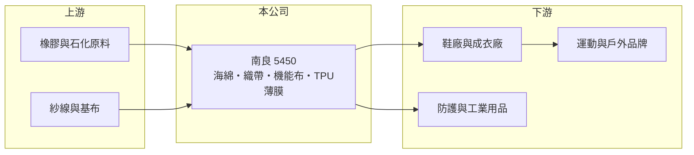

# 5450 南良

> 上櫃｜[[產業索引-其他業|其他業]]｜上市（櫃）日期 2020/06/01

# 第一章：企業模式與商業藍圖

> [!info] 撰寫說明
> 精簡版，由 Claude 依公開資料整理，架構比照 [[2330台積電]]，資料截至 2026-10-07。來源：nstock 公司概況頁、winvest 營收快訊（搜尋結果標題）。產品別營收比重與營運據點未查到。#待校對

南良是子良興業旗下的機能性材料廠，產品從橡膠海綿延伸到織帶、防火布與 TPU 薄膜。

- **核心業務：** 南良生產並銷售[[橡膠海綿]]、海綿貼合品、[[織帶黏扣]]、防火布、耐磨布與[[TPU薄膜]]等材料。
- **營收結構：** 產品別比重本次未查到；2025 年全年營收約 24.3 億元。
- **營運據點：** 生產據點本次未查到；主要股東子良興業持股約 72.07%。
- **長期方向：** 產品線朝防火、耐磨等機能性材料延伸，應用於鞋材、服飾、運動用品與防護用品（推估）。

# 第二章：護城河深度與競爭優勢

南良的優勢在於材料品項多、可提供貼合加工的一站式服務。

- **競爭優勢：** 海綿、織帶、薄膜與機能布可搭配貼合，客戶可一次採購多種部件，降低開發與採購成本（推估）。
- **主要對手：** 國內外鞋材與機能布料廠，例如 [[1342八貫]] 在 TPU 材料有重疊，其他對手本次未查到。
- **觀察重點：** 2026 年營收成長能否延續、品牌客戶庫存調整的節奏，以及毛利率能否維持在兩成五以上。

# 第三章：財務體質與盈利規模

資料日期：2026-10-07，以下數字是撰寫當時的快照；最新月營收、毛利率、累計 EPS 由自動排程寫在本筆記的屬性欄位（月營收、毛利率、累計EPS 等）。#待校對

南良 2026 年營收穩定成長，第二季獲利較第一季明顯回升。

- **營收規模：** 2026 年 4 月營收 2.47 億元、5 月 2.51 億元、6 月 2.45 億元（年增 21.66%）、7 月 2.50 億元（年增 29.43%）、8 月 2.09 億元（年增 9.91%）；1 至 7 月累計約 15.93 億元，年增 11.65%。
- **獲利：** 2026 年第二季 EPS 0.35 元，[[毛利率]] 26.41%、營益率 5.83%、淨利率 5.76%。
- **財務特色：** 資本額約 12.24 億元，近五年平均現金股利約 0.45 元，2024 年配發 0.5 元。

# 第四章：總體風險與地緣政治

南良的風險來自鞋服品牌的庫存週期與原料價格。

- **產業週期：** 鞋材與運動用品材料需求跟著國際品牌的庫存調整起伏，[[長鞭效應]]會放大訂單波動。
- **營運風險：** 營益率約 6%，原料或人工成本上升容易壓縮獲利。
- **其他風險：** 橡膠與石化原料價格、匯率（外銷比重推估偏高），以及美國關稅政策對鞋服供應鏈的影響。

# 專有名詞解析

## 金融

- **[[長鞭效應]]**：終端需求的小幅變動，沿供應鏈往上游傳遞時被逐級放大，造成上游庫存與訂單劇烈波動。
- **[[毛利率]]**：營業毛利占營收的比率，反映產品售價扣除直接成本後的獲利空間。

## 產業

- **[[橡膠海綿]]**：以橡膠發泡製成的彈性材料，用於鞋墊、護具與緩衝部件。
- **[[織帶黏扣]]**：俗稱魔鬼氈的黏扣帶與織帶，用於鞋服、箱包與醫療護具。
- **[[TPU薄膜]]**：熱塑性聚氨酯薄膜，具防水、耐磨與可熱封特性，常與布料貼合使用。

# 核心供應鏈

- 上游：橡膠、石化原料、紗線與基布供應商（推估）
- 下游／客戶：鞋廠、成衣廠與運動品牌供應鏈，名稱未揭露
- 同業：[[1342八貫]] 等機能性材料廠，其他名稱未查到

## 最新新聞
<!-- news:start -->
<!-- news:end -->

## 相關連結
- [公開資訊觀測站](https://mopsov.twse.com.tw/mops/web/t05st03?step=1&firstin=1&co_id=5450)
- [Goodinfo](https://goodinfo.tw/tw/StockDetail.asp?STOCK_ID=5450)
- [Yahoo 股市](https://tw.stock.yahoo.com/quote/5450)
- [鉅亨網新聞](https://www.cnyes.com/twstock/5450/news)
