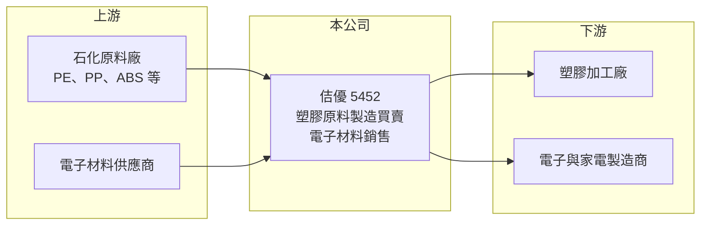

# 5452 佶優

> 上櫃｜[[產業索引-其他電子業|其他電子業]]｜上市（櫃）日期 2000/10/02

# 第一章：企業模式與商業藍圖

> [!info] 撰寫說明
> 精簡版，由 Claude 依公開資料整理，架構比照 [[2330台積電]]，資料截至 2026-10-07。來源：nStock 佶優公司簡介與財務摘要。公開資料有限，產品與客戶結構未逐條比對原始文件。#待校對

佶優以[[塑膠原料]]的製造與買賣為主，另有電子材料銷售，屬於石化下游與加工業之間的材料供應角色。

- **核心業務：** 依公司登記的營業項目，佶優從事塑膠原料之製造、買賣及電子材料之銷售。
- **營收結構：** 本次未查到塑膠原料與電子材料各自的營收比重，2025 年全年營收 49.04 億元。
- **營運據點：** 公司 1991 年 8 月成立，2000 年 10 月上櫃，生產與倉儲據點明細本次未查到。
- **長期方向：** 材料買賣業者的成長多來自擴充代理品項與客戶數，電子材料比重能否提高是觀察方向（推估）。

# 第二章：護城河深度與競爭優勢

佶優的競爭力主要在通路與客戶關係，而非獨家技術。

- **競爭優勢：** 長年經營塑膠原料通路，掌握中小型加工廠客戶與備貨調度能力，屬於服務型優勢（推估）。
- **主要對手：** 石化大廠的直營業務部門，以及其他塑膠原料貿易商與改質料廠，具體名單本次未查到。
- **觀察重點：** 2026 年第二季[[毛利率]] 17.73%，以材料買賣來說偏高，需確認是否來自自製或改質產品比重提高（推估）。

# 第三章：財務體質與盈利規模

資料日期：2026-10-07，以下數字是撰寫當時的快照；最新月營收、毛利率、累計 EPS 由自動排程寫在本筆記的屬性欄位（月營收、毛利率、累計EPS 等）。#待校對

佶優營收規模約 50 億元，但獲利率偏薄，2026 年獲利較 2025 年改善。

- **營收規模：** 2026 年 9 月營收 4.4 億元，1 至 9 月累計 37.85 億元；2025 年全年 49.04 億元。
- **獲利：** 2026 年第二季 EPS 0.39 元，已高於 2025 年全年 EPS 0.33 元；第二季[[營業利益率]] 8.72%、淨利率 4.61%。
- **財務特色：** 資本額 14.88 億元，第二季單季 [[ROE]] 2.54%，資本效率仍偏低。

# 第四章：總體風險與地緣政治

佶優的風險集中在原料價格與下游需求兩端。

- **產業週期：** 塑膠原料價格跟隨油價與石化供需循環，中國新產能投產時報價容易下跌，壓縮貿易商利差。
- **營運風險：** 材料買賣需要備庫存，原料價格急跌時可能產生[[存貨跌價損失]]。
- **其他風險：** 進口原料以美元計價，匯率波動與下游家電、電子產品景氣都會影響營收。

# 專有名詞解析

## 金融

- **[[存貨跌價損失]]**：存貨市價跌破帳面成本時，依會計規定提列的損失，會直接壓低當期獲利。
- **[[毛利率]]**：毛利除以營收，反映產品或服務扣除直接成本後的獲利空間。

## 產業

- **[[塑膠原料]]**：由石化廠生產的塑膠粒，例如 PE、PP、ABS，供下游射出、押出加工成產品。

# 核心供應鏈

- 上游：[[1301台塑]]、[[1304台聚]]、[[1312國喬]] 等國內外石化原料廠（推估）
- 下游／客戶：塑膠射出與押出加工廠、電子與家電製造商（推估）
- 同業：其他塑膠原料貿易商與改質塑膠廠（本次未查到具體名單）

## 最新新聞
<!-- news:start -->
<!-- news:end -->

## 相關連結
- [公開資訊觀測站](https://mopsov.twse.com.tw/mops/web/t05st03?step=1&firstin=1&co_id=5452)
- [Goodinfo](https://goodinfo.tw/tw/StockDetail.asp?STOCK_ID=5452)
- [Yahoo 股市](https://tw.stock.yahoo.com/quote/5452)
- [鉅亨網新聞](https://www.cnyes.com/twstock/5452/news)
