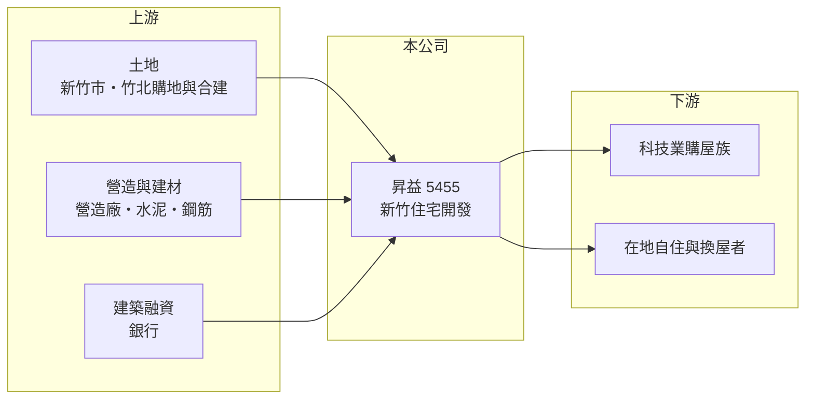

# 5455 昇益

> 上櫃｜[[產業索引-建材營造業|建材營造業]]｜上市（櫃）日期 2000/10/19

# 第一章：企業模式與商業藍圖

> [!info] 撰寫說明
> 本文由 Claude 依公開資料整理，架構比照 [[2330台積電]] 的四章研究，資料截至 2026-10-08。財務數字來源：MoneyDJ 理財網年度財務比率與損益表、櫃買中心開放資料（基本資料、2026 年第二季財報）；業務描述參考富果研究法說會頁面、CMoney、科技新報公司資料頁的標題。公開資料有限，個別建案名稱與區位未逐案查證。#待校對

在評估一家建商的長期價值時，第一步是看懂它所在的市場有什麼長期需求。本章針對昇益開發（股票代號：5455，以下簡稱昇益）的商業模式進行定性分析，說明一家位於新竹、規模不大的建商，如何受惠於科學園區帶來的住宅需求，以及小型建商在交屋空窗期的典型樣貌。

## 一、核心定位：新竹在地的小型住宅建商

昇益成立於 1991 年，2000 年在櫃買中心掛牌，總部位於新竹市公道五路，董事長兼總經理為陳文熾，實收資本額約 6.6 億元，是本文涵蓋的建商中股本最小的一家。公司官網網域為 signality，顯示公司早年可能從事其他產業後才轉型營建（推估，未查得轉型經過）。

* **新竹市場的長期需求：** 新竹科學園區聚集大量半導體與電子業工程師，收入高、購屋需求穩定，竹北與新竹市的房價在過去十年持續上漲。這是在地建商最重要的長期支撐。
* **營收極度不平均：** 昇益採[[建案交屋]]認列營收，2020 年營收只有約 0.02 億元，2024 年則達約 36.2 億元。2026 年上半年營收僅約 0.08 億元，正處於交屋空窗期。

## 二、資本轉化邏輯：一案接一案的小型建商模式

* **案量少、週期明顯：** 小型建商同時進行的建案只有一兩個，交屋年度獲利豐厚，空窗年度則因固定費用與利息而虧損。2020、2021 年與 2026 年上半年都屬於這種空窗期。
* **槓桿經營：** 2026 年第二季底總資產約 54.2 億元，負債約 40.6 億元且幾乎全為流動負債，股東權益約 13.6 億元。負債比率由 2019 年的 12% 升到 2023 年的 86%，2025 年約 67%，反映公司近年推案規模放大。

## 三、長期方向：延續新竹的推案節奏

昇益的長期關鍵在於能否在新竹持續取得土地，讓建案一個接一個銜接，縮短交屋空窗。2023 至 2025 年連續三年交屋，ROE 分別約 24%、40%、18%，顯示在新竹市場順利時，小型建商也能創造很高的股東報酬。

# 第二章：護城河深度與競爭優勢

護城河是企業抵禦競爭、長期維持超額利潤的機制。對小型區域建商而言，護城河主要來自在地經驗與選地眼光，本章說明昇益的優勢與限制。

## 一、昇益可以依靠的競爭要素

* **1. 新竹在地經營：** 熟悉新竹市與竹北的土地與客群，能掌握科技業購屋族群的產品偏好。
* **2. 精簡的組織：** 股本小、組織精簡，交屋年度的獲利可以有效轉化為高 ROE。
* **3. 穩定的產品毛利：** 2022 至 2025 年[[毛利率]]約 18% 至 21%，雖不算高，但相當穩定，代表成本控管一致。

## 二、主要競爭對手格局

| 對手 | 定位 | 對昇益的威脅 |
|---|---|---|
| [[2542興富發]] | 全台大型建商 | 在竹北大量推案，規模優勢 |
| [[5213亞昕]] | 大型住宅建商 | 大型社區開發能力 |
| 新竹在地建商 | 熟悉在地 | 同區域搶地搶客 |
| [[5522遠雄]] | 全台大型建商 | 品牌知名度高 |

## 三、優勢轉化：哪些守得住、哪些守不住

* **守得住：** 新竹科技業的長期購屋需求，為在地建商提供穩定的市場。
* **守不住：** 規模小、案量少，無法平滑營收，交屋空窗期常出現虧損。大型建商大量進入竹北，推高土地成本。
* **觀察重點：** 第一，下一批建案的交屋時程；第二，新土地的取得與推案；第三，科技業景氣對新竹房市的影響。

# 第三章：財務體質與盈利規模

資料日期：2026-10-08。數字取自 MoneyDJ 理財網年度財務資料與櫃買中心開放資料，表格是撰寫當時的快照；最新月營收、毛利率、累計 EPS 由自動排程寫在本筆記的屬性欄位（月營收、毛利率、累計EPS 等）。#待校對

財務報表是檢驗護城河是否真實存在的最終標準。本章用多年度的三率、ROE、營建業指標與資本報酬，檢視昇益的獲利品質。

## 一、獲利能力的基石：三率

| 年度 | 營收（新台幣） | [[毛利率]] | [[營業利益率]] | EPS（元） | [[ROE]] |
|---|---|---|---|---|---|
| 2021 | 0.63 億 | 28.9% | -15.7% | -0.09 | -1.13% |
| 2022 | 6.00 億 | 18.8% | 9.43% | 0.91 | 10.5% |
| 2023 | 16.2 億 | 18.5% | 11.3% | 2.54 | 24.4% |
| 2024 | 36.2 億 | 18.0% | 12.1% | 5.83 | 39.8% |
| 2025 | 20.4 億 | 21.0% | 14.7% | 3.46 | 17.9% |

資料來源：MoneyDJ 理財網年度損益表與財務比率。2026 年上半年（櫃買中心資料）營收約 0.08 億元、營業虧損約 0.14 億元、EPS 負 0.47 元。

2022 至 2025 年是昇益的連續交屋期，四年 EPS 合計約 12.7 元，ROE 平均約 23%。2021 至 2025 年營收年複合成長率因基期極低而失去參考意義。往前看，2019 年也曾有營收 27.6 億元、EPS 3.1 元的交屋高峰，2020 至 2021 年則幾乎沒有營收，顯示公司大約每三至五年經歷一次完整的推案與交屋循環。

## 二、營建業指標：推案量、已售未入帳與存貨

公司未公開完整的推案量與[[已售未入帳]]金額（未查得）。2026 年第二季底流動資產約 53.2 億元，約為 2025 年營收的 2.6 倍，負債幾乎全為流動負債（推估多為建築融資與預收房款）。2026 年上半年營收極低、流動資產卻維持在 50 億元以上，代表在建房地尚待完工，下一個交屋期的時點是觀察重點。

## 三、[[ROE]] 與股利

2021 至 2025 年平均 ROE 約 18.3%（推算），在建商中屬於高水準，但高度集中在交屋年度。依櫃買中心本益比殖利率資料，目前列示的現金股利為 0 元，2025 年度的股利分配情況待校對。2026 年第二季底保留盈餘約 6.79 億元。

## 四、[[ROIC]] 與 [[WACC]]：價值創造利差

**ROIC 推算：** 2025 年營業利益約 3.01 億元，稅後約 2.41 億元。官方資料只揭露負債總計約 40.6 億元，假設其中六成為有息負債約 24.3 億元（推估），加上股東權益約 13.6 億元，投入資本約 38.0 億元，ROIC 約 6.3%（推算）；以 2021 至 2025 年平均營業利益計算約 4.1%（推算）。

**WACC 推算：** 台灣 10 年期公債殖利率取 1.75%、市場風險溢酬 6%、β 取營建同業常見值 0.9（未查得公司實際 β），股東權益成本約 7.2%。負債成本假設 3%，稅率 20%，稅後約 2.4%。權益約占投入資本 36%，WACC 約 4.1%（推算）。

**結論：** 昇益 2025 年的 ROIC 高於 WACC，五年平均則與 WACC 相當。小型建商的價值創造取決於能否縮短交屋空窗期，若新竹的推案能持續銜接，ROIC 有機會長期高於資金成本。

# 第四章：總體風險與地緣政治

任何企業都無法脫離宏觀環境獨立存在。本章分析昇益長期必須面對的房市週期、政策與營運風險。

## 一、產業週期與政策風險

* **新竹房市與科技業景氣：** 新竹的購屋需求與科技業的薪資、股價與聘僱密切相關。半導體景氣下行時，購屋信心與預售去化都會轉弱。
* **[[信用管制]]：** 2024 年第七波選擇性信用管制後，買方貸款成數與建商融資都受限，預售去化放慢。
* **稅制：** 房地合一稅、囤房稅與預售屋轉售限制，會壓抑投資型買盤。

## 二、營運環境的隱性風險

* **案量集中：** 同時進行的建案少，單一建案的延誤或銷售不佳，就會直接造成整年虧損。
* **土地取得：** 竹北與新竹市的土地價格因大型建商進入而上漲，小型建商的取得成本與競標能力相對弱勢。
* **營造成本：** 缺工與建材上漲會壓縮已預售建案的毛利。

## 三、財務風險

* **流動負債集中：** 負債幾乎全為流動負債，若建案去化不順或銀行收緊融資，短期資金調度壓力較大。
* **交屋空窗虧損：** 2026 年上半年的虧損屬於空窗期常態，但若空窗期拉長，利息與費用會持續侵蝕淨值。

# 專有名詞解析

## 金融

- **[[信用管制]]**：央行限制購屋與建商貸款成數的政策，會影響房市成交與建商資金。
- **[[ROIC]]**：投入資本報酬率，稅後營業利益除以股東權益加有息負債，衡量本業運用資本的效率。
- **[[WACC]]**：加權平均資金成本，股東與債權人要求報酬率的加權平均，是 ROIC 要超越的門檻。

## 產業

- **[[建案交屋]]**：建商在房屋完工並交付買方時才認列營收，因此營建公司的營收常集中在交屋年度。
- **[[已售未入帳]]**：已經賣出、但尚未完工交屋而未認列營收的建案金額，是建商未來營收的主要能見度指標。

# 核心供應鏈

## 1. 上游：土地、營造與資金
- 土地來源：新竹市與竹北購地及合建（具體標的未查得）
- 營造：外部發包營造廠（合作對象未查得）；建材如 [[1101台泥]]、[[2002中鋼]]
- 資金：銀行建築融資

## 2. 中游：昇益與同業
- 同業：[[2542興富發]]、[[5213亞昕]]、[[5522遠雄]]

## 3. 下游：客戶
- 新竹科學園區的科技業購屋族、在地自住與換屋者

## 最新新聞
<!-- news:start（自動產生，請勿手動編輯此範圍） -->
- 2026-10-07 📰 媒體 18:53｜營收速報 - 昇益(5455)9月營收13.48億元年增率高達15013.85％｜[鉅亨網](https://news.cnyes.com/news/id/6623866)

完整紀錄：[[5455昇益 新聞]]
<!-- news:end -->

## 相關連結
- [公開資訊觀測站](https://mopsov.twse.com.tw/mops/web/t05st03?step=1&firstin=1&co_id=5455)
- [Goodinfo](https://goodinfo.tw/tw/StockDetail.asp?STOCK_ID=5455)
- [Yahoo 股市](https://tw.stock.yahoo.com/quote/5455)
- [鉅亨網新聞](https://www.cnyes.com/twstock/5455/news)
