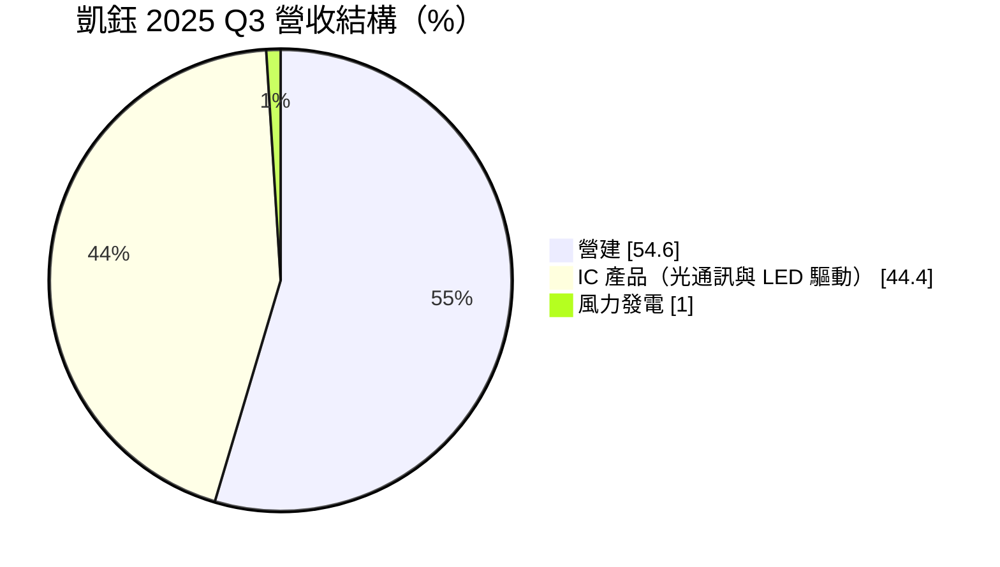
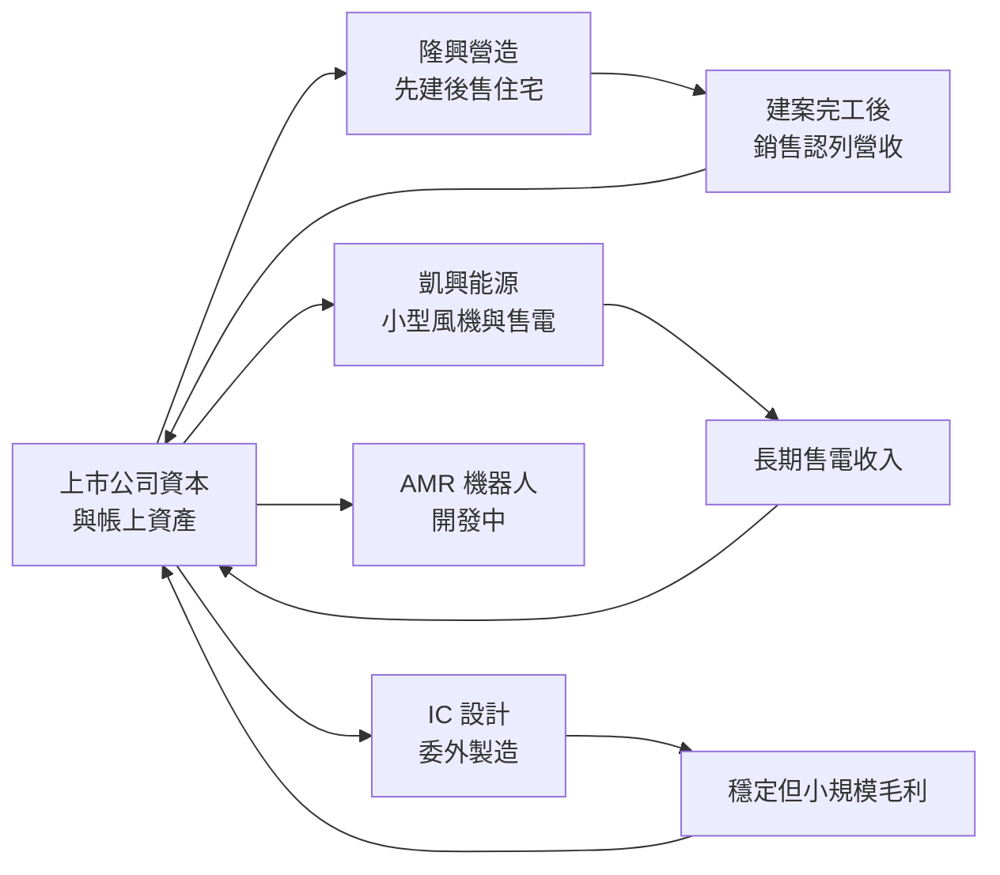
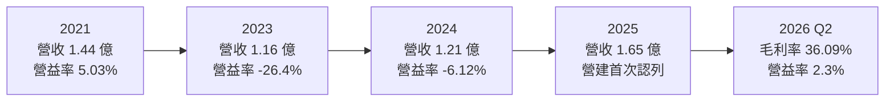
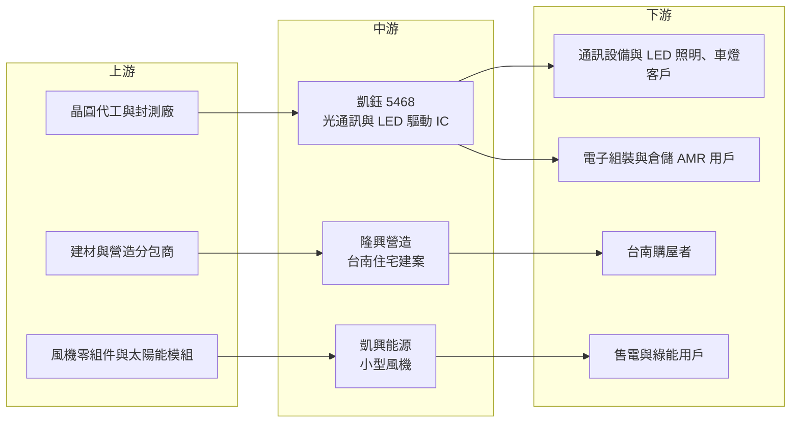

# 5468 凱鈺

> 上櫃｜[[產業索引-半導體業|半導體業]]｜上市（櫃）日期 2001/01/17

# 第一章：企業模式與商業藍圖

> [!info] 撰寫說明
> 本文由 Claude 依公開資料整理，架構比照 [[2330台積電]] 的四章研究，資料截至 2026-10-08。財務數字來源：Goodinfo 台灣股市資訊網年度經營績效頁、富邦 MoneyDJ 個股基本資料（2025 年營收分類、2026 年第二季財務比率、β 值）、富果研究 2025 年第三季法說會整理、科技新報公司資料庫、nStock 公司沿革；產業描述為整理性內容，尚未逐條比對原始文件。#待校對

在評估單一個股的長期投資價值時，首要步驟是拆解企業的底層獲利邏輯。本章針對凱鈺科技股份有限公司（股票代號：5468，以下簡稱凱鈺）的商業模式進行定性分析。凱鈺掛牌在半導體類股，但它的營收規模每年只有一億多元，而且近年最重要的成長來源已不是晶片，而是台南的住宅建案。理解一家「小型 IC 設計公司如何走向多角化」，是看懂凱鈺的關鍵。

## 一、核心定位：營收規模極小、正在轉型的多角化公司

凱鈺於 1994 年 7 月設立，原名台晶記憶體科技，2002 年更名為台晶科技，2007 年與我想科技合併並由台晶存續，2008 年改為現名凱鈺科技，2001 年 1 月在櫃買中心掛牌，總部位於新竹科學園區。董事長為胡炳南，總經理為胡炳昆。

凱鈺早期的核心產品是光纖通訊 IC，用於行動基地台的低頻驅動；後來加入 [[LED驅動IC]]，應用於車燈與監控系統。這兩類晶片都屬於利基型產品，市場規模不大，凱鈺的 IC 營收長年只有一億多元，不足以支撐上市公司的固定費用，因此 2016 至 2020 年連續虧損。

面對 IC 本業難以放大的困境，凱鈺選擇以子公司方式跨入其他產業：100% 持股的隆興營造負責營建，100% 持股的凱興能源負責[[小型風力發電]]，另外開發[[AMR]] 自主移動機器人。公司章程中的營業項目也包含住宅及大樓開發租售業與機械設備製造業。這種轉型方向和許多營收萎縮的老牌電子公司類似：利用既有的上市平台、資本與土地，尋找比原本業更容易放大的事業。

## 二、終端應用與產品板塊

依富果整理的 2025 年第三季法說會資料，當季營收結構如下：

富邦 MoneyDJ 對 2025 年全年營收的分類則為通訊 77.83%、能源 22.17%，分類方式和法說會不同，兩者無法直接對照。以下依法說會的業務劃分說明：

* **營建事業：** 首個建案「城東段一期」位於台南市安南區，採「[[先建後售]]」模式，規劃 21 戶透天電梯住宅與店面，鎖定高齡化與三代同堂需求。2025 年第三季營建收入首次認列，使當季營收年增 66.7%。公司規劃在同區推動「城東段二期」，預計 31 戶，目標 2026 年第一季開工。營建是目前凱鈺最主要的成長引擎。
* **IC 產品：** 光纖通訊 IC 與 LED 驅動 IC 合計約占四成多。公司表示 LED 業務營收比重下降但毛利穩定，會持續經營；IC 不再是發展主軸，而是提供穩定毛利的基礎。
* **能源事業：** 專注陸上型小型風力發電機的設計與製造，台中有一處案場設置 44 支 9.8kW 風機，年發電量約 50 萬度，並規劃拓展太陽能，目標成為能源系統整合商。
* **機械製造（AMR）：** 技術源自工研院，採光達導引（[[Lidar SLAM]]），已開發頂升型、板車型、堆高機型等產品，鎖定電子組裝與物流倉儲。

## 三、資本轉化邏輯：以上市平台資本支撐多事業

這四項業務的現金流特性差異很大。IC 設計屬輕資產，晶圓製造委外，資本需求低；營建採「先建後售」，必須先投入土地與營造成本，等房屋完工、[[建案交屋]]後才能認列營收，資金回收期長，獲利集中在交屋年度；小型風電則是前期投入設備，之後以長期售電回收。凱鈺的總資產從 2023 年底的 5.7 億元增加到 2025 年 9 月底的 7.24 億元（富果法說整理），反映營建投入的增加。

「先建後售」的好處是房屋已蓋好，買方看得到實品，銷售風險較低，也避免預售屋的履約爭議；缺點是公司要自行承擔建造期間的資金成本，若房市轉弱、銷售變慢，存貨會長期壓在帳上。

## 四、企業長期藍圖

管理層表示，隨營建案持續銷售，2026 年整體營收將明顯優於 2025 年。長期策略是以營建為主要成長引擎、維持 IC 業務以穩定毛利、深化綠能布局、並透過 AMR 與集團智慧製造需求整合。公司希望以多元業務組合分散單一產業風險。

從投資人的角度看，這個藍圖意味著凱鈺的本質正在從「半導體公司」轉向「以台南在地營建為主的多角化公司」。未來判斷凱鈺的價值，比較適合用營建業的指標（推案量、銷售率、土地成本）來看，而不是 IC 設計業的研發與產品週期。

# 第二章：護城河深度與競爭優勢

本章分析凱鈺的護城河構成、主要競爭對手，以及多角化策略能否建立長期競爭優勢。

## 一、護城河的核心組成要素

坦白說，凱鈺目前沒有明顯的護城河。各項業務的規模都很小，在各自的產業中都不是主要參與者。如果要找相對優勢，大致有以下三點：

* **1. 利基 IC 的長期客戶關係：** 光纖通訊與 LED 驅動 IC 的客戶在產品導入後不常更換晶片，這讓凱鈺的 IC 營收雖小但相對穩定，毛利率維持在三成左右。這不是強大的護城河，但提供了基本的現金流來源。
* **2. 在地化產品設計：** 營建事業以透天電梯住宅與「先建後售」為區隔，針對台南安南區高齡化與多代同堂的需求設計產品。這是區域型建商常見的做法，優勢來自對當地需求的理解，而非規模。
* **3. 低負債的財務結構：** 2026 年第二季負債比例約 18.64%（富邦 MoneyDJ），財務壓力不大，讓公司有能力在建案銷售期間承擔資金壓力。

## 二、主要競爭對手格局

| 業務 | 主要競爭者 | 凱鈺的處境 |
|---|---|---|
| LED 驅動 IC | [[3588通嘉]]、[[6138茂達]]、中國 LED 驅動 IC 廠 | 規模遠小於同業，只能經營特定利基應用 |
| 光纖通訊 IC | 國際類比與光通訊晶片大廠 | 屬早期核心產品，成長性有限 |
| 台南住宅營建 | 台南在地建商與全國型建商 | 推案量小，以產品差異化爭取買方 |
| 小型風機與綠能 | 國內外小型風機與太陽能系統商 | 案場規模小，尚未形成穩定營收 |
| AMR 機器人 | [[2359所羅門]]、[[2049上銀]] 等自動化廠商 | 仍在開發與導入階段 |

## 三、優勢轉化：守得住、守不住與觀察重點

* **守得住：** 既有 IC 客戶的穩定訂單。這部分營收不大，但毛利率穩定，能支撐部分固定費用。
* **守不住：** IC 業務的成長性。凱鈺的 IC 營收十年來沒有放大，在研發資源有限的情況下，很難和規模大十倍以上的同業競爭新產品。
* **觀察重點：** 第一，城東段一期與二期的銷售速度與毛利率，這決定營建事業能否成為穩定獲利來源；第二，營建毛利率能否高於法說提到的初期水準（2025 年第三季整體毛利率降到 22.3%，主因營建初期毛利率較低）；第三，風電與 AMR 是否能形成實際營收，或只是長期投入。

# 第三章：財務體質與盈利規模

資料日期：2026-10-08。數字取自 Goodinfo 年度經營績效頁與富邦 MoneyDJ 個股基本資料，表格是撰寫當時的快照；最新月營收、毛利率、累計 EPS 由自動排程寫在本筆記的屬性欄位（月營收、毛利率、累計EPS 等）。#待校對

財務報表是檢驗護城河是否真實存在的最終標準。本章用十年的三率、[[ROE]] 與資本報酬，檢視凱鈺在 IC 本業停滯與轉型營建之間的獲利品質。

## 一、獲利能力的基石：三率

| 年度 | 營收（新台幣） | [[毛利率]] | [[營業利益率]] | EPS（元） | [[ROE]] |
|---|---|---|---|---|---|
| 2016 | 1.91 億 | 23.7% | -38.2% | -1.22 | -20.7% |
| 2017 | 1.51 億 | 29.5% | -52.7% | -1.42 | -31.7% |
| 2018 | 1.38 億 | 33.1% | -53.1% | -0.77 | -28.4% |
| 2019 | 1.36 億 | 32.2% | -34.9% | -3.47 | -65.2% |
| 2020 | 1.43 億 | 35.1% | -5.8% | -0.48 | -11.6% |
| 2021 | 1.44 億 | 40.2% | 5.03% | 0.19 | 3.37% |
| 2022 | 1.60 億 | 34.8% | 5.00% | -0.11 | -1.21% |
| 2023 | 1.16 億 | 15.0% | -26.4% | -1.29 | -14.9% |
| 2024 | 1.21 億 | 28.6% | -6.12% | -0.13 | -1.68% |
| 2025 | 1.65 億 | 28.4% | 2.25% | -0.65 | -6.3% |

這張表最清楚的訊息是：凱鈺的營收十年來都在 1.2 億至 1.9 億元之間，規模太小，無法攤提上市公司的研發、管理與上市維持費用。2016 至 2019 年營業利益率長期在 -35% 至 -53%，代表費用遠高於毛利。2020 年後公司大幅精簡費用，營業利益率改善到接近損益兩平，但淨利仍多為虧損。

2025 年營業利益率轉正為 2.25%，但稅後仍虧損 0.26 億元、EPS -0.65 元，表示業外或其他項目仍有損失（明細未查得）。2016 至 2025 年營收年複合成長率約 -1.6%（推算）。2026 年第二季單季毛利率 36.09%、營業利益率 2.3%（富邦 MoneyDJ），營建收入的認列節奏將是未來幾年財報波動的主要來源。

* **[[毛利率]]：** IC 業務毛利率約三成上下；營建初期毛利率較低，2025 年第三季整體毛利率降到 22.3%。未來毛利率會隨營建與 IC 的組合比例而變動。
* **[[營業利益率]]：** 取決於營收規模能否放大。若營建案能穩定交屋，營收規模擴大後費用占比下降，營業利益率才有機會穩定轉正。

## 二、[[ROE]]：資本效率

2021 至 2025 年平均 ROE 約 -4.1%（推算），十年平均約 -17.8%（推算）。十年間只有 2021 年 ROE 為正，凱鈺長期沒有為股東創造報酬。2026 年第二季[[每股淨值]]約 9.57 元（富邦 MoneyDJ），低於 10 元面額，反映多年虧損累積侵蝕了股東權益。

## 三、資本支出與自由現金流

IC 業務採 [[Fabless]] 模式、屬輕資產，資本支出很少；營建業務的土地與營造成本在會計上多列為存貨，而非資本支出，因此營建投入會反映在營運資金與存貨增加上。總資產由 2023 年底的 5.7 億元增加到 2025 年 9 月底的 7.24 億元，推估營建投入使營業現金流在建造期間為負（推估），等交屋後才回收。[[自由現金流]]的長期狀況未查得。

股利方面，依 nStock 與富邦 MoneyDJ，凱鈺近五年沒有配息紀錄。在累積虧損尚未彌補、每股淨值低於面額的情況下，短中期恢復配息的空間有限。

## 四、[[ROIC]] 與 [[WACC]]：價值創造利差

**ROIC 推算：** 2025 年營業利益約 0.037 億元（1.65 億 × 2.25%），以 20% 稅率計算，稅後營業利益約 0.03 億元。投入資本以 2026 年第二季權益約 5.64 億元（每股淨值 9.57 元 × 約 5,892 萬股）計算，有息負債假設不重大，ROIC 約 0.5%（推算）。2023 年營業虧損約 0.31 億元，ROIC 約 -5%（推算）。

**WACC 推算：** 權益成本以 CAPM 估計，假設台灣 10 年期公債殖利率 1.75%、市場風險溢酬 6%、β 取富邦 MoneyDJ 所列 0.74，權益成本約 6.2%。不過凱鈺市值小、成交量低，β 偏低不代表風險低；若改用小型股常見的 β 1.0，權益成本約 7.75%。有息負債不重大，WACC 約 6.2% 至 7.75%（推算）。

**結論：** 凱鈺過去十年的 ROIC 幾乎都低於 WACC，長期沒有創造經濟價值。營建事業是改變這個狀況的唯一明顯機會：如果城東段建案能以合理毛利完銷，且公司能持續推案，營收規模才可能放大到足以讓 ROIC 超過資金成本（推算）。在此之前，凱鈺比較像一家正在轉型、結果尚待驗證的小型公司。

# 第四章：總體風險與地緣政治

任何企業都無法脫離宏觀環境獨立存在。本章分析凱鈺未來必須面對的地緣政治、產業週期與營運風險。

## 一、地緣政治風險

凱鈺的營收以台灣在地的營建與小規模 IC 銷售為主，直接的國際貿易曝險不大。IC 業務若有銷往中國或依賴海外晶圓代工，可能受到關稅與供應鏈政策影響，但規模有限。整體而言，地緣政治對凱鈺的影響主要是間接的：兩岸情勢影響台灣房市信心與購屋需求。

## 二、產業週期與市場結構風險

* **房地產週期：** 營建已成為最主要營收來源，台灣的信用管制、利率與房價走勢會直接影響建案銷售速度。央行針對建商融資與購屋貸款的選擇性信用管制，可能延長「先建後售」的銷售期間。
* **營收認列的不連續性：** 建案營收在交屋時集中認列，可能出現某一年營收大增、下一年驟降的情形，財報波動會比 IC 業務時期更大。
* **LED 與通訊 IC 的價格競爭：** 中國 LED 驅動 IC 廠商價格低廉，凱鈺的 IC 業務只能維持在利基市場。

## 三、營運環境的隱性風險

* **管理資源分散：** 一家營收一億多元的公司同時經營 IC、營建、風電與 AMR 四種事業，每一項都需要不同的專業人才與管理能力，資源分散可能讓每項業務都難以做大。
* **建案集中風險：** 目前營建收入來自台南安南區的單一區域，區域房市轉弱會直接衝擊公司營運。
* **治理與資訊揭露：** 多角化後，投資人需要分辨各事業的獲利貢獻，若財報分部揭露不足，外部評估難度會提高。

## 四、科技或法規演進風險

營建業面臨建材價格、缺工與建築法規（例如耐震、綠建築要求）的變化，都會影響成本。綠能事業的收益取決於再生能源政策與[[躉購費率]]，政策調整會改變投資報酬。IC 業務則面臨 LED 照明與光通訊技術的世代更替，若無研發資源跟進，產品可能逐步被淘汰。對凱鈺而言，最大的長期風險不是單一技術，而是能否在多項事業中找到一項真正具有規模與競爭力的核心。

# 專有名詞解析

## 半導體

- **[[LED驅動IC]]**：控制 LED 電流與亮度的晶片，用於照明、車燈與顯示背光，需要穩定電流以延長 LED 壽命。
- **[[Fabless]]**：無晶圓廠的 IC 設計公司，只負責設計晶片，製造委託晶圓代工廠。

## 應用

- **[[AMR]]**：自主移動機器人，以光達與感測器建立地圖並自行規劃路徑，用於工廠與倉儲搬運。
- **[[Lidar SLAM]]**：以光達掃描環境並同時定位與建圖的技術，讓機器人不需地面磁條也能自主導航。

## 金融

- **[[每股淨值]]**：股東權益除以流通股數，代表每股在帳面上可分配的資產價值。
- **[[自由現金流]]**：營業活動現金流減去資本支出，代表企業可自由用於配息、還債或併購的現金。

## 產業

- **[[先建後售]]**：建商先完成建物再銷售的模式，買方可看實品，但建商需自行負擔建造期間的資金成本。
- **[[建案交屋]]**：建商在房屋完工並交付買方時才認列營收，因此營建公司的營收常集中在交屋年度。
- **[[小型風力發電]]**：單機容量較小的陸上型風機，可設置於工業區或港區，以售電或自用方式回收投資。
- **[[躉購費率]]**：政府以固定價格向再生能源業者收購電力的費率，是綠能投資報酬的重要依據。

# 核心供應鏈

## 1. 上游：製造與材料
- IC 晶圓代工與封裝測試夥伴：公司未揭露（推估委外台灣成熟製程代工廠）
- 營建：建材與營造分包商（未查得）
- 能源：風機與太陽能零組件供應商（未查得）

## 2. 中游：凱鈺本身與子公司
- 隆興營造（100% 持股）：台南安南區城東段建案
- 凱興能源（100% 持股）：小型風力發電

## 3. 下游：主要客戶
- 通訊與 LED 照明、車燈、監控系統客戶（名單未揭露）
- 台南住宅購屋者
- AMR 目標客戶：電子組裝與物流倉儲業者

## 4. 同業與競爭者
- LED 驅動 IC：[[3588通嘉]]、[[6138茂達]]
- AMR 與自動化：[[2359所羅門]]、[[2049上銀]]

## 最新新聞
<!-- news:start -->
<!-- news:end -->

## 相關連結
- [公開資訊觀測站](https://mopsov.twse.com.tw/mops/web/t05st03?step=1&firstin=1&co_id=5468)
- [Goodinfo](https://goodinfo.tw/tw/StockDetail.asp?STOCK_ID=5468)
- [Yahoo 股市](https://tw.stock.yahoo.com/quote/5468)
- [鉅亨網新聞](https://www.cnyes.com/twstock/5468/news)
