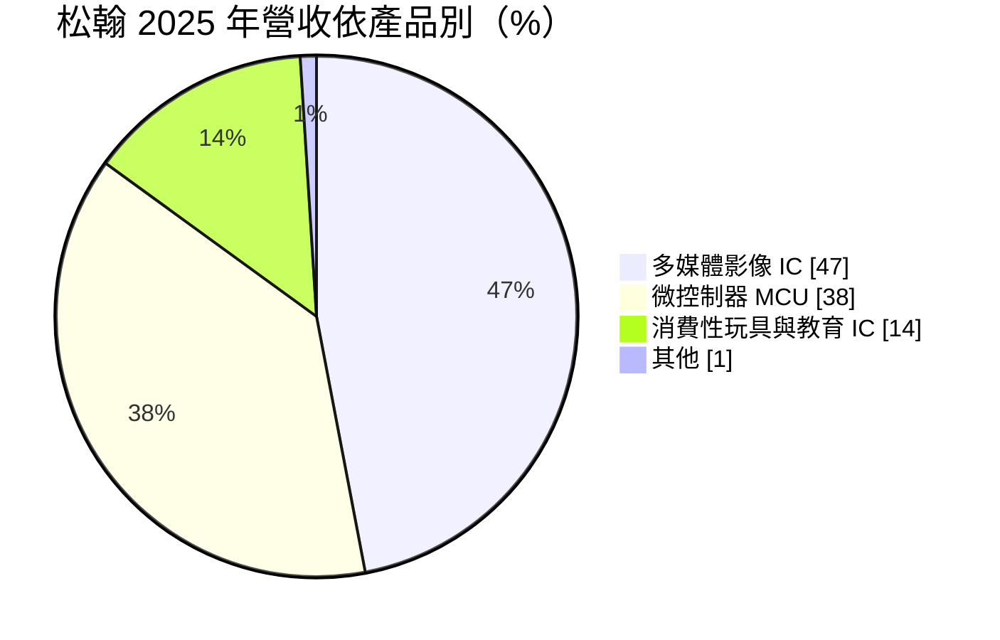
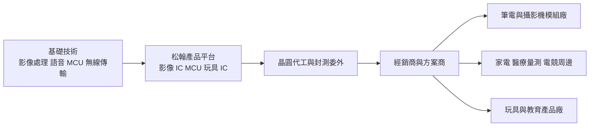
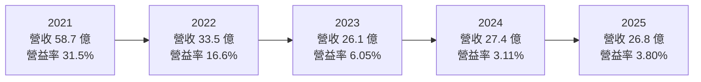
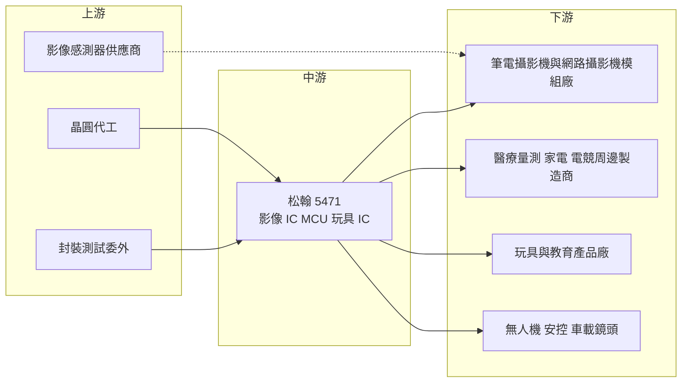

# 5471 松翰

> 上市｜[[產業索引-半導體業|半導體業]]｜上市（櫃）日期 2003/08/25

# 第一章：企業模式與商業藍圖

> [!info] 撰寫說明
> 本文由 Claude 依公開資料整理，架構比照 [[2330台積電]] 的四章研究，資料截至 2026-10-08。財務數字來源：Goodinfo 經營績效與股利政策頁、富果研究 2026 年 3 月與 6 月法說會整理、證交所 OpenAPI 公司基本資料與 2026 年第二季資產負債資料；產業描述為整理性內容，尚未逐條比對原始文件。#待校對

在評估單一個股的長期投資價值時，首要步驟是拆解企業的底層獲利邏輯。本章針對松翰科技（股票代號：5471，以下簡稱松翰）的商業模式進行定性分析，說明一家橫跨筆電攝影機影像晶片、微控制器與教育玩具晶片的消費性 IC 設計公司，如何在多個小眾市場之間配置資源，以及它正把重心移往哪些毛利較高的應用。

## 一、核心定位：多個消費性利基市場的組合型 IC 設計公司

松翰成立於 1996 年，2003 年在證交所上市，總部位於新竹縣竹北市，是一家 [[Fabless]] IC 設計公司。和專注單一產品的 IC 設計公司不同，松翰的營收來自三個彼此獨立的產品群：多媒體影像晶片、[[MCU]] 微控制器，以及消費性玩具與教育晶片。這種「多個利基市場組合」的模式，好處是單一市場衰退時不至於全面崩盤，代價是每個市場的規模都不大，很難在任何一個領域做到全球龍頭。

松翰的長期定位可以這樣理解：它把語音、影像與控制這幾種基礎技術，賣給大量中小型消費電子製造商與部分筆電品牌。公司最有代表性的產品是筆電與外接網路攝影機使用的 [[ISP]] 影像處理晶片，以及點讀筆使用的 [[OID]] 光學辨識晶片組。前者讓松翰進入國際筆電供應鏈，後者則是公司自行發展的獨特技術。

2020 至 2021 年遠距工作與視訊會議需求爆發，網路攝影機晶片供不應求，松翰營收從過去約 32 億元的水準跳升到 58.7 億元，EPS 達 8.71 元。需求退潮後，2023 至 2025 年營收回到 26 至 27 億元，EPS 約 1 元上下。這段經歷說明松翰的營收高度受消費電子的特殊事件影響，投資人需要分辨哪些成長是一次性的、哪些是長期的。

## 二、終端應用／產品板塊：影像、MCU 與玩具三足鼎立

依富果整理的 2026 年 3 月法說會資料，2025 年營收結構如下：

* **多媒體影像 IC：** 包括筆電攝影機與外接網路攝影機的影像處理晶片、嬰兒監視器與倒車顯影的無線影像傳輸晶片，以及安控、門禁、金融票據掃描等非筆電應用。2025 年筆電應用約占影像晶片營收 61%。新一代筆電影像晶片加入人體存在偵測（[[HPD]]）等 AI 功能，依法說會資料單價約 1 美元以上，高於傳統產品的 0.5 至 0.6 美元。無線影像傳輸則延伸到[[無人機圖傳]]，系統延遲低於 40 毫秒。
* **微控制器 MCU：** 分成三類。通用型 MCU 用於小家電與遙控器，競爭激烈，公司正在縮減；USB MCU 用於電競鍵盤與滑鼠；[[SOC MCU]] 用於血壓計、血糖機、耳溫槍、血氧機等居家醫療量測產品，毛利較佳，並以 2026 年的連續血糖監測（[[CGM]]）系統為重點。
* **消費性玩具與教育 IC：** 包括互動玩具的語音晶片與點讀筆的 OID 晶片組。OID 已發展到第四代，是松翰在教育產品領域的獨有技術。

## 三、資本轉化邏輯（營運模式）：分散市場、集中技術

* **技術共用、市場分散：** 影像處理、語音編解碼、MCU 與無線傳輸是松翰的四項基礎技術，同一套技術可以衍生到多種應用。例如無線影像技術先用在嬰兒監視器，再延伸到倒車顯影與無人機。這種模式讓研發投入能在多個市場攤提。
* **高毛利、低資本：** 松翰長期毛利率約 38% 至 42%，2021 年缺貨期間一度達 51.4%。Fabless 模式讓資本支出很低，公司把大部分資源放在研發人員。
* **經銷與方案商通路：** 客戶多為兩岸中小型製造商，需要透過經銷商與方案商提供技術支援。這讓松翰能觸及大量長尾客戶，但也使需求資訊傳遞較慢，容易出現庫存誤判。

## 四、企業長期藍圖：從低毛利通用品轉向高附加價值應用

松翰的長期策略在法說會中說得很清楚：降低對低毛利通用型 MCU 的依賴，把資源轉向醫療量測 SOC MCU、電競 USB MCU，以及高階影像晶片。

* **AI PC 影像晶片：** 人體存在偵測等功能讓筆電鏡頭從「被動拍攝」變成「主動感測」，例如使用者離開時自動鎖螢幕。這類晶片單價較高，若 AI PC 普及，松翰在筆電攝影機的既有位置可以轉化為單價提升。
* **醫療量測：** 居家醫療量測屬剛性需求，產品需通過醫療器材認證，客戶一旦採用不易更換。連續血糖監測是長期成長潛力最大的應用之一。
* **無人機與車用影像：** 無人機圖傳與類比高清（[[AHD]]）有線傳輸晶片，讓松翰把影像技術延伸到車載鏡頭與監控市場。無人機業務目前量小但單價高，軍規產品仍在認證中。

# 第二章：護城河深度與競爭優勢

在長期價值投資中，「護城河」指企業抵禦競爭、維持超額利潤的保護機制。本章分析松翰的護城河構成、主要競爭對手，以及在消費性 IC 市場的價格壓力下，它的優勢能守住多少。

## 一、護城河的核心組成要素

松翰的護城河較窄，主要來自利基技術與客戶的轉換成本：

* **1. 獨特的利基技術：** OID 光學辨識是松翰自行發展、已到第四代的技術，在點讀筆等教育產品中具有獨特性。無線影像傳輸的低延遲與抗干擾能力，也讓公司在嬰兒監視器市場取得法說會所稱的全球領先份額。利基技術讓松翰在小市場中擁有定價權。
* **2. 筆電攝影機的既有位置：** 筆電鏡頭模組需要與品牌廠的軟體、驅動程式與 Windows 認證配合。松翰長期供應筆電攝影機影像晶片，累積了相容性與品質紀錄，這讓它在 AI PC 換代時有優先被評估的機會。
* **3. 醫療量測的認證門檻：** 血壓計、血糖機等醫療器材需要整機認證，晶片一旦被寫進認證文件，更換成本很高。
* **4. 保守的財務結構：** 依證交所 2026 年第二季資料，松翰總資產約 44.4 億元、負債約 8.3 億元，權益約 36.1 億元，負債比不到兩成。低負債讓公司在景氣低谷時仍能持續研發與配息。

## 二、全球主要競爭對手格局

| 對手 | 定位 | 對松翰的威脅 |
|---|---|---|
| [[3227原相]] | 影像感測與光學導航晶片，電競滑鼠感測器領導者 | 在影像與電競周邊市場部分重疊 |
| [[2379瑞昱]] | 大型 IC 設計公司，提供筆電攝影機控制晶片 | 以整合方案與規模競爭筆電影像晶片 |
| [[6202盛群]]、[[4919新唐]] | 台灣 MCU 公司 | 在家電、健康量測 MCU 直接競爭 |
| 中國消費性 IC 與 MCU 設計公司 | 低價搶占玩具、小家電與通用型 MCU | 是通用型 MCU 毛利下滑的主因 |
| [[5487通泰]] | 健康量測與觸控 IC | 在體溫計等健康量測晶片重疊 |

## 三、優勢轉化：哪些市場守得住、哪些守不住

* **守得住：** 有認證門檻或獨特技術的市場，包括醫療量測 SOC MCU、OID 教育產品、嬰兒監視器無線影像，以及筆電攝影機的高階影像晶片。這些市場客戶重視穩定性與功能，價格不是唯一考量。
* **守不住：** 通用型 MCU 與低階玩具語音晶片。這些產品功能單純、轉換成本低，中國同業可以用更低價格取代。法說會資料顯示通用型 MCU 占 MCU 營收比重已從 42% 降到 37%，公司也主動縮減這塊業務。
* **觀察重點：** 第一，AI PC 影像晶片能否帶動單價與毛利率提升；第二，醫療量測與電競周邊能否持續提高在 MCU 營收中的比重；第三，營業利益率能否從近年約 3% 至 6% 的低水準回到 10% 以上，這是判斷轉型是否成功的關鍵財務指標。

# 第三章：財務體質與盈利規模

資料日期：2026-10-08。數字取自 Goodinfo 年度經營績效與股利政策頁、富果研究法說會整理、證交所 OpenAPI 2026 年第二季資產負債資料，表格是撰寫當時的快照；最新月營收、毛利率、累計 EPS 由自動排程寫在本筆記的屬性欄位（月營收、毛利率、累計EPS 等）。#待校對

財務報表是檢驗護城河是否真實存在的最終標準。本章用五年的三率、[[ROE]]、股利與資本報酬，檢視松翰在疫情高峰後的獲利品質。

## 一、獲利能力的基石：三率

| 年度 | 營收（新台幣） | [[毛利率]] | [[營業利益率]] | EPS（元） | [[ROE]] |
|---|---|---|---|---|---|
| 2021 | 58.7 億 | 51.4% | 31.5% | 8.71 | 35.5% |
| 2022 | 33.5 億 | 46.6% | 16.6% | 3.45 | 14.6% |
| 2023 | 26.1 億 | 41.8% | 6.05% | 1.11 | 5.19% |
| 2024 | 27.4 億 | 41.6% | 3.11% | 1.07 | 5.06% |
| 2025 | 26.8 億 | 41.4% | 3.80% | 0.72 | 3.43% |

這張表最重要的訊息是：2020 至 2021 年的高峰是疫情帶來的特殊需求，而不是新常態。依 Goodinfo 長期數字，2016 至 2019 年松翰營收在 31.6 億至 33.4 億元之間，毛利率約 38% 至 40%，營業利益率約 9% 至 11%，EPS 約 1.4 至 2 元。2020 至 2021 年網路攝影機需求暴增，營收跳到 53.7 億與 58.7 億元，營業利益率一度高達 31.5%。2023 年以後營收回到疫情前略低的水準，但營業利益率只剩 3% 至 6%，低於疫情前。

營業利益率低於疫情前，代表公司在高峰期擴充的研發與人事費用，並沒有隨營收回落而等比例縮減。毛利率維持在 41% 左右，說明產品本身仍有定價能力，問題主要在費用結構與營收規模。2016 至 2025 年營收年複合成長率約 -2.0%（推算），反映的是松翰缺乏新的大型成長引擎。

## 二、[[ROE]]：資本效率

2021 至 2025 年平均 ROE 約 12.8%（推算），但主要由 2021 年的 35.5% 撐起，2023 至 2025 年 ROE 只有 3% 至 5%。對照疫情前 2016 至 2019 年約 8% 至 11.5% 的 ROE，近年的資本效率明顯偏低。松翰幾乎沒有財務槓桿，ROE 完全取決於本業獲利；帳上權益約 36 億元，若本業淨利只有 1 億多元，ROE 自然難以提高。

## 三、資本支出與自由現金流

Fabless 模式的資本支出很低（具體金額未查得），[[自由現金流]]在多數年度應為正（推估）。2025 年底存貨淨額從 6.27 億元增加到 7.13 億元，公司說明是為爭取 2026 年較佳的晶圓代工價格而提前備貨，這會暫時占用營運資金。

股利方面，依 Goodinfo，2021 至 2025 年度現金股利分別為 7、2.5、1.2、1、0.8 元；對照 EPS，配息率約為 80%、72%、108%、93%、111%（推算）。2023 與 2025 年配息超過當年 EPS，表示公司動用過去累積的盈餘維持股利。松翰每年都配發現金股利，但金額隨獲利逐年下調；長期若本業獲利無法回升，高配息率會逐步消耗累積的現金與保留盈餘。

## 四、[[ROIC]] 與 [[WACC]]：價值創造利差

**ROIC 推算：** 2025 年營業利益約 1.02 億元（26.8 億 × 3.8%），以 20% 稅率計算，稅後營業利益約 0.81 億元。投入資本以 2026 年第二季權益約 36.1 億元計算（有息負債假設不重大），ROIC 約 2.3%（推算）。對照 2021 年，營業利益約 18.5 億元（58.7 億 × 31.5%），稅後約 14.8 億元，以淨利 14.6 億元與 ROE 35.5% 回推權益約 41 億元，ROIC 約 36%（推算）。

**WACC 推算：** 股東權益成本用 CAPM 估計，假設台灣 10 年期公債殖利率 1.75%、市場風險溢酬 6%、β 取 IC 設計同業常見值 1.0，權益成本約 7.75%。有息負債不重大，WACC 約 7.75%（推算）。

**結論：** 松翰在 2020 至 2022 年的 ROIC 遠高於 WACC，但 2023 至 2025 年的 ROIC 約 2% 至 4%，明顯低於約 7.75% 的資金成本，代表本業在這段期間沒有創造經濟價值。松翰要回到創造價值的軌道，營業利益率至少需要回到疫情前約 9% 至 11% 的水準；以目前約 27 億元的營收規模估算，ROIC 才會接近或超過 WACC（推算）。

# 第四章：總體風險與地緣政治

任何企業都無法脫離宏觀環境獨立存在。本章分析松翰未來必須面對的地緣政治、產業週期、營運與技術風險。

## 一、地緣政治

* **兩岸市場依賴：** 松翰的 MCU、玩具與教育產品客戶多在中國，筆電攝影機模組廠也大多在中國生產。中國推動晶片國產化與兩岸關係變化，都可能影響訂單。
* **美中關稅與供應鏈遷移：** 玩具、小家電與周邊產品是美國對中國關稅的主要對象之一。客戶把生產移往東南亞時，松翰需要跟著建立新的技術支援與通路，短期會影響出貨。
* **無人機與軍規產品的出口管制：** 無人機圖傳涉及軍民兩用技術，若擴大到軍用市場，需要面對各國出口管制與認證規範。

## 二、產業週期與市場結構

* **消費性電子的事件型需求：** 松翰在 2020 至 2021 年經歷了疫情帶來的需求暴增與隨後的急速回落。這類事件型需求會讓營收出現大起大落，投資人不應把高峰期當作常態。
* **[[長鞭效應]]與經銷庫存：** 客戶以中小型製造商與經銷商為主，需求資訊傳遞較慢，庫存調整往往比終端需求變化更劇烈。
* **通用型產品的價格競爭：** 中國 MCU 與消費性 IC 業者大量擴產，使通用型產品長期處於價格壓力之下。

## 三、營運環境的隱性風險

* **費用結構僵化：** 營收回到疫情前水準，營業利益率卻低於疫情前，顯示費用結構調整速度不夠快。若新產品放量不如預期，獲利可能長期停留在低檔。
* **存貨與晶圓成本：** 為鎖定晶圓價格而提前備貨，若需求不如預期，可能需要提列存貨跌價損失。
* **匯率：** 營收多以美元計價，新台幣升值會產生匯兌損失；2025 年稅後淨利年減 33%，主要原因就是從匯兌收益轉為匯兌損失。

## 四、科技或法規演進

* **AI PC 的規格變化：** 筆電攝影機晶片正從單純影像處理走向 AI 感測。若處理器廠把相關功能整合到主晶片的 NPU，或大型 IC 設計公司推出整合方案，松翰的影像晶片可能被取代。
* **醫療器材法規：** 醫療量測產品需要符合各國醫療器材法規，認證流程長，也可能隨法規更新而改變。這既是門檻，也是時間與成本的負擔。
* **教育產品的數位化：** 點讀筆等實體教育產品可能被平板與 AI 學習應用取代，OID 技術的長期需求存在不確定性。

# 專有名詞解析

## 半導體

- **[[Fabless]]**：只做晶片設計、把製造委外給晶圓代工廠的商業模式。
- **[[MCU]]**：微控制器，把處理核心、記憶體與輸入輸出介面整合在單一晶片，負責控制家電與各種電子產品。
- **[[ISP]]**：影像訊號處理器，把影像感測器的原始資料轉成清晰的影像，負責色彩、曝光、降噪等處理。
- **[[OID]]**：光學辨識技術，在紙本印刷隱形點碼，點讀筆讀取後播放對應語音，常見於兒童教育產品。
- **[[SOC MCU]]**：在 MCU 中整合量測、類比前端等功能的系統單晶片，常用於醫療量測產品。

## 應用

- **[[HPD]]**：人體存在偵測，筆電鏡頭判斷使用者是否在螢幕前，以自動喚醒或鎖定螢幕。
- **[[CGM]]**：連續血糖監測，以貼在皮膚上的感測器持續量測血糖，並把資料傳到手機或接收器。
- **[[AHD]]**：類比高清視訊傳輸技術，用同軸線傳送高畫質影像，常見於監控攝影機與車載鏡頭。
- **[[無人機圖傳]]**：把無人機鏡頭拍到的影像即時無線傳回遙控端的系統，要求低延遲與抗干擾。

## 金融

- **[[ROE]]**：股東權益報酬率，稅後淨利除以股東權益，衡量公司用股東的錢賺錢的效率。
- **[[ROIC]]**：投入資本報酬率，稅後營業利益除以股東權益加有息負債，衡量本業運用全部資本的效率。
- **[[WACC]]**：加權平均資金成本，股東與債權人要求報酬率的加權平均，ROIC 高於它才算創造價值。
- **[[自由現金流]]**：營業活動現金流減去資本支出，代表企業可自由用於配息、還債或併購的現金。
- **[[長鞭效應]]**：終端需求的小幅變動，沿供應鏈往上游傳遞時被逐級放大，造成上游庫存與訂單劇烈波動。

# 核心供應鏈

## 1. 上游：晶圓代工與封測
- 晶圓代工夥伴未在本次查得的公開資料中具名；法說會僅提及為爭取代工價格而提前備貨。
- 設計工具：[[SNPS新思科技]]、[[CDNS益華電腦]]

## 2. 中游：同業競爭
- 影像與周邊：[[3227原相]]、[[2379瑞昱]]
- MCU 與健康量測：[[6202盛群]]、[[4919新唐]]、[[5487通泰]]

## 3. 下游：應用市場
- 筆電與網路攝影機：筆電品牌與攝影機模組廠，例如 [[2357華碩]]、[[2353宏碁]]（屬典型客戶群，個別客戶未經公司證實）
- 醫療量測：血壓計、血糖機、耳溫槍、血氧機與連續血糖監測製造商
- 電競周邊：電競鍵盤與滑鼠品牌
- 教育與玩具：點讀筆、互動玩具製造商
- 無線影像：嬰兒監視器、倒車顯影、無人機

## 最新新聞
<!-- news:start（自動產生，請勿手動編輯此範圍） -->
- 2026-10-07 📰 媒體 19:50｜營收速報 - 松翰(5471)9月營收2.72億元年增率高達33.25％｜[鉅亨網](https://news.cnyes.com/news/id/6623956)

完整紀錄：[[5471松翰 新聞]]
<!-- news:end -->

## 相關連結
- [公開資訊觀測站](https://mopsov.twse.com.tw/mops/web/t05st03?step=1&firstin=1&co_id=5471)
- [Goodinfo](https://goodinfo.tw/tw/StockDetail.asp?STOCK_ID=5471)
- [Yahoo 股市](https://tw.stock.yahoo.com/quote/5471)
- [鉅亨網新聞](https://www.cnyes.com/twstock/5471/news)
