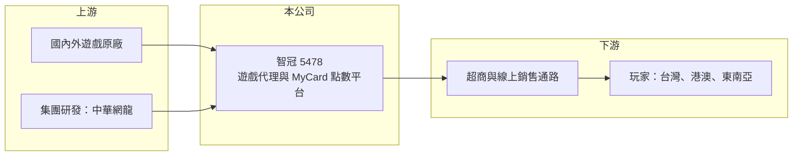

# 5478 智冠

> 上櫃｜[[產業索引-文化創意業|文化創意業]]｜上市（櫃）日期 2001/03/29

# 第一章：企業模式與商業藍圖

> [!info] 撰寫說明
> 精簡版，由 Claude 依公開資料整理，架構比照 [[2330台積電]] 的四章研究，資料截至 2026-10-08。來源：Goodinfo 年度經營績效頁、nStock 公司簡介、櫃買中心開放資料（基本資料、2026 年第二季資產負債與綜合損益、每月營收、本益比殖利率）；業務描述為整理性內容，尚未逐條比對原始文件。#待校對

本章拆解智冠科技（股票代號：5478，以下簡稱智冠）的商業模式。智冠是台灣最早的遊戲代理商之一，如今的獲利核心已從「賣遊戲」轉為經營遊戲玩家付款用的 [[MyCard]] 點數平台，這個轉變決定了它的長期財務樣貌。

- **核心業務：** 智冠成立於 1983 年，總部在高雄，實收資本額約 15.6 億元。依公司介紹，主要業務包括數位內容點數服務平台、遊戲與商業軟體的製造及代理、雜誌發行、廣告服務與遊戲周邊商品批發。其中數位點數平台 MyCard 是最重要的獲利來源，玩家在超商、線上通路購買點數後，可儲值到上百款遊戲與數位服務中使用。
- **營收結構：** 公司未揭露各業務的營收比重。從財報可以看出結構變化：2017 年以前營收約 155 億元、[[毛利率]]不到 20%，2018 年起營收降到約 55 億元、毛利率跳升到 50% 以上。這是因為 [[IFRS 15]] 實施後，MyCard 被認定為代理性質，營收改以[[淨額認列]]，只計入手續費收入而非點數總額。依 2026 年 8 月的月營收公告備註，若 MyCard 改以總額計算，當期營收約 31.45 億元，可見平台實際經手的金流遠大於帳上營收。
- **營運據點：** 以台灣為主，透過集團旗下公司經營遊戲代理、研發與點數業務。上櫃公司 [[3083網龍]]（中華網龍）是智冠持股約 48% 的子公司，負責線上遊戲研發，讓集團同時擁有開發、發行與金流三個環節。
- **長期方向：** 智冠的長期價值建立在 MyCard 的通路與合作遊戲數量上。遊戲本身有生命週期，但只要玩家持續在台灣、港澳與東南亞購買數位點數，平台就能從每筆交易中抽取手續費，這是比單款遊戲更穩定的收入來源。經營層方面，創辦人王俊博卸任董事長後由王思淳接任（年份未查得），屬家族經營企業。

# 第二章：護城河深度與競爭優勢

智冠的護城河主要來自支付平台的網路效應，而不是單一遊戲的成敗。本章分析這個優勢從何而來，以及面對國際平台時能守住多少。

- **競爭優勢：** MyCard 是典型的[[雙邊平台]]：一邊是數百家遊戲與數位內容廠商，另一邊是習慣用點數付款的玩家與上萬個實體銷售點，例如 [[2912統一超]]、[[5903全家]] 等超商通路。合作廠商越多，玩家越願意買點；玩家越多，廠商越需要上架，這種[[網路效應]]讓新進者很難從零建立同等規模。加上數十年的代理經驗，智冠熟悉各國遊戲原廠，能優先取得代理權。
- **主要對手：** 遊戲發行與點數方面，最直接的對手是 [[6180橘子]]（旗下 GASH 點數與遊戲新幹線），其他還有 Google Play、Apple App Store 等手機應用商店的內購付款，以及各類電子支付。遊戲研發端則面對 [[3293鈊象]] 等本土開發商與大量海外發行商。
- **觀察重點：** 手機遊戲普及後，玩家越來越常直接用應用商店內購付款，點數卡的必要性下降。MyCard 能否持續與遊戲廠商合作提供「官網儲值較便宜」的誘因、擴大東南亞市場，以及把點數延伸到影音、社群等其他數位內容，是護城河能否維持的關鍵。

# 第三章：財務體質與盈利規模

資料日期：2026-10-08，表格是撰寫當時的快照；最新月營收、毛利率、累計 EPS 由自動排程寫在本筆記的屬性欄位（月營收、毛利率、累計EPS 等）。#待校對

本章用多年度的三率、ROE 與資本報酬，檢視智冠轉型為平台後的獲利品質。

| 年度 | 營收（新台幣） | [[毛利率]] | [[營業利益率]] | EPS（元） | [[ROE]] |
|---|---|---|---|---|---|
| 2017 | 156 億 | 17.3% | 2.64% | 3.28 | 5.70% |
| 2018 | 55.5 億 | 55.9% | 10.6% | 3.70 | 7.17% |
| 2020 | 72.7 億 | 51.4% | 15.2% | 7.76 | 13.7% |
| 2021 | 66.0 億 | 50.2% | 16.0% | 6.84 | 11.5% |
| 2022 | 61.0 億 | 53.9% | 16.1% | 6.90 | 11.3% |
| 2023 | 62.5 億 | 51.5% | 15.6% | 7.09 | 11.1% |
| 2024 | 67.7 億 | 53.1% | 17.3% | 7.75 | 12.9% |
| 2025 | 65.2 億 | 53.4% | 17.9% | 7.93 | 12.0% |
| 2026 上半年 | 36.16 億 | 57.4% | 22.1% | 4.71 | 不適用（半年） |

- **營收規模：** 改採淨額認列後，帳上營收穩定在 55 億至 73 億元之間，2018 至 2025 年年複合成長率約 2.3%（推算）。營收不大幅成長，但組合中高毛利的平台手續費比重提高。
- **獲利：** 營業利益率由 2018 年的 10.6% 逐步提升到 2025 年的 17.9%，2026 年上半年為 22.1%（櫃買中心資料）。2021 至 2025 年平均 ROE 約 11.8%（推算），EPS 長期在 7 至 8 元之間，波動遠小於一般遊戲公司。
- **財務特色：** 2026 年第二季底總資產約 200.9 億元、負債約 100.9 億元，其中約 97.9 億元為流動負債，主要應是玩家已購買但尚未使用的點數與應付遊戲廠商款項（推估）。這種「先收錢、後付款」的結構讓公司帳上長期握有大量資金。股利方面，2025 年度配發現金股利 7.5 元，配發率約 94.6%（nStock），屬高配息公司。

**[[ROIC]] 與 [[WACC]]：** 2025 年營業利益約 11.7 億元（65.2 億元 × 17.9%），扣除 20% 稅率後約 9.3 億元。2026 年第二季底股東權益約 100 億元，負債多為經營性負債，有息負債假設約 5 億元（推估），投入資本約 105 億元，ROIC 約 8.9%（推算）；若扣除帳上屬於玩家與廠商的資金，實際營運所需資本更少，ROIC 會更高。WACC 假設台灣 10 年期公債 1.75%、市場風險溢酬 6%、β 取 0.8（同業常見值，假設），股東權益成本約 6.55%，因幾乎沒有借款，WACC 約 6.5%（推算）。ROIC 高於 WACC 約 2 至 3 個百分點，代表平台事業長期在創造價值，只是利差不算大，主要原因是帳上資金與轉投資拉低了資本效率。

# 第四章：總體風險與地緣政治

智冠的風險主要來自付款習慣改變與遊戲產業本身的波動。

- **產業週期：** 遊戲產業以爆款驅動，代理遊戲的生命週期通常只有數年。雖然平台手續費比單款遊戲穩定，但若市場長期缺乏熱門大作，點數消費仍會下滑。
- **營運風險：** 最大的長期風險是支付管道被取代。手機應用商店內購、電子錢包與信用卡綁定都在侵蝕點數卡的使用場景；若主要遊戲廠商改為自建金流，MyCard 的手續費收入會受影響。代理權到期或原廠自行來台營運，也會讓代理業務流失。
- **其他風險：** 數位點數涉及預收款項管理、洗錢防制與消費者保護規範，法規趨嚴會增加合規成本。拓展東南亞時，各國支付法規與匯率也是變數。家族接班後的資本配置方向，例如是否持續高配息或轉向併購，也值得長期觀察。

# 專有名詞解析

## 金融

- **[[IFRS 15]]**：國際財務報導準則第 15 號「客戶合約之收入」，規定企業依其是主理人或代理人決定以總額或淨額認列營收。
- **[[淨額認列]]**：企業只是代他人收款的代理人時，營收只認列收取的手續費或差價，而不是交易總額。
- **[[ROIC]]**：投入資本報酬率，稅後營業利益除以股東權益加有息負債，衡量本業運用資本的效率。
- **[[WACC]]**：加權平均資金成本，股東與債權人要求報酬的加權平均，ROIC 高於它才代表創造價值。

## 產業

- **[[MyCard]]**：智冠經營的數位點數平台，玩家購買點數後可儲值到合作的遊戲與數位服務中使用。
- **[[雙邊平台]]**：同時服務兩群使用者（例如乘客與司機）的平台，一邊使用者增加會吸引另一邊加入。
- **[[網路效應]]**：使用者越多、服務對每位使用者越有價值的現象，是平台型企業最主要的護城河。

# 核心供應鏈

- 上游：國內外遊戲原廠與內容商；集團內研發子公司 [[3083網龍]]。
- 下游／客戶：[[2912統一超]]、[[5903全家]] 等超商與線上通路，最終為遊戲玩家；MyCard 合作的遊戲與數位服務廠商同時也是平台客戶。
- 同業：[[6180橘子]]、[[3293鈊象]]、Google Play 與 Apple App Store 的內購付款。

## 最新新聞
<!-- news:start -->
<!-- news:end -->

## 相關連結
- [公開資訊觀測站](https://mopsov.twse.com.tw/mops/web/t05st03?step=1&firstin=1&co_id=5478)
- [Goodinfo](https://goodinfo.tw/tw/StockDetail.asp?STOCK_ID=5478)
- [Yahoo 股市](https://tw.stock.yahoo.com/quote/5478)
- [鉅亨網新聞](https://www.cnyes.com/twstock/5478/news)
