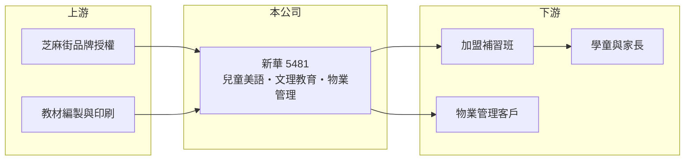

# 5481 新華

> 上櫃｜[[產業索引-其他業|其他業]]｜上市（櫃）日期 2020/06/01

# 第一章：企業模式與商業藍圖

> [!info] 撰寫說明
> 精簡版，由 Claude 依公開資料整理，架構比照 [[2330台積電]]，資料截至 2026-10-07。來源：富果研究 2025-12-30 法說會整理、winvest 營收快訊（搜尋結果標題）。公開資料有限，業務別營收比重未查到。#待校對

新華以芝麻街美語品牌經營兒童美語教育，另有文理教育與物業管理事業。

- **核心業務：** 主力為[[兒童美語]]教育，使用芝麻街美語品牌，以教材與[[加盟]]體系營運；另有文理教育服務與子公司御風物業的物業管理。
- **營收結構：** 各業務比重本次未查到；2025 年前三季合併營收約 0.75 億元，月營收約在 700 萬至 1,000 萬元之間。
- **營運據點：** 以台灣為主，透過加盟補習班擴展據點（推估）。
- **長期方向：** 公司以轉虧為盈為目標，策略包括新教材推廣、擴大加盟、同業整合、拓展長照事業與 ESG 減碳。

# 第二章：護城河深度與競爭優勢

新華的資產是芝麻街美語品牌與教材，但面臨少子化帶來的市場萎縮。

- **競爭優勢：** 芝麻街品牌在家長間有知名度，教材與加盟制度可降低自營據點的成本。
- **主要對手：** 其他兒童美語連鎖與補教業者，具體對手本次未查到。
- **觀察重點：** 加盟據點數變化、新教材銷售成效，以及長照等新事業能否帶來營收。

# 第三章：財務體質與盈利規模

資料日期：2026-10-07，以下數字是撰寫當時的快照；最新月營收、毛利率、累計 EPS 由自動排程寫在本筆記的屬性欄位（月營收、毛利率、累計EPS 等）。#待校對

新華營收小且持續虧損，但帳上現金與淨值相對股本充裕。

- **營收規模：** 2025 年前三季合併營收 7,482 萬元，與前一年同期 7,508 萬元相近；2026 年 4 月營收 733.8 萬元、6 月 694.2 萬元、8 月 1,005.3 萬元（年減 3.12%）。
- **獲利：** 2025 年前三季稅後淨損約 4,290 萬元，每股虧損 0.65 元（前一年同期 -0.52 元）；[[毛利率]]本次未查到。
- **財務特色：** 2025 年 9 月底現金及有價證券約 4.53 億元，總資產約 15.37 億元、股東權益約 11.88 億元，每股淨值 17.89 元。

# 第四章：總體風險與地緣政治

新華的核心風險是少子化與長期虧損侵蝕淨值。

- **產業週期：** 補教業需求與學齡人口直接相關，台灣出生數下降使兒童美語市場長期萎縮。
- **營運風險：** 營收規模小、費用相對高，持續虧損會使每股淨值逐年下降。
- **其他風險：** 品牌授權條件變動、補教法規，以及新事業（長照）的執行風險。

# 專有名詞解析

## 金融

- **[[毛利率]]**：營業毛利占營收的比率，反映產品售價扣除直接成本後的獲利空間。

## 產業

- **[[兒童美語]]**：以學齡前與國小學童為對象的英語補習教育。
- **[[加盟]]**：總部授權品牌、教材與管理制度給加盟主經營，收取加盟金與權利金。

# 核心供應鏈

- 上游：品牌授權方、教材編製與印刷廠（推估）
- 下游／客戶：加盟補習班、學童家長與物業管理社區，名稱未揭露
- 同業：其他兒童美語連鎖補教業者，名稱未查到

## 最新新聞
<!-- news:start -->
<!-- news:end -->

## 相關連結
- [公開資訊觀測站](https://mopsov.twse.com.tw/mops/web/t05st03?step=1&firstin=1&co_id=5481)
- [Goodinfo](https://goodinfo.tw/tw/StockDetail.asp?STOCK_ID=5481)
- [Yahoo 股市](https://tw.stock.yahoo.com/quote/5481)
- [鉅亨網新聞](https://www.cnyes.com/twstock/5481/news)
