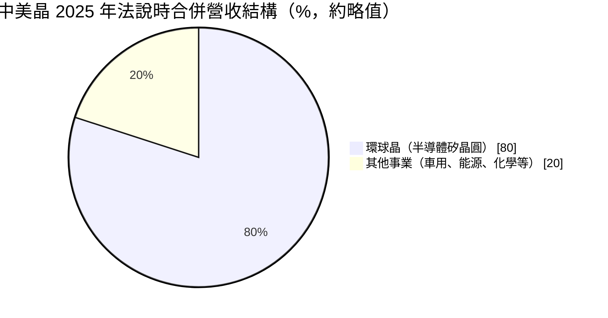
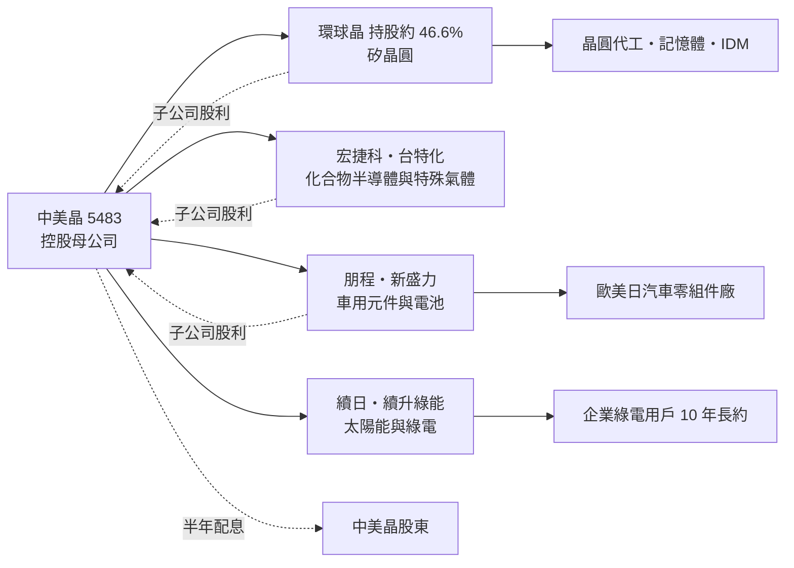
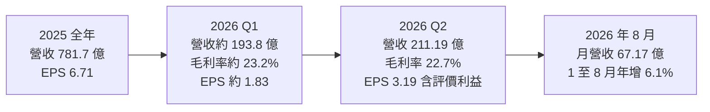
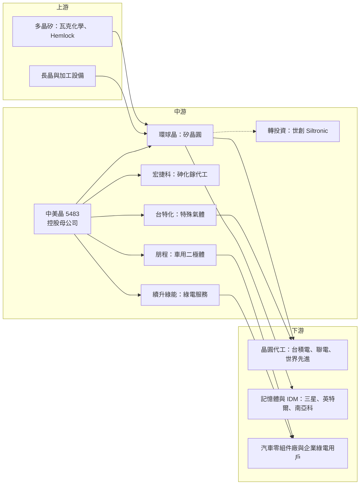

# 5483 中美晶

> 上櫃｜[[產業索引-半導體業|半導體業]]｜上市（櫃）日期 2001/03/02

# 第一章：企業模式與商業藍圖

> [!info] 撰寫說明
> 本文由 Claude 依公開資料整理，架構比照 [[2330台積電]] 的四章研究，資料截至 2026-10-07。財務數字來源：經濟日報（2025 年財報報導）、科技新報與今周刊（2026 年第二季財報報導）、理財周刊（2026 年 9 月）、富果研究（2025 年 8 月法說整理）；產業描述為整理性內容，尚未逐條比對原始文件。#待校對

在評估單一個股的長期投資價值時，首要步驟是拆解企業的底層獲利邏輯。本章針對中美矽晶製品（股票代號：5483，以下簡稱中美晶）的商業模式進行定性分析，說明它如何從一家矽晶圓與太陽能晶片廠，轉型為以環球晶為核心、橫跨半導體、車用元件與再生能源的控股集團，以及投資人該如何閱讀這種集團的財報。

## 一、核心定位：以環球晶為核心的半導體材料與能源控股集團

中美晶是台灣上櫃公司，總部位於新竹科學園區，創辦人與董事長為盧明光，執行長為徐秀蘭。中美晶早年以[[矽晶圓]]與太陽能晶片起家，後來把半導體矽晶圓業務分割成立 [[6488環球晶]]，自己逐步轉型為一家[[控股公司]]。

理解中美晶最重要的一點是：它的合併財報絕大部分來自子公司環球晶。依理財周刊 2026 年 9 月報導，中美晶持有環球晶約 46.6% 股權。這個定位有兩個意義：

* **「環球晶加其他事業」：** 中美晶的股價與獲利，大致可以看成環球晶的表現，加上其他轉投資與自營事業的表現。
* **合併與歸屬要分開看：** 合併營收與合併淨利包含環球晶的全部，但中美晶股東實際分到的只有[[歸屬母公司淨利]]，兩者差距很大。

## 二、終端應用／產品板塊：半導體、車用元件、再生能源三大平台

依富果研究整理的 2025 年 8 月法說資訊，環球晶占中美晶合併營收的比重已由過去約九成降至約八成，其他事業比重則由 9.8% 提升到接近兩成：

* **半導體：**
  * **環球晶：** 全球第三大半導體矽晶圓供應商，產品涵蓋 6、8、12 吋拋光片、[[磊晶]]片與 [[SOI]] 晶圓，客戶是全球主要晶圓代工、記憶體與 [[IDM]] 大廠。
  * **[[8086宏捷科]]：** [[砷化鎵]]（GaAs）晶圓代工，主要應用在手機功率放大器，全球市占超過兩成。
  * **[[4772台特化]]：** 先進製程用[[特殊氣體]]，依富果研究整理，為全球唯二的供應商之一。
* **車用元件：**
  * **[[8255朋程]]：** 車用發電機二極體與整流元件，全球市占超過五成，客戶多為歐美日汽車零組件大廠。
  * **新盛力：** 電池模組與能源管理，2025 年營收 24.51 億元，年增 22.5%。
* **再生能源：**
  * **製造端（續日）：** 太陽能電池與模組，研發轉換效率達 26% 的高規格電池。
  * **服務端（續升綠能）：** 綠電銷售與能源服務平台，2026 年 6 月 29 日登錄興櫃，綠電銷售合約金額已突破 1,000 億元，其中約 85% 為 10 年期[[綠電長約]]。

此外，中美晶透過環球晶持有德國矽晶圓廠世創（Siltronic）股權。2026 年第二季，世創股權評價帶來超過 32 億元的業外評價利益，是當季獲利大增的主因。

## 三、資本轉化邏輯：子公司賺錢、母公司收股利

* **營運據點：** 中美晶本身與太陽能事業以台灣為主要基地。環球晶在台灣、日本、韓國、中國、美國、義大利、丹麥、馬來西亞等地設有工廠，其中美國德州 12 吋新廠與義大利 12 吋新廠是近年擴產重點。再生能源方面，中美晶與聯合再生能源成立合資公司，規劃在美國建置 1GW 太陽能模組廠。
* **現金流來源：** 母公司的股利來源除本業獲利外，也包含子公司配發的現金股利，因此子公司的配息政策會直接影響中美晶的配息能力。

## 四、企業長期藍圖：降低對矽晶圓景氣的依賴

矽晶圓產業有明顯的景氣循環，2023 年至 2025 年間經歷了漫長的庫存調整，客戶延後拉貨、合約價承壓。中美晶的長期策略可以整理為兩點：

* **半導體本業的全球化：** 由環球晶擴充美國、歐洲的 12 吋產能，在地化供應給當地晶圓廠，迎合美國與歐洲的「在地製造」政策。
* **多元化到能源與車用：** 再生能源聚焦公司所稱的「兩個半市場」，即美國、印度與台灣，刻意避開中國太陽能的價格戰；續升綠能採輕資產模式，以長約綠電銷售取得穩定現金流。

這個策略的目的是讓集團在矽晶圓循環低點時，仍有其他事業支撐獲利，也讓中美晶不只是「環球晶的影子股」。

# 第二章：護城河深度與競爭優勢

在長期價值投資中，「護城河」指企業抵禦競爭、維持超額利潤的保護機制。本章分析中美晶旗下各事業的護城河構成、主要競爭對手，以及集團優勢在矽晶圓循環與中國擴產下能守住多少。

## 一、護城河的核心組成要素

中美晶的護城河主要建立在旗下子公司的產業地位上：

* **1. 環球晶的規模與認證：** 全球矽晶圓市場由信越化學、勝高、環球晶、世創與 SK Siltron 等少數業者寡占，進入門檻極高。矽晶圓需要通過客戶長時間認證，一旦打入供應鏈就不易被替換，並且以長期合約（[[LTA]]）為主。
* **2. 利基型子公司的市占率：** 朋程在車用二極體市占超過五成、宏捷科在砷化鎵代工市占超過兩成、台特化在先進製程特殊氣體為少數供應商，這些都是規模不大但具有定價能力的利基市場。
* **3. 綠電長約：** 續升綠能的綠電合約多為 10 年期，對企業客戶而言轉換不易，提供可預期的長期收入。

## 二、全球主要競爭對手格局

| 事業 | 對手 | 對中美晶的威脅 |
|---|---|---|
| 矽晶圓 | [[4063信越化學]]、[[3436勝高]]、世創、SK Siltron | 全球寡占同業，信越與勝高規模大於環球晶 |
| 矽晶圓（國內與中國） | [[3532台勝科]]、[[6182合晶]]、滬硅產業等中國本土廠 | 中國廠商大舉擴產，壓低 8 吋與成熟製程用 12 吋晶圓價格 |
| 砷化鎵代工 | [[3105穩懋]] | 宏捷科最主要的對手，規模較大 |
| 車用二極體 | 歐美日功率元件廠 | 與朋程競爭車廠訂單 |
| 太陽能 | 中國大型太陽能廠；台灣同業 [[3576聯合再生]]（亦為合作夥伴） | 以低價主導全球模組市場 |

## 三、優勢轉化：哪些市場守得住、哪些守不住

* **守得住：** 環球晶在美國、歐洲的在地產能，是信越、勝高以外少數能就近供應美國新晶圓廠的業者，這在美國關稅與在地化要求下是重要優勢。朋程、台特化等利基事業也具穩定的市場地位。
* **守不住：** 矽晶圓的景氣循環無法靠公司自身扭轉；中國本土矽晶圓廠擴產，對成熟製程用晶圓價格造成壓力。2026 年上半年中美晶毛利率 22.93%，低於前一年同期的 25.75%，營業利益率由 14.54% 降至 11.23%，反映的正是環球晶新廠折舊與價格壓力。
* **觀察重點：** 環球晶美國、義大利新廠的[[產能利用率]]與折舊何時開始被營收消化；續升綠能長約能否持續轉化為穩定獲利；世創股價波動造成的評價損益，會讓中美晶的稅後淨利波動大於本業。

# 第三章：財務體質與盈利規模

資料日期：2026-10-07。數字取自經濟日報、科技新報、今周刊與理財周刊等財經媒體整理，表格是撰寫當時的快照；最新月營收、毛利率、累計 EPS 由自動排程寫在本筆記的屬性欄位（月營收、毛利率、累計EPS 等）。#待校對

財務報表是檢驗護城河是否真實存在的最終標準。本章用三率、ROE、現金流與資本報酬，檢視中美晶這類控股集團的獲利品質，特別是本業與評價利益之間的差異。

## 一、獲利能力的基石：三率

| 項目 | 2025 全年 | 2026 Q1 | 2026 Q2 |
|---|---|---|---|
| 營收（新台幣） | 781.7 億 | 約 193.8 億（推算） | 211.19 億 |
| [[毛利率]] | 未查得 | 約 23.2%（推算） | 22.7% |
| [[營業利益率]] | 未查得 | 未查得 | 未查得 |
| EPS（元） | 6.71 | 約 1.83（推算） | 3.19 |

* **[[毛利率]]：** 2026 年上半年 22.93%，低於前一年同期的 25.75%，主因環球晶新廠折舊與成熟製程晶圓價格壓力。
* **[[營業利益率]]：** 2026 年上半年 11.23%，前一年同期 14.54%，與毛利率同步下滑。
* **評價利益的影響：** 2026 年第二季本期淨利 44.53 億元，年增 157.7%，歸屬母公司淨利 19.6 億元。其中來自世創股權的[[業外收益]]超過 32 億元，屬於非經常性質，評估本業時應以營業利益為準。
* **其他數字：** 2026 年第一季數字為上半年累計減去第二季推算而得：上半年營收 405.01 億元、EPS 5.02 元。2025 年營收年減 1.8%，稅後淨利 92.8 億元；同期環球晶營收 606 億元、EPS 15.29 元。2026 年 8 月合併營收 67.17 億元，1 至 8 月累計 542.15 億元，年增 6.1%。

## 二、[[ROE]]：資本效率

中美晶的合併財報包含環球晶的全部營收與資產，但歸屬母公司的淨利只占合併淨利的一部分（2026 年第二季合併淨利 44.5 億元，歸屬母公司 19.6 億元），閱讀時要注意區分。環球晶近年大舉興建新廠，資產規模擴大但產能尚未完全貢獻營收，導致集團整體資本效率下降。ROE 確切數字本次未查得。

## 三、資本支出與自由現金流

* **[[CapEx]]：** 集團資本支出主要來自環球晶的美國德州與義大利 12 吋新廠，以及再生能源的電廠與模組廠建置，確切金額本次未查得。
* **[[自由現金流]]：** 依理財周刊報導，環球晶 12 吋產能已逼近滿載，但新廠折舊壓抑毛利率，環球晶毛利率約 20.6%、營業利益率約 9.4%，預期 2027 年新廠產能開出後才會帶來明顯獲利貢獻。在此之前，集團自由現金流受大額資本支出壓抑（推估）。
* **股利政策：** 中美晶 2025 年度現金股利合計 3.5 元，包括下半年盈餘配發 2.5 元，以及上半年以資本公積配發 1 元。公司採半年配息，股利來源除本業獲利外，也包含子公司配發的現金股利。

## 四、[[ROIC]] 與 [[WACC]]：價值創造利差

環球晶的新廠投資讓集團投入資本大幅增加，但產能仍在爬坡，ROIC 在 2025 至 2026 年應處於低檔，可能接近資金成本（推估，具體數值未查得）。2027 年新廠產能開出、折舊被營收消化後，利差才有機會擴大。

# 第四章：總體風險與地緣政治

任何企業都無法脫離宏觀環境獨立存在。本章分析中美晶未來必須面對的地緣政治、產業週期、營運與法規風險。

## 一、地緣政治風險

* **美國在地化的機會與成本：** 環球晶德州廠受惠美國晶片法案與關稅政策，但美國建廠成本高、人力昂貴，早期折舊負擔沉重。
* **中國競爭：** 中國本土矽晶圓與太陽能業者在政策支持下大舉擴產，是價格壓力的主要來源。中美晶的太陽能策略刻意避開中國市場，但全球太陽能價格仍受中國產能影響。
* **台灣集中風險：** 中美晶本體與部分環球晶產能位於台灣，面臨兩岸風險。

## 二、產業週期與市場結構風險

* **矽晶圓景氣循環：** 矽晶圓需求跟隨晶圓廠產能利用率，2023 至 2025 年的庫存調整期讓合約價與出貨量承壓，是典型的[[長鞭效應]]。若 AI 以外的終端需求（手機、PC、車用、工業）復甦不如預期，成熟製程用晶圓仍會受壓。
* **太陽能價格：** 全球太陽能模組長期供過於求，製造端獲利空間有限。
* **車用景氣：** 朋程與新盛力受全球汽車產量與電動車（[[EV]]）滲透率影響。

## 三、營運環境的隱性風險

* **轉投資評價波動：** 世創股權的評價損益會大幅影響中美晶的稅後淨利，2026 年第二季即貢獻超過 32 億元的評價利益，反向時也可能造成大額損失。
* **新廠折舊：** 環球晶新廠在產能利用率拉高之前，會持續壓抑集團毛利率。
* **集團管理複雜度：** 子公司眾多、產業跨度大，投資人較難評估各事業的真實價值，市場常給予控股公司折價。

## 四、科技與法規演進風險

* **矽晶圓規格升級：** 先進製程對晶圓平坦度與缺陷密度要求持續提高，環球晶需要持續投入研發以維持高階客戶認證。
* **再生能源法規：** 台灣綠電政策、電價與企業綠電採購規範的變動，會影響續升綠能的商業模式與長約價格。

# 專有名詞解析

## 半導體

- **[[矽晶圓]]**：以高純度單晶矽切割拋光而成的圓形薄片，是製造晶片的基板，主要尺寸為 8 吋與 12 吋。
- **[[磊晶]]**：在晶圓表面再長出一層結晶排列相同的薄膜，用來改善電性或製作功率與化合物元件。
- **[[SOI]]**：絕緣層上覆矽晶圓，在矽層與基板之間夾一層絕緣層，可降低漏電，用於射頻與低功耗晶片。
- **[[砷化鎵]]**：化合物半導體材料，電子移動速度快，適合製作手機功率放大器等高頻元件，簡稱 GaAs。
- **[[特殊氣體]]**：晶圓製程中用於蝕刻、沉積與摻雜的高純度氣體，純度要求極高，供應商少。
- **[[IDM]]**：整合元件製造廠，從晶片設計、製造到封測都自己完成的半導體公司，例如英特爾、德州儀器。

## 應用

- **[[EV]]**：電動車，以電池與馬達取代內燃機的車輛，帶動功率元件、電池模組與充電設備需求。

## 金融

- **[[歸屬母公司淨利]]**：合併淨利中屬於母公司股東的部分，扣除子公司其他股東應享有的份額，是計算 EPS 的基礎。
- **[[業外收益]]**：本業營運以外的收益，例如轉投資收益、匯兌與評價利益，波動大且不一定能持續。
- **[[LTA]]**：長期供貨合約，買賣雙方預先約定數量與價格，矽晶圓業者常以此穩定營收。
- **[[產能利用率]]**：實際投片量占總產能的比例，矽晶圓廠的毛利率高度取決於此數字。
- **[[自由現金流]]**：營業活動現金流減去資本支出，代表企業可自由用於配息、還債或併購的現金。
- **[[長鞭效應]]**：終端需求的小幅變動，沿供應鏈往上游傳遞時被逐級放大，造成上游庫存與訂單劇烈波動。

## 產業

- **[[綠電長約]]**：企業向再生能源業者簽訂的長期購電合約，通常 10 至 20 年，讓雙方鎖定價格與供應量。
- **[[控股公司]]**：主要資產是其他公司股權、靠子公司獲利與股利支撐的公司，市場常給予一定折價。

# 核心供應鏈

## 1. 上游：多晶矽、設備與材料
- 多晶矽原料：瓦克化學（Wacker）、Hemlock 等國際多晶矽廠
- 長晶與加工設備：國際設備廠

## 2. 中游：中美晶與主要子公司
- 半導體矽晶圓：[[6488環球晶]]（持股約 46.6%）
- 砷化鎵晶圓代工：[[8086宏捷科]]
- 車用二極體：[[8255朋程]]
- 特殊氣體：[[4772台特化]]
- 綠電服務：續升綠能
- 太陽能合作夥伴：[[3576聯合再生]]
- 矽晶圓轉投資：世創（Siltronic）

## 3. 下游：矽晶圓客戶
- 晶圓代工：[[2330台積電]]、[[2303聯電]]、[[5347世界先進]]
- 記憶體與 IDM：[[005930三星電子]]、[[INTC英特爾]]、[[2408南亞科]]

## 4. 同業
- 矽晶圓：[[4063信越化學]]、[[3436勝高]]、[[3532台勝科]]、[[6182合晶]]
- 砷化鎵代工：[[3105穩懋]]

延伸閱讀：[[台積電供應鏈]]

## 最新新聞
<!-- news:start -->
<!-- news:end -->

## 相關連結
- [公開資訊觀測站](https://mopsov.twse.com.tw/mops/web/t05st03?step=1&firstin=1&co_id=5483)
- [Goodinfo](https://goodinfo.tw/tw/StockDetail.asp?STOCK_ID=5483)
- [Yahoo 股市](https://tw.stock.yahoo.com/quote/5483)
- [鉅亨網新聞](https://www.cnyes.com/twstock/5483/news)
