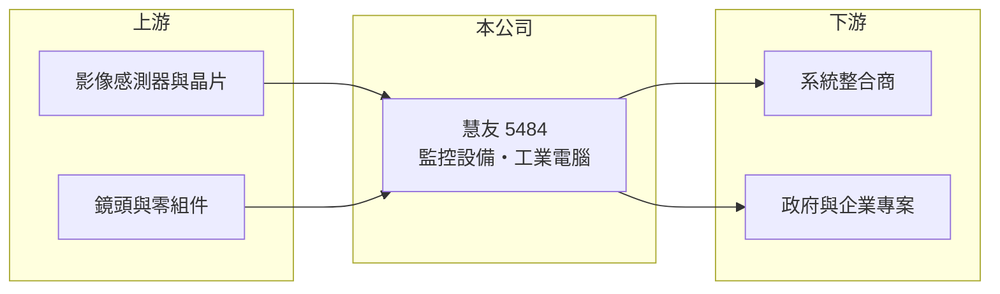

# 5484 慧友

> 上市｜[[產業索引-光電業|光電業]]｜上市（櫃）日期 2003/08/25

# 第一章：企業模式與商業藍圖

> [!info] 撰寫說明
> 精簡版，由 Claude 依公開資料整理，架構比照 [[2330台積電]]，資料截至 2026-10-07。來源：nstock.tw 慧友公司概況、winvest.tw 營收快訊。公開資料有限，產品比重、客戶與營運據點本次未查到。#待校對

慧友是老牌安控設備商，2026 年營收大幅成長並轉虧為盈。

- **核心業務：** 慧友設計、製作、安裝與銷售影像處理器、攝影機等電子監控設備與工業電腦，並代理進出口。
- **營收結構：** 本次未查到各產品比重；產品涵蓋[[IP攝影機]]、[[NVR]] 等監控設備與工業電腦（推估）。
- **營運據點：** 營運據點本次未查到。
- **長期方向：** 安控走向聯網與影像分析，公司可藉由專案與系統整合提高附加價值（推估）。

# 第二章：護城河深度與競爭優勢

慧友的優勢在於長期經營安控市場與專案整合能力。

- **競爭優勢：** 同時具備設備與安裝能力，可承接整套監控專案（推估）。
- **主要對手：** [[3356奇偶]] 等國內安控廠，以及中國大陸大型安控設備商。
- **觀察重點：** 2026 年 5、6 月營收大增後 7 月回落，需觀察是否屬於專案一次認列。

# 第三章：財務體質與盈利規模

資料日期：2026-10-07，以下數字是撰寫當時的快照；最新月營收、毛利率、累計 EPS 由自動排程寫在本筆記的屬性欄位（月營收、毛利率、累計EPS 等）。#待校對

慧友 2026 年營收倍增，但本業仍未轉正，獲利有業外貢獻。

- **營收規模：** 2025 年全年營收 5.06 億元；2026 年 1 至 7 月累計 4.98 億元，年增 106.58%；6 月營收 1.33 億元，年增 224.33%，7 月回落到 0.51 億元。
- **獲利：** 2025 年全年 EPS -0.6 元；2026 年第二季 EPS 0.54 元，上半年累計 0.87 元；第二季[[毛利率]] 15.1%，[[營業利益率]] -5.7%，淨利率 13.28%。
- **財務特色：** 資本額約 6.68 億元，市值約 27 億元；近五年無配息紀錄，淨利高於營業利益代表有[[業外收益]]。

# 第四章：總體風險與地緣政治

慧友的風險在於專案型營收波動大與本業獲利偏弱。

- **產業週期：** 安控需求跟著公共建設、企業與政府標案進度起伏。
- **營運風險：** 專案營收認列時點不定，月營收波動大；業外收益不持續時 EPS 可能回落。
- **其他風險：** 各國對中國大陸安控設備的限制可能帶來替代商機，但資安法規與價格競爭同時存在。

# 專有名詞解析

## 應用

- **[[IP攝影機]]**：透過網路傳輸影像的數位監控攝影機，可遠端觀看與整合影像分析。
- **[[NVR]]**：網路錄影主機，集中接收、儲存與管理多台 IP攝影機的影像。

## 金融

- **[[業外收益]]**：本業以外的收入，例如投資、處分資產或匯兌利益，持續性通常較低。

# 核心供應鏈

- 上游：影像感測器、影像處理晶片、鏡頭與零組件供應商
- 下游／客戶：系統整合商、政府與企業監控專案（推估）
- 同業：[[3356奇偶]]、[[5251天鉞電]]、中國大陸安控設備商

## 最新新聞
<!-- news:start（自動產生，請勿手動編輯此範圍） -->
- 2026-10-08 🏛️ 重訊 13:40｜公告本公司民國115年09月份合併營收｜[觀測站](https://mops.twse.com.tw/mops/#/web/t05st01)

完整紀錄：[[5484慧友 新聞]]
<!-- news:end -->

## 相關連結
- [公開資訊觀測站](https://mopsov.twse.com.tw/mops/web/t05st03?step=1&firstin=1&co_id=5484)
- [Goodinfo](https://goodinfo.tw/tw/StockDetail.asp?STOCK_ID=5484)
- [Yahoo 股市](https://tw.stock.yahoo.com/quote/5484)
- [鉅亨網新聞](https://www.cnyes.com/twstock/5484/news)
