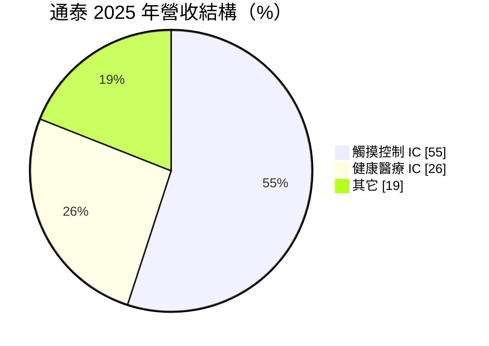
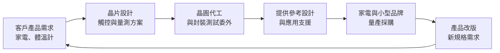
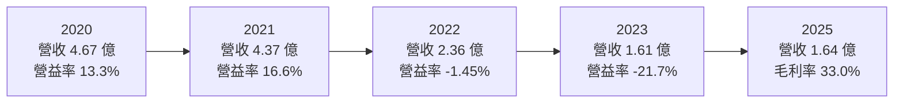
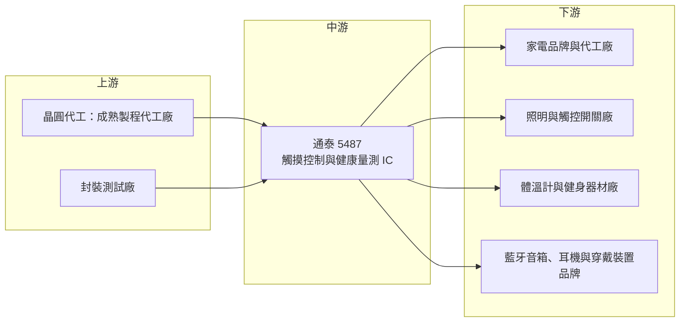

# 5487 通泰

> 上櫃｜[[產業索引-半導體業|半導體業]]｜上市（櫃）日期 2001/02/20

# 第一章：企業模式與商業藍圖

> [!info] 撰寫說明
> 本文由 Claude 依公開資料整理，架構比照 [[2330台積電]] 的四章研究，資料截至 2026-10-08。財務數字來源：Goodinfo 台灣股市資訊網年度經營績效、股利政策與基本資料頁、富果研究 2026 年 4 月法說會整理（2025 年營收結構與財務）、nStock 公司資料；產業描述為整理性內容，尚未逐條比對原始文件。#待校對

在評估單一個股的長期投資價值時，首要步驟是拆解企業的底層獲利邏輯。本章針對通泰積體電路股份有限公司（股票代號：5487，以下簡稱通泰）的商業模式進行定性分析。通泰是一家成立近四十年的小型 IC 設計公司，產品是家電與小型電子產品裡的觸摸控制晶片與體溫計、健身器材用的量測晶片。它的故事代表台灣一批老牌消費性 IC 設計公司的共同處境：產品技術成熟、客戶分散，但營收規模停滯，正在尋找新的利基。

## 一、核心定位：專注家電與健康量測的小型 IC 設計公司

通泰於 1986 年 10 月取得公司執照，1999 年公開發行，2001 年 2 月在櫃買中心掛牌，總部位於新北市中和區。公司業務為積體電路的開發、設計、生產測試與銷售，屬於 [[Fabless]] 模式：通泰負責晶片設計與應用方案，晶圓製造與封裝測試委外，自己不擁有晶圓廠。股本約 2.42 億元，是上櫃公司中規模很小的一家。

通泰的產品多為內建簡單運算核心的混合訊號晶片，例如把[[電容式觸控]]感應、類比數位轉換（[[ADC]]）與控制邏輯整合在同一顆晶片上。這類晶片不需要先進製程，單價低，但需要公司提供完整的應用方案，讓家電廠或小型品牌商能快速做出產品。換言之，通泰賣的不只是晶片，也是「讓客戶少花研發力氣」的設計服務。

## 二、終端應用與產品板塊

依富果整理的 2026 年 4 月法說會資料，2025 年營收結構如下：

* **觸摸控制 IC（55%）：** 主力產品，應用於家電面板（冰箱、電鍋、電磁爐、微波爐）、照明用品（LED 觸摸條形燈、觸摸檯燈、小夜燈）、壁式與旋轉調光觸摸開關、運動與藍牙用品（智慧手環、藍牙音箱、無線耳機、按摩槍）以及觸控遙控器。家電把機械按鍵改成觸摸面板，是這類晶片的長期需求來源。
* **健康醫療 IC（26%）：** 用於數位體溫計（耳溫槍、額溫槍、口溫計）、跑步機等健身器材的心跳偵測，以及數位溫濕度計。比重由 2024 年的 22% 提高到 26%，是公司持續擴大的產品線。
* **其它（19%）：** 法說會未說明內容。

## 三、資本轉化邏輯：輕資產的方案型 IC 設計

通泰的商業模式是典型的小型消費性 IC 設計公司：研發人力是最主要的投入，晶片設計完成後委外生產，透過代理商或直接銷售給大量中小型客戶。這種模式的資本需求很低，好處是不需要龐大資本支出；缺點是進入門檻也低，同類產品的競爭者眾多，價格容易被壓低。

這類公司的獲利關鍵在於「單一晶片能賣多少年、賣給多少客戶」。觸摸控制晶片一旦被寫進某款家電的設計，通常會跟著該產品生命週期銷售數年；健康量測晶片則需要較高的量測精度與穩定性，客戶更換供應商的意願較低。

## 四、企業長期藍圖

依法說會，通泰的策略方向有兩條：

* **觸摸控制往防水與低功耗發展：** 擴展到戶外裝置與電池供電的可攜式產品，官網已推出[[防水觸控]] IC 系列。防水是觸摸面板在廚房、浴室與戶外使用的關鍵難點，能做好的晶片較能維持價格。
* **健康醫療往高精度量測升級：** 導入高精度 ADC 與[[運算放大器]]，開發更高階的量測 IC，並以客戶應用導向提供客製化方案。人口高齡化與居家健康管理的趨勢，是這條產品線的長期需求基礎。

公司未提供量化財測。整體而言，通泰的長期藍圖是「在小市場中做深」，而不是追求營收規模的大幅擴張。

# 第二章：護城河深度與競爭優勢

本章分析通泰的護城河構成、主要競爭對手，以及這些優勢在消費性 IC 價格競爭中能守住多少。

## 一、護城河的核心組成要素

通泰屬於「窄護城河甚至無明顯護城河」的類型，其相對優勢主要來自：

* **1. 長期累積的應用方案：** 近四十年經營家電與量測晶片，累積大量參考設計與客戶應用經驗，能縮短客戶的開發時間。這對缺乏電子研發能力的小型品牌商有實際價值。
* **2. 量測精度的經驗：** 體溫計與健身器材的量測晶片牽涉感測、校正與[[醫療器材法規]]要求，客戶一旦通過認證，不容易輕易更換晶片。
* **3. 低負債與資產規模大於營收：** 2025 年底資產總額約 5.74 億元、每股淨值 21.56 元，遠高於年營收 1.64 億元，財務上有能力撐過營收低谷。

## 二、主要競爭對手格局

| 對手 | 定位 | 對通泰的威脅 |
|---|---|---|
| [[6202盛群]] | 台灣家電 [[MCU]] 與觸控 MCU 大廠 | 產品線廣、規模大，在家電觸控與控制晶片直接競爭 |
| [[4919新唐]] | 台灣 MCU 大廠，具觸控與量測產品 | 以完整 MCU 平台搶家電與工業控制市場 |
| 6457紘康 | 台灣量測型 SoC 設計公司 | 在體溫計、體重計等健康量測晶片直接競爭 |
| [[5471松翰]]、[[6716應廣]] | 台灣消費性 IC 與 MCU 設計公司 | 在低價控制晶片與家電市場重疊 |
| 中國 MCU 與觸控 IC 廠 | 低價、在地服務 | 中國家電與小家電客戶持續轉向本土供應商 |

## 三、優勢轉化：守得住、守不住與觀察重點

* **守得住：** 需要精度與認證的健康量測晶片，以及防水等特殊規格的觸摸控制晶片。這些產品的轉換成本較高，價格較穩定。
* **守不住：** 一般家電與小型電子產品的標準觸控晶片。這類產品規格公開，中國廠商價格更低，營收從 2020 年的 4.67 億元降到 2025 年的 1.64 億元，顯示通泰在主流市場的份額明顯流失。
* **觀察重點：** 第一，健康醫療 IC 的比重能否持續提高；第二，毛利率能否維持在 33% 以上；第三，營收能否止跌回升到足以覆蓋固定費用的規模。若營收持續在 2 億元以下，通泰很難恢復穩定獲利。

# 第三章：財務體質與盈利規模

資料日期：2026-10-08。數字取自 Goodinfo 年度經營績效與股利政策頁、富果研究法說會整理，表格是撰寫當時的快照；最新月營收、毛利率、累計 EPS 由自動排程寫在本筆記的屬性欄位（月營收、毛利率、累計EPS 等）。#待校對

財務報表是檢驗護城河是否真實存在的最終標準。本章用十年的三率、[[ROE]]、股利與資本報酬，檢視通泰在營收萎縮下的獲利品質。

## 一、獲利能力的基石：三率

| 年度 | 營收（新台幣） | [[毛利率]] | [[營業利益率]] | EPS（元） | [[ROE]] |
|---|---|---|---|---|---|
| 2016 | 3.86 億 | 35.4% | 12.8% | 1.85 | 8.43% |
| 2017 | 4.03 億 | 30.6% | 10.1% | 1.32 | 6.13% |
| 2018 | 3.67 億 | 31.5% | 6.57% | 1.02 | 4.82% |
| 2019 | 3.99 億 | 26.3% | 3.30% | 2.69 | 12.1% |
| 2020 | 4.67 億 | 30.6% | 13.3% | 1.67 | 7.19% |
| 2021 | 4.37 億 | 36.2% | 16.6% | 2.02 | 8.39% |
| 2022 | 2.36 億 | 30.6% | -1.45% | -0.08 | -0.32% |
| 2023 | 1.61 億 | 27.9% | -21.7% | -1.20 | -5.30% |
| 2024 | 1.94 億 | 28.7% | -8.65% | -0.11 | -0.50% |
| 2025 | 1.64 億 | 33.0% | -11.9% | -0.53 | -2.45% |

這張表可以分成兩個階段。2016 至 2021 年，通泰營收穩定在 3.7 億至 4.7 億元，每年都有獲利，2020 至 2021 年疫情期間體溫計需求大增，營業利益率一度達 16.6%。2022 年起營收腰斬，2023 年只剩 1.61 億元，營業利益率轉為大幅負值。

營收崩落的原因，推估包括疫情期間額溫槍等健康量測需求的回落、家電與消費性電子的庫存調整，以及中國供應商的價格競爭（推估，公司未逐項說明）。值得注意的是，毛利率在 2025 年仍有 33%，表示產品本身的定價能力尚未崩壞，問題在於營收規模太小，無法攤提固定的研發與管理費用。2016 至 2025 年營收年複合成長率約 -9.1%（推算）。

* **[[毛利率]]：** 長期在 26% 至 36% 之間，2025 年由 2024 年的 28.7% 回升到 33%，反映產品組合往健康量測等較高毛利產品移動。
* **[[營業利益率]]：** 營收規模是決定性因素。以 2025 年的費用結構推算，營收大約要回到 2.5 億至 3 億元以上，營業利益才可能轉正（推估），這是典型的[[營運槓桿]]。
* **[[業外收益]]：** 2019 年營業利益率只有 3.3%，EPS 卻達 2.69 元，代表當年有相當比例的獲利來自業外，具體來源未查得。通泰資產規模遠大於營收，帳上資金的利息或投資收益，對淨利的影響不可忽略。

## 二、[[ROE]]：資本效率

2016 至 2025 年平均 ROE 約 3.9%（推算），2021 至 2025 年平均約 0%（推算）。即使在獲利較好的 2016 至 2021 年，ROE 也只有 5% 至 12%，原因之一是股東權益相對營收偏大：2025 年底每股淨值 21.56 元，以約 2,422 萬股計算，權益約 5.2 億元，是年營收的三倍多。大量資本停留在帳上而沒有投入高報酬的用途，是 ROE 偏低的結構性原因。

## 三、資本支出與自由現金流

通泰屬輕資產的 Fabless 公司，資本支出很低，具體金額未查得。2016 至 2021 年有穩定獲利，[[自由現金流]]推估多為正；2022 年起營業虧損，自由現金流可能轉為小幅負值（推估）。

股利方面，依 Goodinfo，2016 至 2021 年度現金股利依序為 2.0、1.474、0.883、0.978、1.089、1.353 元，2022 至 2025 年度均未配息。以 EPS 計算，2016 至 2021 年配息率約為 108%、112%、87%、36%、65%、67%（推算）。通泰在有獲利的年度屬於高配息公司，但虧損後即停止配息，股利穩定度完全取決於本業能否轉盈。

## 四、[[ROIC]] 與 [[WACC]]：價值創造利差

**ROIC 推算：** 2025 年營業虧損約 0.195 億元（1.64 億 × -11.9%），投入資本以 2025 年底權益約 5.22 億元計算（有息負債假設不重大），ROIC 約 -3.7%（推算）。對照 2021 年，營業利益約 0.725 億元（4.37 億 × 16.6%），稅後約 0.58 億元，以淨利 0.48 億元與 ROE 8.39% 回推權益約 5.7 億元，ROIC 約 10.1%（推算）。由於權益中可能包含大量閒置現金，若扣除非營運資產，本業實際的 ROIC 會更高或更低，視資產組成而定（未查得）。

**WACC 推算：** 權益成本以 CAPM 估計，假設台灣 10 年期公債殖利率 1.75%、市場風險溢酬 6%；通泰的 β 未查得，取小型 IC 設計公司常見值 0.9，權益成本約 7.15%。有息負債不重大，WACC 約 7.15%（推算）。

**結論：** 通泰在 2020 至 2021 年的 ROIC 高於約 7% 的資金成本，屬於創造價值的年度；2022 年起 ROIC 轉為負值，持續低於 WACC，代表本業正在侵蝕股東價值。若營收無法回升，或公司未能更有效運用帳上資本（例如發展新產品或回饋股東），通泰長期難以回到創造價值的軌道（推算）。

# 第四章：總體風險與地緣政治

任何企業都無法脫離宏觀環境獨立存在。本章分析通泰未來必須面對的地緣政治、產業週期與營運風險。

## 一、地緣政治風險

* **中國客戶與供應商的雙重影響：** 家電與小家電的主要製造基地在中國，通泰的終端客戶有相當比例可能位於中國（推估，公司未揭露地區比重）。中國推動晶片國產化，家電廠商優先採用本土 MCU 與觸控晶片，對台灣小型 IC 設計公司形成長期壓力。
* **美國關稅：** 若終端產品從中國出口到美國，關稅會壓抑需求，並間接傳導到晶片採購量。
* **台灣代工產能：** 晶圓製造與封測委外台灣廠商，地緣風險與台灣半導體業整體相同。

## 二、產業週期與市場結構風險

* **消費性電子的需求波動：** 家電、藍牙耳機、穿戴裝置屬消費性產品，景氣轉弱或庫存調整時，晶片訂單會被大幅削減，形成[[長鞭效應]]。
* **疫情後的需求回落：** 2020 至 2021 年體溫計需求是一次性的高峰，類似的特殊需求難以重現，不能作為長期營收基準。
* **市場分散且低價化：** 觸控與量測晶片的競爭者眾多，產品同質化後價格只會往下。

## 三、營運環境的隱性風險

* **規模不經濟：** 營收在 2 億元以下時，研發與上市維持費用占比過高，即使毛利率不錯也難以獲利。
* **人才與研發投入：** 小型 IC 設計公司難與大型同業競爭工程人才，若研發能力弱化，新產品推出速度會更慢。
* **代工價格與產能：** 成熟製程代工價格若上漲，小客戶議價能力弱，毛利率會被壓縮。

## 四、科技或法規演進風險

家電控制晶片正從單純觸控按鍵，走向整合無線連網、語音與顯示的智慧家電主控晶片，大型 MCU 廠商在整合度上更具優勢。健康量測則受醫療器材法規管理，法規要求提高時，認證成本會增加，但也會提高競爭門檻。通泰若能在高精度量測與防水觸控這類需要專門技術的領域持續投入，仍有機會維持利基；反之，若只停留在標準品，長期可能被整合度更高的晶片取代。

# 專有名詞解析

## 半導體

- **[[Fabless]]**：無晶圓廠的 IC 設計公司，只負責設計晶片，製造委託晶圓代工廠。
- **[[MCU]]**：微控制器，把處理器、記憶體與周邊介面整合在一顆晶片上，用於家電、工業與汽車的控制。
- **[[ADC]]**：類比數位轉換器，把溫度、電壓等連續的類比訊號轉成數位數值，是量測晶片的核心電路。
- **[[運算放大器]]**：放大微小類比訊號的基本電路，量測體溫或心跳時用來放大感測器輸出的訊號。

## 應用

- **[[電容式觸控]]**：偵測手指靠近時電容值變化來判斷觸碰的技術，用於家電觸摸面板與觸控開關。
- **[[防水觸控]]**：在面板有水滴或潮濕時仍能正確判斷觸碰的觸控技術，用於廚房家電與戶外裝置。
- **[[醫療器材法規]]**：體溫計等量測產品須符合各國醫療器材管理規範，取得認證後才能上市銷售。

## 金融

- **[[業外收益]]**：本業以外的收益，例如利息、投資收益或處分利益，通常不具持續性。
- **[[營運槓桿]]**：固定成本占比高時，營收小幅變動會造成營業利益大幅變動的現象。
- **[[長鞭效應]]**：終端需求的小幅變動，沿供應鏈往上游傳遞時被逐級放大，造成上游庫存與訂單劇烈波動。

# 核心供應鏈

## 1. 上游：晶圓代工與封裝測試
- 晶圓代工與封測夥伴：公司未揭露（推估為台灣成熟製程代工廠與封測廠）

## 2. 中游：通泰本身
- 觸摸控制 IC 與健康醫療 IC 的設計、應用方案與銷售

## 3. 下游：主要應用客戶
- 家電：冰箱、電鍋、電磁爐、微波爐面板製造商（名單未揭露）
- 照明與觸摸開關製造商
- 數位體溫計、溫濕度計與健身器材製造商
- 藍牙音箱、無線耳機與智慧手環品牌

## 4. 同業與競爭者
- [[6202盛群]]、[[4919新唐]]、6457紘康、[[5471松翰]]、[[6716應廣]]
- 中國本土 MCU 與觸控 IC 廠商

## 最新新聞
<!-- news:start -->
<!-- news:end -->

## 相關連結
- [公開資訊觀測站](https://mopsov.twse.com.tw/mops/web/t05st03?step=1&firstin=1&co_id=5487)
- [Goodinfo](https://goodinfo.tw/tw/StockDetail.asp?STOCK_ID=5487)
- [Yahoo 股市](https://tw.stock.yahoo.com/quote/5487)
- [鉅亨網新聞](https://www.cnyes.com/twstock/5487/news)
